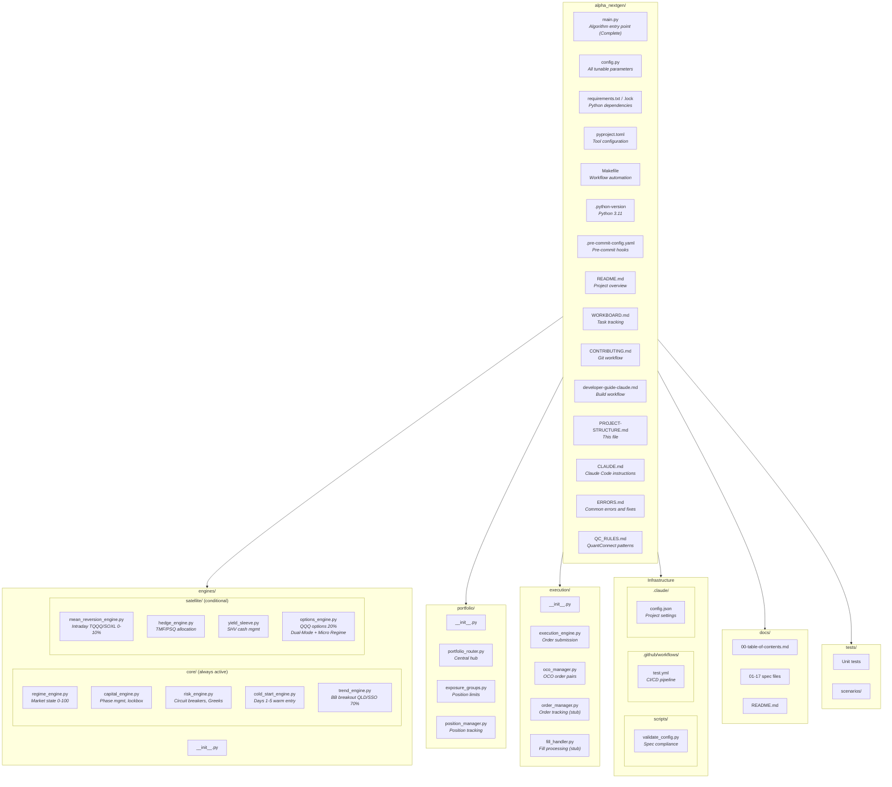
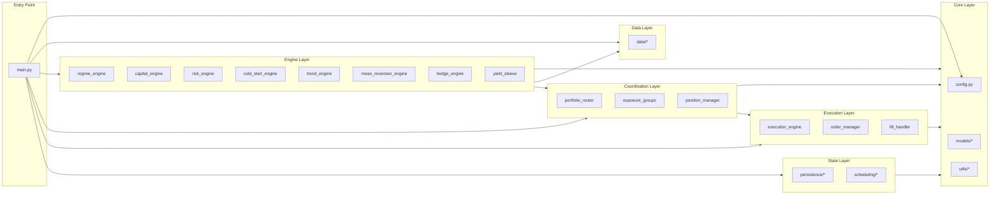

# Alpha NextGen - Project File Structure

> **Last Updated:** 28 January 2026
> **Status:** V2.1.1 Complete - Options Engine Redesign (Dual-Mode + Micro Regime Engine)

---

## Complete Repository Structure



---

## Flat File Listing

```
alpha_nextgen/
│
├── main.py                              # QCAlgorithm entry point (1,638 lines - V2.1 Complete)
├── config.py                            # All tunable parameters
├── requirements.txt                     # Python dependencies (pytest, lean, etc.)
├── requirements.lock                    # Locked versions for reproducibility
├── requirements-dev.txt                 # Dev dependencies (QC stubs for IDE autocomplete)
├── pyproject.toml                       # Unified tool config (pytest, black, mypy)
├── Makefile                             # Workflow automation (make setup, make test)
├── .python-version                      # Python 3.11
├── .pre-commit-config.yaml              # Pre-commit hooks configuration
├── README.md                            # Project overview and quick reference
├── QUICKSTART.md                        # Fast onboarding guide (5 min setup)
├── WORKBOARD.md                         # Task tracking & ownership
├── CONTRIBUTING.md                      # Git workflow, branch naming, commit format
├── developer-guide-claude.md            # Session init, build phases, workflows
├── PROJECT-STRUCTURE.md                 # This file - visual structure reference
├── CLAUDE.md                            # Claude Code AI assistant instructions
├── ERRORS.md                            # Common errors and fixes reference
├── QC_RULES.md                          # QuantConnect coding patterns
│
├── .editorconfig                        # Editor consistency (tabs, spaces, line endings)
│
├── .vscode/
│   └── settings.json                    # VS Code settings (formatting, linting, testing)
│
├── .github/
│   ├── workflows/
│   │   └── test.yml                     # GitHub Actions CI/CD pipeline
│   └── PULL_REQUEST_TEMPLATE.md         # PR checklist for developers
│
├── .claude/
│   └── config.json                      # Claude Code project configuration
│
├── scripts/
│   ├── validate_config.py               # Validate config.py against specs
│   └── check_spec_parity.py             # Code-to-spec update warning
│
├── engines/                             # V2 Core-Satellite architecture
│   ├── __init__.py
│   ├── core/                            # Foundational engines (always active)
│   │   ├── __init__.py
│   │   ├── regime_engine.py             # 4-factor market state (0-100 score)
│   │   ├── capital_engine.py            # SEED/GROWTH phases, virtual lockbox
│   │   ├── risk_engine.py               # Kill switch, panic mode, Greeks monitoring
│   │   ├── cold_start_engine.py         # Days 1-5 warm entry logic
│   │   └── trend_engine.py              # BB compression breakout (QLD, SSO) - 70%
│   └── satellite/                       # Conditional engines
│       ├── __init__.py
│       ├── mean_reversion_engine.py     # Intraday oversold bounce (TQQQ, SOXL) - 0-10%
│       ├── hedge_engine.py              # Regime-based TMF/PSQ allocation
│       ├── yield_sleeve.py              # SHV idle cash management
│       └── options_engine.py            # QQQ options - 20% (V2.1.1 Dual-Mode)
│                                        #   Swing Mode (15%): Debit/Credit spreads, ITM long
│                                        #   Intraday Mode (5%): Micro Regime Engine (21 regimes)
│
├── portfolio/
│   ├── __init__.py
│   ├── portfolio_router.py              # Central hub - TargetWeight aggregation
│   ├── exposure_groups.py               # NASDAQ_BETA, SPY_BETA, RATES definitions
│   └── position_manager.py              # Entry prices, stops, highest highs
│
├── execution/
│   ├── __init__.py
│   ├── execution_engine.py              # Market/MOO order submission
│   ├── oco_manager.py                   # One-Cancels-Other order pairs (options)
│   ├── order_manager.py                 # Order tracking, status, fallback (stub)
│   └── fill_handler.py                  # Fill confirmation, partial fills (stub)
│
├── data/
│   ├── __init__.py
│   ├── symbol_manager.py                # Proxy vs traded symbol subscriptions
│   ├── indicator_manager.py             # BB, RSI, ATR, SMA setup and access
│   └── data_validator.py                # Freshness, price sanity, split detection
│
├── models/
│   ├── __init__.py
│   ├── target_weight.py                 # TargetWeight dataclass
│   ├── regime_state.py                  # RegimeState dataclass
│   ├── capital_state.py                 # CapitalState dataclass
│   ├── position_state.py                # PositionState dataclass
│   └── enums.py                         # Urgency, Phase, RegimeLevel, ExposureGroup
│
├── persistence/
│   ├── __init__.py
│   ├── state_manager.py                 # ObjectStore save/load orchestration
│   ├── serializers.py                   # JSON serialization for complex types
│   └── state_validator.py               # State consistency validation on load
│
├── scheduling/
│   ├── __init__.py
│   ├── daily_scheduler.py               # All scheduled events (09:25, 10:00, 15:45)
│   └── time_guards.py                   # Fed window (13:55-14:10) blocking
│
├── utils/
│   ├── __init__.py
│   ├── calculations.py                  # Volatility, ATR, bandwidth, returns
│   ├── logging_utils.py                 # Structured logging helpers
│   └── constants.py                     # Time constants, magic numbers
│
├── tests/
│   ├── __init__.py
│   ├── test_regime_engine.py
│   ├── test_capital_engine.py
│   ├── test_risk_engine.py
│   ├── test_cold_start_engine.py
│   ├── test_trend_engine.py
│   ├── test_mean_reversion_engine.py
│   ├── test_hedge_engine.py
│   ├── test_yield_sleeve.py
│   ├── test_portfolio_router.py
│   ├── test_execution_engine.py
│   ├── test_exposure_groups.py
│   ├── test_state_persistence.py
│   └── scenarios/
│       ├── test_kill_switch_scenario.py
│       ├── test_panic_mode_scenario.py
│       ├── test_cold_start_scenario.py
│       └── test_full_cycle_scenario.py
│
└── docs/
    ├── README.md                        # Documentation index
    ├── DOCUMENTATION-MAP.md             # Code-to-documentation mapping (for Claude)
    ├── GITHUB-BRANCH-PROTECTION.md      # Branch protection setup guide
    ├── 00-table-of-contents.md
    ├── 01-executive-summary.md
    ├── 02-system-architecture.md
    ├── 03-data-infrastructure.md
    ├── 04-regime-engine.md
    ├── 05-capital-engine.md
    ├── 06-cold-start-engine.md
    ├── 07-trend-engine.md
    ├── 08-mean-reversion-engine.md
    ├── 09-hedge-engine.md
    ├── 10-yield-sleeve.md
    ├── 11-portfolio-router.md
    ├── 12-risk-engine.md
    ├── 13-execution-engine.md
    ├── 14-daily-operations.md
    ├── 15-state-persistence.md
    ├── 16-appendix-parameters.md
    └── 17-appendix-glossary.md
```

---

## File Count Summary

| Directory | Files | Description |
|-----------|:-----:|-------------|
| **Root** | 17 | Entry point, config, documentation, workflow files |
| **.github/** | 2 | CI/CD workflow, PR template |
| **.claude/** | 1 | Claude Code project config |
| **scripts/** | 2 | Validation utilities |
| **engines/** | 9 | All strategy and core engines |
| **portfolio/** | 4 | Router, exposure groups, positions |
| **execution/** | 4 | Order management and fills |
| **data/** | 4 | Symbols, indicators, validation |
| **models/** | 6 | Data classes and enums |
| **persistence/** | 4 | State save/load |
| **scheduling/** | 3 | Timed events |
| **utils/** | 4 | Helper functions |
| **tests/** | 17 | Unit and scenario tests |
| **docs/** | 21 | Documentation sections + maps |
| **TOTAL** | **98** | Complete project |

---

## Key Reference Files

| File | Purpose |
|------|---------|
| **QUICKSTART.md** | Fast onboarding - clone to running tests in 5 minutes |
| **developer-guide-claude.md** | Session initialization, build phases, development workflow |
| **CLAUDE.md** | Component map, authority rules, coding conventions |
| **CONTRIBUTING.md** | Git workflow, branching, testing, CI pipeline |
| **docs/DOCUMENTATION-MAP.md** | Code-to-documentation mapping (for Claude) |
| **QC_RULES.md** | QuantConnect/LEAN-specific patterns and requirements |
| **ERRORS.md** | Common errors and their solutions |
| **config.py** | Single source of truth for all tunable parameters |

---

## Module Dependency Overview



---

## Build Phase Reference

| Phase | Components | Status |
|-------|------------|--------|
| **Phase 1** | config.py, models/, utils/ | ✅ Complete |
| **Phase 2** | regime_engine, capital_engine | ✅ Complete |
| **Phase 3** | cold_start, trend, mr, hedge, yield | ✅ Complete |
| **Phase 4** | portfolio_router, risk_engine, exposure_groups | ✅ Complete |
| **Phase 5** | execution_engine, state_manager, daily_scheduler | ✅ Complete |
| **Phase 6** | main.py (1,332 lines - wires all components) | ✅ Complete |
| **V2.1.1** | Options Engine Redesign (Dual-Mode + Micro Regime) | ✅ Complete |

See [developer-guide-claude.md](developer-guide-claude.md) for detailed build workflow.
