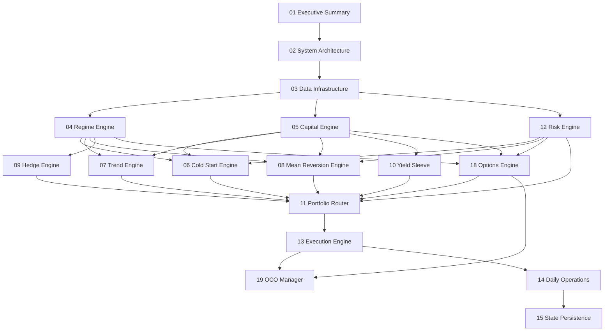

# Alpha NextGen - Project Specification

## Table of Contents

---

## Quick Links

| Resource | Description |
|----------|-------------|
| [README](README.md) | Documentation overview and quick reference |
| [Documentation Map](DOCUMENTATION-MAP.md) | Code-to-documentation mapping (for Claude) |
| [main.py Implementation](MAIN_PY_IMPLEMENTATION.md) | Phase 6 entry point implementation summary |
| [V2 Test Plan](V2_TEST_PLAN.md) | Comprehensive test strategy for V2.1 |
| [QC Coding Rules](../QC_RULES.md) | QuantConnect-specific patterns |
| [Common Errors](../ERRORS.md) | Troubleshooting guide |

---

## Foundation

| # | Section | Description | Key Diagrams |
|:-:|---------|-------------|--------------|
| [01](01-executive-summary.md) | **Executive Summary** | Project goals, design philosophy, key constraints, and critical decisions | None |
| [02](02-system-architecture.md) | **System Architecture** | Overall design, component relationships, authority hierarchy, signal flow | Master Architecture, Data Flow, Authority Hierarchy |

---

## Data Layer

| # | Section | Description | Key Diagrams |
|:-:|---------|-------------|--------------|
| [03](03-data-infrastructure.md) | **Data Infrastructure** | Proxy vs traded symbols, resolutions, indicators, exposure groups, data quality | Data Flow, Exposure Groups |

---

## Core Engines

| # | Section | Description | Key Diagrams |
|:-:|---------|-------------|--------------|
| [04](04-regime-engine.md) | **Regime Engine** | Four-factor market state scoring, smoothing, state classification (RISK_ON to RISK_OFF) | Regime Engine Detail |
| [05](05-capital-engine.md) | **Capital Engine** | SEED/GROWTH phases, position limits, virtual lockbox profit protection | Capital Engine Detail |
| [12](12-risk-engine.md) | **Risk Engine** | Kill switch, panic mode, weekly breaker, gap filter, vol shock, time guard, split guard | Risk Engine Safeguards |

---

## Strategy Engines

| # | Section | Description | Key Diagrams |
|:-:|---------|-------------|--------------|
| [06](06-cold-start-engine.md) | **Cold Start Engine** | Days 1-5 handling, warm entry conditions, reduced sizing, restrictions | Cold Start Flow |
| [07](07-trend-engine.md) | **Trend Engine** | Bollinger Band compression breakouts, Chandelier trailing stops, EOD signals | Trend Engine Detail |
| [08](08-mean-reversion-engine.md) | **Mean Reversion Engine** | RSI oversold detection, intraday-only, +2%/-2% exits, time-based force close | Mean Reversion Detail |
| [09](09-hedge-engine.md) | **Hedge Engine** | Regime-based TMF/PSQ allocation, tail risk protection, rebalancing rules | Hedge Engine Detail |
| [10](10-yield-sleeve.md) | **Yield Sleeve** | SHV for idle cash, LIFO liquidation, lockbox investment | None |
| [18](18-options-engine.md) | **Options Engine** | Dual-Mode (Swing + Intraday), Micro Regime Engine, VIX direction | Options Flow |

---

## Execution Layer

| # | Section | Description | Key Diagrams |
|:-:|---------|-------------|--------------|
| [11](11-portfolio-router.md) | **Portfolio Router** | TargetWeight aggregation, exposure validation, urgency routing, netting | Router Workflow, Position Sizing |
| [13](13-execution-engine.md) | **Execution Engine** | Market orders, MOO orders, fallback handling, fill processing | Order State Machine |
| [19](19-oco-manager.md) | **OCO Manager** | One-Cancels-Other order pairs for options stop/profit exits | OCO State Machine |

---

## Operations

| # | Section | Description | Key Diagrams |
|:-:|---------|-------------|--------------|
| [14](14-daily-operations.md) | **Daily Operations** | Complete timeline 09:00-16:00, scheduled events, engine activation matrix | Daily Timeline, System State Machine, Master Timeline Flow |
| [15](15-state-persistence.md) | **State Persistence** | ObjectStore usage, persisted variables, save/load triggers, recovery | State Persistence |

---

## Appendices

| # | Section | Description |
|:-:|---------|-------------|
| [16](16-appendix-parameters.md) | **Parameters Reference** | All tunable parameters with defaults, ranges, and descriptions |
| [17](17-appendix-glossary.md) | **Glossary** | Trading terms and system-specific concept definitions |

---

## Section Dependencies

---

## Reading Guides

### For New Readers

Start here to understand the system:

1. ➡️ [01 - Executive Summary](01-executive-summary.md) - Why this system exists
2. ➡️ [02 - System Architecture](02-system-architecture.md) - How it all fits together
3. ➡️ [14 - Daily Operations](14-daily-operations.md) - What happens during a trading day
4. ➡️ Then explore specific engines as needed

### For Implementers

Follow this sequence for development:

1. ➡️ [QC Rules](../QC_RULES.md) - Critical coding patterns
2. ➡️ [03 - Data Infrastructure](03-data-infrastructure.md) - Set up data feeds
3. ➡️ [04 - Regime Engine](04-regime-engine.md) - First core engine
4. ➡️ [05 - Capital Engine](05-capital-engine.md) - Second core engine
5. ➡️ [12 - Risk Engine](12-risk-engine.md) - Third core engine
6. ➡️ [06 - Cold Start Engine](06-cold-start-engine.md) - First strategy
7. ➡️ [08 - Mean Reversion Engine](08-mean-reversion-engine.md) - Intraday strategy
8. ➡️ [07 - Trend Engine](07-trend-engine.md) - Swing strategy
9. ➡️ [09 - Hedge Engine](09-hedge-engine.md) - Protection
10. ➡️ [10 - Yield Sleeve](10-yield-sleeve.md) - Cash management
11. ➡️ [11 - Portfolio Router](11-portfolio-router.md) - Coordination
12. ➡️ [13 - Execution Engine](13-execution-engine.md) - Order handling
13. ➡️ [15 - State Persistence](15-state-persistence.md) - Survival across restarts

### For Reviewers

Focus on these sections:

1. ➡️ [01 - Executive Summary](01-executive-summary.md) - Goals and constraints
2. ➡️ [12 - Risk Engine](12-risk-engine.md) - Safety mechanisms
3. ➡️ [16 - Parameters Reference](16-appendix-parameters.md) - Tunable values
4. ➡️ [02 - System Architecture](02-system-architecture.md) - Authority hierarchy

---

## System Overview

### Traded Instruments

| Symbol | Type | Leverage | Strategy | Overnight |
|--------|------|:--------:|----------|:---------:|
| TQQQ | Nasdaq 100 | 3x | Mean Reversion | ❌ |
| SOXL | Semiconductor | 3x | Mean Reversion | ❌ |
| QLD | Nasdaq 100 | 2x | Trend, Cold Start | ✅ |
| SSO | S&P 500 | 2x | Trend, Cold Start | ✅ |
| TMF | 20+ Year Treasury | 3x | Hedge | ✅ |
| PSQ | Nasdaq Inverse | 1x | Hedge | ✅ |
| SHV | Short Treasury | 1x | Yield | ✅ |

### Regime States

| Score | State | New Longs | Hedges | Cold Start |
|:-----:|-------|:---------:|:------:|:----------:|
| 70-100 | RISK_ON | ✅ Full | ❌ None | ✅ Yes |
| 50-69 | NEUTRAL | ✅ Full | ❌ None | ✅ If >50 |
| 40-49 | CAUTIOUS | ✅ Full | 10% TMF | ❌ No |
| 30-39 | DEFENSIVE | ⚠️ Reduced | 15% TMF, 5% PSQ | ❌ No |
| 0-29 | RISK_OFF | ❌ None | 20% TMF, 10% PSQ | ❌ No |

### Risk Controls

| Control | Trigger | Action |
|---------|---------|--------|
| Kill Switch | -3% daily | Liquidate ALL |
| Panic Mode | SPY -4% intraday | Liquidate leveraged longs |
| Weekly Breaker | -5% WTD | Reduce positions 50% |
| Gap Filter | SPY gaps -1.5% | Block intraday entries |
| Vol Shock | SPY bar > 3×ATR | Pause 15 minutes |
| Time Guard | 13:55-14:10 | Block all entries |

---

## Document Conventions

### Formatting

| Element | Meaning |
|---------|---------|
| **Bold** | Important terms or emphasis |
| `Code` | Parameter names, values, code references |
| ✅ | Allowed/Enabled |
| ❌ | Blocked/Disabled |
| ⚠️ | Conditional/Reduced |

### Diagram Colors

| Color | Represents |
|-------|------------|
| Blue | Data/Inputs |
| Orange | Core Engines |
| Green | Strategy Engines |
| Purple | Router/Coordination |
| Red | Risk/Safety |
| Gray | Execution/Output |

### Navigation

Every section includes:
- Previous/Next section links at top and bottom
- Link back to this Table of Contents
- Related section references in Dependencies

---

## Version History

| Version | Date | Changes |
|---------|------|---------|
| 1.0 | January 2026 | Initial specification |
| 1.1 | 25 January 2026 | Phase 6 complete - main.py implemented |
| 2.0 | 26 January 2026 | V2 fork with Core-Satellite architecture |
| 2.1 | 26 January 2026 | Options Engine, OCO Manager, Greeks monitoring, VIX filter |
| 2.1.1 | 28 January 2026 | Options Engine Redesign: Dual-Mode + Micro Regime Engine |

---

## Quick Navigation

| Jump To | Section |
|---------|---------|
| 🏠 Home | [README](README.md) |
| 🎯 Start | [01 - Executive Summary](01-executive-summary.md) |
| 🏗️ Architecture | [02 - System Architecture](02-system-architecture.md) |
| 📊 Data | [03 - Data Infrastructure](03-data-infrastructure.md) |
| 🌡️ Regime | [04 - Regime Engine](04-regime-engine.md) |
| 💰 Capital | [05 - Capital Engine](05-capital-engine.md) |
| 🚀 Cold Start | [06 - Cold Start Engine](06-cold-start-engine.md) |
| 📈 Trend | [07 - Trend Engine](07-trend-engine.md) |
| 📉 Mean Reversion | [08 - Mean Reversion Engine](08-mean-reversion-engine.md) |
| 🛡️ Hedge | [09 - Hedge Engine](09-hedge-engine.md) |
| 💵 Yield | [10 - Yield Sleeve](10-yield-sleeve.md) |
| 🔀 Router | [11 - Portfolio Router](11-portfolio-router.md) |
| ⚠️ Risk | [12 - Risk Engine](12-risk-engine.md) |
| ⚡ Execution | [13 - Execution Engine](13-execution-engine.md) |
| 📅 Operations | [14 - Daily Operations](14-daily-operations.md) |
| 💾 Persistence | [15 - State Persistence](15-state-persistence.md) |
| ⚙️ Parameters | [16 - Appendix: Parameters](16-appendix-parameters.md) |
| 📖 Glossary | [17 - Appendix: Glossary](17-appendix-glossary.md) |
| 🎰 Options | [18 - Options Engine](18-options-engine.md) (Dual-Mode V2.1.1) |
| 🔗 OCO | [19 - OCO Manager](19-oco-manager.md) |