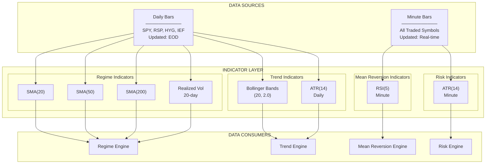
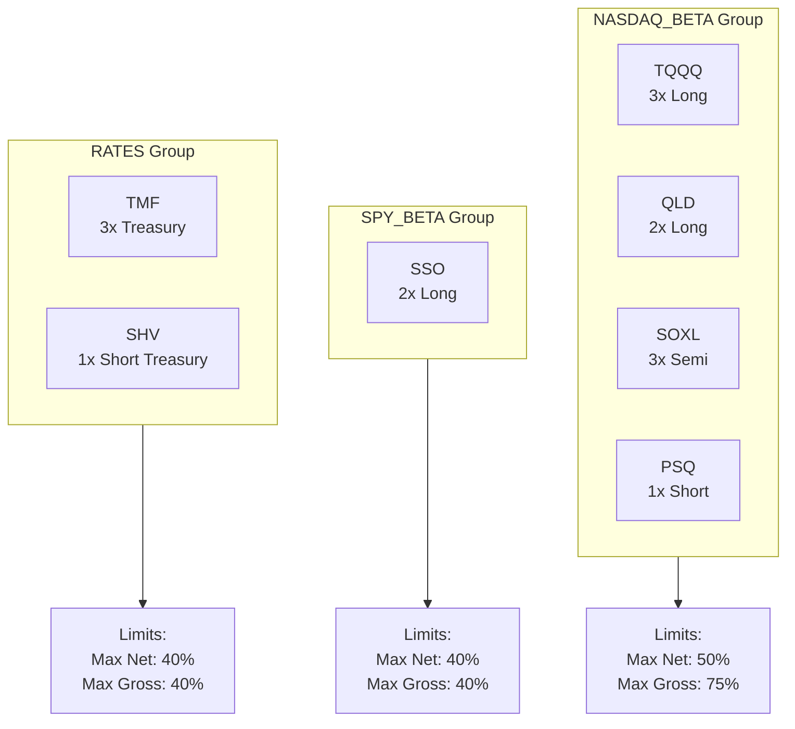

# Section 3: Data Infrastructure

[← System Architecture](02-system-architecture.md) | [Table of Contents](00-table-of-contents.md) | [Regime Engine →](04-regime-engine.md)

---

## Overview

The Data Infrastructure defines what market data the system consumes, at what resolution, and how it's organized. Data is categorized into two types: **Proxy Data** (used only for regime calculation, never traded) and **Traded Data** (instruments the system actually buys and sells).

**Key Principle:** Regime calculation uses separate proxy symbols to ensure clean signals without interference from trading activity.

---

## Data Categories

### Proxy Data (Daily Resolution)

Used exclusively for Regime Engine calculations. These symbols are NEVER traded.

| Symbol | Name | Purpose in Regime |
|--------|------|-------------------|
| **SPY** | S&P 500 ETF | Trend factor (price vs SMAs), Volatility factor |
| **RSP** | Equal Weight S&P 500 | Breadth factor (equal weight vs cap weight) |
| **HYG** | High Yield Corporate Bond | Credit factor (risk appetite) |
| **IEF** | 7-10 Year Treasury | Credit factor (flight to safety) |

### Traded Data (Minute Resolution)

Instruments the system actively trades, monitored at minute resolution for precise entry/exit.

| Symbol | Name | Leverage | Primary Strategy | Overnight Hold |
|--------|------|:--------:|------------------|:--------------:|
| **TQQQ** | ProShares UltraPro QQQ | 3x | Mean Reversion | ❌ Never |
| **SOXL** | Direxion Semiconductor Bull | 3x | Mean Reversion | ❌ Never |
| **QLD** | ProShares Ultra QQQ | 2x | Trend, Cold Start | ✅ Yes |
| **SSO** | ProShares Ultra S&P 500 | 2x | Trend, Cold Start | ✅ Yes |
| **TMF** | Direxion 20+ Year Treasury Bull | 3x | Hedge | ✅ Yes |
| **PSQ** | ProShares Short QQQ | 1x | Hedge | ✅ Yes |
| **SHV** | iShares Short Treasury Bond | 1x | Yield | ✅ Yes |

### Dual Resolution: SPY

SPY is unique - subscribed at BOTH resolutions:

| Resolution | Purpose |
|------------|---------|
| Daily | Regime Engine (trend, volatility calculations) |
| Minute | Risk Engine (panic mode, vol shock detection) |

---

## Data Flow Diagram


---

## Exposure Groups

Instruments are organized into **Exposure Groups** to prevent over-concentration in correlated assets. Groups have static membership (no rolling correlation calculations).


### Exposure Group Limits

| Group | Symbols | Max Net Long | Max Net Short | Max Gross |
|-------|---------|:------------:|:-------------:|:---------:|
| **NASDAQ_BETA** | TQQQ, QLD, SOXL, PSQ | 50% | 30% | 75% |
| **SPY_BETA** | SSO | 40% | 0% | 40% |
| **RATES** | TMF, SHV | 40% | 0% | 40% |

### Exposure Calculation Examples

**Example 1: Within Limits**
```
TQQQ: +25% (long)
QLD:  +20% (long)
SOXL: +0%
PSQ:  +0%
─────────────────
NASDAQ_BETA Net:   45% ✅ (under 50% limit)
NASDAQ_BETA Gross: 45% ✅ (under 75% limit)
```

**Example 2: Exceeds Limit - Scale Down**
```
TQQQ: +30% (long)
QLD:  +25% (long)
SOXL: +0%
PSQ:  +0%
─────────────────
NASDAQ_BETA Net:   55% ❌ (exceeds 50% limit)

Scale Factor: 50/55 = 0.909

Adjusted:
TQQQ: +27.3%
QLD:  +22.7%
─────────────────
NASDAQ_BETA Net:   50% ✅
```

**Example 3: Long and Short Netting**
```
QLD:  +30% (long)
PSQ:  +15% (short exposure, but long position)
─────────────────
NASDAQ_BETA Net:   15% ✅ (30% - 15% hedge)
NASDAQ_BETA Gross: 45% ✅
```

---

## Indicators

### Regime Engine Indicators

All calculated on **SPY daily** data:

| Indicator | Parameters | Purpose | Warmup |
|-----------|------------|---------|:------:|
| SMA(20) | Period: 20 | Short-term trend | 20 days |
| SMA(50) | Period: 50 | Medium-term trend | 50 days |
| SMA(200) | Period: 200 | Long-term trend | 200 days |
| Realized Volatility | Period: 20, History: 252 | Vol percentile | 252 days |

### Trend Engine Indicators

Calculated on **QLD and SSO daily** data:

| Indicator | Parameters | Purpose | Warmup |
|-----------|------------|---------|:------:|
| Bollinger Bands | Period: 20, StdDev: 2.0 | Compression/Breakout | 20 days |
| ATR | Period: 14 | Chandelier stop calculation | 14 days |

### Mean Reversion Engine Indicators

Calculated on **TQQQ and SOXL minute** data:

| Indicator | Parameters | Purpose | Warmup |
|-----------|------------|---------|:------:|
| RSI | Period: 5 | Oversold detection | 5 bars |

### Risk Engine Indicators

Calculated on **SPY minute** data:

| Indicator | Parameters | Purpose | Warmup |
|-----------|------------|---------|:------:|
| ATR | Period: 14 | Vol shock detection | 14 bars |

---

## Warmup Requirements

The system requires historical data to initialize indicators before trading.

| Indicator | Days Required | Symbol |
|-----------|:-------------:|--------|
| SMA(200) | 200 | SPY |
| Vol Percentile | 252 | SPY |
| Buffer | 20 | - |
| **Total Warmup** | **220** | - |

**Configuration:**
```
SetWarmUp(220, Resolution.Daily)
```

**Behavior During Warmup:**
- All indicators calculate but no trading occurs
- `IsWarmingUp` returns `True`
- OnData exits immediately
- After warmup, normal operation begins

---

## Data Quality Rules

### Freshness Checks

| Check | Threshold | Action |
|-------|-----------|--------|
| Stale Data | >5 minutes during market hours | Log warning, use last known |
| Missing Bar | No data for symbol | Skip symbol for that bar |
| Weekend/Holiday | Market closed | No action expected |

### Sanity Checks

| Check | Threshold | Action |
|-------|-----------|--------|
| Price <= 0 | Any | Reject bar, log error |
| Price Change | >50% from prior close | Flag for review, possible split |
| Volume | = 0 on trading day | Log warning |

### Split Detection

| Trigger | Action |
|---------|--------|
| `data.Splits` contains symbol | Freeze trading on symbol for day |
| Price drops >40% overnight | Investigate potential split |
| QuantConnect split event | Automatic price adjustment |

**Split Guard Behavior:**
1. Detect split event from `data.Splits`
2. Add symbol to frozen set for the day
3. Skip all entries for frozen symbols
4. Allow exits (liquidation) if needed
5. Clear frozen set at next day open

---

## Symbol Configuration

### QuantConnect Subscription
```
Resolution.Daily   → End-of-day bars, used for regime
Resolution.Minute  → Real-time bars, used for trading
```

### Symbol Groups (Code Reference)

| Group Variable | Symbols | Purpose |
|----------------|---------|---------|
| `proxy_symbols` | SPY, RSP, HYG, IEF | Regime calculation |
| `traded_symbols` | TQQQ, SOXL, QLD, SSO, TMF, PSQ, SHV | All tradeable |
| `mr_symbols` | TQQQ, SOXL | Mean reversion candidates |
| `trend_symbols` | QLD, SSO | Trend candidates |
| `hedge_symbols` | TMF, PSQ | Hedge instruments |
| `yield_symbols` | SHV | Cash management |

---

## Data Access Patterns

### Safe Data Access

Always check data availability before accessing:
```
1. Check data.ContainsKey(symbol)
2. Check data[symbol] is not None
3. Check indicator.IsReady
4. Then access values
```

### Price Access

| Property | Description |
|----------|-------------|
| `data[symbol].Open` | Bar open price |
| `data[symbol].High` | Bar high price |
| `data[symbol].Low` | Bar low price |
| `data[symbol].Close` | Bar close price |
| `data[symbol].Volume` | Bar volume |
| `Securities[symbol].Close` | Last known close |
| `Securities[symbol].Open` | Today's open (after market open) |

### History Requests

| Use Case | Request |
|----------|---------|
| Regime vol calculation | `History(spy, 252, Resolution.Daily)` |
| Breadth calculation | `History([rsp, spy], 21, Resolution.Daily)` |
| Credit calculation | `History([hyg, ief], 21, Resolution.Daily)` |

---

## Data Timing

### When Data Arrives

| Resolution | Timing | Use |
|------------|--------|-----|
| Daily | After 16:00 ET (finalized) | Regime, Trend signals |
| Minute | Every minute 09:30-16:00 | MR signals, Risk checks |

### When to Use Each

| Scenario | Resolution | Why |
|----------|------------|-----|
| Regime calculation | Daily | Need finalized EOD data |
| Trend entry signal | Daily | BB calculation on daily |
| MR entry signal | Minute | Need real-time oversold |
| Kill switch check | Minute | Need real-time equity |
| Panic mode check | Minute | Need real-time SPY price |

---

## ETF Characteristics

### Leveraged ETF Behavior

| Symbol | Leverage | Daily Reset | Decay Risk | Overnight Hold |
|--------|:--------:|:-----------:|:----------:|:--------------:|
| TQQQ | 3x | Yes | High | ❌ |
| SOXL | 3x | Yes | High | ❌ |
| QLD | 2x | Yes | Medium | ✅ |
| SSO | 2x | Yes | Medium | ✅ |
| TMF | 3x | Yes | Medium* | ✅ |
| PSQ | 1x | No | Low | ✅ |
| SHV | 1x | No | None | ✅ |

*TMF decay is acceptable for hedge purposes as it's not held for growth.

### Why 3x Intraday Only

3x ETFs experience **volatility decay** (also called beta slippage):
- Daily rebalancing causes drag in choppy markets
- Holding overnight exposes to gap risk
- Intraday moves capture directional moves without decay

**Example of Decay:**
```
Day 1: Underlying +10%, 3x ETF +30%  → $100 → $130
Day 2: Underlying -10%, 3x ETF -30% → $130 → $91
Net:   Underlying 0%, 3x ETF -9%
```

### Why 2x for Swing

2x ETFs have less severe decay:
- Acceptable for multi-day holds
- Lower gap risk than 3x
- Still provides leverage for returns

---

## Parameters Summary

| Parameter | Value | Section Reference |
|-----------|:-----:|-------------------|
| Daily Warmup | 220 days | Warmup Requirements |
| SMA Periods | 20, 50, 200 | Regime Indicators |
| BB Period | 20 | Trend Indicators |
| BB StdDev | 2.0 | Trend Indicators |
| ATR Period | 14 | Trend/Risk Indicators |
| RSI Period | 5 | MR Indicators |
| Vol Lookback | 20 days | Regime Indicators |
| Vol History | 252 days | Regime Indicators |
| NASDAQ_BETA Max Net | 50% | Exposure Groups |
| NASDAQ_BETA Max Gross | 75% | Exposure Groups |
| SPY_BETA Max | 40% | Exposure Groups |
| RATES Max | 40% | Exposure Groups |

---

## Dependencies

**Depends On:**
- Section 2: System Architecture (overall design)

**Used By:**
- Section 4: Regime Engine (proxy data, indicators)
- Section 7: Trend Engine (traded data, BB, ATR)
- Section 8: Mean Reversion Engine (traded data, RSI)
- Section 11: Portfolio Router (exposure groups)
- Section 12: Risk Engine (SPY minute data)

---

[← System Architecture](02-system-architecture.md) | [Table of Contents](00-table-of-contents.md) | [Regime Engine →](04-regime-engine.md)