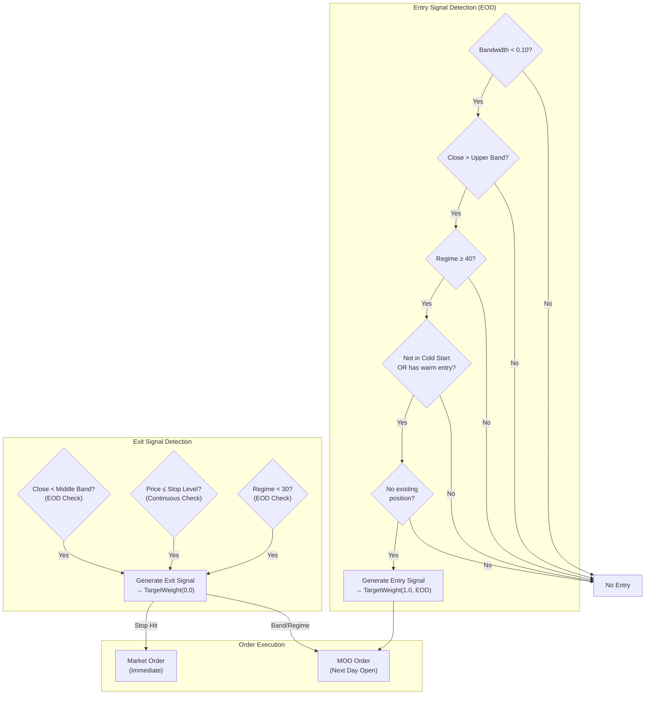
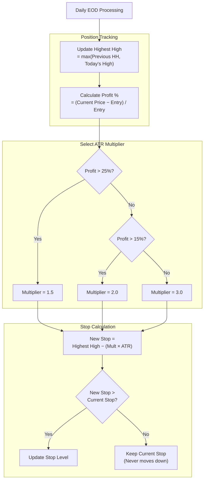

# Section 7: Trend Engine

## 7.1 Purpose and Philosophy

The Trend Engine captures **multi-day momentum moves** in 2× leveraged ETFs. It identifies periods of low volatility (compression) followed by directional breakouts, then rides the trend until momentum exhausts.

### 7.1.1 The Compression-Expansion Cycle

Markets alternate between periods of consolidation and expansion:

| Phase | Bollinger Band Behavior | Market State |
|-------|-------------------------|--------------|
| **Compression** | Bands narrow | Low recent volatility, coiling energy |
| **Expansion** | Bands widen | High volatility, directional movement |

**Key Insight:** Compression precedes expansion. When bands squeeze tight, a breakout is imminent. The direction of the breakout predicts the subsequent trend direction.

### 7.1.2 Why 2× Instead of 3×?

The Trend Engine holds positions **overnight**, sometimes for multiple days or weeks. For overnight holds:

| Factor | 3× Products | 2× Products |
|--------|:-----------:|:-----------:|
| Daily decay | Severe over multi-day periods | Moderate, acceptable |
| Gap risk | Enormous (−5% gap = −15%) | Manageable (−5% gap = −10%) |
| Stop width | Must be tight (capital at risk) | Can be wider |
| Holding period suitability | Intraday only | Multi-day swing trades ✅ |

**Conclusion:** 2× provides meaningful leverage while remaining manageable for swing trading.

---

## 7.2 Instruments

### 7.2.1 QLD (ProShares Ultra QQQ)

**Primary trend instrument.** 2× leveraged Nasdaq-100 exposure.

| Characteristic | Description |
|----------------|-------------|
| Underlying | Nasdaq-100 Index |
| Leverage | 2× |
| Beta | Higher than SSO (tech-heavy) |
| Best for | Strong risk-on regimes |
| Liquidity | Excellent |

### 7.2.2 SSO (ProShares Ultra S&P 500)

**Secondary trend instrument.** 2× leveraged S&P 500 exposure.

| Characteristic | Description |
|----------------|-------------|
| Underlying | S&P 500 Index |
| Leverage | 2× |
| Beta | Lower than QLD (diversified sectors) |
| Best for | Moderate regimes |
| Liquidity | Very high |

---

## 7.3 Entry Signal: Bollinger Band Compression Breakout

### 7.3.1 Bollinger Band Configuration

| Parameter | Value | Notes |
|-----------|:-----:|-------|
| Period | 20 days | Standard setting |
| Standard Deviation | 2.0 | Standard setting |

**Band Definitions:**
- **Middle Band:** 20-day Simple Moving Average (SMA)
- **Upper Band:** Middle + (2 × Standard Deviation)
- **Lower Band:** Middle − (2 × Standard Deviation)

### 7.3.2 Bandwidth Calculation

Bandwidth measures how wide the bands are relative to price:

```
Bandwidth = (Upper Band − Lower Band) / Middle Band
```

**Lower bandwidth = tighter bands = more compression**

#### Typical Bandwidth Ranges

| Bandwidth | Interpretation |
|:---------:|----------------|
| > 0.20 | Wide bands, recent expansion |
| 0.15 – 0.20 | Normal volatility |
| 0.10 – 0.15 | Beginning to compress |
| **< 0.10** | **Compressed — breakout likely imminent** |

### 7.3.3 Compression Threshold

The system considers bands "compressed" when:

```
Bandwidth < 0.10 (10%)
```

This indicates the **tightest 10%** of historical band widths—a significant squeeze that typically precedes a directional move.

### 7.3.4 Breakout Confirmation

A breakout is confirmed when **price closes above the upper band**:

```
Close > Upper Band
```

**Important:** This requires a daily **close** above the band, not just an intraday touch. The close confirms conviction.

### 7.3.5 Complete Entry Conditions

**All conditions must be true:**

| # | Condition | Requirement |
|:-:|-----------|-------------|
| 1 | Compression | Bandwidth < 0.10 |
| 2 | Breakout | Close > Upper Band |
| 3 | Regime | Score ≥ 40 (not RISK_OFF) |
| 4 | Cold Start | Not in cold start, OR has warm entry position |
| 5 | No Position | No existing position in this symbol |

---

## 7.4 Exit Signals

The system exits trend positions when **any of three conditions** trigger.

### Exit Conditions Summary

| Exit Type | Trigger | Urgency | Rationale |
|-----------|---------|:-------:|-----------|
| **Band Basis** | Close < Middle Band | EOD | Momentum exhausted |
| **Chandelier Stop** | Price ≤ Stop Level | IMMEDIATE | Capital protection |
| **Regime Exit** | Score < 30 | EOD | Macro override |

---

### 7.4.1 Band Basis Exit

**Trigger:** Daily close falls below the middle band (20-day SMA).

**Rationale:** The middle band represents the trend's equilibrium. When price falls below it, the breakout momentum has exhausted and price is returning to mean.

This is a **technical exit** for positions that slowly roll over rather than collapse.

```
Exit when: Close < Middle Band (20-day SMA)
```

---

### 7.4.2 Chandelier Stop Exit

**Trigger:** Price touches or falls below the trailing stop level.

**Rationale:** Protect capital from violent trend reversals. The trailing stop rises with price, locking in gains while giving room for normal pullbacks.

```
Exit when: Price ≤ Chandelier Stop Level
```

See **Section 7.5** for detailed Chandelier stop mechanics.

---

### 7.4.3 Regime Exit

**Trigger:** Regime score falls below 30 (RISK_OFF territory).

**Rationale:** If market conditions deteriorate to RISK_OFF, we don't want to hold leveraged long positions regardless of technical levels. This is a **macro override** of the technical strategy.

```
Exit when: Regime Score < 30
```

---

## 7.5 Chandelier Trailing Stop

### 7.5.1 Concept

The **Chandelier Exit** is a volatility-adjusted trailing stop that hangs from the highest high since entry, like a chandelier hangs from a ceiling.

**Key Properties:**
- As price makes new highs, the stop rises
- The stop **never moves down**
- Distance from high is measured in ATR units

### 7.5.2 ATR-Based Calculation

```
Stop Level = Highest High Since Entry − (Multiplier × ATR)
```

Where:
- **Highest High:** Maximum price reached since position entry
- **ATR:** 14-period Average True Range (daily)
- **Multiplier:** Varies based on profit level (see below)

ATR measures typical daily range, so the stop is calibrated to the instrument's normal volatility.

### 7.5.3 Tiered Multipliers

The ATR multiplier **tightens as profit increases**, locking in more gains on winning trades:

| Profit Level | ATR Multiplier | Stop Distance | Rationale |
|:------------:|:--------------:|:-------------:|-----------|
| < 15% | **3.0** | Widest | Initial phase, give room to work |
| 15% – 25% | **2.0** | Medium | Solid gain, protect more |
| > 25% | **1.5** | Tightest | Large gain, protect aggressively |

### 7.5.4 Example Progression

**Setup:** Entry at $100.00, ATR = $3.00

#### Day 0: Entry
| Component | Value |
|-----------|------:|
| Entry price | $100.00 |
| Highest high | $100.00 |
| Profit | 0% |
| Multiplier | 3.0 |
| **Initial stop** | **$91.00** ($100 − $9) |

#### Day 3: Price rises to $110 (10% profit)
| Component | Value |
|-----------|------:|
| Highest high | $110.00 |
| Profit | 10% (< 15%) |
| Multiplier | 3.0 |
| **New stop** | **$101.00** ($110 − $9) |

Stop raised from $91 to $101 (now above entry = locked in profit).

#### Day 7: Price rises to $118 (18% profit)
| Component | Value |
|-----------|------:|
| Highest high | $118.00 |
| Profit | 18% (> 15%) |
| Multiplier | **2.0** (tightened) |
| **New stop** | **$112.00** ($118 − $6) |

Multiplier tightened from 3.0 to 2.0 due to profit level.

#### Day 12: Price rises to $128 (28% profit)
| Component | Value |
|-----------|------:|
| Highest high | $128.00 |
| Profit | 28% (> 25%) |
| Multiplier | **1.5** (tightest) |
| **New stop** | **$123.50** ($128 − $4.50) |

Maximum protection engaged.

#### Day 15: Price pulls back to $124
| Component | Value |
|-----------|------:|
| Highest high | $128.00 (unchanged) |
| Stop | $123.50 (unchanged) |

Stop does NOT move down on pullbacks.

#### Day 16: Price drops to $123
```
Price ($123) < Stop ($123.50) → EXIT TRIGGERED
```

**Result:** Net profit = +23% (exited at ~$123 vs entry at $100)

### 7.5.5 Stop Update Timing

Stops are recalculated **daily after market close**, using:
- The finalized daily high (for highest high tracking)
- The current ATR reading
- The current profit level (for multiplier selection)

**Critical Rule:** The stop only moves UP, never down—even if ATR increases.

---

## 7.6 Signal Timing and Execution

### 7.6.1 OnEndOfDay Analysis

All trend signal analysis occurs in the **OnEndOfDay** event handler:

| Benefit | Description |
|---------|-------------|
| Complete bars | Uses finalized daily OHLC data |
| Accurate Bollinger Bands | Calculated on actual closing prices |
| No incomplete data risk | Avoids signals based on partial bars |

### 7.6.2 MOO Execution

Signals detected at end of day result in **Market-On-Open (MOO) orders** for the next trading day:

| Signal Type | Order Action |
|-------------|--------------|
| Entry signal | Queue MOO **buy** order |
| Exit signal (band/regime) | Queue MOO **sell** order |

**MOO Order Benefits:**
- High liquidity at the open
- Reliable execution
- Single price for entry (no slippage during open volatility)
- No overnight order management

### 7.6.3 Exception: Intraday Stop Hits

If price hits the Chandelier stop **during market hours**, the exit executes **immediately via market order**—not waiting for EOD.

```
Intraday Stop Hit → Immediate Market Sell Order
```

**Capital preservation takes priority over optimal execution timing.**

---

## 7.7 Output Format

The Trend Engine produces **TargetWeight** objects for the Portfolio Router.

### Entry Signal Output

| Field | Value |
|-------|-------|
| Symbol | QLD or SSO |
| Weight | 1.0 (full allocation to trend strategy budget) |
| Strategy | "TREND" |
| Urgency | EOD |
| Reason | "BB Compression Breakout: Bandwidth=X, Close>Upper" |

### Exit Signal Output

| Field | Value |
|-------|-------|
| Symbol | QLD or SSO |
| Weight | 0.0 (exit position) |
| Strategy | "TREND" |
| Urgency | EOD (band/regime) or IMMEDIATE (stop hit) |
| Reason | Description of exit trigger |

#### Exit Reason Examples

| Exit Type | Reason String |
|-----------|---------------|
| Band basis | "BAND_EXIT: Close ($X) < Middle Band ($Y)" |
| Chandelier stop | "STOP_HIT: Price ($X) < Stop ($Y)" |
| Regime exit | "REGIME_EXIT: Score (X) < 30" |

---

## 7.8 Mermaid Diagram: Entry/Exit Logic



---

## 7.9 Mermaid Diagram: Chandelier Stop Logic



---

## 7.10 Position Tracking Data

For each active trend position, the following data is maintained:

| Data Point | Type | Updated | Used For |
|------------|------|---------|----------|
| `symbol` | String | Entry | Position identification |
| `entry_price` | Float | Entry | Profit calculation, stop tightening |
| `entry_date` | Date | Entry | Logging, analysis |
| `highest_high` | Float | Daily | Chandelier stop calculation |
| `current_stop` | Float | Daily | Stop monitoring |
| `strategy_tag` | String | Entry | "TREND" or "COLD_START" |

### Persistence

All position tracking data is persisted to ObjectStore and survives algorithm restarts.

---

## 7.11 Integration with Other Engines

### Inputs from Other Engines

| Source | Data | Used For |
|--------|------|----------|
| **Regime Engine** | `regime_score` | Entry blocking (< 40), exit trigger (< 30) |
| **Capital Engine** | `tradeable_equity` | Position sizing |
| **Risk Engine** | Safeguard status | Entry blocking if kill switch active |
| **Cold Start Engine** | `days_running` | Cold start blocking |

### Outputs to Other Engines

| Destination | Data | Purpose |
|-------------|------|---------|
| **Portfolio Router** | TargetWeight objects | Entry and exit intentions |
| **State Persistence** | Position tracking data | Survival across restarts |

---

## 7.12 Parameter Reference

### Bollinger Band Parameters

| Parameter | Value | Description |
|-----------|:-----:|-------------|
| `BB_PERIOD` | 20 | Moving average period |
| `BB_STD_DEV` | 2.0 | Standard deviation multiplier |
| `COMPRESSION_THRESHOLD` | 0.10 | Bandwidth threshold for compression |

### Chandelier Stop Parameters

| Parameter | Value | Description |
|-----------|:-----:|-------------|
| `ATR_PERIOD` | 14 | ATR calculation period |
| `CHANDELIER_BASE_MULT` | 3.0 | Initial multiplier (profit < 15%) |
| `CHANDELIER_TIGHT_MULT` | 2.5 | Medium multiplier (profit 10-20%) - V2.1 |
| `CHANDELIER_TIGHTER_MULT` | 2.0 | Tight multiplier (profit > 20%) - V2.1 |
| `PROFIT_TIGHT_PCT` | 0.10 | Profit level for first tightening (10%) - V2.1 |
| `PROFIT_TIGHTER_PCT` | 0.20 | Profit level for second tightening (20%) - V2.1 |

### Regime Thresholds

| Parameter | Value | Description |
|-----------|:-----:|-------------|
| Entry minimum | 40 | Regime score required for entry |
| Exit trigger | 30 | Regime score that forces exit |

---

## 7.13 Edge Cases and Special Scenarios

### Scenario 1: Gap Down Through Stop

```
Previous Close: $120 (Stop at $115)
Today's Open: $110 (Below stop)
```

**Action:** Exit immediately at market open (~$110). The stop is a trigger level, not a guaranteed exit price. Gap risk is accepted.

### Scenario 2: Multiple Symbols Signal Entry

```
EOD Analysis:
- QLD: Compression breakout detected ✅
- SSO: Compression breakout detected ✅
```

**Action:** Both signals route to Portfolio Router. Router validates against exposure limits and may scale down if NASDAQ_BETA + SPY_BETA would exceed limits.

### Scenario 3: Regime Drops to 35 (DEFENSIVE)

```
Current Position: QLD at +12% profit
Regime: 35 (above 30 threshold)
```

**Action:** Position remains open. Regime exit only triggers at < 30. However, new entries would be subject to reduced sizing per DEFENSIVE rules.

### Scenario 4: ATR Increases Significantly

```
Day 1: Highest High = $100, ATR = $2, Stop = $94 (100 - 3×2)
Day 2: Highest High = $100, ATR = $4, Stop = $88? 
```

**Action:** Stop stays at $94. The stop **never moves down**, even if ATR increases. This protects against volatility expansion eroding protection.

### Scenario 5: Position From Warm Entry

```
Day 2: Warm entry in QLD at $80 (tagged "COLD_START")
Day 5: Cold start ends
Day 7: BB breakout signal for QLD
```

**Action:** No new entry—position already exists. The warm entry position continues to be managed with trend exit rules. The breakout signal is skipped because condition #5 (no existing position) fails.

---

## 7.14 Key Design Decisions Summary

| Decision | Rationale |
|----------|-----------|
| **2× leverage (not 3×)** | Acceptable decay for multi-day holds; manageable gap risk |
| **Bollinger Band compression** | Identifies low-volatility coiling that precedes breakouts |
| **Bandwidth < 0.10** | Captures significant squeezes without excessive false signals |
| **Close > Upper Band** | Requires conviction (daily close), not just intraday touch |
| **Chandelier trailing stop** | Volatility-adjusted protection that locks in gains |
| **Tiered multipliers** | Tighten protection as profit increases |
| **Stop never moves down** | Prevents volatility expansion from eroding protection |
| **EOD signal generation** | Uses complete daily bars for reliable signals |
| **MOO execution** | High liquidity, reliable fills at open |
| **Immediate stop execution** | Capital preservation overrides timing optimization |
| **Regime < 30 exit** | Macro conditions override technical signals |

---

*Next Section: [08 - Mean Reversion Engine](08-mean-reversion-engine.md)*

*Previous Section: [06 - Cold Start Engine](06-cold-start-engine.md)*
