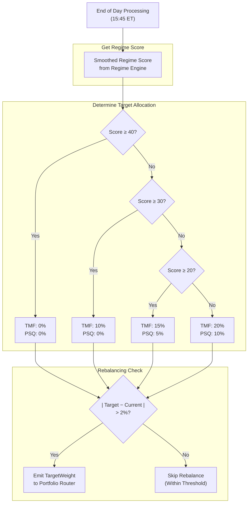
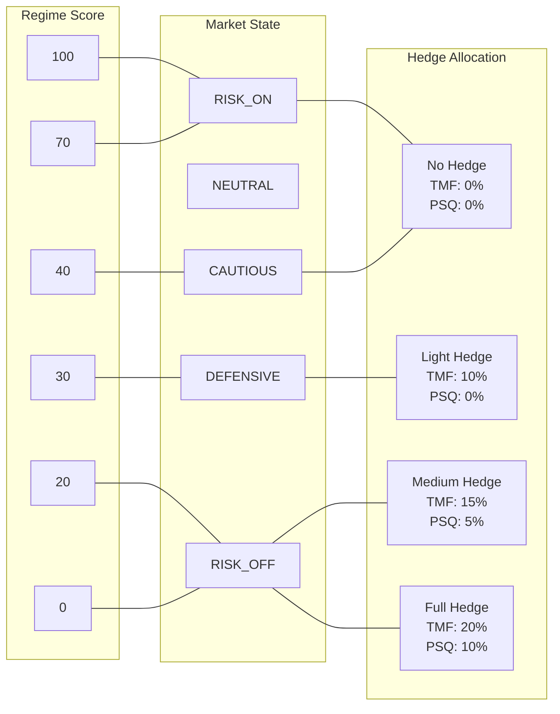

# Section 9: Hedge Engine

## 9.1 Purpose and Philosophy

The Hedge Engine provides **tail risk protection** when market conditions deteriorate. Hedges are insurance—they cost money in good times but protect the portfolio during crashes.

### 9.1.1 Insurance Mentality

Hedges are **not profit centers**. We expect them to lose money most of the time. Their value comes from asymmetric payoff:

| Market Condition | Hedge Behavior | Portfolio Impact |
|------------------|----------------|------------------|
| Normal/Bull | Small, ongoing cost | Minor drag on returns |
| Crash/Correction | Large, sudden benefit | Offsets equity losses |

#### Example Asymmetry

```
Normal Year:
  • 20% hedge allocation loses 5%
  • Portfolio cost: 20% × 5% = 1% drag

Crash Year:
  • 20% hedge allocation gains 50%
  • Portfolio benefit: 20% × 50% = 10% gain
  • While equity positions fall 30%+
```

The hedge's purpose is **survival**, not profit.

### 9.1.2 Regime-Triggered Activation

Hedges activate based on **regime score**, not prediction:

| Approach | Problem |
|----------|---------|
| ❌ Predict crashes | Impossible to time consistently |
| ✅ Respond to deterioration | Measurable, systematic, reliable |

As regime worsens, hedge allocation increases automatically. No discretion required.

---

## 9.2 Instruments

### 9.2.1 TMF (Direxion Daily 20+ Year Treasury Bull 3x)

**Primary hedge instrument.** 3× leveraged long-duration treasuries.

#### Why TMF Hedges Equity Risk

| Factor | Explanation |
|--------|-------------|
| **Flight-to-safety** | During crashes, investors flee to treasuries |
| **Negative correlation** | Treasury prices rise when stocks fall |
| **Long duration** | 20+ year bonds maximize rate sensitivity |
| **3× leverage** | Amplifies the hedge effect |

#### Characteristics

| Property | Value/Description |
|----------|-------------------|
| Underlying | 20+ Year Treasury Bond Index |
| Leverage | 3× |
| Correlation to SPY | Negative (especially during stress) |
| Daily decay | Significant during calm periods |
| Best scenario | Equity crash + rate cuts |
| Weakness | Rate-driven selloffs (rising rates) |

### 9.2.2 PSQ (ProShares Short QQQ)

**Secondary hedge instrument.** 1× inverse Nasdaq-100.

#### Why PSQ Supplements TMF

| Factor | Explanation |
|--------|-------------|
| **Direct inverse** | Guaranteed to rise when Nasdaq falls |
| **Works in all selloffs** | Even rate-driven crashes |
| **1× leverage** | Minimal decay |
| **Stability** | More predictable than 3× inverse |

#### Characteristics

| Property | Value/Description |
|----------|-------------------|
| Underlying | Nasdaq-100 Index (inverse) |
| Leverage | 1× (inverse) |
| Correlation to QQQ | −1.0 (by design) |
| Daily decay | Modest (1× inverse products) |
| Best scenario | Any Nasdaq decline |
| Weakness | Bull markets (steady drag) |

### 9.2.3 Why Both Instruments?

| Scenario | TMF | PSQ | Combined |
|----------|:---:|:---:|:--------:|
| Equity crash + rate cuts | ✅ Excellent | ✅ Good | ✅✅ Best |
| Equity crash + rates flat | ✅ Good | ✅ Good | ✅✅ Good |
| Equity crash + rates rise | ❌ Poor | ✅ Good | ✅ Protected |
| Sideways market | ❌ Decay | ❌ Decay | ❌ Cost |
| Bull market | ❌ Decay | ❌ Decay | ❌ Cost |

PSQ provides **certainty**—it will always hedge Nasdaq exposure regardless of interest rate dynamics.

---

## 9.3 Hedge Allocation Logic

### 9.3.1 Regime-Based Scaling

Hedge allocation scales with regime deterioration:

| Regime Score | State | TMF Allocation | PSQ Allocation | Total Hedge |
|:------------:|-------|:--------------:|:--------------:|:-----------:|
| **≥ 40** | RISK_ON / NEUTRAL / CAUTIOUS | 0% | 0% | 0% |
| **30 – 39** | DEFENSIVE | 10% | 0% | 10% |
| **20 – 29** | RISK_OFF (moderate) | 15% | 5% | 20% |
| **< 20** | RISK_OFF (severe) | 20% | 10% | 30% |

### 9.3.2 Visual Representation

```
Regime Score:  100 -------- 40 -------- 30 -------- 20 -------- 0
                |           |           |           |           |
TMF:           0%          0%         10%         15%         20%
PSQ:           0%          0%          0%          5%         10%
Total:         0%          0%         10%         20%         30%
                |           |           |           |           |
State:      RISK_ON    CAUTIOUS   DEFENSIVE  RISK_OFF   RISK_OFF
                                              (mod)     (severe)
```

### 9.3.3 Why Graduated Scaling?

Previous versions used **binary hedging** (ON at regime 40, OFF at 41). This caused problems:

| Problem | Impact |
|---------|--------|
| Regime oscillating around 40 | Constant hedge trading |
| Sudden large positions | Disrupted portfolio balance |
| No gradual adjustment | Couldn't match severity |
| High transaction costs | Frequent buys/sells |

**Graduated scaling provides:**

| Benefit | Description |
|---------|-------------|
| Smooth transitions | No abrupt position changes |
| Lower turnover | Fewer trades, lower costs |
| Proportional response | Hedge matches threat level |
| Reduced whipsaw | Less sensitivity to noise |

### 9.3.4 Why TMF Before PSQ?

**TMF is added first because:**
- Flight-to-safety works in most crash scenarios
- TMF can rally significantly during stress (50%+ in severe crashes)
- Lower ongoing cost than inverse products in typical conditions

**PSQ is added only when conditions are severe:**
- Score below 30 suggests serious trouble
- Need direct equity offset, not just flight-to-safety
- Worth the cost when probability of continued decline is high

---

## 9.4 Rebalancing Rules

### 9.4.1 EOD Only

Hedge rebalancing occurs **only at end of day** (15:45 ET):

| Property | Value |
|----------|-------|
| Timing | OnEndOfDay (15:45 ET) |
| Frequency | Once per day maximum |
| Trigger | Regime score change |

**Benefits:**
- Uses finalized regime score
- Prevents intraday churn from regime oscillation
- Batches with other EOD orders for efficiency

### 9.4.2 Threshold for Action

Rebalance only if target differs from current by more than **2%**:

```
Rebalance if: |Target Allocation − Current Allocation| > 2%
```

#### Example

| Scenario | TMF Target | TMF Current | Difference | Action |
|----------|:----------:|:-----------:|:----------:|--------|
| A | 10% | 9% | 1% | ❌ No rebalance |
| B | 10% | 7% | 3% | ✅ Rebalance |
| C | 15% | 10% | 5% | ✅ Rebalance |
| D | 0% | 2% | 2% | ❌ No rebalance |

This avoids small, costly adjustments that don't meaningfully change protection.

### 9.4.3 Panic Mode Exception

If **panic mode** triggers (SPY down 4%+ intraday), hedge requirements may be addressed **immediately** rather than waiting for EOD.

```
Panic Mode Triggered:
  → Check if hedge allocation is below required level
  → If yes, increase hedge immediately
  → Do not wait for 15:45 EOD processing
```

This ensures protection is in place during acute stress.

---

## 9.5 Output Format

The Hedge Engine produces **TargetWeight** objects for both instruments.

### TMF Output

| Field | Value |
|-------|-------|
| Symbol | TMF |
| Weight | 0.0, 0.10, 0.15, or 0.20 (based on regime) |
| Strategy | "HEDGE" |
| Urgency | EOD |
| Reason | "Regime=X, TMF target=Y%" |

### PSQ Output

| Field | Value |
|-------|-------|
| Symbol | PSQ |
| Weight | 0.0, 0.05, or 0.10 (based on regime) |
| Strategy | "HEDGE" |
| Urgency | EOD |
| Reason | "Regime=X, PSQ target=Y%" |

### Example Outputs

**Regime Score = 35 (DEFENSIVE):**
```
TargetWeight(TMF, 0.10, "HEDGE", EOD, "Regime=35, TMF target=10%")
TargetWeight(PSQ, 0.00, "HEDGE", EOD, "Regime=35, PSQ target=0%")
```

**Regime Score = 22 (RISK_OFF moderate):**
```
TargetWeight(TMF, 0.15, "HEDGE", EOD, "Regime=22, TMF target=15%")
TargetWeight(PSQ, 0.05, "HEDGE", EOD, "Regime=22, PSQ target=5%")
```

**Regime Score = 15 (RISK_OFF severe):**
```
TargetWeight(TMF, 0.20, "HEDGE", EOD, "Regime=15, TMF target=20%")
TargetWeight(PSQ, 0.10, "HEDGE", EOD, "Regime=15, PSQ target=10%")
```

---

## 9.6 Mermaid Diagram: Regime-Based Allocation



---

## 9.7 Mermaid Diagram: Hedge Allocation Tiers



---

## 9.8 Integration with Other Engines

### Inputs from Other Engines

| Source | Data | Used For |
|--------|------|----------|
| **Regime Engine** | `smoothed_score` | Determines hedge tier |
| **Regime Engine** | `tmf_target_pct`, `psq_target_pct` | Direct allocation targets |
| **Capital Engine** | `tradeable_equity` | Calculates dollar amounts |
| **Risk Engine** | Panic mode status | Immediate rebalance trigger |

### Outputs to Other Engines

| Destination | Data | Purpose |
|-------------|------|---------|
| **Portfolio Router** | TargetWeight (TMF) | Hedge allocation intent |
| **Portfolio Router** | TargetWeight (PSQ) | Hedge allocation intent |

### Relationship to Regime Engine

The Hedge Engine is tightly coupled to the Regime Engine:

```
Regime Engine Output:
  • smoothed_score: 28
  • tmf_target_pct: 0.15
  • psq_target_pct: 0.05

Hedge Engine simply passes these through as TargetWeights
```

The allocation logic is **defined in the Regime Engine** (Section 4); the Hedge Engine is primarily a **signal emitter** that converts regime outputs to TargetWeight objects.

---

## 9.9 Exposure Group Consideration

### RATES Group

TMF and SHV are both in the **RATES** exposure group:

| Symbol | Type | Group |
|--------|------|-------|
| TMF | 3× Long Treasury | RATES |
| SHV | Short Treasury (Yield) | RATES |

**RATES Group Limits:**

| Limit | Value |
|-------|:-----:|
| Max Net Long | 40% |
| Max Gross | 40% |

### NASDAQ_BETA Group

PSQ is in the **NASDAQ_BETA** exposure group (as an inverse):

| Symbol | Type | Group |
|--------|------|-------|
| PSQ | 1× Inverse Nasdaq | NASDAQ_BETA |
| TQQQ | 3× Long Nasdaq | NASDAQ_BETA |
| QLD | 2× Long Nasdaq | NASDAQ_BETA |
| SOXL | 3× Long Semiconductor | NASDAQ_BETA |

**Impact:** PSQ allocation counts as **negative** (short) exposure in NASDAQ_BETA, which can offset long positions.

```
Example:
  • QLD position: +30% (long)
  • PSQ position: +10% (inverse = -10% effective)
  • Net NASDAQ_BETA: 30% - 10% = 20% net long
  • Gross NASDAQ_BETA: 30% + 10% = 40%
```

---

## 9.10 Parameter Reference

### Hedge Tier Parameters

| Parameter | Value | Description |
|-----------|:-----:|-------------|
| `HEDGE_LEVEL_1` | 40 | Score below which hedging begins |
| `HEDGE_LEVEL_2` | 30 | Score below which medium hedge |
| `HEDGE_LEVEL_3` | 20 | Score below which full hedge |

### TMF Allocation Parameters

| Parameter | Value | Description |
|-----------|:-----:|-------------|
| `TMF_LIGHT` | 0.10 | TMF allocation at DEFENSIVE |
| `TMF_MEDIUM` | 0.15 | TMF allocation at RISK_OFF (moderate) |
| `TMF_FULL` | 0.20 | TMF allocation at RISK_OFF (severe) |

### PSQ Allocation Parameters

| Parameter | Value | Description |
|-----------|:-----:|-------------|
| `PSQ_MEDIUM` | 0.05 | PSQ allocation at RISK_OFF (moderate) |
| `PSQ_FULL` | 0.10 | PSQ allocation at RISK_OFF (severe) |

### Rebalancing Parameters

| Parameter | Value | Description |
|-----------|:-----:|-------------|
| Rebalance threshold | 2% | Minimum difference to trigger rebalance |
| Rebalance timing | EOD | When rebalancing occurs |

---

## 9.11 Hedge Performance Scenarios

### Scenario 1: 2020 COVID Crash

```
February 19, 2020: Regime Score = 72 (RISK_ON)
  • TMF: 0%, PSQ: 0%
  • No hedges, full equity exposure

March 1, 2020: Regime Score = 38 (DEFENSIVE)
  • TMF: 10%, PSQ: 0%
  • Light hedge activated

March 10, 2020: Regime Score = 22 (RISK_OFF)
  • TMF: 15%, PSQ: 5%
  • Medium hedge, direct protection added

March 16, 2020: Regime Score = 12 (RISK_OFF severe)
  • TMF: 20%, PSQ: 10%
  • Full hedge, maximum protection

Result:
  • TMF gained ~50% during crash
  • PSQ gained ~30% during crash
  • 30% hedge allocation × ~40% average gain = ~12% portfolio offset
  • Significantly reduced drawdown
```

### Scenario 2: 2022 Rate Hike Environment

```
January 2022: Regime Score = 55 (NEUTRAL)
  • TMF: 0%, PSQ: 0%
  • No hedges

March 2022: Regime Score = 32 (DEFENSIVE)
  • TMF: 10%, PSQ: 0%
  • Light hedge activated

Challenge:
  • TMF LOST value (rates rising hurt bonds)
  • Equity markets also fell
  • TMF hedge was counterproductive

June 2022: Regime Score = 25 (RISK_OFF)
  • TMF: 15%, PSQ: 5%
  • PSQ added, providing direct equity hedge

Result:
  • PSQ helped offset equity losses
  • TMF was a drag (rate-driven selloff)
  • Illustrates why PSQ is important as backup
```

### Scenario 3: Normal Bull Market

```
Throughout 2021: Regime Score = 65-80 (NEUTRAL to RISK_ON)
  • TMF: 0%, PSQ: 0%
  • No hedges, no drag on performance

Result:
  • Full participation in bull market
  • No hedge cost during favorable conditions
  • Regime-based approach avoided unnecessary insurance
```

---

## 9.12 Edge Cases and Special Scenarios

### Scenario 1: Regime Oscillates Around 40

```
Day 1: Score = 42 → TMF: 0%
Day 2: Score = 38 → TMF: 10%
Day 3: Score = 41 → TMF: 0%
Day 4: Score = 39 → TMF: 10%
```

**Mitigation:** 
- 2% rebalancing threshold prevents tiny adjustments
- Exponential smoothing in Regime Engine reduces daily swings
- Graduated tiers reduce impact of threshold crossings

### Scenario 2: Panic Mode + Low Hedge

```
Regime Score: 45 (no hedge required)
11:00 AM: SPY drops 4.2% → Panic Mode triggers
Current Hedge: 0%
```

**Action:** Panic mode may trigger immediate hedge addition even though regime score doesn't require it. Risk Engine takes precedence.

### Scenario 3: RATES Group Limit

```
Current SHV (Yield): 35%
Regime Score: 25 → TMF target: 15%
Combined RATES: 35% + 15% = 50%
RATES limit: 40%
```

**Action:** Portfolio Router will scale down TMF and/or SHV to fit within 40% RATES limit. Hedge target may not be fully achieved.

### Scenario 4: Regime Improves Rapidly

```
Day 1: Score = 18 → TMF: 20%, PSQ: 10%
Day 2: Score = 35 → TMF: 10%, PSQ: 0%
Day 3: Score = 55 → TMF: 0%, PSQ: 0%
```

**Action:** Hedges are reduced as conditions improve. The 2% threshold may cause slight lag, but positions are wound down over 2-3 days rather than immediately.

---

## 9.13 Key Design Decisions Summary

| Decision | Rationale |
|----------|-----------|
| **Two hedge instruments** | TMF for flight-to-safety, PSQ for direct offset |
| **TMF primary, PSQ secondary** | TMF works in most scenarios; PSQ added only when severe |
| **Graduated scaling** | Smooth transitions, reduced whipsaw |
| **Regime-triggered (not predictive)** | Systematic response to measurable deterioration |
| **EOD rebalancing only** | Prevents intraday churn |
| **2% rebalancing threshold** | Avoids small, costly adjustments |
| **Panic mode exception** | Ensures protection during acute stress |
| **Max 30% total hedge** | Balances protection with growth potential |
| **Insurance mentality** | Accept ongoing cost for tail risk protection |

---

*Next Section: [10 - Yield Sleeve](10-yield-sleeve.md)*

*Previous Section: [08 - Mean Reversion Engine](08-mean-reversion-engine.md)*
