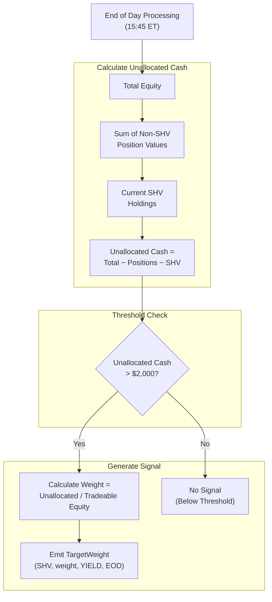
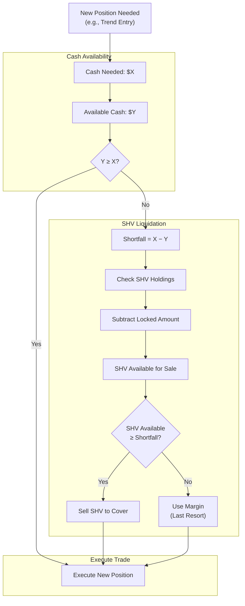

# Section 10: Yield Sleeve

## 10.1 Purpose and Philosophy

The Yield Sleeve puts **unallocated cash to work** earning yield. Rather than holding idle cash earning nothing (or minimal sweep interest), we invest in short-term treasuries.

### 10.1.1 Opportunity Cost of Cash

Cash in a brokerage account typically earns:

| Broker | Typical Cash Yield |
|--------|:------------------:|
| Interactive Brokers | ~4-5% on excess cash |
| Most other brokers | 0-0.5% |

**SHV currently yields approximately 5%.** Over time, this adds up:

| Scenario | Idle Cash | Annual Yield | Earnings |
|----------|----------:|:------------:|---------:|
| Small account | $50,000 | 5% | $2,500/year |
| Growing account | $60,000 (30% of $200k) | 5% | $3,000/year |
| Larger account | $150,000 (30% of $500k) | 5% | $7,500/year |

### 10.1.2 Maintaining Liquidity

The Yield Sleeve uses SHV specifically because it's essentially **"better cash"**:

| Property | Cash | SHV |
|----------|:----:|:---:|
| Liquidity | Instant | Instant (T+1 settlement) |
| Yield | 0-0.5% | ~5% |
| Volatility | None | Negligible |
| Bid-ask spread | N/A | 1-2 cents |

**Same liquidity, better yield.**

---

## 10.2 Instrument

### 10.2.1 SHV (iShares Short Treasury Bond ETF)

**The Yield Sleeve instrument.** Ultra-short duration treasury exposure.

| Property | Value |
|----------|-------|
| Issuer | BlackRock (iShares) |
| Holdings | US Treasury securities with ≤1 year to maturity |
| Current yield | ~5% (varies with Fed rates) |
| Duration | ~0.3 years |
| Price volatility | Negligible (a few cents daily) |
| Expense ratio | 0.15% |
| Bid-ask spread | 1-2 cents typically |
| Average daily volume | Very high |

### 10.2.2 Why SHV?

#### Compared to BIL (SPDR Bloomberg 1-3 Month T-Bill)

| Factor | SHV | BIL |
|--------|:---:|:---:|
| Duration | ~0.3 years | ~0.1 years |
| Expense ratio | 0.15% | 0.14% |
| Liquidity | Higher | Slightly lower |
| Yield | Marginally higher | Marginally lower |

**SHV chosen for:** Best combination of yield and liquidity.

#### Compared to Money Market Funds

Money market funds are not available through QuantConnect/IBKR in the same way as ETFs. SHV provides equivalent functionality with standard ETF mechanics.

---

## 10.3 Allocation Logic

### 10.3.1 Unallocated Cash Calculation

```
Unallocated Cash = Total Equity 
                 − Value of all non-SHV positions 
                 − Current SHV holdings
```

This represents cash that **could be deployed** to SHV.

#### Example Calculation

| Component | Value |
|-----------|------:|
| Total equity | $120,000 |
| QLD position | $35,000 |
| TMF position | $12,000 |
| Current SHV | $40,000 |
| **Unallocated cash** | **$33,000** |

### 10.3.2 Minimum Threshold

**Only buy SHV if unallocated cash exceeds $2,000.**

| Unallocated Cash | Action |
|-----------------:|--------|
| > $2,000 | ✅ Buy SHV |
| ≤ $2,000 | ❌ Skip (too small) |

**Rationale:**
- Avoids small, inefficient trades
- Commission and spread on small trades eat into yield
- Round number for simplicity

### 10.3.3 No Maximum

There is **no maximum SHV allocation**:

| Scenario | SHV Allocation | Status |
|----------|:--------------:|:------:|
| All strategies deployed | ~10-20% | Normal |
| Partial deployment | ~30-40% | Acceptable |
| RISK_OFF (no longs) | 60%+ | Expected |

**If regime is RISK_OFF and all long positions are closed, 60%+ might be in SHV. This is appropriate—idle capital should earn yield.**

---

## 10.4 Liquidation Priority

### 10.4.1 LIFO (Last In, First Out)

When cash is needed for other positions, **SHV is sold first**:

```
Priority for sourcing cash:
1. Available cash balance
2. Sell SHV (Yield Sleeve) ← First to liquidate
3. Use margin (last resort)
```

SHV is the **lowest priority holding**—it exists to earn yield on otherwise idle capital, not as a strategic position.

### 10.4.2 No Minimum Hold

Unlike some positions, SHV has **no minimum holding period**:

| Property | Value |
|----------|-------|
| Minimum hold time | None |
| Sell restrictions | None |
| Liquidity | Full, anytime |

If we need cash, sell it immediately. No concern about short-term holding costs.

### 10.4.3 Automatic Liquidation

When the Portfolio Router needs cash for a new position:

```
1. Calculate cash needed for new position
2. Check available cash in account
3. If insufficient:
   a. Calculate shortfall
   b. Check SHV holdings
   c. Sell sufficient SHV to cover shortfall
4. Execute the new position
```

This happens **automatically**—no manual intervention required.

#### Example: Trend Entry Needs Cash

```
Scenario:
  • Current cash: $5,000
  • Trend entry signal: Buy $25,000 QLD
  • Shortfall: $20,000
  • Current SHV: $45,000

Action:
  1. Sell $20,000 of SHV
  2. Use proceeds + existing cash for QLD purchase
  3. Remaining SHV: $25,000
```

---

## 10.5 Lockbox Integration

The **virtual lockbox capital** is physically invested in SHV.

### 10.5.1 Lockbox Concept Recap

- Locked capital = Reserved profits (excluded from risk)
- But it still needs to be **somewhere physically**
- SHV earns yield on locked capital
- Locked amount excluded from tradeable equity calculations

### 10.5.2 Physical vs Logical View

| View | Total | Locked | Tradeable |
|------|------:|-------:|----------:|
| **Logical** | $150,000 | $10,500 | $139,500 |
| **Physical** | $150,000 in positions | $10,500 in SHV (protected) | Rest available |

### 10.5.3 Example with Lockbox

| Component | Value | Notes |
|-----------|------:|-------|
| Total equity | $150,000 | |
| Locked amount | $10,500 | From $100k milestone |
| Non-SHV positions | $80,000 | QLD, TMF, etc. |
| **Total SHV holdings** | **$59,500** | |
| ↳ Locked portion | $10,500 | Cannot be traded |
| ↳ Available portion | $49,000 | Can be liquidated |
| Tradeable equity | $139,500 | Total − Locked |

The $10,500 lockbox capital physically exists in SHV but is **mathematically excluded** from trading calculations.

### 10.5.4 Liquidation with Lockbox

When liquidating SHV, the locked portion is **protected**:

```
SHV Holdings: $59,500
  • Locked: $10,500
  • Available: $49,000

Cash needed: $30,000

Action:
  • Sell $30,000 of SHV (from available portion)
  • Remaining SHV: $29,500
    - Locked: $10,500 (unchanged)
    - Available: $19,000
```

The system will **not** liquidate the locked portion for normal trading needs.

---

## 10.6 Output Format

The Yield Sleeve produces **TargetWeight** objects.

### Standard Output

| Field | Value |
|-------|-------|
| Symbol | SHV |
| Weight | Calculated (varies widely) |
| Strategy | "YIELD" |
| Urgency | EOD |
| Reason | "Unallocated cash $X" |

### Weight Calculation

```
SHV Target Weight = Unallocated Cash / Tradeable Equity
```

#### Example Outputs

**Scenario A: Significant Idle Cash**
```
Tradeable equity: $100,000
Unallocated cash: $35,000
Target weight: 35%

TargetWeight(SHV, 0.35, "YIELD", EOD, "Unallocated cash $35,000")
```

**Scenario B: Minimal Idle Cash**
```
Tradeable equity: $100,000
Unallocated cash: $1,500
Target weight: N/A (below $2,000 threshold)

No TargetWeight emitted
```

**Scenario C: RISK_OFF Environment**
```
Tradeable equity: $100,000
All longs closed, only hedges active
Unallocated cash: $65,000
Target weight: 65%

TargetWeight(SHV, 0.65, "YIELD", EOD, "Unallocated cash $65,000")
```

---

## 10.7 Mermaid Diagram: Yield Sleeve Logic



---

## 10.8 Mermaid Diagram: SHV Liquidation Flow



---

## 10.9 Integration with Other Engines

### Inputs from Other Engines

| Source | Data | Used For |
|--------|------|----------|
| **Capital Engine** | `tradeable_equity` | Weight calculation |
| **Capital Engine** | `locked_amount` | Protecting lockbox portion |
| **Portfolio Router** | Current positions | Calculating unallocated cash |

### Outputs to Other Engines

| Destination | Data | Purpose |
|-------------|------|---------|
| **Portfolio Router** | TargetWeight (SHV) | Yield allocation intent |

### Interaction with Portfolio Router

The Yield Sleeve is **lowest priority** in the Portfolio Router:

```
Router Priority:
1. Risk Engine actions (kill switch, panic mode)
2. Strategy exits (stops, targets)
3. Hedge adjustments
4. Strategy entries (trend, MR)
5. Yield Sleeve adjustments ← Last
```

If resources are constrained, Yield Sleeve is first to be reduced or skipped.

---

## 10.10 Exposure Group Consideration

### RATES Group

SHV is in the **RATES** exposure group along with TMF:

| Symbol | Type | Group |
|--------|------|-------|
| SHV | Short Treasury (Yield) | RATES |
| TMF | 3× Long Treasury (Hedge) | RATES |

**RATES Group Limits:**

| Limit | Value |
|-------|:-----:|
| Max Net Long | 40% |
| Max Gross | 40% |

### Potential Conflict

In RISK_OFF scenarios:
- TMF hedge: 20%
- SHV yield: Could be 30%+
- Combined RATES: 50%+ (exceeds limit)

**Resolution:** Portfolio Router scales down SHV to fit within RATES limit. Hedge allocation takes priority over yield.

```
Example:
  TMF target: 20%
  SHV target: 35%
  RATES limit: 40%
  
  Adjusted:
  TMF: 20% (hedge priority)
  SHV: 20% (scaled to fit)
```

---

## 10.11 Parameter Reference

### Yield Sleeve Parameters

| Parameter | Value | Description |
|-----------|:-----:|-------------|
| `SHV_MIN_TRADE` | $2,000 | Minimum unallocated cash to trigger SHV buy |
| Yield (current) | ~5% | Approximate annual yield |
| Expense ratio | 0.15% | Annual fund expense |

### Exposure Limits

| Parameter | Value | Description |
|-----------|:-----:|-------------|
| RATES Max Net | 40% | Maximum combined TMF + SHV |
| RATES Max Gross | 40% | Same (no short exposure) |

---

## 10.12 Yield Calculation Examples

### Example 1: Normal Operation

```
Account: $100,000
Average SHV allocation: 25% ($25,000)
Annual yield: 5%
Expense ratio: 0.15%

Gross yield: $25,000 × 5% = $1,250
Expenses: $25,000 × 0.15% = $37.50
Net yield: $1,212.50/year

Without Yield Sleeve (cash at 0.5%):
$25,000 × 0.5% = $125/year

Benefit: $1,087.50/year additional income
```

### Example 2: RISK_OFF Period (3 months)

```
Account: $150,000
SHV allocation during RISK_OFF: 60% ($90,000)
Duration: 3 months (0.25 years)
Annual yield: 5%

Yield earned: $90,000 × 5% × 0.25 = $1,125

If sitting in cash: ~$112

Benefit: ~$1,000 additional during defensive period
```

### Example 3: Growing Account

```
Year 1: Average $75,000 account, 30% SHV → $1,125 yield
Year 2: Average $150,000 account, 25% SHV → $1,875 yield
Year 3: Average $300,000 account, 20% SHV → $3,000 yield

Cumulative 3-year yield benefit: ~$6,000
```

---

## 10.13 Edge Cases and Special Scenarios

### Scenario 1: All Cash (Algorithm Start)

```
Day 1: Algorithm starts with $50,000 cash
No positions yet, cold start active

Action:
  • Most cash goes to SHV immediately
  • Earns yield while waiting for warm entry
  • SHV liquidated when warm entry executes
```

### Scenario 2: Kill Switch Liquidation

```
Kill switch triggers:
  • All positions liquidated (including SHV)
  • Account goes to 100% cash
  
Next day:
  • Cold start begins
  • Excess cash deployed to SHV
  • Yield earned during recovery period
```

### Scenario 3: RATES Limit Conflict

```
Regime = 18 (RISK_OFF severe)
  • TMF target: 20%
  • PSQ target: 10%
  • Unallocated cash: 45%
  
RATES limit: 40%
TMF (20%) already at hedge target

SHV allocation:
  • Target: 45%
  • Allowed: 40% − 20% = 20%
  • Actual: 20%
  
Remaining 25% stays as cash
```

### Scenario 4: Rapid Position Changes

```
Day 1: 60% SHV (quiet market)
Day 2: Trend signals → Sell 30% SHV for QLD
Day 3: MR entry → Sell 15% SHV for TQQQ
Day 4: MR exit → Proceeds back to SHV
Day 5: Trend exit → Proceeds back to SHV

SHV acts as a buffer, absorbing and releasing cash as needed
```

---

## 10.14 Key Design Decisions Summary

| Decision | Rationale |
|----------|-----------|
| **SHV as instrument** | Best combination of yield, liquidity, and low volatility |
| **Ultra-short duration** | Minimal interest rate risk |
| **$2,000 minimum** | Avoids inefficient small trades |
| **No maximum allocation** | Idle cash should earn yield regardless of amount |
| **LIFO liquidation** | SHV is lowest priority; liquidate first when cash needed |
| **Automatic liquidation** | No manual intervention for cash management |
| **Lockbox integration** | Protected capital physically in SHV but logically excluded |
| **EOD rebalancing** | Batches with other EOD orders; no intraday churn |
| **RATES group membership** | Subject to 40% combined limit with TMF |
| **Hedge priority over yield** | TMF allocation maintained; SHV scaled if needed |

---

*Next Section: [11 - Portfolio Router](11-portfolio-router.md)*

*Previous Section: [09 - Hedge Engine](09-hedge-engine.md)*
