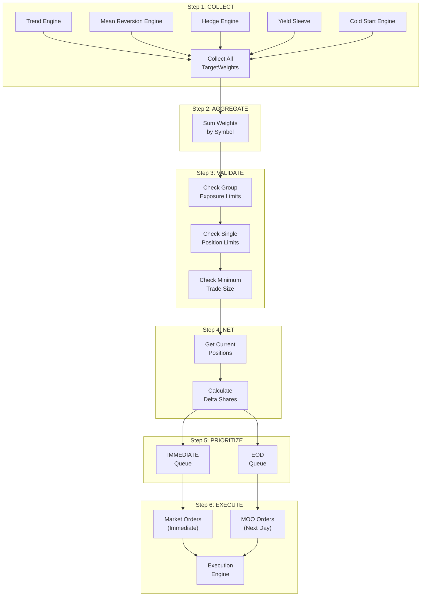
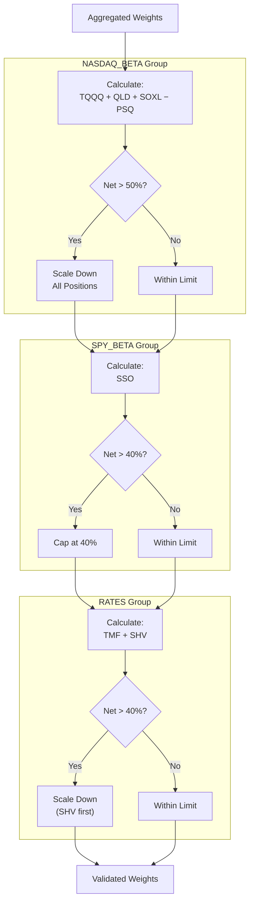

# Section 11: Portfolio Router

## 11.1 Purpose and Philosophy

The Portfolio Router is the **central coordination hub** that transforms strategy intentions into executed trades. It ensures all strategies work together harmoniously rather than conflicting.

### 11.1.1 Why Centralized Routing?

Previous system versions had each strategy place orders independently. This caused serious problems:

| Problem | Description | Impact |
|---------|-------------|--------|
| **Wash Sales** | One strategy buys while another sells same symbol | Tax issues, wasted commissions |
| **Beta Stacking** | Multiple strategies all long Nasdaq simultaneously | Excessive concentration risk |
| **Conflicting Positions** | Long TQQQ and short PSQ creating unintended exposure | Unpredictable net exposure |
| **Execution Chaos** | Multiple orders hitting market at same time | Poor fills, confusion |

### 11.1.2 The Router Solution

The Portfolio Router solves these problems by:

| Function | Benefit |
|----------|---------|
| **Collecting all intentions** | See full picture before acting |
| **Netting opposing signals** | Cancel out conflicting requests |
| **Enforcing portfolio limits** | Prevent excessive concentration |
| **Coordinating execution** | Single, orderly set of trades |

### 11.1.3 The TargetWeight Abstraction

Strategies express **intentions**, not orders:

| Strategy Says | Not This |
|---------------|----------|
| "I want 30% in QLD" | "Buy 150 shares of QLD" |
| "I want 0% in TQQQ" | "Sell all TQQQ" |

This abstraction allows the Router to:
- Compare multiple strategy intentions for same symbol
- Calculate net desired exposure
- Determine actual shares needed to reach target

---

## 11.2 Processing Workflow Overview

The Portfolio Router follows a **six-step workflow**:

```
Step 1: COLLECT    → Gather all TargetWeight objects from strategy engines
Step 2: AGGREGATE  → Sum weights by symbol across strategies
Step 3: VALIDATE   → Apply portfolio-level constraints
Step 4: NET        → Compare targets to current positions
Step 5: PRIORITIZE → Separate by urgency (IMMEDIATE vs EOD)
Step 6: EXECUTE    → Pass to Execution Engine
```

---

## 11.3 Step 1: Collect

### 11.3.1 Sources of TargetWeights

Gather all TargetWeight objects from all strategy engines:

| Engine | Typical Weights | Symbols |
|--------|-----------------|---------|
| **Trend Engine** | 0-2 weights | QLD, SSO |
| **Mean Reversion Engine** | 0-2 weights | TQQQ, SOXL |
| **Hedge Engine** | 2 weights | TMF, PSQ |
| **Yield Sleeve** | 0-1 weight | SHV |
| **Cold Start Engine** | 0-1 weight | QLD or SSO |

### 11.3.2 TargetWeight Structure

Each TargetWeight includes:

| Field | Type | Description |
|-------|------|-------------|
| `symbol` | String | Instrument ticker |
| `weight` | Float | Desired allocation (0.0 to 1.0) |
| `strategy` | String | Source engine name |
| `urgency` | Enum | IMMEDIATE or EOD |
| `reason` | String | Human-readable explanation |

### 11.3.3 Example Collection

```
Collected TargetWeights at 15:45 ET:

From Trend Engine:
  • TargetWeight(QLD, 0.30, "TREND", EOD, "BB Breakout")
  
From Hedge Engine:
  • TargetWeight(TMF, 0.10, "HEDGE", EOD, "Regime=38")
  • TargetWeight(PSQ, 0.00, "HEDGE", EOD, "Regime=38")
  
From Yield Sleeve:
  • TargetWeight(SHV, 0.55, "YIELD", EOD, "Unallocated $55k")

Total: 4 TargetWeights collected
```

---

## 11.4 Step 2: Aggregate

### 11.4.1 Sum Weights by Symbol

Sum weights across all strategies for each symbol:

```
For each symbol:
    Aggregated Weight = Σ (all strategy weights for this symbol)
```

### 11.4.2 Simple Same-Direction Example

```
Collected:
  • Trend wants +30% QLD
  • No other strategy mentions QLD

Aggregated:
  • QLD: 30%
```

### 11.4.3 Opposing Signals Example

```
Collected:
  • Trend wants +40% QLD (entry signal)
  • MeanRev wants -15% QLD (hypothetical exit)

Aggregated:
  • QLD: 40% - 15% = 25%
```

The Router doesn't distinguish between strategies—it just sums to get **net intention**.

### 11.4.4 Full Cancellation Example

```
Collected:
  • Strategy A wants +20% TQQQ
  • Strategy B wants -20% TQQQ

Aggregated:
  • TQQQ: 0%

If currently holding 20% TQQQ → Close position entirely
```

---

## 11.5 Step 3: Validate

Apply portfolio-level constraints to aggregated weights.

### 11.5.1 Validation Checks

| Check | Constraint | Action if Violated |
|-------|------------|-------------------|
| **Group Exposure** | NASDAQ_BETA ≤ 50% net | Scale down proportionally |
| **Single Position** | ≤ 50% (SEED) or 40% (GROWTH) | Cap at limit |
| **Minimum Trade** | ≥ $2,000 position value | Skip trade |

### 11.5.2 Group Exposure Limits

#### Exposure Group Definitions

| Group | Symbols | Max Net Long | Max Net Short | Max Gross |
|-------|---------|:------------:|:-------------:|:---------:|
| **NASDAQ_BETA** | TQQQ, QLD, SOXL, PSQ | 50% | 30% | 75% |
| **SPY_BETA** | SSO | 40% | 0% | 40% |
| **RATES** | TMF, SHV | 40% | 0% | 40% |

#### Calculating Group Exposure

```
For NASDAQ_BETA group:
  • Long exposure = Sum of positive weights (TQQQ, QLD, SOXL)
  • Short exposure = Absolute value of inverse (PSQ counts as short)
  • Net = Long - Short
  • Gross = Long + Short
```

#### Scaling When Exceeded

If net long exceeds maximum:

```
Scale Factor = Max Allowed / Current Total
Apply factor to all long positions in group
```

**Example:**
```
NASDAQ_BETA positions:
  • TQQQ: +25%
  • QLD: +35%
  • SOXL: +15%
  • PSQ: 0%

Total Net Long: 75%
Max Net Long: 50%

Scale Factor = 50% / 75% = 0.667

Adjusted:
  • TQQQ: 25% × 0.667 = 16.7%
  • QLD: 35% × 0.667 = 23.3%
  • SOXL: 15% × 0.667 = 10.0%

New Total: 50% (within limit)
```

### 11.5.3 Single Position Limits

Check each symbol against phase-dependent maximum:

| Phase | Max Single Position |
|-------|:-------------------:|
| SEED | 50% |
| GROWTH | 40% |

```
If validated_weight > max_single_position:
    validated_weight = max_single_position
```

### 11.5.4 Minimum Trade Size

If resulting position value is below $2,000, skip the trade:

```
Position Value = Tradeable Equity × Weight

If Position Value < $2,000:
    Skip this trade (not worth commission/spread)
```

---

## 11.6 Step 4: Net Against Current

Compare validated target weights to current portfolio positions.

### 11.6.1 Delta Calculation

For each symbol:

```
Target Value = Tradeable Equity × Target Weight
Current Value = Current Holdings Value
Delta Value = Target Value - Current Value
Delta Shares = Delta Value / Current Price
```

### 11.6.2 Rounding

Round to **whole shares**:

```
If |Delta Shares| < 1:
    No action needed (within rounding tolerance)
```

### 11.6.3 Example Calculation

```
Symbol: QLD
Tradeable Equity: $100,000
Target Weight: 30%
Current Holdings: 200 shares @ $80 = $16,000

Calculations:
  • Target Value: $100,000 × 30% = $30,000
  • Current Value: $16,000
  • Delta Value: $30,000 - $16,000 = +$14,000
  • Current Price: $80
  • Delta Shares: $14,000 / $80 = +175 shares

Action: Buy 175 shares of QLD
```

---

## 11.7 Step 5: Prioritize

Separate orders by urgency.

### 11.7.1 IMMEDIATE Queue

Process right away:

| Signal Type | Source |
|-------------|--------|
| Mean reversion entries | MR Engine |
| Mean reversion exits | MR Engine |
| Stop loss exits | Trend Engine |
| Kill switch liquidations | Risk Engine |
| Panic mode liquidations | Risk Engine |
| Cold start warm entries | Cold Start Engine |

### 11.7.2 EOD Queue

Hold until 15:45 batch processing:

| Signal Type | Source |
|-------------|--------|
| Trend entries | Trend Engine |
| Trend exits (band/regime) | Trend Engine |
| Hedge rebalancing | Hedge Engine |
| Yield sleeve adjustments | Yield Sleeve |

### 11.7.3 Conflict Resolution

If same symbol has both IMMEDIATE and EOD weights:

```
IMMEDIATE takes precedence
```

**Example:**
```
Collected:
  • TargetWeight(TQQQ, 0.15, "MEANREV", IMMEDIATE, "MR Entry")
  • TargetWeight(TQQQ, 0.00, "TREND", EOD, "Some signal")

Resolution:
  • Process IMMEDIATE weight (0.15) now
  • Ignore EOD weight for this symbol
```

---

## 11.8 Step 6: Execute

Pass validated orders to Execution Engine.

### 11.8.1 Order Type Mapping

| Urgency | Order Type | Timing |
|---------|------------|--------|
| IMMEDIATE | Market Order | Execute now |
| EOD | MOO Order | Execute next day open |

### 11.8.2 Order Handoff

```
For each order in queue:
    1. Create order object with:
       - Symbol
       - Quantity (delta shares)
       - Side (Buy/Sell)
       - Order type (Market/MOO)
    2. Pass to Execution Engine
    3. Track order status
```

---

## 11.9 SHV Liquidation Handling

When a new position requires cash, SHV is liquidated first.

### 11.9.1 Cash Sourcing Priority

```
1. Available cash balance
2. Sell SHV (Yield Sleeve) ← First to liquidate
3. Use margin (last resort)
```

### 11.9.2 Automatic Liquidation Process

```
1. Calculate cash needed for new position
2. Check available cash in account
3. If insufficient:
   a. Calculate shortfall
   b. Check SHV holdings (excluding locked portion)
   c. Sell sufficient SHV to cover shortfall
4. Execute the new position
```

### 11.9.3 Example

```
Scenario:
  • Cash needed: $25,000 (for QLD entry)
  • Available cash: $5,000
  • Shortfall: $20,000
  • SHV holdings: $45,000 (of which $10,000 locked)
  • SHV available: $35,000

Action:
  1. Sell $20,000 of SHV
  2. Combined with $5,000 cash = $25,000 available
  3. Execute QLD purchase
  4. Remaining SHV: $25,000
```

---

## 11.10 Mermaid Diagram: Six-Step Workflow



---

## 11.11 Mermaid Diagram: Exposure Group Validation



---

## 11.12 Netting Examples

### Example 1: Multiple Strategies, Same Direction

```
Input:
  • Trend: QLD +30%
  • Cold Start: QLD +0% (no signal)
  • Hedge: QLD +0% (no signal)

Aggregated: QLD = 30%
Action: Target 30% QLD
```

### Example 2: Strategies with Opposing Views

```
Input:
  • Trend: QLD +40% (entry signal)
  • Hypothetical Exit: QLD -10%

Aggregated: QLD = 30%
Action: Target 30% QLD (net of both views)
```

### Example 3: Hedge Offsetting Long

```
Input:
  • Trend: QLD +35%
  • Hedge: PSQ +10% (inverse = -10% effective)

NASDAQ_BETA Exposure:
  • Gross: 35% + 10% = 45%
  • Net: 35% - 10% = 25%

Both within limits (Gross < 75%, Net < 50%)
```

### Example 4: Over-Concentration Requiring Scaling

```
Input:
  • Trend: QLD +35%
  • MR: TQQQ +25%
  • Cold Start: SSO +0%

NASDAQ_BETA (QLD + TQQQ):
  • Total: 60%
  • Limit: 50%
  • Scale: 50/60 = 0.833

Adjusted:
  • QLD: 35% × 0.833 = 29.2%
  • TQQQ: 25% × 0.833 = 20.8%
  • Total: 50% (within limit)
```

---

## 11.13 Error Handling

### 11.13.1 Invalid Symbols

```
If TargetWeight references unknown symbol:
    → Log error
    → Skip this weight
    → Continue processing others
```

### 11.13.2 Conflicting Urgencies

```
If same symbol has both IMMEDIATE and EOD:
    → IMMEDIATE takes precedence
    → Log the conflict
```

### 11.13.3 Insufficient Liquidity

```
If position sizing exceeds available capital (including margin):
    → Scale down to available amount
    → Log the reduction
    → Execute reduced position
```

### 11.13.4 Negative Weights

```
If aggregated weight < 0 for a long-only symbol:
    → Treat as 0 (no position)
    → Sell any existing holdings
```

---

## 11.14 Integration with Other Engines

### Inputs from Other Engines

| Source | Data | Purpose |
|--------|------|---------|
| **All Strategy Engines** | TargetWeight objects | Aggregation input |
| **Capital Engine** | `tradeable_equity` | Position sizing |
| **Capital Engine** | `max_single_position_pct` | Validation |
| **Capital Engine** | `locked_amount` | SHV liquidation protection |
| **Risk Engine** | Kill switch / panic mode status | Override processing |

### Outputs to Other Engines

| Destination | Data | Purpose |
|-------------|------|---------|
| **Execution Engine** | Order objects | Trade execution |

### Authority in System Hierarchy

The Portfolio Router sits at **Level 5-6** in the authority hierarchy:

```
Level 1: Operational Safety
Level 2: Circuit Breakers ← Can override Router
Level 3: Regime Constraints ← Can block signals
Level 4: Capital Constraints ← Router enforces
Level 5: Strategy Signals ← Router processes
Level 6: Execution Preferences ← Router decides
```

---

## 11.15 Parameter Reference

### Exposure Group Limits

| Group | Max Net Long | Max Net Short | Max Gross |
|-------|:------------:|:-------------:|:---------:|
| NASDAQ_BETA | 50% | 30% | 75% |
| SPY_BETA | 40% | 0% | 40% |
| RATES | 40% | 0% | 40% |

### Position Limits

| Phase | Max Single Position |
|-------|:-------------------:|
| SEED | 50% |
| GROWTH | 40% |

### Trade Thresholds

| Parameter | Value |
|-----------|:-----:|
| Minimum trade size | $2,000 |
| Minimum share delta | 1 share |

---

## 11.16 Processing Timeline

### Intraday Processing (IMMEDIATE)

```
Every minute during market hours:
  1. Check for IMMEDIATE TargetWeights
  2. If found:
     a. Aggregate (typically just one signal)
     b. Validate
     c. Net against current
     d. Execute immediately
```

### End of Day Processing (EOD)

```
At 15:45 ET:
  1. Collect all EOD TargetWeights
  2. Aggregate all by symbol
  3. Validate against all limits
  4. Net against current positions
  5. Calculate SHV liquidation if needed
  6. Submit MOO orders for next day
```

---

## 11.17 Key Design Decisions Summary

| Decision | Rationale |
|----------|-----------|
| **Centralized coordination** | Prevents strategy conflicts, wash sales, beta stacking |
| **TargetWeight abstraction** | Strategies express intent, Router decides execution |
| **Aggregate then validate** | See full picture before applying constraints |
| **Static exposure groups** | Simpler than rolling correlation matrices |
| **IMMEDIATE vs EOD urgency** | Time-sensitive signals execute immediately |
| **SHV liquidation priority** | Lowest-priority holding funds higher-priority trades |
| **Proportional scaling** | Fair reduction when limits exceeded |
| **$2,000 minimum trade** | Avoids inefficient small trades |
| **MOO for EOD signals** | Reliable execution at next open |

---

*Next Section: [12 - Risk Engine](12-risk-engine.md)*

*Previous Section: [10 - Yield Sleeve](10-yield-sleeve.md)*
