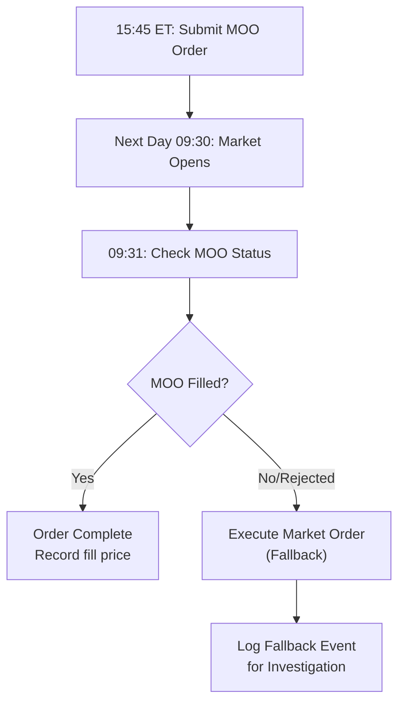
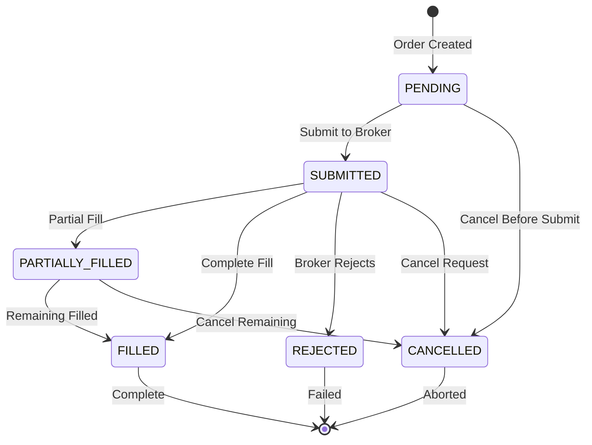
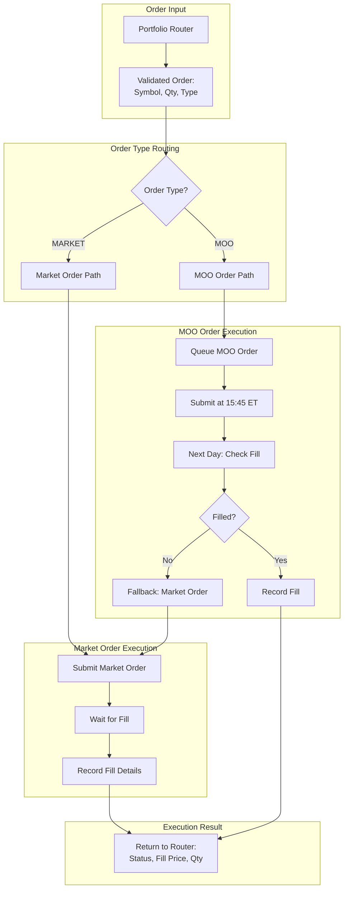
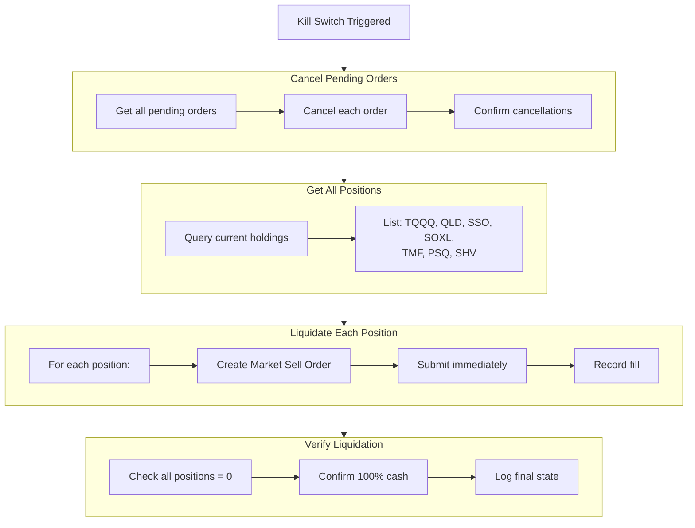

# Section 13: Execution Engine

## 13.1 Purpose and Philosophy

The Execution Engine translates **validated orders from the Portfolio Router** into actual market transactions. It handles order type selection, submission, and fill management.

### 13.1.1 Execution Quality vs Simplicity

The system prioritizes **reliable execution** over optimal execution:

| Approach | Benefit |
|----------|---------|
| Market orders | Certainty of fill |
| MOO orders | Reliable next-day execution |
| No limit orders | No risk of non-fill |
| No algorithms | Predictable behavior |
| No smart routing | Simplicity |

This simplicity ensures the system **behaves predictably** across all market conditions.

### 13.1.2 Design Principles

| Principle | Implementation |
|-----------|----------------|
| **Certainty over price** | Market orders guarantee fills |
| **Simplicity over optimization** | No complex order types |
| **Reliability over savings** | Accept spread costs for reliability |
| **Consistency** | Same execution logic every time |

---

## 13.2 Order Types

### 13.2.1 Market Orders

Used for **IMMEDIATE** urgency signals:

| Signal Source | Example |
|---------------|---------|
| Mean reversion entries | RSI oversold detected |
| Mean reversion exits | Target/stop/time hit |
| Stop loss exits | Chandelier stop triggered |
| Kill switch liquidations | −3% daily loss |
| Panic mode liquidations | SPY −4% intraday |
| Cold start warm entries | 10:00 AM regime check |

**Properties:**

| Property | Value |
|----------|-------|
| Execution timing | Immediate |
| Fill guarantee | Yes (in liquid ETFs) |
| Price guarantee | No (market price) |
| Slippage risk | Minimal in liquid ETFs |

### 13.2.2 Market-On-Open (MOO) Orders

Used for **EOD** urgency signals:

| Signal Source | Example |
|---------------|---------|
| Trend entries | BB compression breakout |
| Trend exits (band/regime) | Close below middle band |
| Hedge rebalancing | Regime change |
| Yield sleeve adjustments | Unallocated cash |

**Properties:**

| Property | Value |
|----------|-------|
| Submission timing | 15:45 ET (day before) |
| Execution timing | Next day's opening auction |
| Fill guarantee | Yes (participates in auction) |
| Price guarantee | Opening auction price |

**Benefits of MOO:**

| Benefit | Description |
|---------|-------------|
| High liquidity | Opening auction has maximum participation |
| Single price | No slippage during volatile open |
| Overnight analysis | Full day to finalize signals |
| No management | No need to monitor overnight |

---

## 13.3 Order Type Selection Matrix

| Scenario | Order Type | Timing | Rationale |
|----------|------------|--------|-----------|
| Trend entry | MOO | Next day open | Uses complete daily bars |
| Trend exit (band/regime) | MOO | Next day open | EOD signal, execute at open |
| Trend exit (stop hit intraday) | Market | Immediately | Capital preservation |
| MR entry | Market | Immediately | Time-sensitive opportunity |
| MR exit (target/stop/time) | Market | Immediately | Lock in result |
| Hedge rebalance | MOO | Next day open | EOD regime calculation |
| Yield adjustment | MOO | Next day open | EOD cash calculation |
| Warm entry | Market | At 10:00 AM | Immediate deployment |
| Kill switch | Market | Immediately | Emergency liquidation |
| Panic mode | Market | Immediately | Emergency liquidation |

---

## 13.4 MOO Fallback Logic

### 13.4.1 The Problem

MOO orders can sometimes be rejected:

| Rejection Reason | Example |
|------------------|---------|
| Symbol halted | Trading suspended before open |
| Technical issues | Broker connectivity problem |
| Invalid parameters | Order size exceeds limits |
| Exchange rejection | Regulatory or exchange rule |

If we rely solely on MOO and it fails, the intended position isn't established.

### 13.4.2 The Solution

Queue failed MOO orders for **fallback execution**:

```
1. Submit MOO order at 15:45 ET
2. At 09:31 next day, check if MOO filled
3. If MOO rejected or invalid → execute market order instead
4. Log the fallback for investigation
```

### 13.4.3 Why 09:31?

One minute after open allows:

| Factor | Benefit |
|--------|---------|
| Opening auction complete | MOO should have filled |
| MOO fills reported | Can verify status |
| Time to detect failures | Check order state |
| Still near open price | Fallback price close to intended |

### 13.4.4 Fallback Process



---

## 13.5 Fill Processing

### 13.5.1 Recording Fills

When an order fills, record:

| Data Point | Purpose |
|------------|---------|
| Fill price | P&L calculation, stop levels |
| Fill time | Trade logging, analysis |
| Fill quantity | Position verification |
| Commission/fees | True cost tracking |

### 13.5.2 Partial Fills

For highly liquid ETFs, partial fills are rare. If they occur:

| Step | Action |
|------|--------|
| 1 | Continue tracking remaining order |
| 2 | Update position with partial quantity |
| 3 | Full position management begins only when complete |

### 13.5.3 Fill Confirmation

Before acting on a fill:

| Check | Action |
|-------|--------|
| Position appears in portfolio | Verify holding |
| Quantity matches expected | Confirm full fill |
| Log any discrepancies | Alert for review |

---

## 13.6 Order State Machine

### 13.6.1 Order States

| State | Description |
|-------|-------------|
| **PENDING** | Order created, not yet submitted |
| **SUBMITTED** | Sent to broker |
| **PARTIALLY_FILLED** | Some shares filled |
| **FILLED** | Complete execution |
| **REJECTED** | Broker rejected order |
| **CANCELLED** | Order cancelled (by us or broker) |

### 13.6.2 State Transitions



---

## 13.7 Error Handling

### 13.7.1 Order Rejection

If broker rejects an order:

| Step | Action |
|------|--------|
| 1 | Log rejection reason |
| 2 | **Do not retry automatically** |
| 3 | Alert for manual review if critical |
| 4 | Continue with other orders |

**Rationale:** Automatic retry might repeat the error condition. Human review determines if retry is appropriate.

### 13.7.2 Connection Issues

If connection to broker is lost:

| Step | Action |
|------|--------|
| 1 | Halt all new order submission |
| 2 | Existing positions remain as-is |
| 3 | Resume when connection restored |
| 4 | Log gap in coverage |

### 13.7.3 Unexpected Fills

If a fill is received for an unexpected order:

| Step | Action |
|------|--------|
| 1 | Log detailed information |
| 2 | Alert for investigation |
| 3 | **Do not automatically reverse** |
| 4 | Human review determines action |

### 13.7.4 Timeout Handling

| Scenario | Timeout | Action |
|----------|---------|--------|
| Market order | 60 seconds | Log warning, check status |
| MOO order | N/A (fills at open) | Check at 09:31 |
| Connection lost | 5 minutes | Alert, halt new orders |

---

## 13.8 Integration with Portfolio Router

### 13.8.1 Order Handoff

The Portfolio Router passes validated orders to the Execution Engine:

```
Order Object:
  • symbol: String (e.g., "QLD")
  • quantity: Integer (positive = buy, negative = sell)
  • order_type: Enum (MARKET or MOO)
  • urgency: Enum (IMMEDIATE or EOD)
  • reason: String (human-readable)
  • strategy: String (source engine)
```

### 13.8.2 Execution Response

The Execution Engine returns:

```
Execution Result:
  • order_id: String
  • status: Enum (FILLED, REJECTED, PENDING)
  • fill_price: Float (if filled)
  • fill_quantity: Integer (if filled)
  • fill_time: DateTime (if filled)
  • rejection_reason: String (if rejected)
```

---

## 13.9 Mermaid Diagram: Execution Flow



---

## 13.10 Mermaid Diagram: Kill Switch Liquidation



---

## 13.11 Order Tagging and Tracking

### 13.11.1 Order Tags

Each order is tagged with metadata for tracking:

| Tag | Purpose | Example |
|-----|---------|---------|
| `strategy` | Source engine | "TREND", "MEANREV", "HEDGE" |
| `signal_type` | Entry or exit | "ENTRY", "EXIT_STOP", "EXIT_TARGET" |
| `signal_reason` | Trigger description | "BB Breakout", "RSI=22" |
| `order_id` | Unique identifier | "ORD-20240115-001" |

### 13.11.2 Order Log

All orders are logged with:

| Field | Description |
|-------|-------------|
| Timestamp | When order was created |
| Symbol | Instrument |
| Side | Buy or Sell |
| Quantity | Number of shares |
| Order type | Market or MOO |
| Status | Current state |
| Fill price | Execution price (if filled) |
| Strategy | Source engine |
| Reason | Signal description |

---

## 13.12 QuantConnect-Specific Implementation

### 13.12.1 Order Methods

| Order Type | QC Method |
|------------|-----------|
| Market Order | `self.MarketOrder(symbol, quantity)` |
| MOO Order | `self.MarketOnOpenOrder(symbol, quantity)` |

### 13.12.2 Fill Event Handling

```python
def OnOrderEvent(self, orderEvent):
    """Handle order fill events from QuantConnect."""
    if orderEvent.Status == OrderStatus.Filled:
        # Record fill details
        symbol = orderEvent.Symbol
        fill_price = orderEvent.FillPrice
        fill_quantity = orderEvent.FillQuantity
        # Update position tracking
        # Log execution
```

### 13.12.3 Order Cancellation

```python
def CancelAllOrders(self):
    """Cancel all pending orders (kill switch)."""
    for ticket in self.Transactions.GetOpenOrders():
        ticket.Cancel()
```

---

## 13.13 Execution Timing Summary

### 13.13.1 Daily Timeline

| Time (ET) | Event | Order Activity |
|-----------|-------|----------------|
| 09:25 | Pre-market setup | None |
| 09:30 | Market open | MOO orders execute |
| 09:31 | MOO fallback check | Fallback market orders if needed |
| 09:33 | SOD baseline set | Gap filter checked |
| 10:00 | Cold start window | Warm entry market orders |
| 10:00–15:00 | Trading hours | MR market orders, stop orders |
| 13:55–14:10 | Time guard | Entries blocked |
| 15:45 | EOD processing | MOO orders submitted for next day |
| 16:00 | Market close | No more executions |

### 13.13.2 Order Submission Windows

| Order Type | Submission Window | Execution Window |
|------------|-------------------|------------------|
| Market (MR) | 10:00–15:00 | Immediate |
| Market (stops) | 09:30–16:00 | Immediate |
| Market (kill switch) | 09:30–16:00 | Immediate |
| MOO | 15:45 (day before) | 09:30 next day |

---

## 13.14 Parameter Reference

### Execution Parameters

| Parameter | Value | Description |
|-----------|:-----:|-------------|
| MOO submission time | 15:45 ET | When to submit next-day orders |
| MOO fallback check | 09:31 ET | When to verify MOO fills |
| Market order timeout | 60 seconds | Warning threshold |
| Connection timeout | 5 minutes | Halt new orders |

### Order Size Limits

| Limit | Source | Description |
|-------|--------|-------------|
| Minimum trade | $2,000 | From Portfolio Router |
| Maximum single position | 50%/40% | Phase-dependent |
| Group exposure limits | Various | NASDAQ_BETA, SPY_BETA, RATES |

---

## 13.15 Error Scenarios and Responses

### Scenario 1: MOO Rejected Due to Halt

```
15:45 ET: Submit MOO buy 200 QLD
09:30 ET: QLD halted pre-market
09:31 ET: MOO rejected (symbol halted)

Response:
  • Log rejection: "QLD MOO rejected - symbol halted"
  • Do NOT submit fallback (symbol still halted)
  • Monitor for halt lift
  • Alert for manual review
```

### Scenario 2: Market Order Partial Fill

```
11:23 ET: Submit market buy 500 TQQQ
11:23 ET: Partial fill - 350 shares @ $45.20
11:23 ET: Remaining 150 pending

Response:
  • Update position with 350 shares
  • Continue waiting for remaining fill
  • After 60 seconds, log warning if still pending
  • Do not cancel (wait for completion)
```

### Scenario 3: Kill Switch During Pending Orders

```
10:15 ET: MR entry submitted - 300 TQQQ (pending)
10:16 ET: Kill switch triggered

Response:
  • Cancel pending 300 TQQQ order
  • If partially filled, sell filled portion
  • Liquidate all other positions
  • Go to 100% cash
```

---

## 13.16 Key Design Decisions Summary

| Decision | Rationale |
|----------|-----------|
| **Market orders for immediacy** | Certainty of fill in liquid ETFs |
| **MOO for EOD signals** | High liquidity at open, overnight analysis time |
| **No limit orders** | Avoid non-fill risk; accept spread |
| **09:31 fallback check** | Enough time for MOO report, still near open |
| **No automatic retry on rejection** | Avoid repeating errors; human review |
| **Tag all orders** | Enable tracking, analysis, debugging |
| **60-second market order timeout** | Warning threshold, not cancellation |
| **Connection loss halts new orders** | Existing positions safer than blind orders |

---

*Next Section: [14 - Daily Operations](14-daily-operations.md)*

*Previous Section: [12 - Risk Engine](12-risk-engine.md)*
