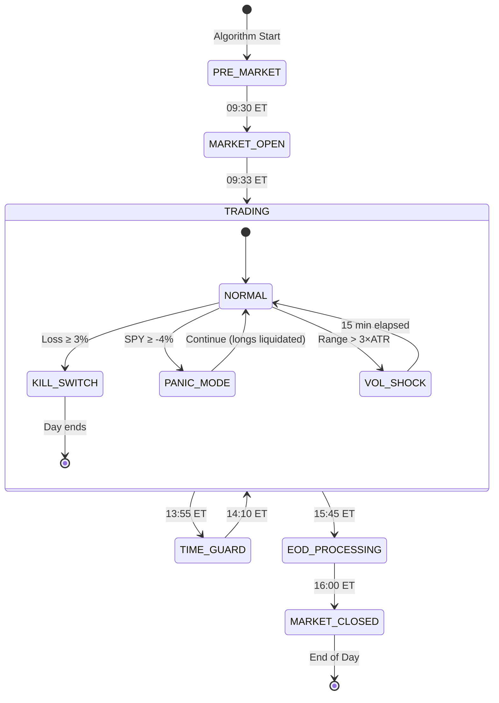
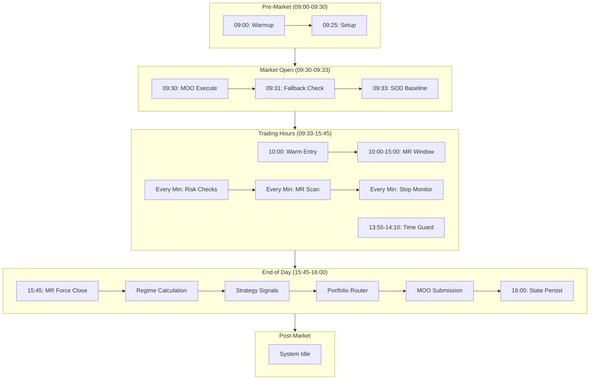

# Section 14: Daily Operations

## 14.1 Purpose and Philosophy

The Daily Operations section defines the **complete timeline** of system activities from pre-market through post-market. Understanding this timeline is essential for debugging, monitoring, and modifying the system.

### 14.1.1 Event-Driven Architecture

The system operates on **scheduled events** rather than continuous polling:

| Approach | Description |
|----------|-------------|
| Scheduled events | Specific times trigger specific actions |
| Minute bars | Data arrives every minute during market hours |
| OnEndOfDay | Special event for daily bar finalization |

### 14.1.2 Time Zones

All times in this document are **Eastern Time (ET)**:

| Season | UTC Offset |
|--------|:----------:|
| Eastern Standard Time (EST) | UTC-5 |
| Eastern Daylight Time (EDT) | UTC-4 |

QuantConnect handles timezone conversion automatically.

---

## 14.2 Complete Daily Timeline

### Pre-Market (Before 09:30)

```
09:00 ET ─── Algorithm Warmup Verification
             ├── Verify all indicators populated
             ├── Confirm data feeds active
             └── Load persisted state from ObjectStore

09:25 ET ─── Pre-Market Setup
             ├── Set equity_prior_close baseline
             ├── Calculate regime preview (yesterday's close)
             └── Prepare for market open
```

### Market Open (09:30 – 09:33)

```
09:30 ET ─── Market Open
             ├── MOO orders execute in opening auction
             ├── Process MOO fill events
             ├── Update position quantities
             └── Begin minute-by-minute data flow

09:31 ET ─── MOO Fallback Window
             ├── Check if any MOO orders failed/rejected
             ├── Execute market order fallbacks
             └── Log all fallback executions

09:33 ET ─── Start of Day (SOD) Baseline
             ├── Set equity_sod baseline (post-MOO fills)
             ├── Check gap filter (SPY open vs prior close)
             └── Initialize intraday safeguard monitors
```

### Cold Start Window (10:00)

```
10:00 ET ─── Warm Entry Check
             ├── Check if days_running < 5
             ├── If cold start active:
             │   ├── Check all 8 warm entry conditions
             │   ├── If conditions met → Execute warm entry
             │   └── If not → Log reason, continue
             └── If cold start complete → Skip
```

### Trading Hours (10:00 – 15:00)

```
10:00 - 15:00 ET ─── Continuous Trading Loop

    EVERY MINUTE:
    │
    ├── STEP 1: Risk Engine Checks (ALWAYS FIRST)
    │   ├── Kill switch: Compare equity vs prior_close AND sod
    │   ├── Panic mode: Check SPY intraday drop vs 4%
    │   ├── Vol shock: Check SPY 1-min bar range vs 3×ATR
    │   └── If ANY triggered → Immediate action, skip other processing
    │
    ├── STEP 2: Mean Reversion Scanning (if safeguards clear)
    │   ├── For each MR symbol (TQQQ, SOXL):
    │   │   ├── Check entry conditions (RSI, drop, volume, time)
    │   │   └── Check exit conditions (target, stop, time)
    │   └── Emit TargetWeight objects (urgency: IMMEDIATE)
    │
    ├── STEP 3: Position Monitoring
    │   ├── Update Chandelier stops for trend positions
    │   ├── Track highest highs since entry
    │   └── Check for intraday stop triggers
    │
    └── STEP 4: Execute IMMEDIATE Orders
        └── If any IMMEDIATE TargetWeights → Router processes immediately
```

### Time Guard (13:55 – 14:10)

```
13:55 ET ─── Time Guard Activates
             ├── Block all new entries
             ├── Continue exit monitoring
             └── Continue risk checks

14:10 ET ─── Time Guard Deactivates
             ├── Resume normal entry scanning
             └── Continue all other activities
```

### Mean Reversion Close (15:00 – 15:45)

```
15:00 ET ─── MR Entry Window Closes
             ├── No new MR entries after this time
             └── Continue monitoring existing MR positions

15:45 ET ─── MR Time Exit
             ├── Force close ALL remaining MR positions
             └── Execute immediate market sell orders
```

### End of Day Processing (15:45 – 16:00)

```
15:45 ET ─── EOD Processing Begins

    ├── REGIME ENGINE
    │   ├── Calculate all 4 factors (trend, vol, breadth, credit)
    │   ├── Aggregate weighted score
    │   ├── Apply exponential smoothing
    │   └── Output: RegimeState with hedge targets
    │
    ├── CAPITAL ENGINE
    │   ├── Check phase transition eligibility
    │   ├── Check lockbox milestones
    │   └── Output: CapitalState with tradeable equity
    │
    ├── TREND ENGINE (EOD signals)
    │   ├── Check BB compression/breakout for QLD, SSO
    │   ├── Check band basis exit for existing positions
    │   ├── Check regime exit condition
    │   └── Emit TargetWeight objects (urgency: EOD)
    │
    ├── HEDGE ENGINE
    │   ├── Compare current hedge vs regime-required levels
    │   └── Emit TargetWeight for TMF, PSQ (urgency: EOD)
    │
    ├── YIELD SLEEVE
    │   ├── Calculate unallocated cash
    │   └── Emit TargetWeight for SHV (urgency: EOD)
    │
    └── PORTFOLIO ROUTER (EOD batch)
        ├── Collect all EOD TargetWeights
        ├── Aggregate by symbol
        ├── Validate against limits
        ├── Calculate deltas vs current positions
        └── Submit MOO orders for next day

16:00 ET ─── Market Close

    ├── OnEndOfDay Event Processing
    │   ├── Finalize regime score
    │   ├── Check phase transitions
    │   ├── Increment days_running (if no kill switch)
    │   └── Clear daily flags
    │
    └── State Persistence
        ├── Save all state to ObjectStore
        └── Ready for next trading day
```

### Post-Market (After 16:00)

```
16:00+ ET ─── System Idle
              └── No processing until next trading day
```

---

## 14.3 Timeline Visualization

```mermaid
gantt
    title Daily Operations Timeline (Eastern Time)
    dateFormat HH:mm
    axisFormat %H:%M
    
    section Pre-Market
    Warmup Verification       :done, 09:00, 15m
    Pre-Market Setup          :done, 09:25, 5m
    
    section Open
    Market Open (MOO)         :crit, 09:30, 1m
    MOO Fallback Check        :09:31, 2m
    SOD Baseline Setup        :09:33, 2m
    
    section Cold Start
    Warm Entry Window         :10:00, 5m
    
    section Trading
    Continuous Trading Loop   :10:00, 235m
    Time Guard Active         :crit, 13:55, 15m
    MR Entry Window           :10:00, 300m
    
    section EOD
    MR Force Close            :crit, 15:45, 1m
    EOD Processing            :15:45, 15m
    Market Close              :16:00, 1m
    
    section Post
    State Persistence         :16:00, 5m
```



---

## 14.4 Engine Activation Matrix

### Which Engines Are Active When?

| Time Window | Regime | Capital | Risk | Cold Start | Trend | MR | Hedge | Yield |
|-------------|:------:|:-------:|:----:|:----------:|:-----:|:--:|:-----:|:-----:|
| 09:00–09:30 | Preview | Load | — | Check | — | — | — | — |
| 09:30–09:33 | — | — | ✅ | — | — | — | — | — |
| 09:33–10:00 | — | — | ✅ | — | Monitor | — | — | — |
| 10:00–13:55 | — | — | ✅ | ✅ | Monitor | ✅ | — | — |
| 13:55–14:10 | — | — | ✅ | — | Monitor | ❌ | — | — |
| 14:10–15:00 | — | — | ✅ | — | Monitor | ✅ | — | — |
| 15:00–15:45 | — | — | ✅ | — | Monitor | Exit only | — | — |
| 15:45–16:00 | ✅ | ✅ | ✅ | — | ✅ | Exit | ✅ | ✅ |
| 16:00+ | — | — | — | — | — | — | — | — |

**Legend:**
- ✅ = Active (generating signals)
- Monitor = Monitoring existing positions only
- Exit only = Only exit signals, no entries
- — = Inactive
- ❌ = Blocked by safeguard

---

## 14.5 Scheduled Events Configuration

### 14.5.1 QuantConnect Scheduled Events

| Event Name | Time | Days | Function |
|------------|------|------|----------|
| `PreMarketSetup` | 09:25 | Mon-Fri | Set baselines, load state |
| `SODBaseline` | 09:33 | Mon-Fri | Set equity_sod, check gap |
| `WarmEntryCheck` | 10:00 | Mon-Fri | Cold start warm entry |
| `TimeGuardStart` | 13:55 | Mon-Fri | Block entries |
| `TimeGuardEnd` | 14:10 | Mon-Fri | Resume entries |
| `MRForceClose` | 15:45 | Mon-Fri | Close MR positions |
| `EODProcessing` | 15:45 | Mon-Fri | Run all EOD logic |
| `WeeklyReset` | 09:30 | Mon | Reset weekly breaker |

### 14.5.2 Minute-Level Processing

Every minute during market hours (09:30–16:00):

```python
def OnData(self, data):
    """Called every minute with new data."""
    # Risk checks first
    self.risk_engine.check_all_safeguards()
    
    # MR scanning (if within window and safeguards clear)
    if self.is_mr_window() and self.safeguards_clear():
        self.mr_engine.scan_for_signals()
    
    # Position monitoring
    self.trend_engine.monitor_positions()
```

---

## 14.6 Data Flow by Time

### 14.6.1 Pre-Market Data Flow

```
ObjectStore
    │
    ├──→ Load days_running
    ├──→ Load current_phase
    ├──→ Load lockbox_amount
    ├──→ Load position tracking
    └──→ Load regime_score (previous)

Yesterday's Daily Bars
    │
    └──→ Calculate regime preview
```

### 14.6.2 Market Hours Data Flow

```
Minute Bars (SPY, TQQQ, SOXL, QLD, SSO, TMF, PSQ, SHV)
    │
    ├──→ Risk Engine (SPY for panic, vol shock)
    ├──→ MR Engine (TQQQ, SOXL for RSI, price, volume)
    └──→ Position Manager (all for stop monitoring)

Portfolio Value
    │
    └──→ Risk Engine (kill switch calculation)
```

### 14.6.3 EOD Data Flow

```
Finalized Daily Bars (SPY, RSP, HYG, IEF)
    │
    └──→ Regime Engine
            │
            ├──→ Trend Factor
            ├──→ Volatility Factor
            ├──→ Breadth Factor
            └──→ Credit Factor
                    │
                    └──→ Smoothed Score
                            │
                            ├──→ Hedge Engine (hedge targets)
                            ├──→ Trend Engine (entry/exit decisions)
                            └──→ Cold Start Engine (warm entry eligibility)

Finalized Daily Bars (QLD, SSO)
    │
    └──→ Trend Engine
            │
            ├──→ Bollinger Bands
            └──→ Entry/Exit Signals
                    │
                    └──→ Portfolio Router
                            │
                            └──→ MOO Orders
```

---

## 14.7 State Machine: System States

### 14.7.1 Daily State Machine



### 14.7.2 State Definitions

| State | Description | Activities |
|-------|-------------|------------|
| **PRE_MARKET** | Before market open | Load state, set baselines |
| **MARKET_OPEN** | Opening auction | Process MOO fills |
| **TRADING** | Normal market hours | All scanning and monitoring |
| **TIME_GUARD** | Fed window | Entries blocked |
| **EOD_PROCESSING** | End of day batch | Regime calc, MOO submission |
| **MARKET_CLOSED** | After hours | State persistence |
| **KILL_SWITCH** | Emergency state | All liquidated, trading disabled |
| **PANIC_MODE** | Flash crash response | Longs liquidated, hedges kept |
| **VOL_SHOCK** | Temporary pause | Entries paused 15 min |

---

## 14.8 Weekend and Holiday Handling

### 14.8.1 Weekend Closure

| Day | Activity |
|-----|----------|
| Friday 16:00 | Normal EOD processing, state persisted |
| Saturday | System idle |
| Sunday | System idle |
| Monday 09:00 | Resume with warmup verification |

### 14.8.2 Market Holidays

| Holiday | Handling |
|---------|----------|
| Full closure | System detects market closed, no processing |
| Early close | EOD processing at actual close time |

QuantConnect handles market holiday detection automatically.

### 14.8.3 Early Close Days

| Day | Normal Close | Early Close | Adjustment |
|-----|:------------:|:-----------:|------------|
| Day After Thanksgiving | 16:00 | 13:00 | EOD at 12:45 |
| Christmas Eve | 16:00 | 13:00 | EOD at 12:45 |
| Day Before Independence Day | 16:00 | 13:00 | EOD at 12:45 |

---

## 14.9 Special Scenarios

### 14.9.1 Algorithm Restart Mid-Day

```
Scenario: Algorithm restarts at 11:30 AM

Recovery Process:
  1. Load state from ObjectStore
  2. Verify indicator warmup (should be cached)
  3. Set baselines:
     - equity_prior_close: Load from ObjectStore
     - equity_sod: Use current equity (approximation)
  4. Check current safeguard states
  5. Resume normal minute-by-minute processing
  
Limitations:
  - MR positions may have been lost (no intraday persistence)
  - Stops may need recalculation
  - Gap filter status must be rechecked
```

### 14.9.2 Kill Switch Triggered

```
Normal Day Timeline:
  09:30 ──────────────────────────────────── 16:00
         Trading                             Close

Kill Switch Day Timeline:
  09:30 ─── 10:42 ──────────────────────────── 16:00
         Trading   Kill Switch   Disabled      Close
                   Liquidate     (no trading)
                   All
                   
Next Day:
  Cold start mode active (days_running = 0)
```

### 14.9.3 Gap Down Morning

```
09:33 AM: SPY gapped down 2.1%
          Gap Filter ACTIVE

Day Timeline:
  09:33 ─────────────────────────────────────── 16:00
         Gap Filter Active                      Close
         (MR entries blocked all day)
         (Trend monitoring continues)
         (Stops still active)
```

---

## 14.10 Monitoring and Logging

### 14.10.1 Key Log Events

| Time | Event | Log Message |
|------|-------|-------------|
| 09:25 | Pre-market | "Pre-market setup: equity_prior_close = $X" |
| 09:30 | Open | "Market open: Processing MOO fills" |
| 09:33 | SOD | "SOD baseline: equity_sod = $X, gap_filter = Y" |
| 10:00 | Cold start | "Warm entry check: [conditions]" |
| Various | MR signals | "MR Entry: TQQQ RSI=22, Drop=3.1%" |
| Various | Risk events | "⚠️ VOL SHOCK: SPY range $2.50 > 3×ATR" |
| 15:45 | EOD | "Regime score: 58 (NEUTRAL), TMF=0%, PSQ=0%" |
| 15:45 | MOO submit | "MOO submitted: Buy 150 QLD" |
| 16:00 | Close | "Market close: State persisted" |

### 14.10.2 Daily Summary

At 16:00, log a daily summary:

```
═══════════════════════════════════════════════════════
DAILY SUMMARY - 2024-01-15
═══════════════════════════════════════════════════════
Starting Equity:  $52,000
Ending Equity:    $53,150
Daily P&L:        +$1,150 (+2.21%)
Week-to-Date:     +3.45%

Regime Score:     58 (NEUTRAL)
Phase:            SEED
Days Running:     12

Trades Executed:
  • MR Entry TQQQ @ $45.20 (10:47)
  • MR Exit TQQQ @ $46.12 (+2.0%) (12:23)
  
Safeguards Triggered:
  • None

MOO Orders for Tomorrow:
  • Buy 150 QLD (Trend entry)
═══════════════════════════════════════════════════════
```

---

## 14.11 Mermaid Diagram: Master Timeline Flow



---

## 14.12 Key Design Decisions Summary

| Decision | Rationale |
|----------|-----------|
| **09:25 baseline (not 09:30)** | Captures true prior close before any fills |
| **09:33 SOD baseline** | Allows MOO fills to settle before measurement |
| **10:00 warm entry** | Avoids opening volatility |
| **Minute-by-minute risk checks** | Immediate response to adverse conditions |
| **13:55-14:10 time guard** | Protects against Fed announcement volatility |
| **15:45 EOD processing** | Complete daily bars available |
| **15:45 MR force close** | Ensures no 3× overnight exposure |
| **State persistence at 16:00** | All daily data finalized |
| **Risk checks ALWAYS first** | Safety before opportunity |

---

*Next Section: [15 - State Persistence](15-state-persistence.md)*

*Previous Section: [13 - Execution Engine](13-execution-engine.md)*
