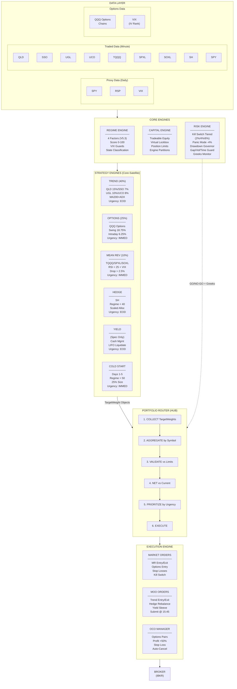
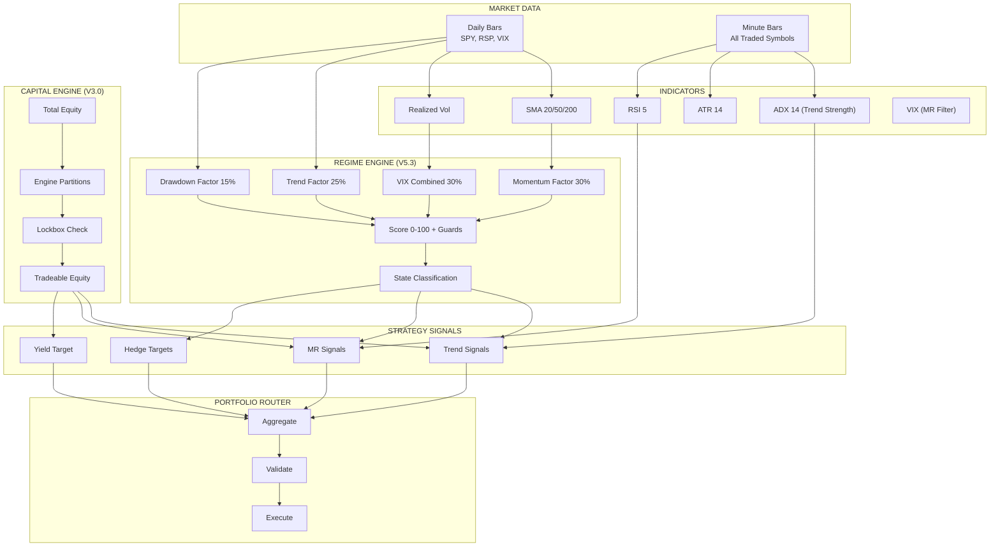

# Section 2: System Architecture

[← Executive Summary](01-executive-summary.md) | [Table of Contents](00-table-of-contents.md) | [Data Infrastructure →](03-data-infrastructure.md)

---

## Overview

Alpha NextGen is a modular algorithmic trading system built on a hub-and-spoke architecture. The Portfolio Router serves as the central hub, coordinating signals from multiple strategy engines while core engines (Regime, Capital, Risk) provide the foundational context that governs all trading decisions.

**Design Philosophy:**
- Separation of concerns (each engine has one job)
- Strategies emit signals, Router decides execution
- Risk controls have absolute authority
- State persists across restarts

---

## Master Architecture Diagram


---

## Component Layers

### Layer 1: Data Layer

Provides market data at appropriate resolutions.

| Data Type | Resolution | Purpose |
|-----------|:----------:|---------|
| Proxy Symbols | Daily | Regime calculation only (never traded) |
| Traded Symbols | Minute | Strategy signals and execution |
| SPY | Both | Regime (daily) + Safeguards (minute) |

### Layer 2: Core Engines

Provide context that governs all trading decisions.

| Engine | Responsibility | Output |
|--------|----------------|--------|
| **Regime Engine** | Detect market state (V5.3 4-factor) | Score 0-100, State classification |
| **Capital Engine** | Manage tradeable equity (V3.0) | Position limits, Engine partitions, Lockbox |
| **Risk Engine** | Protect capital | Tiered KS (2%/4%/6%), Drawdown Governor, Circuit breakers |

### Layer 3: Strategy Engines

Generate trading signals based on their specific logic.

| Strategy | Style | Symbols | Urgency | Allocation |
|----------|-------|---------|:-------:|:----------:|
| **Trend** | MA200+ADX swing | QLD 15%, SSO 7%, UGL 10%, UCO 8% | EOD | 40% (Core) |
| **Options** | VASS + Micro Regime | QQQ options (Swing 18.75% + Intraday 6.25%) | IMMEDIATE | 25% |
| **Mean Reversion** | RSI oversold + VIX | TQQQ 4%, SPXL 3%, SOXL 3% | IMMEDIATE | 10% |
| **Hedge** | Tail protection | SH (5%/8%/10% by regime) | EOD | 0-10% |
| **Yield** | Cash management | (Spec only) | EOD | Remainder |
| **Cold Start** | Safe deployment | QLD, SSO | IMMEDIATE | 25% sizing |

### Layer 4: Portfolio Router

Central coordinator that aggregates, validates, and routes signals.

**Key Functions:**
1. Collect TargetWeight objects from all strategies
2. Aggregate weights by symbol (net opposing signals)
3. Validate against exposure group limits
4. Calculate share deltas vs current positions
5. Prioritize by urgency (IMMEDIATE vs EOD)
6. Route to Execution Engine

### Layer 5: Execution Engine

Converts validated signals into broker orders.

| Order Type | When Used | Timing |
|------------|-----------|--------|
| Market | IMMEDIATE urgency | Execute now |
| MOO | EOD urgency | Submit at 15:45, execute at next open |

---

## Data Flow Diagram


---

## Authority Hierarchy

When conflicts arise, higher levels ALWAYS override lower levels.

```mermaid
flowchart TB
    subgraph L1["LEVEL 1: OPERATIONAL SAFETY (Highest)"]
        L1A["Broker Connection"]
        L1B["Data Freshness"]
        L1C["Symbol Halts"]
        L1D["Split Detection"]
    end

    subgraph L2["LEVEL 2: CIRCUIT BREAKERS"]
        L2A["Tiered Kill Switch<br/>-2%/-4%/-6%"]
        L2B["Panic Mode -4%"]
        L2C["Weekly Breaker -5%"]
        L2D["Drawdown Governor<br/>-15% Binary"]
        L2E["Vol Shock 3×ATR"]
        L2F["Gap Filter -1.5%"]
        L2G["Time Guard"]
    end

    subgraph L3["LEVEL 3: REGIME CONSTRAINTS"]
        L3A["Score < 30: No New Longs"]
        L3B["Score < 40: Hedges Required"]
        L3C["Score ≤ 50: No Cold Start"]
    end

    subgraph L4["LEVEL 4: CAPITAL CONSTRAINTS"]
        L4A["Engine Partitions"]
        L4B["Group Exposure Caps"]
        L4C["Lockbox Reservations"]
        L4D["Min Trade Size $2k"]
    end

    subgraph L5["LEVEL 5: STRATEGY SIGNALS"]
        L5A["Trend Signals"]
        L5B["MR Signals"]
        L5C["Hedge Signals"]
        L5D["Yield Signals"]
        L5E["Cold Start Signals"]
    end

    subgraph L6["LEVEL 6: EXECUTION (Lowest)"]
        L6A["Order Type Selection"]
        L6B["SHV Liquidation Priority"]
        L6C["Order Tagging"]
    end

    L1 --> L2 --> L3 --> L4 --> L5 --> L6
```


### Authority Examples

| Scenario | Resolution |
|----------|------------|
| Trend wants to buy QLD, but KS Tier 1 (-2%) triggered | **Tier 1 wins** - Trend reduced 50%, options blocked |
| Trend wants to hold, but KS Tier 2 (-4%) triggered | **Tier 2 wins** - Trend liquidated, spreads kept |
| Portfolio at -6% loss (KS Tier 3) | **Tier 3 wins** - Full liquidation (nuclear) |
| MR wants to enter TQQQ, but Gap Filter active | **Gap Filter wins** - Entry blocked |
| Hedge wants 20% SH, but Regime is 60 | **Regime wins** - No hedge needed |
| Trend wants 50% QLD, but NASDAQ_BETA already at 45% | **Exposure Limit wins** - Reduced to 5% |
| MR and Trend both want QLD | **Router aggregates** - Net weight applied |
| Portfolio at -15% drawdown | **Governor wins** - Binary 0%, PUT spreads only |

---

## Engine Interaction Map

| Engine | Receives From | Sends To |
|--------|---------------|----------|
| **Regime** | Data Layer (proxy symbols) | All Strategy Engines, Risk Engine |
| **Capital** | Portfolio state | All Strategy Engines, Router |
| **Risk** | Portfolio state, SPY minute data, Greeks | Router (GO/NO-GO) |
| **Cold Start** | Regime, Capital, Risk | Router |
| **Trend** | Data Layer (MA200, ADX), Regime, Capital | Router |
| **Mean Reversion** | Data Layer, Regime, Risk, VIX | Router |
| **Options** | Data Layer (QQQ), IV, Greeks, Regime | Router, OCO Manager |
| **Hedge** | Regime | Router |
| **Yield** | Portfolio cash | Router |
| **Router** | All Strategies, Risk | Execution Engine |
| **OCO Manager** | Options Engine | Execution Engine |
| **Execution** | Router, OCO Manager | Broker |

---

## Signal Flow: TargetWeight Object

All strategies communicate with the Router using a standardized TargetWeight structure:

| Field | Type | Description |
|-------|------|-------------|
| `symbol` | Symbol | Which instrument |
| `weight` | float | Target portfolio percentage (0.0 to 1.0) |
| `strategy` | string | Which strategy generated this |
| `urgency` | enum | IMMEDIATE or EOD |
| `reason` | string | Why this signal (for logging) |

**Example TargetWeight:**
```
Symbol: QLD
Weight: 0.40 (40% of portfolio)
Strategy: TREND
Urgency: EOD
Reason: MA200_ADX_ENTRY
```

---

## Urgency Classification

| Urgency | Order Type | When Executed | Used By |
|---------|------------|---------------|---------|
| **IMMEDIATE** | Market Order | Now | MR entry/exit, Stops, Kill Switch, Panic Mode, Warm Entry |
| **EOD** | MOO Order | Next market open | Trend entry/exit, Hedge rebalance, Yield |

---

## System Boundaries

### What the System Does

- Trades US equity ETFs (leveraged and inverse)
- Uses regime detection to adapt to market conditions
- Combines multiple strategies in a single portfolio
- Manages risk with multiple circuit breakers
- Persists state across restarts

### What the System Does NOT Do

- Trade futures or forex
- Use margin beyond ETF leverage
- Hold 3x leveraged products overnight (MR symbols close by 15:45)
- Trade during pre-market or after-hours
- Hold options overnight (closed by 15:45)

### V3.0 Capital & Risk Changes

- **Phases Removed**: No more SEED/GROWTH phase system - regime-based safeguards replace it
- **Drawdown Governor**: Binary system (100% or 0%) triggers at -15% from peak, recovers at -12%
- **Tiered Kill Switch**: Graduated response replacing binary -5% nuclear option
  - Tier 1 (-2%): Reduce trend by 50%, block new options
  - Tier 2 (-4%): Liquidate trend, keep spreads (they have own stops)
  - Tier 3 (-6%): Full liquidation (nuclear option)
- **HWM Reset**: Removed - artificial manipulation no longer used

### V6.x Features

#### V6.11 Universe Redesign
- **Hedge Simplification**: TMF/PSQ retired, SH (1x Inverse S&P) is sole hedge
- **COMMODITIES Exposure Group**: UGL (2x Gold) + UCO (2x Crude Oil) replaces RATES group
- **All Trend Symbols 2x**: QLD/SSO/UGL/UCO - no 3x in Trend Engine
- **Trend Allocations**: QLD 15%, SSO 7%, UGL 10%, UCO 8% (40% total)
- **MR Symbols**: TQQQ 4%, SPXL 3%, SOXL 3% (10% total, intraday only)

#### V6.12 Changes
- **CALL Bias Control**: NEUTRAL_ALIGNED_SIZE_MULT = 0.50 reduces size when Macro NEUTRAL
- **Dir=NONE Reduction**: VIX-adaptive STABLE bands narrow conviction gaps
- **Spread Failure Cooldown**: Reduced from 4 hours to 1 hour
- **VASS Medium IV DTE**: Extended to 30 days for better contract availability

#### V6.13 Parameter Optimization
- **Neutrality Exit Band**: Tightened to 6% (SPREAD_NEUTRALITY_EXIT_PNL_BAND = 0.06)
- **Neutrality Zone**: Narrowed to 48-62 (from wider bands)
- **Spread Width**: Reduced to $4 minimum/target (SPREAD_WIDTH_MIN = 4.0)
- **ATR Stop**: 0.9 multiplier, 12% floor, 30% cap
- **VIX-Adaptive STABLE Bands**: +/-0.2% (low VIX) to +/-0.7% (high VIX)
- **Intraday Triggers**: Relaxed FADE/ITM thresholds for more signals

#### V6.14 Changes
- **UVXY Conviction Thresholds**: +2.8% bearish, -4.5% bullish
- **Pre-Market VIX Shock Ladder**: 3-tier protection before market open
  - L1 (VIX 22+ or 4% gap): Reduce size to 75%
  - L2 (VIX 28+ or 7% gap): Block CALLs until 11:00, 50% size
  - L3 (VIX 35+ or 12% gap): Block all entries until 12:00, 25% size
- **Credit Spread Liquidity**: Min OI = 35, wider spread tolerance (40%)
- **Expiration Hammer**: Moved to 12:00 PM (from 2:00 PM)

### Core Infrastructure

- **Options Engine**: Trades QQQ options (25% allocation) with VASS + Micro Regime dual-mode
- **V5.3 Regime Model**: 4-factor scoring with VIX guards (Clamp, Spike Cap, Breadth Decay)
- **VIX Regime Filter**: Adjusts MR and Options parameters based on VIX level
- **Greeks Monitoring**: Portfolio delta/gamma/vega limits for options

---

## Key Design Decisions

| Decision | Rationale |
|----------|-----------|
| **Proxy symbols for Regime** | Cleaner signals, no interference from traded symbols |
| **Separate MR and Trend instruments** | 3x for intraday (no overnight decay), 2x for swing (acceptable decay) |
| **Router as central hub** | Single point of coordination, prevents conflicts |
| **Two urgency levels** | Time-sensitive MR vs. patient Trend |
| **Static exposure groups** | Simpler than rolling correlation, easier to validate |
| **Smoothed regime score** | Prevents whipsaw from daily noise |

---

## Dependencies

**Depends On:**
- Section 3: Data Infrastructure (symbol definitions)

**Used By:**
- All subsequent sections (reference architecture)

---

[← Executive Summary](01-executive-summary.md) | [Table of Contents](00-table-of-contents.md) | [Data Infrastructure →](03-data-infrastructure.md)