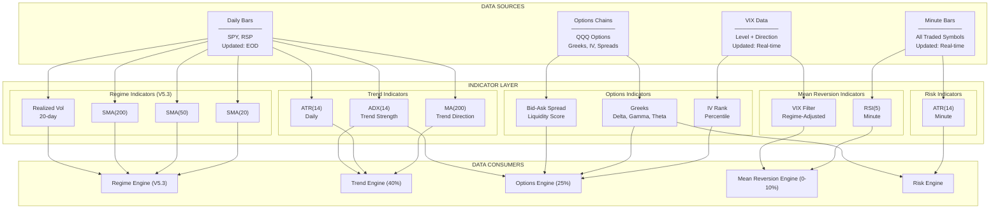
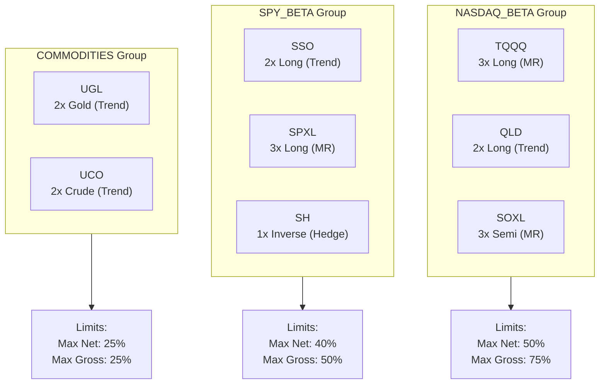

# Section 3: Data Infrastructure

[← System Architecture](02-system-architecture.md) | [Table of Contents](00-table-of-contents.md) | [Regime Engine →](04-regime-engine.md)

---

## Overview

The Data Infrastructure defines what market data the system consumes, at what resolution, and how it's organized. Data is categorized into two types: **Proxy Data** (used only for regime calculation, never traded) and **Traded Data** (instruments the system actually buys and sells).

**Key Principle:** Regime calculation uses separate proxy symbols to ensure clean signals without interference from trading activity.

---

## Data Categories

### Proxy Data (Daily Resolution)

Used exclusively for Regime Engine calculations. These symbols are NEVER traded.

| Symbol | Name | Purpose in Regime |
|--------|------|-------------------|
| **SPY** | S&P 500 ETF | Trend factor, Momentum factor, Drawdown factor |
| **RSP** | Equal Weight S&P 500 | Momentum factor (breadth proxy via equal weight vs cap weight) |
| **VIX** | CBOE Volatility Index | VIX Combined factor (65% level + 35% direction) |

> **V5.3 Note:** HYG (High Yield Corporate Bond) and IEF (7-10 Year Treasury) removed. The Credit factor was eliminated in the V5.3 4-factor model redesign. VIX is now a direct data subscription.

### Traded Data (Minute Resolution)

Instruments the system actively trades, monitored at minute resolution for precise entry/exit.

| Symbol | Name | Leverage | Primary Strategy | Allocation | Overnight Hold |
|--------|------|:--------:|------------------|:----------:|:--------------:|
| **QLD** | ProShares Ultra QQQ | 2x | Trend, Cold Start | 15% | ✅ Yes |
| **SSO** | ProShares Ultra S&P 500 | 2x | Trend, Cold Start | 7% | ✅ Yes |
| **UGL** | ProShares Ultra Gold | 2x | Trend | 10% | ✅ Yes |
| **UCO** | ProShares Ultra Bloomberg Crude | 2x | Trend | 8% | ✅ Yes |
| **TQQQ** | ProShares UltraPro QQQ | 3x | Mean Reversion | 4% | ❌ Never |
| **SPXL** | Direxion Daily S&P 500 Bull 3X | 3x | Mean Reversion | 3% | ❌ Never |
| **SOXL** | Direxion Semiconductor Bull | 3x | Mean Reversion | 3% | ❌ Never |
| **SH** | ProShares Short S&P 500 | 1x | Hedge | 0-10% | ✅ Yes |

> **V6.11 Universe Redesign:** TNA and FAS replaced with UGL and UCO for commodity diversification. TMF, PSQ, and SHV removed from default universe. All Trend symbols are now 2x leverage. SH is the sole hedge symbol.

### Dual Resolution: SPY

SPY is unique - subscribed at BOTH resolutions:

| Resolution | Purpose |
|------------|---------|
| Daily | Regime Engine (trend, volatility calculations) |
| Minute | Risk Engine (panic mode, vol shock detection) |

---

## Data Flow Diagram


---

## Exposure Groups

Instruments are organized into **Exposure Groups** to prevent over-concentration in correlated assets. Groups have static membership (no rolling correlation calculations).


> **V6.11 Note:** SMALL_CAP_BETA (TNA), FINANCIALS_BETA (FAS), and RATES (TMF, SHV) groups removed. COMMODITIES group added for UGL and UCO.

### Exposure Group Limits

| Group | Symbols | Max Net Long | Max Net Short | Max Gross |
|-------|---------|:------------:|:-------------:|:---------:|
| **NASDAQ_BETA** | QLD, TQQQ, SOXL | 50% | 30% | 75% |
| **SPY_BETA** | SSO, SPXL, SH (inverse) | 40% | 15% | 50% |
| **COMMODITIES** | UGL, UCO | 25% | 0% | 25% |

### Exposure Calculation Examples

**Example 1: Within Limits**
```
QLD:  +15% (long)
TQQQ: +4% (long)
SOXL: +3%
─────────────────
NASDAQ_BETA Net:   22% ✅ (under 50% limit)
NASDAQ_BETA Gross: 22% ✅ (under 75% limit)
```

**Example 2: Exceeds Limit - Scale Down**
```
QLD:  +30% (long)
TQQQ: +25% (long)
SOXL: +0%
─────────────────
NASDAQ_BETA Net:   55% ❌ (exceeds 50% limit)

Scale Factor: 50/55 = 0.909

Adjusted:
QLD:  +27.3%
TQQQ: +22.7%
─────────────────
NASDAQ_BETA Net:   50% ✅
```

**Example 3: Long and Short Netting (SPY_BETA)**
```
SSO:  +7% (long)
SPXL: +3% (long)
SH:   +10% (short exposure via inverse)
─────────────────
SPY_BETA Net:   0% ✅ (10% long - 10% inverse)
SPY_BETA Gross: 20% ✅ (under 50% limit)
```

---

## Indicators

### Regime Engine Indicators

All calculated on **SPY daily** data:

| Indicator | Parameters | Purpose | Warmup |
|-----------|------------|---------|:------:|
| SMA(20) | Period: 20 | Short-term trend | 20 days |
| SMA(50) | Period: 50 | Medium-term trend | 50 days |
| SMA(200) | Period: 200 | Long-term trend | 200 days |
| Realized Volatility | Period: 20, History: 252 | Vol percentile | 252 days |

### Trend Engine Indicators

Calculated on **QLD, SSO, UGL, and UCO daily** data:

| Indicator | Parameters | Purpose | Warmup |
|-----------|------------|---------|:------:|
| MA200 | Period: 200 | Trend direction | 200 days |
| ADX | Period: 14 | Trend strength confirmation (>= 15) | 14 days |
| ATR | Period: 14 | Chandelier stop calculation | 14 days |

### Mean Reversion Engine Indicators

Calculated on **TQQQ, SPXL, and SOXL minute** data:

| Indicator | Parameters | Purpose | Warmup |
|-----------|------------|---------|:------:|
| RSI | Period: 5 | Oversold detection | 5 bars |

### Risk Engine Indicators

Calculated on **SPY minute** data:

| Indicator | Parameters | Purpose | Warmup |
|-----------|------------|---------|:------:|
| ATR | Period: 14 | Vol shock detection | 14 bars |

---

## Warmup Requirements

The system requires historical data to initialize indicators before trading.

| Indicator | Days Required | Symbol |
|-----------|:-------------:|--------|
| SMA(200) | 200 | SPY |
| Vol Percentile | 252 | SPY |
| Buffer | 20 | - |
| **Total Warmup** | **220** | - |

**Configuration:**
```
SetWarmUp(220, Resolution.Daily)
```

**Behavior During Warmup:**
- All indicators calculate but no trading occurs
- `IsWarmingUp` returns `True`
- OnData exits immediately
- After warmup, normal operation begins

---

## Data Quality Rules

### Freshness Checks

| Check | Threshold | Action |
|-------|-----------|--------|
| Stale Data | >5 minutes during market hours | Log warning, use last known |
| Missing Bar | No data for symbol | Skip symbol for that bar |
| Weekend/Holiday | Market closed | No action expected |

### Sanity Checks

| Check | Threshold | Action |
|-------|-----------|--------|
| Price <= 0 | Any | Reject bar, log error |
| Price Change | >50% from prior close | Flag for review, possible split |
| Volume | = 0 on trading day | Log warning |

### Split Detection

| Trigger | Action |
|---------|--------|
| `data.Splits` contains symbol | Freeze trading on symbol for day |
| Price drops >40% overnight | Investigate potential split |
| QuantConnect split event | Automatic price adjustment |

**Split Guard Behavior:**
1. Detect split event from `data.Splits`
2. Add symbol to frozen set for the day
3. Skip all entries for frozen symbols
4. Allow exits (liquidation) if needed
5. Clear frozen set at next day open

---

## Symbol Configuration

### QuantConnect Subscription
```
Resolution.Daily   → End-of-day bars, used for regime
Resolution.Minute  → Real-time bars, used for trading
```

### Symbol Groups (Code Reference)

| Group Variable | Symbols | Purpose |
|----------------|---------|---------|
| `proxy_symbols` | SPY, RSP, VIX | Regime calculation (V5.3) |
| `traded_symbols` | QLD, SSO, UGL, UCO, TQQQ, SPXL, SOXL, SH | All tradeable (V6.11) |
| `mr_symbols` | TQQQ, SPXL, SOXL | Mean reversion candidates |
| `trend_symbols` | QLD, SSO, UGL, UCO | Trend candidates |
| `hedge_symbols` | SH | Hedge instrument (V6.11: TMF/PSQ retired) |
| `yield_symbols` | SHV | Cash management (spec only, removed from default universe) |

---

## Data Access Patterns

### Safe Data Access

Always check data availability before accessing:
```
1. Check data.ContainsKey(symbol)
2. Check data[symbol] is not None
3. Check indicator.IsReady
4. Then access values
```

### Price Access

| Property | Description |
|----------|-------------|
| `data[symbol].Open` | Bar open price |
| `data[symbol].High` | Bar high price |
| `data[symbol].Low` | Bar low price |
| `data[symbol].Close` | Bar close price |
| `data[symbol].Volume` | Bar volume |
| `Securities[symbol].Close` | Last known close |
| `Securities[symbol].Open` | Today's open (after market open) |

### History Requests

| Use Case | Request |
|----------|---------|
| Regime vol calculation | `History(spy, 252, Resolution.Daily)` |
| Momentum calculation | `History([rsp, spy], 21, Resolution.Daily)` |
| VIX Combined factor | VIX real-time data (level + direction) |

---

## Data Timing

### When Data Arrives

| Resolution | Timing | Use |
|------------|--------|-----|
| Daily | After 16:00 ET (finalized) | Regime, Trend signals |
| Minute | Every minute 09:30-16:00 | MR signals, Risk checks |

### When to Use Each

| Scenario | Resolution | Why |
|----------|------------|-----|
| Regime calculation | Daily | Need finalized EOD data |
| Trend entry signal | Daily | MA200 + ADX calculation on daily |
| MR entry signal | Minute | Need real-time oversold |
| Kill switch check | Minute | Need real-time equity |
| Panic mode check | Minute | Need real-time SPY price |

---

## ETF Characteristics

### Leveraged ETF Behavior

| Symbol | Leverage | Daily Reset | Decay Risk | Overnight Hold | Rationale |
|--------|:--------:|:-----------:|:----------:|:--------------:|-----------|
| QLD | 2x | Yes | Medium | ✅ | Trend swing trades (days-weeks) |
| SSO | 2x | Yes | Medium | ✅ | Trend swing trades (days-weeks) |
| UGL | 2x | Yes | Medium | ✅ | Trend swing trades (commodity hedge) |
| UCO | 2x | Yes | Medium | ✅ | Trend swing trades (energy/inflation) |
| TQQQ | 3x | Yes | High | ❌ | Mean reversion intraday only |
| SPXL | 3x | Yes | High | ❌ | Mean reversion intraday only |
| SOXL | 3x | Yes | High | ❌ | Mean reversion intraday only |
| SH | 1x | No | None | ✅ | Hedge (1x inverse S&P) |

> **V6.11 Note:** All Trend symbols are 2x leverage. TNA/FAS removed and replaced with UGL/UCO for commodity diversification. TMF/PSQ/SHV removed from default universe.

### Why 3x Intraday Only

3x ETFs experience **volatility decay** (also called beta slippage):
- Daily rebalancing causes drag in choppy markets
- Holding overnight exposes to gap risk
- Intraday moves capture directional moves without decay

**Example of Decay:**
```
Day 1: Underlying +10%, 3x ETF +30%  → $100 → $130
Day 2: Underlying -10%, 3x ETF -30% → $130 → $91
Net:   Underlying 0%, 3x ETF -9%
```

### Why 2x for Swing

2x ETFs have less severe decay:
- Acceptable for multi-day holds
- Lower gap risk than 3x
- Still provides leverage for returns

---

## Parameters Summary

| Parameter | Value | Section Reference |
|-----------|:-----:|-------------------|
| Daily Warmup | 252 days | Warmup Requirements |
| SMA Periods | 20, 50, 200 | Regime Indicators |
| MA200 Period | 200 | Trend Indicators |
| ADX Period | 14 | Trend Indicators |
| ATR Period | 14 | Trend/Risk Indicators |
| RSI Period | 5 | MR Indicators |
| Vol Lookback | 20 days | Regime Indicators |
| Vol History | 252 days | Regime Indicators |
| NASDAQ_BETA Max Net | 50% | Exposure Groups |
| NASDAQ_BETA Max Gross | 75% | Exposure Groups |
| SPY_BETA Max Net | 40% | Exposure Groups |
| SPY_BETA Max Gross | 50% | Exposure Groups |
| COMMODITIES Max | 25% | Exposure Groups |

---

## Dependencies

**Depends On:**
- Section 2: System Architecture (overall design)

**Used By:**
- Section 4: Regime Engine (proxy data, indicators)
- Section 7: Trend Engine (traded data, MA200, ADX, ATR)
- Section 8: Mean Reversion Engine (traded data, RSI)
- Section 11: Portfolio Router (exposure groups)
- Section 12: Risk Engine (SPY minute data)
- Section 18: Options Engine (QQQ options chains, VIX data)

---

[← System Architecture](02-system-architecture.md) | [Table of Contents](00-table-of-contents.md) | [Regime Engine →](04-regime-engine.md)