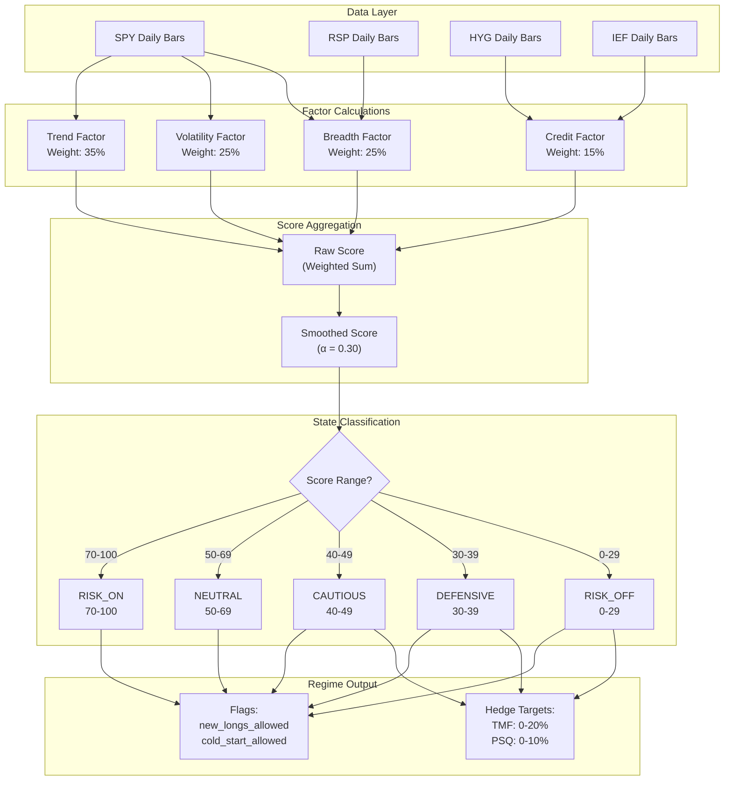

# Section 4: Regime Engine

## 4.1 Purpose and Philosophy

The Regime Engine answers the fundamental question: **"What is the current market environment, and how should we position accordingly?"**

Rather than treating every day the same, the system adapts its behavior based on measurable market conditions. In favorable regimes, it deploys leverage aggressively. In unfavorable regimes, it reduces exposure and activates hedges.

### 4.1.1 Why Regime-Based Trading?

Markets cycle through distinct phases:

- **Bull markets with low volatility** — Ideal for leverage
- **Bull markets with high volatility** — Proceed with caution
- **Corrections within bull markets** — Reduce exposure
- **Bear markets** — Defensive positioning required

A static strategy that works well in one regime may fail catastrophically in another. The Regime Engine provides the adaptability to survive all conditions.

### 4.1.2 VIX in Regime Score (V2.3 Update)

> **V2.3 Change**: VIX Level is now included as a regime factor (20% weight) for options strategy selection.

**Why VIX Was Added:**

Options are priced off **implied volatility** (VIX), not realized volatility. The previous regime score used only realized volatility, which meant:
- High VIX = expensive options = lower expected returns (not captured)
- Low VIX = cheap options = better entry opportunities (not captured)

**Data Source:** VIX is obtained via CBOE subscription. For live trading, ensure VIX data feed is enabled.

| Proxy Symbol | Purpose | Why This Proxy |
|--------------|---------|----------------|
| **SPY** | Trend & Volatility | Most liquid, most representative broad market proxy |
| **RSP** | Breadth | Equal-weight S&P 500; outperformance indicates broad participation |
| **HYG** | Credit (Risk Appetite) | High-yield bonds sensitive to credit risk |
| **IEF** | Credit (Safe Haven) | 7-10 Year Treasuries; HYG-IEF spread indicates credit premium |
| **VIX** | Implied Volatility | Market's expectation of future volatility (V2.3) |

---

## 4.2 The Five Factors (V2.3)

The regime score combines five distinct market factors, each measuring a different aspect of market health.

### Factor Weight Summary (V2.3)

| Factor | Weight | What It Measures |
|--------|:------:|------------------|
| **Trend** | 30% | Price position relative to moving averages and trend structure |
| **VIX Level** | 20% | Implied volatility - options pricing environment (V2.3 NEW) |
| **Realized Vol** | 15% | Historical price movement - market stability |
| **Breadth** | 20% | Market health via equal-weight vs cap-weight performance |
| **Credit** | 15% | Credit market stress via high-yield bond performance |

> **V2.3 Change**: Weights rebalanced to include VIX. Trend reduced from 35% to 30%, Realized Vol from 25% to 15%, Breadth from 25% to 20%.

---

### 4.2.1 Trend Factor (35% Weight)

**What It Measures:** Price position relative to moving averages and trend structure.

**Why It Matters:** When price is above rising moving averages in proper alignment, the path of least resistance is higher. Fighting the trend is a losing strategy.

#### Calculation Logic

Starting from a **base score of 50**, the trend factor adds or subtracts points:

**Price vs Individual Moving Averages:**

| Condition | Points |
|-----------|:------:|
| Price > 20-day SMA (short-term strength) | +10 |
| Price > 50-day SMA (medium-term strength) | +10 |
| Price > 200-day SMA (long-term strength) | +15 |

**Moving Average Alignment:**

| Condition | Points |
|-----------|:------:|
| Bullish alignment (SMA20 > SMA50 > SMA200) | +10 |
| Bearish alignment (SMA20 < SMA50 < SMA200) | -15 |

**Extended/Oversold Conditions:**

| Condition | Points |
|-----------|:------:|
| Price > 15% above 200 SMA (extended, likely pullback) | -10 |
| Price > 10% below 200 SMA (oversold, potential bounce) | +5 |

The result is **clamped to range 0-100**.

---

### 4.2.2 VIX Level Factor (20% Weight) - V2.3 NEW

**What It Measures:** Market's implied volatility expectations via VIX index.

**Why It Matters:** Options are priced off implied volatility. High VIX means expensive options with lower expected returns. Low VIX means cheap options with better entry opportunities.

#### Calculation Logic

**VIX Level Scoring:**

| VIX Level | Score (0-100) | Interpretation |
|:---------:|:-------------:|----------------|
| < 15 | 100 | Complacent market, cheap options |
| 15-18 | 85 | Low fear, good for buying options |
| 18-22 | 70 | Normal volatility environment |
| 22-26 | 50 | Elevated fear, options getting expensive |
| 26-30 | 30 | High fear, expensive premiums |
| 30-40 | 15 | Very high fear, avoid buying options |
| > 40 | 0 | Crisis mode, options extremely expensive |

**Config Parameters:**
- `VIX_REGIME_WEIGHT` (default: 0.20)
- `VIX_LOW_THRESHOLD` (default: 15)
- `VIX_NORMAL_THRESHOLD` (default: 22)
- `VIX_HIGH_THRESHOLD` (default: 30)
- `VIX_EXTREME_THRESHOLD` (default: 40)

---

### 4.2.3 Realized Volatility Factor (15% Weight)

**What It Measures:** Current market stability via historical price movement.

**Why It Matters:** Low realized volatility indicates stable conditions ideal for leveraged positions. High realized volatility indicates uncertainty and potential for large adverse moves.

#### Calculation Logic

**Step 1: Calculate 20-day Realized Volatility**

1. Gather 21 days of SPY closing prices
2. Calculate daily returns (close-to-close percentage changes)
3. Take standard deviation of returns
4. Annualize by multiplying by √252

**Step 2: Determine Historical Percentile**

1. Calculate rolling 20-day volatility for each of the past 252 days
2. Find what percentile the current reading falls into

**Step 3: Score Based on Percentile**

Starting from **base score of 50**, add/subtract based on percentile:

| Volatility Percentile | Description | Points |
|:---------------------:|-------------|:------:|
| Below 20th | Very calm | +25 |
| 20th – 40th | Calm | +15 |
| 40th – 60th | Normal | +0 |
| 60th – 80th | Elevated | -15 |
| Above 80th | High fear | -25 |

**Additional Absolute Level Adjustments:**

| Condition | Points |
|-----------|:------:|
| Realized vol < 12% annualized (extra calm) | +10 |
| Realized vol > 25% annualized (danger zone) | -10 |

---

### 4.2.3 Breadth Factor (25% Weight)

**What It Measures:** Market health via equal-weight vs cap-weight performance divergence.

**Why It Matters:** A healthy bull market has broad participation across all stocks. When only mega-cap stocks are rising while the average stock lags, the rally is narrow and vulnerable.

#### Calculation Logic

Calculate 20-day returns for both RSP (equal weight) and SPY (cap weight).

**Spread = RSP Return − SPY Return**

Starting from **base score of 50**:

| RSP vs SPY Spread | Description | Points |
|:-----------------:|-------------|:------:|
| RSP leading > 2% | Excellent breadth | +25 |
| RSP leading 1% – 2% | Good breadth | +15 |
| RSP leading 0% – 1% | Slightly positive | +5 |
| RSP lagging 0% – 1% | Neutral | +0 |
| RSP lagging 1% – 2% | Narrowing breadth | -10 |
| RSP lagging > 2% | Very narrow (mega-cap only) | -20 |

---

### 4.2.4 Credit Factor (15% Weight)

**What It Measures:** Credit market stress via high-yield bond performance relative to treasuries.

**Why It Matters:** Credit markets often lead equity markets. When high-yield bonds underperform treasuries, it signals credit stress and impending risk-off sentiment.

#### Calculation Logic

Calculate 20-day returns for both HYG (high yield) and IEF (treasuries).

**Spread = HYG Return − IEF Return**

Starting from **base score of 50**:

| HYG vs IEF Spread | Description | Points |
|:-----------------:|-------------|:------:|
| HYG leading > 2% | Strong risk appetite | +25 |
| HYG leading 1% – 2% | Healthy credit | +15 |
| HYG leading 0% – 1% | Mildly positive | +5 |
| HYG lagging 0% – 1% | Mild caution | -5 |
| HYG lagging 1% – 2% | Credit stress emerging | -15 |
| HYG lagging > 2% | Significant stress | -25 |

---

## 4.3 Score Aggregation and Smoothing

### 4.3.1 Weighted Combination Formula

The five factor scores are combined using fixed weights (V2.3):

```
Raw Score = (Trend × 0.30) + (VIX × 0.20) + (Volatility × 0.15) + (Breadth × 0.20) + (Credit × 0.15)
```

#### Example Calculation (V2.3)

| Factor | Score | Weight | Contribution |
|--------|:-----:|:------:|:------------:|
| Trend | 72 | 30% | 21.60 |
| VIX | 70 | 20% | 14.00 |
| Volatility | 65 | 15% | 9.75 |
| Breadth | 58 | 20% | 11.60 |
| Credit | 45 | 15% | 6.75 |
| **Raw Score** | | | **63.70** |

---

### 4.3.2 Exponential Smoothing

Raw scores can be noisy day-to-day. To prevent whipsaw trading around threshold values, the score is smoothed using exponential moving average logic.

#### Smoothing Formula

```
Smoothed Score = (α × Raw Score) + ((1 - α) × Previous Smoothed Score)
```

**Where α (alpha) = 0.30**

This means:
- **30% weight** on today's raw score
- **70% weight** on previous smoothed score

This creates "momentum" in the score. A single day's change has limited impact; sustained changes over multiple days have larger impact.

#### Example Progression Over Three Days

| Day | Raw Score | Previous Smoothed | Calculation | New Smoothed |
|:---:|:---------:|:-----------------:|-------------|:------------:|
| 1 | 60 | 50 | (0.3 × 60) + (0.7 × 50) | **53.0** |
| 2 | 65 | 53 | (0.3 × 65) + (0.7 × 53) | **56.6** |
| 3 | 70 | 56.6 | (0.3 × 70) + (0.7 × 56.6) | **60.6** |

The score rose from 50 to 60.6 over three days, not immediately to 70.

---

## 4.4 Regime State Classification

The smoothed score maps to discrete regime states that drive system behavior.

### Regime States Summary Table

| Score Range | State | New Longs | Hedges | Cold Start |
|:-----------:|-------|:---------:|:------:|:----------:|
| **70 – 100** | RISK_ON | ✅ Full | ❌ None | ✅ Allowed |
| **50 – 69** | NEUTRAL | ✅ Full | ❌ None | ✅ If > 50 |
| **40 – 49** | CAUTIOUS | ✅ Full | 10% TMF | ❌ Blocked |
| **30 – 39** | DEFENSIVE | ⚠️ Reduced | 15% TMF + 5% PSQ | ❌ Blocked |
| **0 – 29** | RISK_OFF | ❌ None | 20% TMF + 10% PSQ | ❌ Blocked |

---

### 4.4.1 RISK_ON (Score 70–100)

Market conditions are highly favorable. **All systems are go.**

**Characteristics:**
- Strong trend (price above all MAs, proper alignment)
- Low volatility (below historical median)
- Good breadth (equal weight performing well)
- Healthy credit (high yield outperforming)

**System Behavior:**
- Full leverage allowed
- No hedges required
- Cold start warm entry permitted
- All strategy engines active

---

### 4.4.2 NEUTRAL (Score 50–69)

Market conditions are acceptable but not ideal. **Proceed normally with awareness.**

**Characteristics:**
- Mixed signals across factors
- Some factors positive, some neutral or slightly negative
- No glaring red flags

**System Behavior:**
- Full leverage allowed
- No hedges required
- Cold start warm entry permitted only if score **strictly above 50**
- All strategy engines active

---

### 4.4.3 CAUTIOUS (Score 40–49)

Market conditions are deteriorating. **Increased vigilance required.**

**Characteristics:**
- Trend weakening or volatility rising
- One or more factors flashing warning signs
- Not yet crisis level

**System Behavior:**
- Leverage still allowed but proceed carefully
- **Light hedge required: 10% TMF**
- Cold start warm entry **NOT** permitted
- Strategy signals still honored

---

### 4.4.4 DEFENSIVE (Score 30–39)

Market conditions are unfavorable. **Defensive positioning required.**

**Characteristics:**
- Multiple factors negative
- Clear risk-off signals emerging
- Potential for further deterioration

**System Behavior:**
- Reduced leverage appropriate
- **Medium hedge required: 15% TMF + 5% PSQ**
- Cold start warm entry **NOT** permitted
- Strategy signals honored but with reduced sizing

---

### 4.4.5 RISK_OFF (Score 0–29)

Market conditions are dangerous. **Maximum defense required.**

**Characteristics:**
- Strong bearish trend
- High volatility
- Narrow or negative breadth
- Credit stress

**System Behavior:**
- **No new long entries allowed**
- **Full hedge required: 20% TMF + 10% PSQ**
- Cold start warm entry **NOT** permitted
- Only exits and hedges active

---

## 4.5 Regime-Triggered Hedge Allocation

The Regime Engine directly controls the Hedge Engine's target allocations. As regime deteriorates, hedge allocation increases automatically.

### Hedge Allocation Tiers

| Regime Score | TMF Allocation | PSQ Allocation | Total Hedge |
|:------------:|:--------------:|:--------------:|:-----------:|
| **≥ 40** | 0% | 0% | 0% |
| **30 – 39** | 10% | 0% | 10% |
| **20 – 29** | 15% | 5% | 20% |
| **< 20** | 20% | 10% | 30% |

### Why Graduated Scaling?

Previous versions used binary hedging (ON at regime 40, OFF at 41). This caused problems:

| Problem | Impact |
|---------|--------|
| Regime oscillating around 40 | Constant hedge trading (high turnover) |
| Sudden large hedge positions | Disrupted portfolio balance |
| No gradual adjustment | Couldn't match severity of conditions |

**Graduated scaling provides:**
- Smooth transitions between hedge levels
- Lower turnover and transaction costs
- Appropriate hedge size for severity of conditions

### Why TMF Before PSQ?

TMF is added first because:
- Flight-to-safety works in most crash scenarios
- TMF can rally significantly during stress
- PSQ is more expensive (inverse decay adds up over time)

PSQ is added only when conditions are severe:
- Score below 30 suggests serious trouble
- Need direct equity offset, not just flight-to-safety
- Worth the cost when probability of continued decline is high

---

## 4.6 Regime Engine Outputs

The Regime Engine produces a comprehensive output used by all other system components.

### Primary Outputs

| Output | Type | Description |
|--------|------|-------------|
| `smoothed_score` | Float (0–100) | The final regime score after smoothing |
| `raw_score` | Float (0–100) | Score before smoothing (for logging) |
| `state_name` | String | RISK_ON, NEUTRAL, CAUTIOUS, DEFENSIVE, or RISK_OFF |

### Component Scores (Debugging/Analysis)

| Output | Type | Description |
|--------|------|-------------|
| `trend_score` | Float (0–100) | Trend factor contribution |
| `volatility_score` | Float (0–100) | Volatility factor contribution |
| `breadth_score` | Float (0–100) | Breadth factor contribution |
| `credit_score` | Float (0–100) | Credit factor contribution |

### Component Raw Values

| Output | Type | Description |
|--------|------|-------------|
| `realized_vol` | Float | Current 20-day realized volatility (annualized) |
| `vol_percentile` | Float (0–100) | Where current vol ranks vs 252-day history |
| `breadth_spread` | Float | RSP return − SPY return (20-day) |
| `credit_spread` | Float | HYG return − IEF return (20-day) |

### Derived Flags

| Flag | Type | Logic |
|------|------|-------|
| `new_longs_allowed` | Boolean | `True` if score ≥ 30 |
| `cold_start_allowed` | Boolean | `True` if score > 50 |

### Hedge Targets

| Output | Type | Description |
|--------|------|-------------|
| `tmf_target_pct` | Float | Target TMF allocation (0% to 20%) |
| `psq_target_pct` | Float | Target PSQ allocation (0% to 10%) |

---

## 4.7 Calculation Timing

The regime score is calculated **once per day** in the `OnEndOfDay` event, using finalized daily bars.

### Why End-of-Day Calculation?

| Benefit | Explanation |
|---------|-------------|
| **Complete Data** | All four proxies have complete, final daily data |
| **No Incomplete Bars** | No risk of calculating on partial/incomplete bars |
| **Consistent Timing** | Single authoritative score for the entire next trading day |
| **Hedge Coordination** | Aligns with hedge rebalancing decisions |

### Daily Timeline

```
15:45 ET — OnEndOfDay Event Fires
    ├── Calculate all five factor scores (V2.3)
    ├── Aggregate using weighted formula
    ├── Apply exponential smoothing
    ├── Classify regime state
    ├── Determine hedge targets
    └── Output RegimeState to other engines
```

---

## 4.8 Parameter Reference

### Regime Calculation Parameters

| Parameter | Value | Description |
|-----------|:-----:|-------------|
| `TREND_WEIGHT` | 0.35 | Weight for trend factor |
| `VOL_WEIGHT` | 0.25 | Weight for volatility factor |
| `BREADTH_WEIGHT` | 0.25 | Weight for breadth factor |
| `CREDIT_WEIGHT` | 0.15 | Weight for credit factor |
| `SMOOTHING_ALPHA` | 0.30 | EMA smoothing coefficient |

### Indicator Parameters

| Parameter | Value | Description |
|-----------|:-----:|-------------|
| `SMA_PERIODS` | 20, 50, 200 | Moving average periods for trend |
| `VOL_LOOKBACK_DAYS` | 20 | Days for realized volatility calculation |
| `VOL_PERCENTILE_LOOKBACK` | 252 | Days for volatility percentile ranking |
| `RETURN_LOOKBACK_DAYS` | 20 | Days for breadth/credit spread calculation |

---

## 4.9 Mermaid Diagram: Regime Calculation Flow



---

## 4.10 Key Design Decisions Summary

| Decision | Rationale |
|----------|-----------|
| **Five-factor model (V2.3)** | Captures trend, VIX, volatility, breadth, and credit dimensions of market health |
| **VIX included (V2.3)** | Implied volatility directly impacts options pricing and market fear |
| **30% trend weight (V2.3)** | Trend remains important but balanced with VIX for options strategy |
| **Exponential smoothing (α=0.30)** | Prevents whipsaw around threshold boundaries |
| **Five regime states** | Provides granular response without excessive complexity |
| **Graduated hedge scaling** | Matches hedge intensity to severity of conditions |
| **EOD calculation only** | Uses finalized data; provides stable signal for next day |

---

*Next Section: [05 - Capital Engine](05-capital-engine.md)*

*Previous Section: [03 - Data Infrastructure](03-data-infrastructure.md)*
