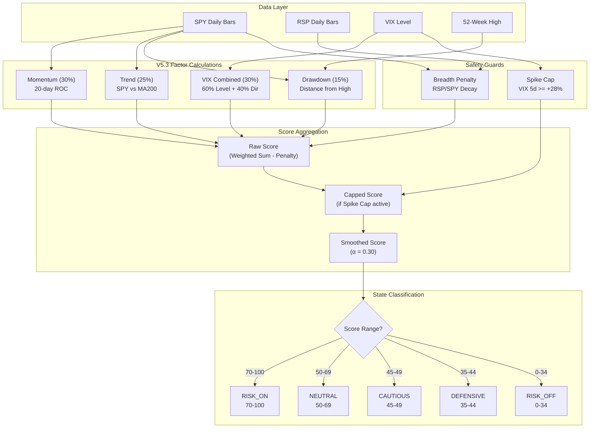

# Section 4: Regime Engine

## 4.1 Purpose and Philosophy

The Regime Engine answers the fundamental question: **"What is the current market environment, and how should we position accordingly?"**

Rather than treating every day the same, the system adapts its behavior based on measurable market conditions. In favorable regimes, it deploys leverage aggressively. In unfavorable regimes, it reduces exposure and activates hedges.

### 4.1.1 Why Regime-Based Trading?

Markets cycle through distinct phases:

- **Bull markets with low volatility** — Ideal for leverage
- **Bull markets with high volatility** — Proceed with caution
- **Corrections within bull markets** — Reduce exposure
- **Bear markets** — Defensive positioning required

A static strategy that works well in one regime may fail catastrophically in another. The Regime Engine provides the adaptability to survive all conditions.

### 4.1.2 Model Evolution

The Regime Engine has evolved through multiple versions to improve crash detection and regime accuracy:

| Version | Model | Key Innovation |
|---------|-------|----------------|
| V2.3 | 5-factor | Added VIX Level for options pricing context |
| V3.0 | 7-factor | Added VIX Direction for same-day crash detection |
| V3.3 | 3-factor simplified | Fixed score compression in grinding bears with Drawdown factor |
| V4.0 | 5-factor leading | 55% weight on leading/concurrent indicators |
| V4.1 | 5-factor (VIX Level) | Fixed VIX Direction bug (stable VIX scored same regardless of level) |
| **V5.3** | **4-factor** | **Current: VIX Combined (60% level + 40% direction)** |

**Active Model Selection** (via `config.py`):
- `V53_REGIME_ENABLED = True` → V5.3 4-factor model (recommended)
- `V4_REGIME_ENABLED = True` → V4.0/V4.1 5-factor model
- `V3_REGIME_SIMPLIFIED_ENABLED = True` → V3.3 3-factor model
- All disabled → Legacy 7-factor model

---

## 4.2 V5.3 Four-Factor Model (Current)

The V5.3 model uses four factors optimized for crash detection while maintaining responsiveness to recoveries.

### Factor Weight Summary (V5.3/V6.15)

| Factor | Weight | What It Measures |
|--------|:------:|------------------|
| **Momentum** | 30% | 20-day ROC - catches reversals in days |
| **VIX Combined** | 35% | V6.15: Increased for fear sensitivity (was 30%). 60% level + 40% direction |
| **Trend** | 20% | V6.15: Reduced lagging trend dominance (was 25%). SPY vs MA200 |
| **Drawdown** | 15% | Distance from 52-week high |

---

### 4.2.1 Momentum Factor (30% Weight)

**What It Measures:** 20-day Rate of Change (ROC) - how much has SPY moved in the last 20 days?

**Why It Matters:** Momentum is a leading indicator that catches reversals within days, not weeks. A sharp momentum reversal often precedes regime changes.

#### Calculation Logic

```python
momentum_roc = (current_price - price_20d_ago) / price_20d_ago
```

| ROC Range | Score | Description |
|:---------:|:-----:|-------------|
| > +5% | 90 | Strong bull momentum |
| +2% to +5% | 75 | Bull momentum |
| +1% to +2% | 60 | Mildly bullish |
| -1% to +1% | 50 | Neutral |
| -2% to -1% | 40 | Mildly bearish |
| -5% to -2% | 25 | Bear momentum |
| < -5% | 10 | Strong bear momentum |

**Config Parameters:**
- `MOMENTUM_LOOKBACK` (default: 20)
- `MOMENTUM_THRESHOLD_STRONG_BULL` (default: 0.05)
- `MOMENTUM_THRESHOLD_BEAR` (default: -0.02)

---

### 4.2.2 VIX Combined Factor (30% Weight)

**What It Measures:** Market fear intensity combining absolute level (60%) and directional momentum (40%).

**Why It Matters:** VIX level alone misses fast-moving crashes (VIX can spike from 12 to 30 in days). VIX direction alone treats VIX=12 stable the same as VIX=32 stable. Combining both captures fear intensity AND momentum.

#### Calculation Logic

```python
vix_combined = (0.60 * vix_level_score) + (0.40 * vix_direction_score)

# High-VIX clamp: When VIX >= 25, cap combined score at 47
if vix_level >= 25:
    vix_combined = min(vix_combined, 47)
```

**VIX Level Scoring:**

| VIX Level | Score | Interpretation |
|:---------:|:-----:|----------------|
| < 15 | 100 | Complacent market, cheap options |
| 15-18 | 85 | Low fear |
| 18-22 | 70 | Normal volatility |
| 22-26 | 50 | Elevated fear |
| 26-30 | 30 | High fear |
| 30-40 | 15 | Very high fear |
| > 40 | 0 | Crisis mode |

**VIX Direction Scoring (5-day change):**

| VIX 5d Change | Score | Interpretation |
|:-------------:|:-----:|----------------|
| > +20% | 10 | Spike (panic) |
| +10% to +20% | 25 | Rising fast |
| +5% to +10% | 40 | Rising |
| +2% to +5% | 50 | Stable (high band) |
| -2% to +2% | 55 | Stable |
| -10% to -2% | 70 | Falling |
| < -10% | 85 | Falling fast (relief) |

**Config Parameters:**
- `VIX_COMBINED_LEVEL_WEIGHT` (default: 0.60)
- `VIX_COMBINED_DIRECTION_WEIGHT` (default: 0.40)
- `VIX_COMBINED_HIGH_VIX_THRESHOLD` (default: 25.0)
- `VIX_COMBINED_HIGH_VIX_CLAMP` (default: 47.0)

---

### 4.2.3 Trend Factor (25% Weight)

**What It Measures:** Price position relative to moving averages and trend structure.

**Why It Matters:** When price is above rising moving averages in proper alignment, the path of least resistance is higher.

#### Calculation Logic

Starting from a **base score of 50**:

**Price vs Individual Moving Averages:**

| Condition | Points |
|-----------|:------:|
| Price > 20-day SMA | +10 |
| Price > 50-day SMA | +10 |
| Price > 200-day SMA | +15 |

**Moving Average Alignment:**

| Condition | Points |
|-----------|:------:|
| Bullish alignment (SMA20 > SMA50 > SMA200) | +10 |
| Bearish alignment (SMA20 < SMA50 < SMA200) | -15 |

**Extended/Oversold Conditions:**

| Condition | Points |
|-----------|:------:|
| Price > 15% above 200 SMA | -10 |
| Price > 10% below 200 SMA | +5 |

Result is **clamped to 0-100**.

---

### 4.2.4 Drawdown Factor (15% Weight)

**What It Measures:** Distance from 52-week high - how far has the market fallen from its peak?

**Why It Matters:** Drawdown breaks score compression in grinding bear markets. Previous models would score 45-50 even when market was down 30% because each factor scored ~50. Drawdown provides decisive differentiation.

#### Calculation Logic

```python
drawdown_pct = (spy_52w_high - current_price) / spy_52w_high
```

| Drawdown | Score | Market State |
|:--------:|:-----:|--------------|
| < 5% | 90 | Bull market (near highs) |
| 5-10% | 70 | Correction |
| 10-15% | 50 | Pullback |
| 15-20% | 30 | Bear market |
| > 20% | 10 | Deep bear |

**Config Parameters:**
- `DRAWDOWN_THRESHOLD_BULL` (default: 0.05)
- `DRAWDOWN_THRESHOLD_CORRECTION` (default: 0.10)
- `DRAWDOWN_THRESHOLD_PULLBACK` (default: 0.15)
- `DRAWDOWN_THRESHOLD_BEAR` (default: 0.20)

---

## 4.3 V5.3 Guards (Safety Mechanisms)

### 4.3.1 VIX Spike Cap

**Purpose:** Immediately cap regime score during VIX spikes to prevent bullish signals during crashes.

**Trigger:** VIX 5-day change >= +28%

**Effect:** Raw regime score capped at 38 (DEFENSIVE) for 3 days (V6.6: lowered from 45 to 38)

**Config:**
- `V53_SPIKE_CAP_ENABLED` (default: True)
- `V53_SPIKE_CAP_THRESHOLD` (default: 0.28)
- `V53_SPIKE_CAP_MAX_SCORE` (default: 38 - V6.6: lowered from 45)
- `V53_SPIKE_CAP_DECAY_DAYS` (default: 3)

### 4.3.2 Breadth Decay Penalty (V6.9)

**Purpose:** Penalize regime score when market breadth is deteriorating (mega-cap rally while average stock lags).

**Trigger:** RSP/SPY ratio declining (V6.9: more sensitive thresholds)
- 5-day decay > -1%: -8 points (V6.9: was -10% threshold, -5 penalty)
- 10-day decay > -3%: -12 points (additive) (V6.9: was -15% threshold, -8 penalty)

**Config:**
- `V53_BREADTH_DECAY_ENABLED` (default: True)
- `V53_BREADTH_5D_DECAY_THRESHOLD` (default: -0.01 - V6.9: was -0.10)
- `V53_BREADTH_10D_DECAY_THRESHOLD` (default: -0.03 - V6.9: was -0.15)
- `V53_BREADTH_5D_PENALTY` (default: 8 - V6.9: increased from 5)
- `V53_BREADTH_10D_PENALTY` (default: 12 - V6.9: increased from 8)

---

## 4.4 Score Aggregation and Smoothing

### 4.4.1 V5.3 Aggregation Formula

```python
raw_score = (
    momentum_score * 0.30 +
    vix_combined_score * 0.30 +
    trend_score * 0.25 +
    drawdown_score * 0.15
) - breadth_penalty
```

#### Example Calculation (V5.3)

| Factor | Score | Weight | Contribution |
|--------|:-----:|:------:|:------------:|
| Momentum | 75 | 30% | 22.50 |
| VIX Combined | 60 | 30% | 18.00 |
| Trend | 72 | 25% | 18.00 |
| Drawdown | 70 | 15% | 10.50 |
| Breadth Penalty | -5 | - | -5.00 |
| **Raw Score** | | | **64.00** |

---

### 4.4.2 Exponential Smoothing

Raw scores can be noisy day-to-day. To prevent whipsaw trading around threshold values, the score is smoothed:

```python
smoothed_score = (alpha * raw_score) + ((1 - alpha) * previous_smoothed)
```

**Where alpha = 0.30** (configurable via `REGIME_SMOOTHING_ALPHA`)

This means:
- **30% weight** on today's raw score
- **70% weight** on previous smoothed score

---

## 4.5 Regime State Classification

The smoothed score maps to discrete regime states that drive system behavior.

### Regime States Summary Table (V6.15)

| Score Range | State | New Longs | Hedges | Cold Start |
|:-----------:|-------|:---------:|:------:|:----------:|
| **70 – 100** | RISK_ON | Full | None | Allowed |
| **50 – 69** | NEUTRAL | Full | None | If > 50 |
| **45 – 49** | CAUTIOUS | Full | 5% SH | Blocked |
| **35 – 44** | DEFENSIVE | Reduced | 8% SH | Blocked |
| **0 – 34** | RISK_OFF | None | 10% SH | Blocked |

> **V6.15 Note:** Regime thresholds adjusted for better crash detection. CAUTIOUS raised to 45 (was 40), DEFENSIVE raised to 35 (was 30).

> **V6.11 Note:** TMF/PSQ replaced with SH (1x Inverse S&P). See docs/16-appendix-parameters.md for full hedge allocations.

---

### 4.5.1 RISK_ON (Score 70–100)

Market conditions are highly favorable. **All systems are go.**

**System Behavior:**
- Full leverage allowed
- No hedges required
- Cold start warm entry permitted
- All strategy engines active

---

### 4.5.2 NEUTRAL (Score 50–69)

Market conditions are acceptable but not ideal. **Proceed normally with awareness.**

**System Behavior:**
- Full leverage allowed
- No hedges required
- Cold start warm entry permitted only if score **strictly above 50**
- All strategy engines active

---

### 4.5.3 CAUTIOUS (Score 45–49)

Market conditions are deteriorating. **Increased vigilance required.**

> V6.15: Threshold raised from 40 to 45 for earlier hedge activation.

**System Behavior:**
- Leverage still allowed but proceed carefully
- **Light hedge required: 5% SH** (V6.11: was 10% TMF)
- Cold start warm entry **NOT** permitted
- Strategy signals still honored

---

### 4.5.4 DEFENSIVE (Score 35–44)

Market conditions are unfavorable. **Defensive positioning required.**

> V6.15: Threshold raised from 30 to 35 for earlier risk reduction.

**System Behavior:**
- Reduced leverage appropriate
- **Medium hedge required: 8% SH** (V6.11: was 15% TMF + 5% PSQ)
- Cold start warm entry **NOT** permitted
- Strategy signals honored but with reduced sizing

---

### 4.5.5 RISK_OFF (Score 0–34)

Market conditions are dangerous. **Maximum defense required.**

> V6.15: Threshold raised to 34 (was 29) due to DEFENSIVE threshold increase.

**System Behavior:**
- **No new long entries allowed**
- **Full hedge required: 10% SH** (V6.11: was 20% TMF + 10% PSQ)
- Cold start warm entry **NOT** permitted
- Only exits and hedges active

---

## 4.6 Regime-Triggered Hedge Allocation (V6.11)

### Hedge Allocation Tiers (V6.15)

| Regime Score | SH Allocation | Notes |
|:------------:|:-------------:|-------|
| **>= 50** | 0% | No hedge in bull/neutral |
| **45 – 49** | 5% | Light hedge (CAUTIOUS) |
| **35 – 44** | 8% | Medium hedge (DEFENSIVE) |
| **< 35** | 10% | Full hedge (RISK_OFF) |

> **V6.15 Change:** Thresholds raised (CAUTIOUS 45, DEFENSIVE 35) for earlier hedge activation.

### Why SH? (V6.11)

V6.11 simplified hedging from TMF/PSQ to SH only:
- **SH (1x Inverse S&P)**: No decay, direct equity hedge
- TMF removed: Rate-sensitive, less correlated in modern environment
- PSQ removed: Inverse Nasdaq has decay, less liquid than SH
- Single hedge symbol simplifies execution and position management

---

## 4.7 Regime Engine Outputs

### Primary Outputs

| Output | Type | Description |
|--------|------|-------------|
| `smoothed_score` | Float (0–100) | The final regime score after smoothing |
| `raw_score` | Float (0–100) | Score before smoothing (for logging) |
| `state` | RegimeLevel | RISK_ON, NEUTRAL, CAUTIOUS, DEFENSIVE, or RISK_OFF |

### V5.3 Component Scores

| Output | Type | Description |
|--------|------|-------------|
| `momentum_score` | Float (0–100) | 20-day ROC momentum score |
| `momentum_roc` | Float | Raw 20-day ROC value |
| `vix_combined_score` | Float (0–100) | 60% level + 40% direction |
| `vix_level` | Float | Current VIX value |
| `vix_5d_change` | Float | 5-day VIX change percentage |
| `trend_score` | Float (0–100) | Trend factor score |
| `drawdown_score` | Float (0–100) | Drawdown factor score |
| `drawdown_pct` | Float | Raw drawdown percentage |
| `breadth_penalty` | Float | Points deducted for breadth decay |

### Derived Flags

| Flag | Type | Logic |
|------|------|-------|
| `new_longs_allowed` | Boolean | `True` if score >= 30 |
| `cold_start_allowed` | Boolean | `True` if score > 50 |

### Guard Status

| Flag | Type | Description |
|------|------|-------------|
| `v53_spike_cap_active` | Boolean | VIX spike cap currently active |
| `using_v53_model` | Boolean | True if using V5.3 model |

---

## 4.8 Calculation Timing

The regime score is calculated **once per day** in the `OnEndOfDay` event, using finalized daily bars.

### Daily Timeline

```
15:45 ET — OnEndOfDay Event Fires
    ├── Calculate all factor scores
    ├── Apply guards (spike cap, breadth penalty)
    ├── Aggregate using weighted formula
    ├── Apply exponential smoothing
    ├── Classify regime state
    ├── Determine hedge targets
    └── Output RegimeState to other engines
```

---

## 4.9 Alternative Models (Configurable)

### V4.0/V4.1 Five-Factor Model

Enabled via `V4_REGIME_ENABLED = True`

| Factor | Weight | Description |
|--------|:------:|-------------|
| Momentum | 30% | 20-day ROC |
| VIX Level (V4.1) | 25% | Absolute fear intensity |
| Breadth | 20% | RSP/SPY ratio |
| Drawdown | 15% | Distance from 52w high |
| Trend | 10% | SPY vs MA200 (context only) |

**V4.1 Fix:** Uses VIX Level instead of VIX Direction to fix bug where stable VIX scored 55 regardless of level.

### V3.3 Simplified Three-Factor Model

Enabled via `V3_REGIME_SIMPLIFIED_ENABLED = True`

| Factor | Weight | Description |
|--------|:------:|-------------|
| Trend | 35% | SPY vs MA200 |
| VIX Level | 30% | Fear/panic level |
| Drawdown | 35% | Distance from 52w high |

**Guards:**
- VIX Direction Shock Cap (10% daily VIX spike)
- Recovery Hysteresis (2-day confirmation for upgrades)

### Legacy Seven-Factor Model (V3.0)

Used when all model flags are disabled.

| Factor | Weight |
|--------|:------:|
| Trend | 20% |
| VIX Level | 15% |
| VIX Direction | 15% |
| Breadth | 15% |
| Credit | 15% |
| Chop (ADX) | 10% |
| Volatility | 10% |

---

## 4.10 Parameter Reference

### V5.3 Model Parameters (V6.15 Tuning)

| Parameter | Default | Description |
|-----------|:-------:|-------------|
| `V53_REGIME_ENABLED` | True | Enable V5.3 4-factor model |
| `WEIGHT_MOMENTUM_V53` | 0.30 | Momentum factor weight |
| `WEIGHT_VIX_COMBINED_V53` | 0.35 | V6.15: Increased for fear sensitivity (was 0.30) |
| `WEIGHT_TREND_V53` | 0.20 | V6.15: Reduced lagging trend dominance (was 0.25) |
| `WEIGHT_DRAWDOWN_V53` | 0.15 | Drawdown factor weight |
| `REGIME_SMOOTHING_ALPHA` | 0.30 | EMA smoothing coefficient |

### V5.3 Guard Parameters (V6.6/V6.9)

| Parameter | Default | Description |
|-----------|:-------:|-------------|
| `V53_SPIKE_CAP_ENABLED` | True | Enable spike cap |
| `V53_SPIKE_CAP_THRESHOLD` | 0.28 | VIX 5d change trigger |
| `V53_SPIKE_CAP_MAX_SCORE` | 38 | V6.6: Score cap when triggered (was 45) |
| `V53_SPIKE_CAP_DECAY_DAYS` | 3 | Days until cap expires |
| `V53_BREADTH_DECAY_ENABLED` | True | Enable breadth penalty |
| `V53_BREADTH_5D_DECAY_THRESHOLD` | -0.01 | V6.9: 5d decay trigger (was -0.10) |
| `V53_BREADTH_10D_DECAY_THRESHOLD` | -0.03 | V6.9: 10d decay trigger (was -0.15) |
| `V53_BREADTH_5D_PENALTY` | 8.0 | V6.9: Points for 5d decay (was 5.0) |
| `V53_BREADTH_10D_PENALTY` | 12.0 | V6.9: Points for 10d decay (was 8.0) |

### Regime Thresholds (V6.15)

| Parameter | Value | Description |
|-----------|:-----:|-------------|
| `REGIME_RISK_ON` | 70 | RISK_ON threshold |
| `REGIME_NEUTRAL` | 50 | NEUTRAL threshold |
| `REGIME_CAUTIOUS` | 45 | V6.15: CAUTIOUS threshold (was 40) |
| `REGIME_DEFENSIVE` | 35 | V6.15: DEFENSIVE threshold (was 30) |

---

## 4.11 Mermaid Diagram: V5.3 Regime Calculation Flow



---

## 4.12 Key Design Decisions Summary

| Decision | Rationale |
|----------|-----------|
| **V5.3 4-factor model** | Balances crash detection with recovery responsiveness |
| **VIX Combined (60/40)** | Captures both fear intensity AND momentum |
| **High-VIX clamp at 47** | Prevents false bullish signals when VIX >= 25 |
| **Momentum as leading indicator** | 20-day ROC catches reversals in days, not weeks |
| **Drawdown for bear differentiation** | Breaks score compression in grinding bears |
| **Breadth decay penalty** | Flags narrow rallies (mega-cap only) |
| **Spike cap guard** | Immediate protection during VIX spikes |
| **Exponential smoothing** | Prevents whipsaw around threshold boundaries |

---

*Next Section: [05 - Capital Engine](05-capital-engine.md)*

*Previous Section: [03 - Data Infrastructure](03-data-infrastructure.md)*
