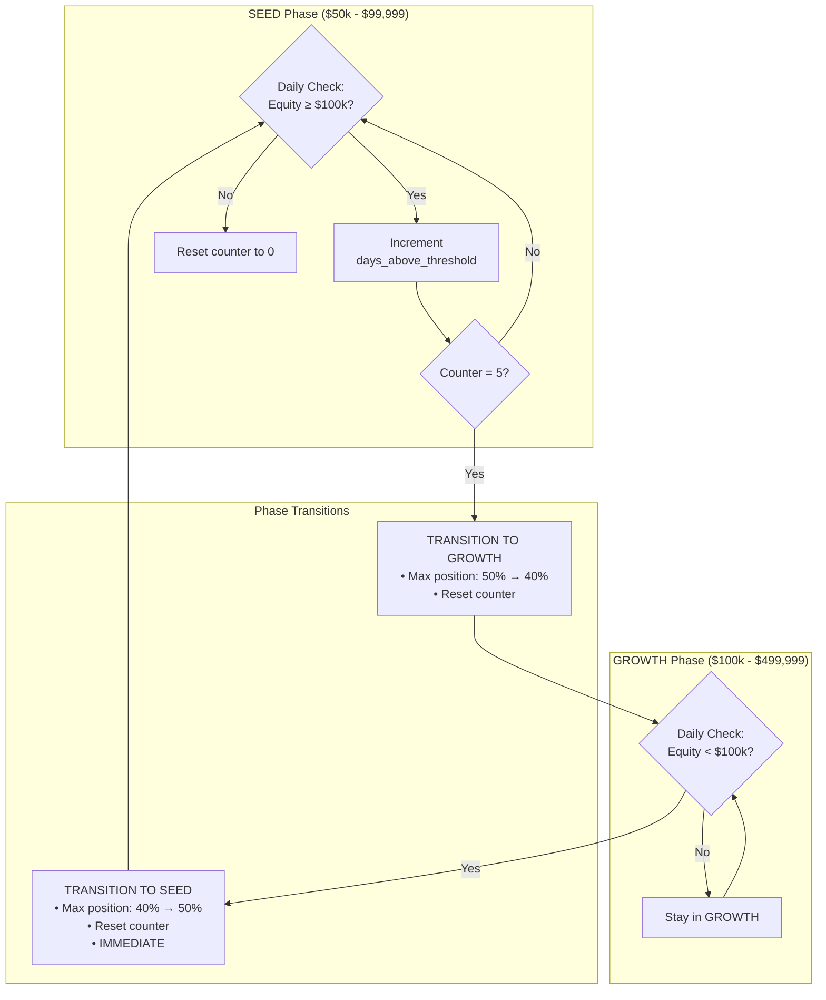
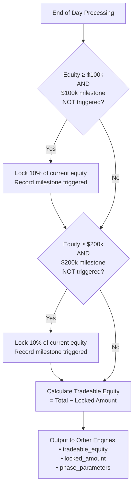

# Section 5: Capital Engine

## 5.1 Purpose and Philosophy

The Capital Engine manages the financial foundation of the system: how much capital is available and how to preserve profits over time.

> **V3.0 Note:** The SEED/GROWTH phase system has been removed. Regime-based safeguards (Startup Gate, Drawdown Governor, Regime Engine) now replace phase-dependent risk parameters. Account size no longer determines allocation -- market conditions do.

### 5.1.1 Capital Management (V3.0)

The Capital Engine now focuses on:

- **Capital partitioning**: 50/50 split between Trend and Options engines
- **Lockbox**: Virtual profit preservation mechanism
- **Tradeable equity**: Total equity minus locked amount
- **Maximum single position**: Fixed at 40% (was phase-dependent)

### 5.1.2 Profit Preservation Philosophy

As the account grows, a portion of gains should be "locked away" from active trading risk. This creates a psychological and mathematical floor that prevents giving back all profits during inevitable drawdowns.

The **Virtual Lockbox** mechanism reserves capital via calculation (not actual withdrawal), ensuring preserved profits continue earning yield while being excluded from risk calculations.

---

## 5.2 Phase Definitions

> **V3.0 Note:** Phase-based risk management (SEED/GROWTH) has been removed. The parameters below are retained for reference but no longer drive runtime behavior. The kill switch is now a tiered system (2%/4%/6%, V2.27) and max single position is fixed at 40%.

### Phase Overview (Historical/Reference Only)

| Phase | Equity Range | Target Vol | Max Single Position | Kill Switch |
|-------|:------------:|:----------:|:-------------------:|:-----------:|
| **SEED** | $50,000 – $99,999 | 20% | 50% | ~~3%~~ → 6% (Tier 3) |
| **GROWTH** | $100,000 – $499,999 | 20% | 40% | ~~3%~~ → 6% (Tier 3) |

---

### 5.2.1 SEED Phase ($50,000 – $99,999)

The initial growth phase focused on building the account to six figures.

#### Risk Parameters

| Parameter | Value | Rationale |
|-----------|:-----:|-----------|
| Target Volatility | 20% annualized | Aggressive but controlled |
| Maximum Single Position | 50% of tradeable equity | Allows meaningful concentration for growth |
| Kill Switch Threshold | 3% daily loss | Prevents catastrophic single-day losses |

#### Philosophy

Accept higher concentration to accelerate growth. A single position can be half the portfolio because we need meaningful gains to progress. The priority is **growth**, with adequate but not excessive risk controls.

**Example:** At $75,000 equity, a 50% position = $37,500 in a single instrument. This concentration creates meaningful P&L impact from successful trades.

---

### 5.2.2 GROWTH Phase ($100,000 – $499,999)

The scaling phase focused on consistent compounding with reduced concentration.

#### Risk Parameters

| Parameter | Value | Rationale |
|-----------|:-----:|-----------|
| Target Volatility | 20% annualized | Unchanged from SEED |
| Maximum Single Position | 40% of tradeable equity | **Reduced from 50%** |
| Kill Switch Threshold | 3% daily loss | Unchanged from SEED |

#### Philosophy

With more capital at stake, reduce single-position concentration. A 50% position in a 3x ETF at $400,000 is $200,000 of exposure—too much for a single trade. The reduced limit forces diversification across multiple positions.

**Example:** At $300,000 equity, a 40% position = $120,000 maximum. This is still substantial but less concentrated than SEED parameters would allow.

---

### 5.2.3 Future Phases (Defined but Not Active in V2)

These phases are defined in the specification but commented out in V2 implementation. They will be activated when the account reaches appropriate levels.

| Phase | Equity Range | Target Vol | Max Single | Kill Switch |
|-------|:------------:|:----------:|:----------:|:-----------:|
| SCALE | $500k – $1.99M | 15% | 30% | 2.5% |
| COMPOUND | $2M – $9.99M | 12% | 25% | 2.0% |
| PRESERVE | $10M+ | 10% | 20% | 1.5% |

**Pattern:** As capital increases, volatility targets decrease, position concentration decreases, and kill switch thresholds tighten. This reflects the shift from growth-focused to preservation-focused objectives.

---

## 5.3 Phase Transition Logic

### 5.3.1 Upward Transition (SEED → GROWTH)

#### Requirement

**Five consecutive trading days** with equity at or above $100,000.

#### Rationale

A single good day shouldn't trigger a phase change. The account might spike to $102,000 on a lucky trade, then fall back to $95,000. Requiring five consecutive days ensures the growth is **sustained and likely to persist**.

#### Process

```
1. Each day at end of day, check if equity >= $100,000
2. If YES → increment days_above_threshold counter
3. If NO → reset counter to zero
4. When counter reaches 5 → execute transition to GROWTH phase
5. Reset counter after transition
```

#### Example Timeline

| Day | Equity | Counter | Action |
|-----|-------:|:-------:|--------|
| Monday | $103,000 | 1 | Above threshold |
| Tuesday | $101,500 | 2 | Above threshold |
| Wednesday | $99,000 | **0** | Below threshold — **RESET** |
| Thursday | $100,500 | 1 | Above threshold |
| Friday | $102,000 | 2 | Above threshold |
| Next Monday | $104,000 | 3 | Above threshold |
| Next Tuesday | $105,000 | 4 | Above threshold |
| Next Wednesday | $103,000 | **5** | **→ TRANSITION TO GROWTH** |

---

### 5.3.2 Downward Transition (GROWTH → SEED)

#### Requirement

**Immediate** if equity drops below $100,000.

#### Rationale

Safety takes precedence over stability. If the account has fallen back below the threshold, we need the more aggressive SEED parameters immediately—not after waiting five days while the account potentially deteriorates further.

#### Process

```
1. Each day, check if current phase is GROWTH
2. If equity < $100,000 → immediately transition to SEED
3. Reset days_above_threshold counter to zero
```

### Transition Asymmetry Summary

| Direction | Condition | Timing |
|-----------|-----------|--------|
| **Upward** (SEED → GROWTH) | Equity ≥ $100k | 5 consecutive days required |
| **Downward** (GROWTH → SEED) | Equity < $100k | Immediate |

This asymmetry is intentional: we want to be **slow to promote** (ensure sustainability) but **fast to demote** (ensure safety).

---

## 5.4 Virtual Lockbox

### 5.4.1 Concept

The lockbox is a virtual mechanism that "reserves" a portion of accumulated profits.

**This reserved capital:**

| Property | Description |
|----------|-------------|
| Remains in account | Not actually withdrawn |
| Excluded from tradeable equity | Cannot be risked on leveraged positions |
| Invested in SHV | Earns yield while reserved (~5% currently) |
| Fully liquid | Available if truly needed in emergency |

### 5.4.2 Milestone Schedule

| Milestone | Lock Percentage | Trigger Condition |
|:---------:|:---------------:|-------------------|
| **$100,000** | 10% | First time equity reaches $100k |
| **$200,000** | 10% | First time equity reaches $200k |

#### Future Milestones (Defined but Not Active in V2)

| Milestone | Lock Percentage | Trigger Condition |
|:---------:|:---------------:|-------------------|
| $500,000 | 15% | First time equity reaches $500k |
| $1,000,000 | 15% | First time equity reaches $1M |
| $2,000,000 | 20% | First time equity reaches $2M |

---

### 5.4.3 Milestone Trigger Rules

Each milestone triggers **exactly once**:

1. When equity **first reaches** the threshold, lock the specified percentage of **CURRENT equity**
2. Record that the milestone has been triggered
3. **Never trigger the same milestone again**, even if equity drops and recovers

#### Example Progression

```
Step 1: Account reaches $105,000 for the first time
        → $100k milestone triggers
        → Lock 10% × $105,000 = $10,500
        → Record: [$100k milestone = TRIGGERED]

Step 2: Account later drops to $95,000
        → $100k milestone does NOT re-trigger (already recorded)

Step 3: Account recovers to $115,000
        → Still no re-trigger (milestone already hit)

Step 4: Account reaches $205,000 for the first time
        → $200k milestone triggers
        → Lock 10% × $205,000 = $20,500
        → Total locked: $10,500 + $20,500 = $31,000
```

---

### 5.4.4 Tradeable Equity Calculation

The core formula that drives all position sizing:

```
Tradeable Equity = Total Portfolio Value − Locked Amount
```

**All percentage-based limits are calculated against tradeable equity, not total equity:**

- Maximum single position percentages
- Exposure group limits
- Strategy allocation percentages

#### Calculation Example

| Component | Value |
|-----------|------:|
| Total equity | $150,000 |
| Locked amount (from $100k milestone) | $10,500 |
| **Tradeable equity** | **$139,500** |
| Maximum single position (GROWTH @ 40%) | $55,800 |

---

### 5.4.5 Physical Location of Locked Capital

The locked capital doesn't disappear—it needs to be invested somewhere. The system places locked capital in **SHV** (the Yield Sleeve instrument).

**Benefits:**

| Benefit | Description |
|---------|-------------|
| Earns yield | Approximately 5% annually |
| Minimal volatility | Short-term treasuries have negligible price movement |
| Full liquidity | Can be sold instantly if truly needed |
| Excluded from risk | Not counted toward tradeable equity |

#### Example with Lockbox

| Component | Value | Notes |
|-----------|------:|-------|
| Total equity | $150,000 | |
| Locked amount | $10,500 | |
| Non-SHV positions | $80,000 | QLD, SH, etc. |
| SHV holdings | $59,500 | Of which $10,500 is "locked" |
| Tradeable equity | $139,500 | Total − Locked |

The $10,500 lockbox capital physically exists in the SHV position but is mathematically excluded from trading calculations.

---

## 5.5 Capital Engine Outputs

The Capital Engine produces outputs used throughout the system.

### Equity Figures

| Output | Type | Description |
|--------|------|-------------|
| `total_equity` | Float | Raw portfolio value |
| `locked_amount` | Float | Cumulative lockbox total |
| `tradeable_equity` | Float | Total minus locked |

### Phase Information

| Output | Type | Description |
|--------|------|-------------|
| `current_phase` | String | "SEED" or "GROWTH" |
| `days_above_threshold` | Integer | For transition tracking |

### Phase Parameters (V3.0)

| Output | Type | Description |
|--------|------|-------------|
| `target_volatility` | Float | 0.20 |
| `max_single_position_pct` | Float | 0.40 (V3.0: fixed, was phase-dependent) |
| `kill_switch_pct` | Float | 0.06 Tier 3 / 0.04 Tier 2 / 0.02 Tier 1 (V2.27: tiered) |

### Lockbox Information

| Output | Type | Description |
|--------|------|-------------|
| `milestones_triggered` | Set | Set of milestone thresholds already hit |
| `locked_amount` | Float | Current locked capital |

---

## 5.6 Mermaid Diagram: Phase Transition Logic



---

## 5.7 Mermaid Diagram: Lockbox Logic



---

## 5.8 Integration with Other Engines

### How Capital Engine Outputs Are Used

| Consumer | Uses | For |
|----------|------|-----|
| **Portfolio Router** | `tradeable_equity`, `max_single_position_pct` | Position sizing and limit validation |
| **Risk Engine** | `kill_switch_pct`, `total_equity` | Daily loss threshold calculation |
| **Trend Engine** | `tradeable_equity` | Sizing breakout entries |
| **Mean Reversion Engine** | `tradeable_equity` | Sizing intraday entries |
| **Hedge Engine** | `tradeable_equity` | Calculating hedge allocation amounts |
| **Yield Sleeve** | `locked_amount` | Ensuring lockbox capital is in SHV |

### Authority Level

In the system's authority hierarchy, Capital Constraints sit at **Level 4**:

```
Level 1: Operational Safety (broker, data, halts)
Level 2: Circuit Breakers (kill switch, panic mode)
Level 3: Regime Constraints (score-based limits)
Level 4: CAPITAL CONSTRAINTS ← Capital Engine
Level 5: Strategy Signals
Level 6: Execution Preferences
```

Capital constraints override strategy signals but are overridden by regime constraints and circuit breakers.

---

## 5.9 Parameter Reference

### Phase Thresholds

| Parameter | Value | Description |
|-----------|:-----:|-------------|
| `SEED_MIN` | $50,000 | Minimum starting capital |
| `SEED_MAX` | $99,999 | Upper bound of SEED phase |
| `GROWTH_MIN` | $100,000 | Lower bound of GROWTH phase |
| `GROWTH_MAX` | $499,999 | Upper bound of GROWTH phase |

### Risk Parameters (V3.0: Unified)

| Parameter | Value | Notes |
|-----------|:-----:|-------|
| `TARGET_VOLATILITY` | 20% | Unchanged |
| `MAX_SINGLE_POSITION_PCT` | 40% | V3.0: Fixed (was phase-dependent) |
| Kill Switch Tier 1 | 2% | Reduce trend 50%, block new options |
| Kill Switch Tier 2 | 4% | Exit trend, keep spreads |
| Kill Switch Tier 3 | 6% | Full liquidation |

### Transition Parameters

| Parameter | Value | Description |
|-----------|:-----:|-------------|
| `PHASE_UP_DAYS` | 5 | Consecutive days required for upward transition |

### Lockbox Parameters

| Parameter | Value | Description |
|-----------|:-----:|-------------|
| `MILESTONE_100K_LOCK` | 10% | Percentage locked at $100k milestone |
| `MILESTONE_200K_LOCK` | 10% | Percentage locked at $200k milestone |

---

## 5.10 State Persistence

The following Capital Engine state variables are persisted to ObjectStore and survive algorithm restarts:

| Variable | Type | Default | Description |
|----------|------|:-------:|-------------|
| `Current_Phase` | String | "SEED" | Current phase name |
| `Days_Above_Threshold` | Integer | 0 | Counter for upward transition |
| `Lockbox_Amount` | Float | 0 | Total dollars locked |
| `Lockbox_Milestones` | Set | {} | Set of triggered milestone values |

### Load Behavior

On algorithm startup:

1. Load all persisted state from ObjectStore
2. If state is missing (first run), use defaults
3. Validate phase matches current equity range
4. Log any inconsistencies but continue operation

### Save Triggers

State is saved:

- At end of day (16:00 ET)
- After any phase transition
- After any lockbox milestone trigger

---

## 5.11 Key Design Decisions Summary

| Decision | Rationale |
|----------|-----------|
| **V3.0: Phases removed** | Regime-based safeguards replace phase-dependent risk parameters |
| **Capital Partition (50/50)** | Hard firewall prevents Trend/Options engine starvation |
| **Virtual lockbox (not withdrawal)** | Keeps capital earning yield while excluding from risk |
| **10% lock at milestones** | Meaningful profit preservation without excessive conservatism |
| **SHV for locked capital** | Earns ~5% yield with minimal volatility |
| **Tradeable equity as base** | All position limits use risk-adjusted capital, not total equity |

---

*Next Section: [06 - Cold Start Engine](06-cold-start-engine.md)*

*Previous Section: [04 - Regime Engine](04-regime-engine.md)*
