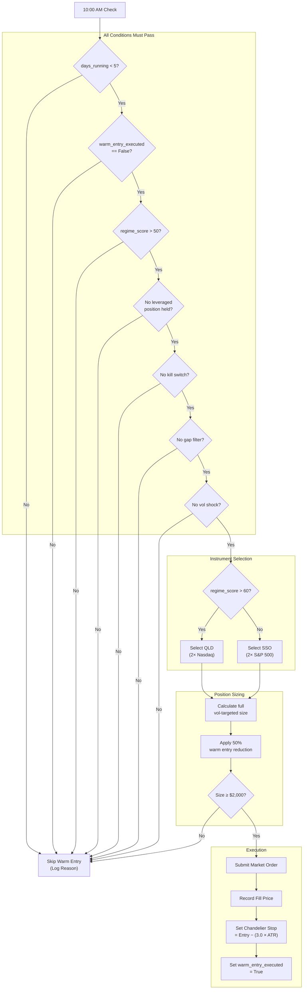
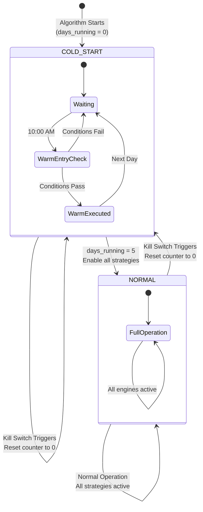

# Section 6: Cold Start Engine

## 6.1 Purpose and Philosophy

The Cold Start Engine solves the **Day 1 Deployment Problem**: when the algorithm starts fresh with no positions, it might wait days or weeks for a valid breakout signal, leaving 100% of capital idle.

### 6.1.1 The Problem

Normal trend entry requires Bollinger Band compression followed by breakout. This pattern might not occur for extended periods. Meanwhile:

| Issue | Impact |
|-------|--------|
| Capital sits idle | Earning nothing (or minimal sweep interest) |
| Opportunity cost | Missing market moves while waiting |
| No participation | Algorithm not engaged with market |
| User confidence | Erodes when system appears inactive |

### 6.1.2 The Solution

During the **first five trading days**, if market conditions are favorable, deploy capital immediately using a simplified "warm entry" approach.

**This approach:**
- Gets capital working quickly
- Maintains safety through reduced position size (50% of normal)
- Requires strict regime and safeguard conditions
- Provides exposure while waiting for proper breakout signals

---

## 6.2 Cold Start Detection

### 6.2.1 Days Running Counter

The system tracks how many trading days it has been running:

| Property | Behavior |
|----------|----------|
| Initial value | 0 |
| Increment | +1 at end of each trading day |
| Condition | Only increments if no kill switch triggered that day |
| Persistence | Survives algorithm restarts via ObjectStore |

**Cold start mode is active when:** `days_running < 5`

### 6.2.2 Counter Reset Conditions

The counter resets to zero when:

| Event | New Counter Value | Rationale |
|-------|:-----------------:|-----------|
| Kill switch triggers | 0 | After significant loss, restart conservatively |

This means after a kill switch, the algorithm enters a **new cold start period**. This is intentional—after a significant loss, we want the conservative cold start behavior rather than immediately jumping back to full exposure.

### 6.2.3 Calendar Days vs Trading Days

The counter uses **trading days**, not calendar days:

- Monday through Friday when market is open
- Excludes weekends
- Excludes market holidays

#### Example Timeline

| Day | Calendar | Counter | Notes |
|-----|----------|:-------:|-------|
| Thursday | Day 1 | 1 | Algorithm starts |
| Friday | Day 2 | 2 | |
| Saturday | — | 2 | No increment (weekend) |
| Sunday | — | 2 | No increment (weekend) |
| Monday | Day 3 | 3 | |
| Tuesday | Day 4 | 4 | |
| Wednesday | Day 5 | 5 | **Cold start ends** |

---

## 6.3 Warm Entry Conditions

**All eight conditions must be satisfied** for warm entry to execute.

### Condition Summary Table

| # | Condition | Requirement | Rationale |
|:-:|-----------|-------------|-----------|
| 1 | Cold Start Active | `days_running < 5` | Only applies during cold start period |
| 2 | Warm Entry Not Executed | First attempt only | One warm entry per cold start period |
| 3 | Time Requirement | ≥ 10:00 AM ET | Avoid opening volatility |
| 4 | Regime Score | > 50 | Only enter in favorable conditions |
| 5 | No Existing Position | No leveraged longs held | Don't double up |
| 6 | No Kill Switch | Not triggered | Safety override |
| 7 | No Gap Filter | Not triggered | Avoid weak open days |
| 8 | No Vol Shock | Not active | Wait for calm conditions |

---

### 6.3.1 Cold Start Mode Active

**Requirement:** `days_running < 5`

If cold start is complete (day 5+), warm entry is not applicable. The algorithm transitions to normal operation with full trend and mean reversion signals.

---

### 6.3.2 Warm Entry Not Already Executed

**Requirement:** `warm_entry_executed == False`

Each cold start period gets **exactly one** warm entry attempt. Once a warm entry has been executed (successfully or not), no additional warm entries occur during that cold start period.

**Why only one?**
- Prevents multiple "getting started" positions stacking up
- Single controlled deployment is sufficient
- Additional exposure should come from proper signals

---

### 6.3.3 Time Requirement

**Requirement:** Current time ≥ 10:00 AM Eastern

This avoids the opening volatility and allows the market to establish its direction for the day.

| Time | Status |
|------|--------|
| 09:30 – 09:59 | ❌ Too early |
| 10:00+ | ✅ Allowed |

---

### 6.3.4 Regime Score Requirement

**Requirement:** `regime_score > 50`

We only enter in favorable or neutral conditions, **never** when regime is cautious or worse.

| Regime Score | Warm Entry |
|:------------:|:----------:|
| > 50 | ✅ Allowed |
| ≤ 50 | ❌ Blocked |

Note: The threshold is **strictly greater than** 50, not greater than or equal to.

---

### 6.3.5 No Existing Leveraged Position

**Requirement:** No current holdings in TQQQ, QLD, SSO, or SOXL

If a position exists from a previous session (or was established earlier in the current session), no warm entry is needed—capital is already deployed.

---

### 6.3.6 No Kill Switch

**Requirement:** Kill switch not triggered

If the account is in kill switch mode (daily loss exceeded 3%), no new entries are allowed for the remainder of the day.

---

### 6.3.7 No Gap Filter

**Requirement:** Gap filter not triggered

If SPY gapped down 1.5% or more from the prior close, we don't want to enter on a weak open. The gap filter blocks intraday entries on these days.

---

### 6.3.8 No Vol Shock

**Requirement:** Vol shock safeguard not active

If SPY just had an extreme 1-minute bar (range > 3× ATR), we wait for volatility to subside before entering.

---

## 6.4 Warm Entry Instrument Selection

If all conditions pass, the next decision is **which instrument to buy**.

### Selection Logic

| Regime Score | Instrument | Rationale |
|:------------:|:----------:|-----------|
| **> 60** | QLD | Higher conviction → more aggressive Nasdaq exposure |
| **50 – 60** | SSO | Moderate conviction → more conservative S&P exposure |

### 6.4.1 High Conviction (Regime > 60): QLD

When the regime score is above 60, we have higher confidence in market direction. **QLD (2× Nasdaq)** provides more aggressive exposure to capture the favorable conditions.

### 6.4.2 Moderate Conviction (Regime 50–60): SSO

When the regime score is between 50 and 60, conditions are acceptable but not strongly bullish. **SSO (2× S&P 500)** provides more conservative exposure with lower beta.

### 6.4.3 Why Not 3× Products?

Warm entry is a "getting started" position based on regime alone, **without technical confirmation signals**. Using 2× instead of 3× limits risk during this lower-conviction entry.

| Factor | 2× (QLD/SSO) | 3× (TQQQ/SOXL) |
|--------|:------------:|:--------------:|
| Leverage risk | Moderate | High |
| Overnight decay | Acceptable | Significant |
| Conviction level needed | Regime only | Technical + Regime |

---

## 6.5 Warm Entry Size Calculation

### 6.5.1 Base Calculation

First, calculate what the **full volatility-targeted position size** would be using standard position sizing logic (as detailed in the Portfolio Router section).

### 6.5.2 Warm Entry Reduction

**Take 50% of the full calculated size.**

This reduced size reflects the lower conviction of a regime-only entry versus a confirmed breakout signal.

```
Warm Entry Size = Full Vol-Targeted Size × 0.50
```

#### Example Calculation

| Component | Value |
|-----------|------:|
| Tradeable equity | $90,000 |
| Full vol-targeted size for QLD | $36,000 (40% of equity) |
| **Warm entry size** | **$18,000** (50% of full, or 20% of equity) |

### 6.5.3 Minimum Size Check

**If the calculated warm entry size is less than $2,000, the entry is skipped.**

Positions below this threshold aren't worth the commission and management overhead.

| Calculated Size | Action |
|----------------:|--------|
| ≥ $2,000 | ✅ Execute warm entry |
| < $2,000 | ❌ Skip (too small) |

---

## 6.6 Warm Entry Execution

### 6.6.1 Order Type

Warm entry uses a **market order** for immediate execution.

Since we've waited until 10:00 AM, the market has had time to establish price and liquidity. Market orders ensure we get filled rather than missing the entry on a limit order.

### 6.6.2 Initial Stop Placement

Immediately after the warm entry fill, a **Chandelier stop** is established:

```
Initial Stop = Entry Price − (3.0 × ATR)
```

Where ATR is the 14-period Average True Range for the instrument.

#### Example

| Component | Value |
|-----------|------:|
| Entry price | $85.00 |
| 14-period ATR | $2.50 |
| ATR multiplier | 3.0 |
| **Initial stop** | **$77.50** |

This provides protection while giving the position room to work.

### 6.6.3 Position Tracking

The warm entry position is tracked like any trend position:

| Tracked Data | Initial Value |
|--------------|---------------|
| Entry price | Fill price |
| Highest high | Entry price |
| Stop level | Entry − (3.0 × ATR) |
| Strategy tag | "COLD_START" |

---

## 6.7 Cold Start Restrictions

During cold start (days 1–5), certain normal activities are restricted.

### Activity Matrix

| Activity | Days 1–5 (Cold Start) | Days 6+ (Normal) |
|----------|:---------------------:|:----------------:|
| Warm entry (50% size) | ✅ If conditions met | ❌ Not applicable |
| Full trend entries | ❌ Blocked | ✅ Active |
| Mean reversion entries | ❌ Blocked | ✅ Active |
| Hedge positions | ✅ Based on regime | ✅ Based on regime |
| Yield sleeve (SHV) | ✅ For idle cash | ✅ For idle cash |
| Stop loss exits | ✅ Always active | ✅ Always active |
| Kill switch execution | ✅ Always active | ✅ Always active |

### 6.7.1 Why Block Full Trend Entries?

The warm entry serves the purpose of getting exposure. Allowing full trend entries during cold start could result in:

- Warm entry + full trend entry = **over-concentration**
- Potentially 50% (warm) + 50% (trend) = 100% in one direction

By blocking full trend entries, we ensure controlled exposure during the learning period.

### 6.7.2 Why Block Mean Reversion?

Mean reversion requires understanding what constitutes "normal" intraday behavior:

- Is a 2.5% drop unusual or routine?
- Is current volume elevated versus recent history?

During the first five days, we don't have sufficient recent intraday history for the algorithm to make these judgments reliably.

---

## 6.8 Cold Start Completion

### 6.8.1 Transition to Normal Mode

When `days_running` reaches 5, cold start mode **ends automatically**:

| Change | From Cold Start | To Normal |
|--------|:---------------:|:---------:|
| Trend entries | Blocked | ✅ Active |
| Mean reversion | Blocked | ✅ Active |
| Position sizing | 50% (warm only) | 100% (full) |
| Warm entry logic | Active | Disabled |

### 6.8.2 Warm Entry Position Management

Any position established via warm entry **continues to be managed normally**:

- Chandelier stop updates daily (tightens as profit increases)
- Exit conditions checked (band basis, stop, regime)
- Position treated identically to a trend position

The only difference is how the position was initiated—after cold start ends, there's no distinction in management.

---

## 6.9 Mermaid Diagram: Warm Entry Flow



---

## 6.10 Mermaid Diagram: Cold Start State Machine



---

## 6.11 Integration with Other Engines

### How Cold Start Engine Interacts with System

| Engine | Interaction |
|--------|-------------|
| **Regime Engine** | Reads `regime_score` to determine if warm entry allowed and instrument selection |
| **Risk Engine** | Checks kill switch, gap filter, vol shock status before warm entry |
| **Capital Engine** | Gets `tradeable_equity` for position sizing |
| **Portfolio Router** | Submits warm entry as TargetWeight with IMMEDIATE urgency |
| **Execution Engine** | Executes market order for warm entry |
| **Trend Engine** | Blocked during cold start; takes over position management after |

### TargetWeight Output Format

When warm entry conditions are met:

| Field | Value |
|-------|-------|
| Symbol | QLD or SSO |
| Weight | Calculated (typically ~0.20) |
| Strategy | "COLD_START" |
| Urgency | IMMEDIATE |
| Reason | "Warm Entry: Regime=X, Instrument=Y" |

---

## 6.12 Parameter Reference

### Cold Start Parameters

| Parameter | Value | Description |
|-----------|:-----:|-------------|
| `COLD_START_DAYS` | 5 | Number of days in cold start mode |
| `WARM_ENTRY_SIZE_MULT` | 0.50 | Multiplier applied to full position size |
| `WARM_ENTRY_TIME` | 10:00 AM ET | Earliest time for warm entry |
| `WARM_REGIME_MIN` | 50 | Minimum regime score (exclusive) |
| `WARM_QLD_THRESHOLD` | 60 | Regime score above which QLD is selected |
| `WARM_MIN_SIZE` | $2,000 | Minimum position size for warm entry |

### Chandelier Stop Parameters (Warm Entry)

| Parameter | Value | Description |
|-----------|:-----:|-------------|
| `CHANDELIER_BASE_MULT` | 3.0 | Initial ATR multiplier for stop |
| `ATR_PERIOD` | 14 | ATR calculation period |

---

## 6.13 State Persistence

The following Cold Start Engine state variables are persisted to ObjectStore:

| Variable | Type | Default | Description |
|----------|------|:-------:|-------------|
| `Days_Running` | Integer | 0 | Trading days since start/reset |
| `Warm_Entry_Executed` | Boolean | False | Whether warm entry occurred this period |
| `Warm_Entry_Symbol` | String | null | Symbol used for warm entry (if any) |

### Reset Behavior

| Event | Days_Running | Warm_Entry_Executed |
|-------|:------------:|:-------------------:|
| Algorithm first start | 0 | False |
| Kill switch triggers | 0 | False |
| Normal end of day | +1 | Unchanged |
| Cold start completes | 5+ | N/A (disabled) |

---

## 6.14 Edge Cases and Special Scenarios

### Scenario 1: Algorithm Starts on Friday

```
Friday:    Day 1, warm entry possible
Saturday:  No increment (weekend)
Sunday:    No increment (weekend)
Monday:    Day 2
Tuesday:   Day 3
Wednesday: Day 4
Thursday:  Day 5 → Cold start ends
```

Cold start spans calendar week but only 5 trading days.

### Scenario 2: Kill Switch on Day 3

```
Day 1: Counter = 1
Day 2: Counter = 2
Day 3: Kill switch triggers → Counter = 0
Day 4: Counter = 1 (new cold start period)
Day 5: Counter = 2
...
Day 8: Counter = 5 → Cold start ends
```

Kill switch effectively extends the observation period.

### Scenario 3: Warm Entry Followed by Kill Switch

```
Day 1: Counter = 1
Day 2: Counter = 2, Warm entry executes (QLD position)
Day 3: Kill switch triggers
       → Liquidate ALL positions (including warm entry QLD)
       → Counter = 0
       → warm_entry_executed = False (reset)
Day 4: Counter = 1, new cold start begins
       → Warm entry possible again if conditions met
```

### Scenario 4: Regime Drops Below 50 After Warm Entry

```
Day 1: Regime = 62, Warm entry executes (QLD)
Day 2: Regime = 48
       → Warm entry position remains (not auto-liquidated)
       → Managed by stop loss and regime exit rules
       → If regime < 30, position would exit per trend rules
```

The warm entry position follows normal trend position management once established.

---

## 6.15 Relationship with StartupGate (V2.30)

### 6.15.1 Two Independent Systems

V2.29 introduced `StartupGate` (`engines/core/startup_gate.py`) as a **separate, one-time** arming sequence, redesigned in V2.30 as an all-weather time-based system. It is important to understand how it differs from Cold Start Engine:

| Property | Cold Start Engine | Startup Gate (V2.30) |
|----------|:-----------------:|:--------------------:|
| **Purpose** | Warm entry after start/kill switch | One-time time-based arming |
| **Duration** | 5 trading days | 15 days (5 warmup + 5 obs + 5 reduced) |
| **Resets on kill switch** | Yes | **No** (permanent) |
| **Once completed** | Resets next kill switch | **Stays armed forever** |
| **Hedges/Yield** | Based on regime | **Always allowed** (never gated) |
| **Directional longs** | Warm entry at 50% | Blocked → 50% → 100% |
| **Regime dependency** | Uses regime score | **None** (time-based only) |
| **File** | `cold_start_engine.py` | `startup_gate.py` |

### 6.15.2 Execution Order

StartupGate runs **before** ColdStart matters:

```
Algorithm Launch
    │
    ▼
┌─────────────────────────────────────────────────────────────┐
│ STARTUP GATE (one-time, never resets, no regime dependency) │
│ INDICATOR_WARMUP → OBSERVATION → REDUCED → FULLY_ARMED     │
│      5 days          5 days       5 days                    │
│ Hedges/yield always allowed. Bearish options from OBSERVATION│
└─────────────────────────────────────────────────────────────┘
    │ (FULLY_ARMED — permanent)
    ▼
┌─────────────────────────────────────────────────────┐
│ COLD START (resets on kill switch)                   │
│ Day 1-5: Warm entry at 50% → Day 6+: Full          │
│ Kill switch → Reset to Day 0 → 5 more days          │
└─────────────────────────────────────────────────────┘
```

- While StartupGate gates directional longs, hedges and yield always run
- ColdStart still counts its days silently during startup gate phases
- Once StartupGate is FULLY_ARMED, it is permanently out of the picture
- ColdStart continues to handle kill switch recovery independently
- **No cross-dependencies** between the two systems

### 6.15.3 Code Impact

**Zero changes** to `cold_start_engine.py` for V2.29 or V2.30. All StartupGate logic lives in its own class and integrates via `main.py` only.

---

## 6.16 Key Design Decisions Summary

| Decision | Rationale |
|----------|-----------|
| **5 trading days** | Sufficient observation without excessive delay |
| **50% position size** | Lower conviction entry deserves reduced exposure |
| **10:00 AM start time** | Avoid opening volatility and noise |
| **Regime > 50 required** | Only enter in favorable/neutral conditions |
| **2× products only** | Lower leverage appropriate for regime-only signal |
| **QLD vs SSO selection** | Match instrument aggressiveness to regime conviction |
| **One warm entry per period** | Controlled deployment, no stacking |
| **Kill switch resets counter** | After loss, restart with conservative approach |
| **Block trend/MR during cold start** | Prevent over-concentration and ensure data sufficiency |

---

*Next Section: [07 - Trend Engine](07-trend-engine.md)*

*Previous Section: [05 - Capital Engine](05-capital-engine.md)*
