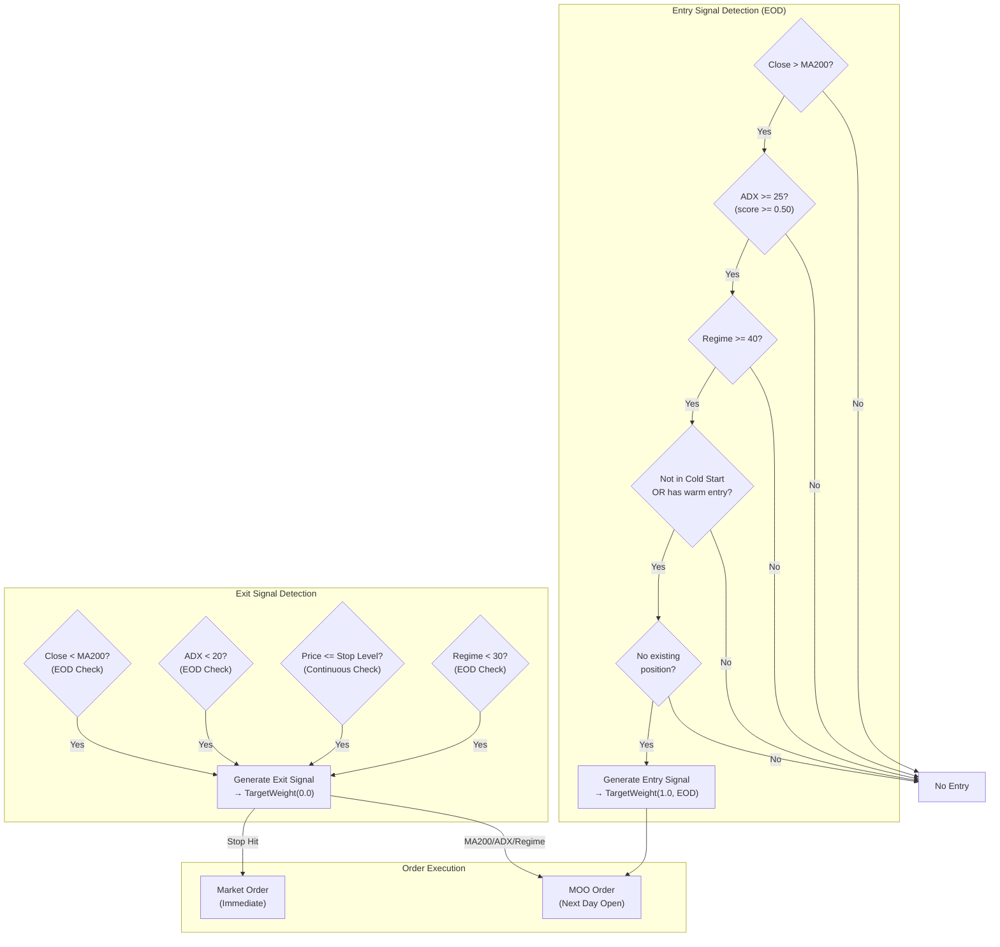

# Section 7: Trend Engine

[Previous: 06 - Cold Start Engine](06-cold-start-engine.md) | [Table of Contents](00-table-of-contents.md) | [Next: 08 - Mean Reversion Engine](08-mean-reversion-engine.md)

---

## 7.1 Purpose and Philosophy

The Trend Engine captures **multi-day momentum moves** in 2× leveraged ETFs. It uses the **200-day Moving Average (MA200)** for trend direction and **ADX (Average Directional Index)** for momentum confirmation.

### 7.1.1 V2 Strategy: MA200 + ADX

The V2 Trend Engine replaces the V1 Bollinger Band compression approach with a cleaner, more robust signal:

| Component | Purpose |
|-----------|---------|
| **MA200** | Trend direction filter — only trade in direction of long-term trend |
| **ADX** | Momentum confirmation — only enter when trend has sufficient strength |

**Key Insight:** MA200 keeps us on the right side of the market. ADX prevents entering during choppy, directionless periods where whipsaws are common.

### 7.1.2 Why MA200?

The 200-day moving average is the most widely watched trend indicator:

| Factor | Benefit |
|--------|---------|
| Institutional reference | Fund managers often use MA200 for regime decisions |
| Self-fulfilling | Widely watched = creates support/resistance at the level |
| Noise filtering | Long lookback smooths out short-term volatility |
| Clear signal | Price above = bullish, price below = bearish |

### 7.1.3 Why ADX?

ADX measures trend strength regardless of direction:

| ADX Value | Trend Strength | Trading Implication |
|:---------:|----------------|---------------------|
| < 20 | Weak/Absent | Avoid — choppy, directionless |
| 20-25 | Emerging | Cautious — trend developing |
| 25-35 | Strong | Ideal — confirmed momentum |
| > 35 | Very Strong | Best — powerful trend in place |

**Critical:** ADX doesn't indicate direction, only strength. We use MA200 for direction, ADX for confirmation.

### 7.1.4 Why 2× Instead of 3×?

The Trend Engine holds positions **overnight**, sometimes for multiple days or weeks. For overnight holds:

| Factor | 3× Products | 2× Products |
|--------|:-----------:|:-----------:|
| Daily decay | Severe over multi-day periods | Moderate, acceptable |
| Gap risk | Enormous (−5% gap = −15%) | Manageable (−5% gap = −10%) |
| Stop width | Must be tight (capital at risk) | Can be wider |
| Holding period suitability | Intraday only | Multi-day swing trades ✅ |

**Conclusion:** 2× provides meaningful leverage while remaining manageable for swing trading.

---

## 7.2 Instruments

The Trend Engine trades four diversified leveraged ETFs to maximize entry opportunities while maintaining risk controls:

### 7.2.1 QLD (ProShares Ultra QQQ) — 20% Allocation

**Primary trend instrument.** 2× leveraged Nasdaq-100 exposure.

| Characteristic | Description |
|----------------|-------------|
| Underlying | Nasdaq-100 Index |
| Leverage | 2× |
| Allocation | 20% of portfolio |
| Beta | Higher than SSO (tech-heavy) |
| Best for | Strong risk-on regimes |
| Liquidity | Excellent ($4.2B AUM) |

### 7.2.2 SSO (ProShares Ultra S&P 500) — 15% Allocation

**Secondary trend instrument.** 2× leveraged S&P 500 exposure.

| Characteristic | Description |
|----------------|-------------|
| Underlying | S&P 500 Index |
| Leverage | 2× |
| Allocation | 15% of portfolio |
| Beta | Lower than QLD (diversified sectors) |
| Best for | Moderate regimes |
| Liquidity | Very high ($3.8B AUM) |

### 7.2.3 TNA (Direxion Daily Small Cap Bull 3X) — 12% Allocation

**V2.2 Addition: Small-cap diversification.** 3× leveraged Russell 2000 exposure.

| Characteristic | Description |
|----------------|-------------|
| Underlying | Russell 2000 Index |
| Leverage | 3× |
| Allocation | 12% of portfolio |
| Correlation to QLD | 0.65-0.75 (moderate) |
| Best for | Small-cap rallies, sector rotation |
| Liquidity | Strong ($2.16B AUM, $472M daily volume) |

**Rationale for TNA:** Russell 2000 often leads or diverges from mega-cap tech. Adding TNA provides:
- Exposure to domestic small-caps underweighted in QLD/SSO
- Lower correlation to Nasdaq during sector rotation periods
- Higher entry frequency (small-caps trend independently)

### 7.2.4 FAS (Direxion Daily Financial Bull 3X) — 8% Allocation

**V2.2 Addition: Sector diversification.** 3× leveraged Financial sector exposure.

| Characteristic | Description |
|----------------|-------------|
| Underlying | Russell 1000 Financial Services Index |
| Leverage | 3× |
| Allocation | 8% of portfolio |
| Correlation to QLD | 0.55-0.70 (moderate) |
| Best for | Rate cycle plays, financial sector strength |
| Liquidity | Strong ($2.55B AUM, ~374K shares daily) |

**Rationale for FAS:** Financial sector has distinct drivers (interest rates, credit spreads) from tech:
- Diversifies beyond tech-heavy Nasdaq exposure
- Provides opportunities during rate-driven market environments
- Lower correlation improves portfolio diversification

### 7.2.5 Allocation Summary

| Symbol | Allocation | Index | Leverage | Correlation to QLD |
|--------|:----------:|-------|:--------:|:------------------:|
| QLD | 20% | Nasdaq-100 | 2× | 1.00 |
| SSO | 15% | S&P 500 | 2× | 0.85-0.95 |
| TNA | 12% | Russell 2000 | 3× | 0.65-0.75 |
| FAS | 8% | Financials | 3× | 0.55-0.70 |
| **Total** | **55%** | | |

**Liquidity Requirements for All Trend Symbols:**
- Minimum AUM: $2 billion
- Minimum daily volume: $300 million
- Maximum bid-ask spread: 0.05%

---

## 7.3 ADX Scoring System

### 7.3.1 ADX Confidence Score

ADX values are converted to a 0-1 confidence score for entry decisions:

| ADX Value | Score | Confidence | Entry Allowed? |
|:---------:|:-----:|------------|:--------------:|
| < 20 | 0.25 | Weak/Choppy | ❌ No |
| 20-25 | 0.50 | Moderate | ✅ Yes (minimum) |
| 25-35 | 0.75 | Strong | ✅ Yes |
| >= 35 | 1.00 | Very Strong | ✅ Yes (best) |

**Entry Requirement:** ADX score >= 0.50 (ADX >= 20)

### 7.3.2 Score Calculation

```python
def adx_score(adx_value: float) -> float:
    if adx_value >= 35:      # Very strong
        return 1.0
    elif adx_value >= 25:    # Strong
        return 0.75
    elif adx_value >= 20:    # Moderate
        return 0.50
    else:                    # Weak
        return 0.25
```

---

## 7.4 Entry Signal: MA200 + ADX Confirmation

### 7.4.1 Complete Entry Conditions

**All conditions must be true:**

| # | Condition | Requirement | Rationale |
|:-:|-----------|-------------|-----------|
| 1 | **Trend Direction** | Close > MA200 | Bullish trend confirmed |
| 2 | **Momentum Strength** | ADX >= 25 (score >= 0.50) | Sufficient trend strength |
| 3 | **Regime** | Score >= 40 | Not RISK_OFF |
| 4 | **Cold Start** | Not in cold start, OR has warm entry | Safety during startup |
| 5 | **No Position** | No existing position in symbol | Avoid pyramiding |

### 7.4.2 Entry Signal Logic

```python
# Condition 1: Price above MA200 (bullish trend)
if close <= ma200:
    return None

# Condition 2: ADX >= 25 (sufficient momentum)
if adx_score(adx) < 0.50:
    return None  # ADX too weak

# Condition 3: Regime score >= 40
if regime_score < 40:
    return None

# Condition 4: Not in cold start, OR has warm entry
if is_cold_start_active and not has_warm_entry:
    return None

# All conditions passed → Generate entry signal
```

### 7.4.3 Entry Signal Output

| Field | Value |
|-------|-------|
| Symbol | QLD or SSO |
| Weight | 1.0 (full allocation to trend budget) |
| Source | "TREND" |
| Urgency | EOD |
| Reason | "MA200+ADX Entry: Close=$X > MA200=$Y, ADX=Z (score=S, STRONG)" |

---

## 7.5 Exit Signals

The system exits trend positions when **any of four conditions** trigger.

### Exit Conditions Summary

| Exit Type | Trigger | Urgency | Rationale |
|-----------|---------|:-------:|-----------|
| **MA200 Exit** | Close < MA200 | EOD | Trend reversal |
| **ADX Exit** | ADX < 20 | EOD | Momentum exhaustion |
| **Chandelier Stop** | Price <= Stop Level | IMMEDIATE | Capital protection |
| **Regime Exit** | Score < 30 | EOD | Macro override |

---

### 7.5.1 MA200 Exit

**Trigger:** Daily close falls below the 200-day moving average.

**Rationale:** When price closes below MA200, the bullish trend has reversed. Exit to avoid riding a downtrend.

```
Exit when: Close < MA200
```

---

### 7.5.2 ADX Exit (Momentum Exhaustion)

**Trigger:** ADX falls below 20.

**Rationale:** When ADX drops below 20, the trend has lost momentum and the market is becoming directionless. Exit before whipsaws begin.

```
Exit when: ADX < 20
```

---

### 7.5.3 Chandelier Stop Exit

**Trigger:** Price touches or falls below the trailing stop level.

**Rationale:** Protect capital from violent trend reversals. The trailing stop rises with price, locking in gains while giving room for normal pullbacks.

```
Exit when: Price <= Chandelier Stop Level
```

See **Section 7.6** for detailed Chandelier stop mechanics.

---

### 7.5.4 Regime Exit

**Trigger:** Regime score falls below 30 (RISK_OFF territory).

**Rationale:** If market conditions deteriorate to RISK_OFF, we don't want to hold leveraged long positions regardless of technical levels. This is a **macro override** of the technical strategy.

```
Exit when: Regime Score < 30
```

---

## 7.6 Chandelier Trailing Stop

### 7.6.1 Concept

The **Chandelier Exit** is a volatility-adjusted trailing stop that hangs from the highest high since entry, like a chandelier hangs from a ceiling.

**Key Properties:**
- As price makes new highs, the stop rises
- The stop **never moves down**
- Distance from high is measured in ATR units

### 7.6.2 ATR-Based Calculation

```
Stop Level = Highest High Since Entry − (Multiplier × ATR)
```

Where:
- **Highest High:** Maximum price reached since position entry
- **ATR:** 14-period Average True Range (daily)
- **Multiplier:** Varies based on profit level (see below)

ATR measures typical daily range, so the stop is calibrated to the instrument's normal volatility.

### 7.6.3 Tiered Multipliers (V2.1)

The ATR multiplier **tightens as profit increases**, locking in more gains on winning trades:

| Profit Level | ATR Multiplier | Stop Distance | Rationale |
|:------------:|:--------------:|:-------------:|-----------|
| < 10% | **3.0** | Widest | Initial phase, give room to work |
| 10% – 20% | **2.5** | Medium | Solid gain, protect more |
| > 20% | **2.0** | Tightest | Large gain, protect aggressively |

### 7.6.4 Example Progression

**Setup:** Entry at $100.00, ATR = $3.00

#### Day 0: Entry
| Component | Value |
|-----------|------:|
| Entry price | $100.00 |
| Highest high | $100.00 |
| Profit | 0% |
| Multiplier | 3.0 |
| **Initial stop** | **$91.00** ($100 − $9) |

#### Day 3: Price rises to $108 (8% profit)
| Component | Value |
|-----------|------:|
| Highest high | $108.00 |
| Profit | 8% (< 10%) |
| Multiplier | 3.0 |
| **New stop** | **$99.00** ($108 − $9) |

Stop raised from $91 to $99 (now protecting most of capital).

#### Day 7: Price rises to $115 (15% profit)
| Component | Value |
|-----------|------:|
| Highest high | $115.00 |
| Profit | 15% (> 10%) |
| Multiplier | **2.5** (tightened) |
| **New stop** | **$107.50** ($115 − $7.50) |

Multiplier tightened from 3.0 to 2.5 due to profit level.

#### Day 12: Price rises to $125 (25% profit)
| Component | Value |
|-----------|------:|
| Highest high | $125.00 |
| Profit | 25% (> 20%) |
| Multiplier | **2.0** (tightest) |
| **New stop** | **$119.00** ($125 − $6) |

Maximum protection engaged.

#### Day 15: Price pulls back to $120
| Component | Value |
|-----------|------:|
| Highest high | $125.00 (unchanged) |
| Stop | $119.00 (unchanged) |

Stop does NOT move down on pullbacks.

#### Day 16: Price drops to $118
```
Price ($118) < Stop ($119) → EXIT TRIGGERED
```

**Result:** Net profit = +18% (exited at ~$118 vs entry at $100)

### 7.6.5 Stop Update Timing

Stops are recalculated **daily after market close**, using:
- The finalized daily high (for highest high tracking)
- The current ATR reading
- The current profit level (for multiplier selection)

**Critical Rule:** The stop only moves UP, never down—even if ATR increases.

---

## 7.7 Signal Timing and Execution

### 7.7.1 OnEndOfDay Analysis

All trend signal analysis occurs in the **OnEndOfDay** event handler:

| Benefit | Description |
|---------|-------------|
| Complete bars | Uses finalized daily OHLC data |
| Accurate MA200 | Calculated on actual closing prices |
| Accurate ADX | Uses complete daily ranges |
| No incomplete data risk | Avoids signals based on partial bars |

### 7.7.2 MOO Execution

Signals detected at end of day result in **Market-On-Open (MOO) orders** for the next trading day:

| Signal Type | Order Action |
|-------------|--------------|
| Entry signal | Queue MOO **buy** order |
| Exit signal (MA200/ADX/regime) | Queue MOO **sell** order |

**MOO Order Benefits:**
- High liquidity at the open
- Reliable execution
- Single price for entry (no slippage during open volatility)
- No overnight order management

### 7.7.3 Exception: Intraday Stop Hits

If price hits the Chandelier stop **during market hours**, the exit executes **immediately via market order**—not waiting for EOD.

```
Intraday Stop Hit → Immediate Market Sell Order
```

**Capital preservation takes priority over optimal execution timing.**

---

## 7.8 Output Format

The Trend Engine produces **TargetWeight** objects for the Portfolio Router.

### Entry Signal Output

| Field | Value |
|-------|-------|
| Symbol | QLD or SSO |
| Weight | 1.0 (full allocation to trend strategy budget) |
| Source | "TREND" |
| Urgency | EOD |
| Reason | "MA200+ADX Entry: Close=$X > MA200=$Y, ADX=Z (score=S, STRONG)" |

### Exit Signal Output

| Field | Value |
|-------|-------|
| Symbol | QLD or SSO |
| Weight | 0.0 (exit position) |
| Source | "TREND" |
| Urgency | EOD (MA200/ADX/regime) or IMMEDIATE (stop hit) |
| Reason | Description of exit trigger |

#### Exit Reason Examples

| Exit Type | Reason String |
|-----------|---------------|
| MA200 exit | "MA200_EXIT: Close ($X) < MA200 ($Y)" |
| ADX exit | "ADX_EXIT: ADX (X) < 20" |
| Chandelier stop | "STOP_HIT: Price ($X) <= Stop ($Y)" |
| Regime exit | "REGIME_EXIT: Score (X) < 30" |

---

## 7.9 Mermaid Diagram: Entry/Exit Logic



---

## 7.10 Mermaid Diagram: Chandelier Stop Logic


---

## 7.11 Position Tracking Data

For each active trend position, the following data is maintained:

| Data Point | Type | Updated | Used For |
|------------|------|---------|----------|
| `symbol` | String | Entry | Position identification |
| `entry_price` | Float | Entry | Profit calculation, stop tightening |
| `entry_date` | Date | Entry | Logging, analysis |
| `highest_high` | Float | Daily | Chandelier stop calculation |
| `current_stop` | Float | Daily | Stop monitoring |
| `strategy_tag` | String | Entry | "TREND" or "COLD_START" |

### Persistence

All position tracking data is persisted to ObjectStore and survives algorithm restarts.

---

## 7.12 Integration with Other Engines

### Inputs from Other Engines

| Source | Data | Used For |
|--------|------|----------|
| **Regime Engine** | `regime_score` | Entry blocking (< 40), exit trigger (< 30) |
| **Capital Engine** | `tradeable_equity` | Position sizing |
| **Risk Engine** | Safeguard status | Entry blocking if kill switch active |
| **Cold Start Engine** | `days_running` | Cold start blocking |

### Outputs to Other Engines

| Destination | Data | Purpose |
|-------------|------|---------|
| **Portfolio Router** | TargetWeight objects | Entry and exit intentions |
| **State Persistence** | Position tracking data | Survival across restarts |

---

## 7.13 Parameter Reference

### MA200 + ADX Parameters

| Parameter | Value | Description |
|-----------|:-----:|-------------|
| `MA_PERIOD` | 200 | Moving average period for trend direction |
| `ADX_PERIOD` | 14 | ADX calculation period |
| `ADX_WEAK_THRESHOLD` | 20 | Below this = weak trend (exit trigger) |
| `ADX_MODERATE_THRESHOLD` | 25 | Entry minimum threshold |
| `ADX_STRONG_THRESHOLD` | 35 | Very strong trend |
| `TREND_ENTRY_REGIME_MIN` | 40 | Minimum regime score for entry |
| `TREND_EXIT_REGIME` | 30 | Regime score that forces exit |
| `TREND_ADX_EXIT_THRESHOLD` | 20 | ADX level that forces exit |

### Chandelier Stop Parameters (V2.1)

| Parameter | Value | Description |
|-----------|:-----:|-------------|
| `ATR_PERIOD` | 14 | ATR calculation period |
| `CHANDELIER_BASE_MULT` | 3.0 | Initial multiplier (profit < 10%) |
| `CHANDELIER_TIGHT_MULT` | 2.5 | Medium multiplier (profit 10-20%) |
| `CHANDELIER_TIGHTER_MULT` | 2.0 | Tight multiplier (profit > 20%) |
| `PROFIT_TIGHT_PCT` | 0.10 | Profit level for first tightening (10%) |
| `PROFIT_TIGHTER_PCT` | 0.20 | Profit level for second tightening (20%) |

---

## 7.14 Edge Cases and Special Scenarios

### Scenario 1: Gap Down Through Stop

```
Previous Close: $120 (Stop at $115)
Today's Open: $110 (Below stop)
```

**Action:** Exit immediately at market open (~$110). The stop is a trigger level, not a guaranteed exit price. Gap risk is accepted.

### Scenario 2: Multiple Symbols Signal Entry

```
EOD Analysis:
- QLD: MA200+ADX entry signal ✅
- SSO: MA200+ADX entry signal ✅
```

**Action:** Both signals route to Portfolio Router. Router validates against exposure limits and may scale down if NASDAQ_BETA + SPY_BETA would exceed limits.

### Scenario 3: ADX Drops to 22 (Above Exit, Below Entry)

```
Current Position: QLD at +12% profit
ADX: 22 (above 20 exit threshold)
```

**Action:** Position remains open. ADX exit only triggers at < 20. However, no new entries would be allowed since ADX < 25.

### Scenario 4: MA200 Below Price But ADX < 20

```
No current position
Close > MA200 ✅
ADX = 18 ❌
```

**Action:** No entry. Both conditions must be met. Price above MA200 confirms trend direction, but ADX < 20 indicates the trend lacks momentum.

### Scenario 5: ATR Increases Significantly

```
Day 1: Highest High = $100, ATR = $2, Stop = $94 (100 - 3×2)
Day 2: Highest High = $100, ATR = $4, Stop = $88?
```

**Action:** Stop stays at $94. The stop **never moves down**, even if ATR increases. This protects against volatility expansion eroding protection.

### Scenario 6: Position From Warm Entry

```
Day 2: Warm entry in QLD at $80 (tagged "COLD_START")
Day 5: Cold start ends
Day 7: MA200+ADX entry signal for QLD
```

**Action:** No new entry—position already exists. The warm entry position continues to be managed with trend exit rules. The entry signal is skipped because condition #5 (no existing position) fails.

---

## 7.15 Key Design Decisions Summary

| Decision | Rationale |
|----------|-----------|
| **MA200 for trend direction** | Most widely watched long-term trend indicator |
| **ADX for momentum confirmation** | Prevents entries during choppy, directionless markets |
| **ADX >= 25 for entry** | Ensures sufficient trend strength before committing capital |
| **ADX < 20 for exit** | Exits when momentum exhausts before whipsaws begin |
| **2× leverage (not 3×)** | Acceptable decay for multi-day holds; manageable gap risk |
| **Chandelier trailing stop** | Volatility-adjusted protection that locks in gains |
| **Tiered multipliers (3.0/2.5/2.0)** | Tighten protection as profit increases |
| **Stop never moves down** | Prevents volatility expansion from eroding protection |
| **EOD signal generation** | Uses complete daily bars for reliable signals |
| **MOO execution** | High liquidity, reliable fills at open |
| **Immediate stop execution** | Capital preservation overrides timing optimization |
| **Regime < 30 exit** | Macro conditions override technical signals |

---

## 7.16 V1 to V2 Migration Notes

| Aspect | V1 (Bollinger Band) | V2 (MA200 + ADX) |
|--------|---------------------|------------------|
| Entry Signal | Bandwidth < 0.10, Close > Upper Band | Close > MA200, ADX >= 25 |
| Exit Signal | Close < Middle Band | Close < MA200, ADX < 20 |
| Trend Filter | Implicit (breakout direction) | Explicit (MA200 position) |
| Momentum Filter | None (compression only) | ADX strength scoring |
| Stop Tiers | 3.0 / 2.0 / 1.5 | 3.0 / 2.5 / 2.0 |
| Profit Thresholds | 15% / 25% | 10% / 20% |

**Why the change?** MA200 + ADX provides:
- Clearer trend definition (above/below MA200)
- Better false signal filtering (ADX rejects choppy markets)
- More intuitive logic (trend + momentum vs compression + breakout)
- Widely validated approach used by institutional traders

---

*Next Section: [08 - Mean Reversion Engine](08-mean-reversion-engine.md)*

*Previous Section: [06 - Cold Start Engine](06-cold-start-engine.md)*
