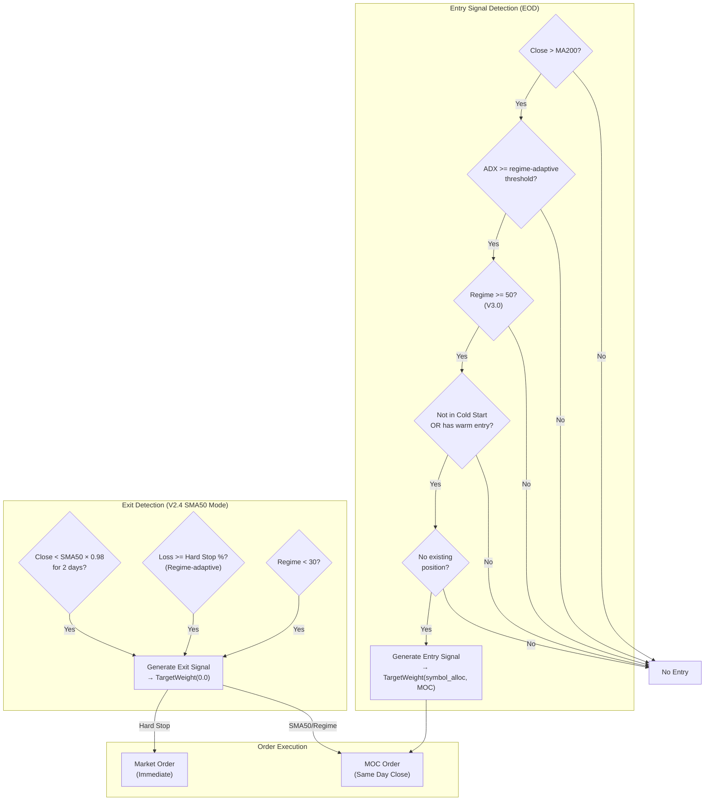
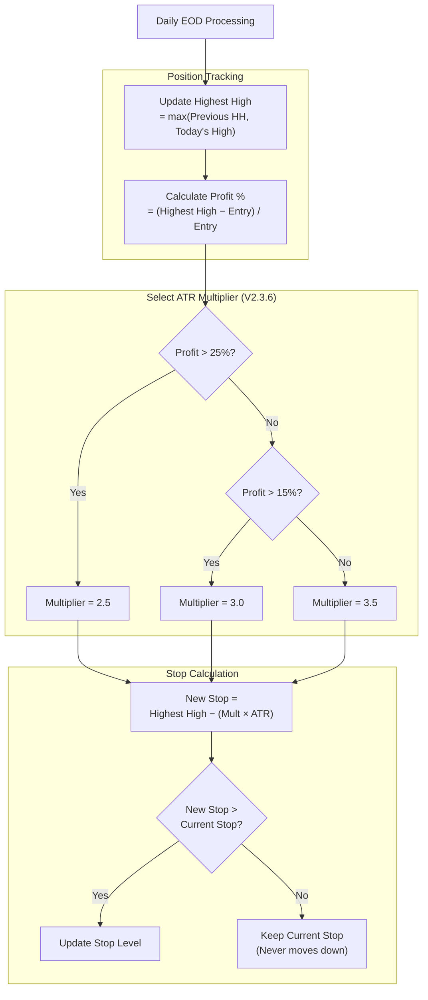

# Section 7: Trend Engine

[Previous: 06 - Cold Start Engine](06-cold-start-engine.md) | [Table of Contents](00-table-of-contents.md) | [Next: 08 - Mean Reversion Engine](08-mean-reversion-engine.md)

---

## 7.1 Purpose and Philosophy

The Trend Engine captures **multi-day momentum moves** in 2× leveraged ETFs. It uses the **200-day Moving Average (MA200)** for trend direction and **ADX (Average Directional Index)** for momentum confirmation.

### 7.1.1 V2 Strategy: MA200 + ADX

The V2 Trend Engine replaces the V1 Bollinger Band compression approach with a cleaner, more robust signal:

| Component | Purpose |
|-----------|---------|
| **MA200** | Trend direction filter — only trade in direction of long-term trend |
| **ADX** | Momentum confirmation — only enter when trend has sufficient strength |

**Key Insight:** MA200 keeps us on the right side of the market. ADX prevents entering during choppy, directionless periods where whipsaws are common.

### 7.1.2 Why MA200?

The 200-day moving average is the most widely watched trend indicator:

| Factor | Benefit |
|--------|---------|
| Institutional reference | Fund managers often use MA200 for regime decisions |
| Self-fulfilling | Widely watched = creates support/resistance at the level |
| Noise filtering | Long lookback smooths out short-term volatility |
| Clear signal | Price above = bullish, price below = bearish |

### 7.1.3 Why ADX?

ADX measures trend strength regardless of direction:

| ADX Value | Trend Strength | Trading Implication |
|:---------:|----------------|---------------------|
| < 20 | Weak/Absent | Avoid — choppy, directionless |
| 20-25 | Emerging | Cautious — trend developing |
| 25-35 | Strong | Ideal — confirmed momentum |
| > 35 | Very Strong | Best — powerful trend in place |

**Critical:** ADX doesn't indicate direction, only strength. We use MA200 for direction, ADX for confirmation.

### 7.1.4 Why 2× Instead of 3×?

The Trend Engine holds positions **overnight**, sometimes for multiple days or weeks. For overnight holds:

| Factor | 3× Products | 2× Products |
|--------|:-----------:|:-----------:|
| Daily decay | Severe over multi-day periods | Moderate, acceptable |
| Gap risk | Enormous (−5% gap = −15%) | Manageable (−5% gap = −10%) |
| Stop width | Must be tight (capital at risk) | Can be wider |
| Holding period suitability | Intraday only | Multi-day swing trades ✅ |

**Conclusion:** 2× provides meaningful leverage while remaining manageable for swing trading.

---

## 7.2 Instruments

The Trend Engine trades four diversified 2× leveraged ETFs spanning equities and commodities to maximize entry opportunities while maintaining risk controls.

> **V6.11 Update:** Universe changed from equities-only (QLD/SSO/TNA/FAS) to diversified equities + commodities (QLD/SSO/UGL/UCO). All instruments are now 2× leverage for consistent risk management.

### 7.2.1 QLD (ProShares Ultra QQQ) — 15% Allocation

**Primary equity trend instrument.** 2× leveraged Nasdaq-100 exposure.

| Characteristic | Description |
|----------------|-------------|
| Underlying | Nasdaq-100 Index |
| Leverage | 2× |
| Allocation | 15% of portfolio |
| Beta | Higher than SSO (tech-heavy) |
| Best for | Strong risk-on regimes |
| Liquidity | Excellent ($4.2B AUM) |
| Hard Stop | 15% from entry |

### 7.2.2 SSO (ProShares Ultra S&P 500) — 7% Allocation

**Secondary equity trend instrument.** 2× leveraged S&P 500 exposure.

| Characteristic | Description |
|----------------|-------------|
| Underlying | S&P 500 Index |
| Leverage | 2× |
| Allocation | 7% of portfolio |
| Beta | Lower than QLD (diversified sectors) |
| Best for | Moderate regimes |
| Liquidity | Very high ($3.8B AUM) |
| Hard Stop | 15% from entry |

### 7.2.3 UGL (ProShares Ultra Gold) — 10% Allocation

**V6.11 Addition: Commodity hedge.** 2× leveraged Gold exposure.

| Characteristic | Description |
|----------------|-------------|
| Underlying | Gold Bullion |
| Leverage | 2× |
| Allocation | 10% of portfolio |
| Correlation to QLD | Low/Negative (uncorrelated asset) |
| Best for | Inflation hedging, risk-off environments |
| Liquidity | Good ($300M+ AUM) |
| Hard Stop | 18% from entry (higher volatility) |

**Rationale for UGL:** Gold provides true diversification from equity exposure:
- Uncorrelated to stock market movements
- Tends to rise during risk-off periods when equities fall
- Provides inflation protection
- Lower overall portfolio correlation

### 7.2.4 UCO (ProShares Ultra Bloomberg Crude Oil) — 8% Allocation

**V6.11 Addition: Energy/inflation hedge.** 2× leveraged Crude Oil exposure.

| Characteristic | Description |
|----------------|-------------|
| Underlying | Bloomberg WTI Crude Oil Subindex |
| Leverage | 2× |
| Allocation | 8% of portfolio |
| Correlation to QLD | Moderate (0.40-0.60) |
| Best for | Energy sector strength, inflation periods |
| Liquidity | Good ($500M+ AUM) |
| Hard Stop | 18% from entry (higher volatility) |

**Rationale for UCO:** Crude oil provides energy sector exposure:
- Diversifies beyond tech-heavy equity exposure
- Benefits from inflation and geopolitical events
- Provides additional entry opportunities uncorrelated to stock movements

### 7.2.5 Allocation Summary

| Symbol | Allocation | Underlying | Leverage | Correlation to QLD | Hard Stop |
|--------|:----------:|------------|:--------:|:------------------:|:---------:|
| QLD | 15% | Nasdaq-100 | 2× | 1.00 | 15% |
| SSO | 7% | S&P 500 | 2× | 0.85-0.95 | 15% |
| UGL | 10% | Gold | 2× | Low/Negative | 18% |
| UCO | 8% | Crude Oil | 2× | 0.40-0.60 | 18% |
| **Total** | **40%** | | | |

**Priority Order:** QLD > UGL > UCO > SSO (Nasdaq > Gold > Oil > S&P)

**Liquidity Requirements for All Trend Symbols:**
- Minimum AUM: $250 million
- Minimum daily volume: $50 million
- Maximum bid-ask spread: 0.10%

---

## 7.3 ADX Scoring System

### 7.3.1 ADX Confidence Score

ADX values are converted to a 0-1 confidence score for entry decisions:

| ADX Value | Score | Confidence | Entry Allowed? |
|:---------:|:-----:|------------|:--------------:|
| < 20 | 0.25 | Weak/Choppy | ❌ No |
| 20-25 | 0.50 | Moderate | ✅ Yes (minimum) |
| 25-35 | 0.75 | Strong | ✅ Yes |
| >= 35 | 1.00 | Very Strong | ✅ Yes (best) |

**Entry Requirement:** ADX score >= 0.50 (ADX >= 20)

### 7.3.2 Score Calculation

```python
def adx_score(adx_value: float) -> float:
    if adx_value >= 35:      # Very strong
        return 1.0
    elif adx_value >= 25:    # Strong
        return 0.75
    elif adx_value >= 20:    # Moderate
        return 0.50
    else:                    # Weak
        return 0.25
```

---

## 7.4 Entry Signal: MA200 + ADX Confirmation

### 7.4.1 Complete Entry Conditions

**All conditions must be true:**

| # | Condition | Requirement | Rationale |
|:-:|-----------|-------------|-----------|
| 1 | **Trend Direction** | Close > MA200 | Bullish trend confirmed |
| 2 | **Momentum Strength** | ADX >= regime-adaptive threshold | V3.0: Varies by market regime |
| 3 | **Regime** | Score >= 50 | V3.0: Only in Neutral+ regimes |
| 4 | **Cold Start** | Not in cold start, OR has warm entry | Safety during startup |
| 5 | **No Position** | No existing position in symbol | Avoid pyramiding |

### 7.4.2 V3.0 Regime-Adaptive ADX Thresholds

The ADX entry requirement varies based on the current regime score:

| Regime Score | Market State | ADX Minimum | Rationale |
|:------------:|--------------|:-----------:|-----------|
| >= 75 | Strong Bull | 15 | Trust the regime, lower bar for momentum |
| 60-74 | Normal | 22 | Standard momentum confirmation |
| < 60 | Cautious/Bear | 25 | Require stronger trend confirmation |

**Why adaptive thresholds?** In strong bull markets, the regime itself provides confidence. We can enter with lower ADX because the macro environment is favorable. In cautious/bear markets, we need stronger technical confirmation before committing capital.

### 7.4.3 Entry Signal Logic

```python
# Condition 1: Price above MA200 (bullish trend)
if close <= ma200:
    return None

# Condition 2: ADX check - V3.0 Regime-Adaptive Thresholds
if regime_score >= 75:
    # Strong bull: ADX > 15 is enough
    if adx < 15:
        return None
elif regime_score < 60:
    # Cautious/bear: require ADX > 25
    if adx < 25:
        return None
else:
    # Normal regime (60-74): ADX >= 22
    if adx < 22:
        return None

# Condition 3: Regime score >= 50 (V3.0: raised from 40)
if regime_score < 50:
    return None

# Condition 4: Not in cold start, OR has warm entry
if is_cold_start_active and not has_warm_entry:
    return None

# All conditions passed → Generate entry signal
```

### 7.4.4 Entry Signal Output

| Field | Value |
|-------|-------|
| Symbol | QLD, SSO, UGL, or UCO |
| Weight | Symbol-specific allocation (0.15, 0.07, 0.10, or 0.08) |
| Source | "TREND" |
| Urgency | MOC (Market-On-Close, same day) |
| Reason | "MA200+ADX Entry: Close=$X > MA200=$Y, ADX=Z (score=S, STRONG)" |

> **V2.4.2 Change:** Urgency changed from EOD (next-day open) to MOC (same-day close) for faster execution.

---

## 7.5 Exit Signals

The system supports two exit modes: **V2.4 SMA50 + Hard Stop** (default) and **Legacy Chandelier** (fallback).

### 7.5.0 Exit Mode Selection

| Config Flag | Exit Mode | Description |
|-------------|-----------|-------------|
| `TREND_USE_SMA50_EXIT = True` | **SMA50 + Hard Stop (Default)** | V2.4: Structural trend exit |
| `TREND_USE_SMA50_EXIT = False` | Chandelier Legacy | Original MA200/ADX/Chandelier logic |

---

### V2.4 SMA50 Exit Mode (Default)

The SMA50 exit mode provides simpler, more robust exit logic with longer holding periods.

#### Exit Conditions Summary (SMA50 Mode)

| Exit Type | Trigger | Urgency | Rationale |
|-----------|---------|:-------:|-----------|
| **SMA50 Break** | Close < SMA50 × (1 - 2%) for 2 days | MOC | Structural trend break |
| **Hard Stop** | Loss >= asset-specific % | IMMEDIATE | Capital protection |
| **Regime Exit** | Score < 30 | MOC | Macro override |

### 7.5.1 SMA50 Structural Exit (V2.4)

**Trigger:** Daily close falls below SMA50 × (1 - 2% buffer) for 2 consecutive days.

**V2.5 Enhancement:** Requires 2 consecutive days below the threshold to prevent whipsaw exits in choppy markets.

**Rationale:** The 50-day SMA represents the intermediate-term trend. When price closes below this level with a buffer, the structural uptrend has broken.

```
Exit when: Close < SMA50 × 0.98 for 2 consecutive days
```

**Benefits over Chandelier:**
- Allows 3% minor volatility without exit (if above SMA50)
- Longer holding periods (30-90 days vs 5-15 days)
- Cleaner logic than tiered ATR multipliers
- 2-day confirmation prevents false exits

---

### 7.5.2 Hard Stop Exit (V2.4)

**Trigger:** Loss from entry price exceeds asset-specific threshold.

**V3.0 Enhancement:** Stop percentages are regime-adaptive (looser in bull, tighter in bear).

| Asset | Base Hard Stop | Rationale |
|-------|:--------------:|-----------|
| QLD | 15% | 2× equity, standard volatility |
| SSO | 15% | 2× equity, standard volatility |
| UGL | 18% | 2× commodity, higher volatility |
| UCO | 18% | 2× commodity, higher volatility |

#### Regime-Adaptive Stop Multipliers (V3.0)

| Regime Score | Multiplier | Effective QLD Stop | Effective UGL Stop |
|:------------:|:----------:|:------------------:|:------------------:|
| >= 75 | 1.50× | 22.5% | 27% |
| 50-74 | 1.00× | 15% | 18% |
| < 50 | 0.70× | 10.5% | 12.6% |

**Rationale:** In strong bull markets, give winners more room to run. In cautious/bear markets, tighten stops to protect capital.

```
Exit when: (Entry Price - Current Price) / Entry Price >= Hard Stop %
```

---

### 7.5.3 Regime Exit

**Trigger:** Regime score falls below 30 (RISK_OFF territory).

**Rationale:** If market conditions deteriorate to RISK_OFF, we don't want to hold leveraged long positions regardless of technical levels. This is a **macro override** of the technical strategy.

```
Exit when: Regime Score < 30
```

---

### Legacy Chandelier Exit Mode (Fallback)

When `TREND_USE_SMA50_EXIT = False`, the original V2.2 exit logic applies:

| Exit Type | Trigger | Urgency | Rationale |
|-----------|---------|:-------:|-----------|
| **MA200 Exit** | Close < MA200 | MOC | Trend reversal |
| **ADX Exit** | ADX < 10 | MOC | Momentum exhaustion (V2.3.12: lowered from 20) |
| **Chandelier Stop** | Price <= Stop Level | IMMEDIATE | Capital protection |
| **Regime Exit** | Score < 30 | MOC | Macro override |

See **Section 7.6** for detailed Chandelier stop mechanics.

---

## 7.6 Chandelier Trailing Stop (Legacy Mode)

> **Note:** This section describes the legacy Chandelier stop logic, which is only active when `TREND_USE_SMA50_EXIT = False`. The default V2.4+ configuration uses SMA50 + Hard Stop instead (see Section 7.5).

### 7.6.1 Concept

The **Chandelier Exit** is a volatility-adjusted trailing stop that hangs from the highest high since entry, like a chandelier hangs from a ceiling.

**Key Properties:**
- As price makes new highs, the stop rises
- The stop **never moves down**
- Distance from high is measured in ATR units

### 7.6.2 ATR-Based Calculation

```
Stop Level = Highest High Since Entry − (Multiplier × ATR)
```

Where:
- **Highest High:** Maximum price reached since position entry
- **ATR:** 14-period Average True Range (daily)
- **Multiplier:** Varies based on profit level (see below)

ATR measures typical daily range, so the stop is calibrated to the instrument's normal volatility.

### 7.6.3 Tiered Multipliers (V2.3.6)

The ATR multiplier **tightens as profit increases**, locking in more gains on winning trades.

**2× ETFs (QLD, SSO, UGL, UCO):**

| Profit Level | ATR Multiplier | Stop Distance | Rationale |
|:------------:|:--------------:|:-------------:|-----------|
| < 15% | **3.5** | Widest | Initial phase, give room to work |
| 15% – 25% | **3.0** | Medium | Solid gain, protect more |
| > 25% | **2.5** | Tightest | Large gain, protect aggressively |

> **V2.3.6 Change:** Widened all multipliers (3.0→3.5, 2.5→3.0, 2.0→2.5) and raised thresholds (10%→15%, 20%→25%). In choppy markets like Q1 2024, tight stops were suffocating trades, cutting +2-3% winners short instead of holding for +20% moves.

> **V6.11 Note:** All trend symbols are now 2× leverage. The 3× multiplier table (TNA/FAS) is no longer used.

### 7.6.4 Example Progression

**Setup:** Entry at $100.00, ATR = $3.00

#### Day 0: Entry
| Component | Value |
|-----------|------:|
| Entry price | $100.00 |
| Highest high | $100.00 |
| Profit | 0% |
| Multiplier | 3.5 |
| **Initial stop** | **$89.50** ($100 − $10.50) |

#### Day 3: Price rises to $108 (8% profit)
| Component | Value |
|-----------|------:|
| Highest high | $108.00 |
| Profit | 8% (< 15%) |
| Multiplier | 3.5 |
| **New stop** | **$97.50** ($108 − $10.50) |

Stop raised from $89.50 to $97.50 (now protecting most of capital).

#### Day 7: Price rises to $118 (18% profit)
| Component | Value |
|-----------|------:|
| Highest high | $118.00 |
| Profit | 18% (> 15%) |
| Multiplier | **3.0** (tightened) |
| **New stop** | **$109.00** ($118 − $9) |

Multiplier tightened from 3.5 to 3.0 due to profit level.

#### Day 12: Price rises to $130 (30% profit)
| Component | Value |
|-----------|------:|
| Highest high | $130.00 |
| Profit | 30% (> 25%) |
| Multiplier | **2.5** (tightest) |
| **New stop** | **$122.50** ($130 − $7.50) |

Maximum protection engaged.

#### Day 15: Price pulls back to $120
| Component | Value |
|-----------|------:|
| Highest high | $125.00 (unchanged) |
| Stop | $119.00 (unchanged) |

Stop does NOT move down on pullbacks.

#### Day 16: Price drops to $118
```
Price ($118) < Stop ($119) → EXIT TRIGGERED
```

**Result:** Net profit = +18% (exited at ~$118 vs entry at $100)

### 7.6.5 Stop Update Timing

Stops are recalculated **daily after market close**, using:
- The finalized daily high (for highest high tracking)
- The current ATR reading
- The current profit level (for multiplier selection)

**Critical Rule:** The stop only moves UP, never down—even if ATR increases.

---

## 7.7 Signal Timing and Execution

### 7.7.1 OnEndOfDay Analysis

All trend signal analysis occurs in the **OnEndOfDay** event handler:

| Benefit | Description |
|---------|-------------|
| Complete bars | Uses finalized daily OHLC data |
| Accurate MA200 | Calculated on actual closing prices |
| Accurate ADX | Uses complete daily ranges |
| No incomplete data risk | Avoids signals based on partial bars |

### 7.7.2 MOO Execution

Signals detected at end of day result in **Market-On-Open (MOO) orders** for the next trading day:

| Signal Type | Order Action |
|-------------|--------------|
| Entry signal | Queue MOO **buy** order |
| Exit signal (MA200/ADX/regime) | Queue MOO **sell** order |

**MOO Order Benefits:**
- High liquidity at the open
- Reliable execution
- Single price for entry (no slippage during open volatility)
- No overnight order management

### 7.7.3 Exception: Intraday Stop Hits

If price hits the Chandelier stop **during market hours**, the exit executes **immediately via market order**—not waiting for EOD.

```
Intraday Stop Hit → Immediate Market Sell Order
```

**Capital preservation takes priority over optimal execution timing.**

---

## 7.8 Output Format

The Trend Engine produces **TargetWeight** objects for the Portfolio Router.

### Entry Signal Output

| Field | Value |
|-------|-------|
| Symbol | QLD, SSO, UGL, or UCO |
| Weight | Symbol-specific: 0.15 (QLD), 0.07 (SSO), 0.10 (UGL), 0.08 (UCO) |
| Source | "TREND" |
| Urgency | MOC (Market-On-Close, same day) |
| Reason | "MA200+ADX Entry: Close=$X > MA200=$Y, ADX=Z (score=S, STRONG)" |

### Exit Signal Output

| Field | Value |
|-------|-------|
| Symbol | QLD, SSO, UGL, or UCO |
| Weight | 0.0 (exit position) |
| Source | "TREND" |
| Urgency | MOC (SMA50/regime) or IMMEDIATE (hard stop hit) |
| Reason | Description of exit trigger |

#### Exit Reason Examples (V2.4 SMA50 Mode)

| Exit Type | Reason String |
|-----------|---------------|
| SMA50 break | "SMA50_BREAK: Close $X < SMA50 $Y × 0.98 = $Z \| 2 consecutive days" |
| Hard stop | "HARD_STOP: Loss 16% >= 15% (base 15% × 100% regime mult) \| Entry $X -> $Y" |
| Regime exit | "REGIME_EXIT: Score (X) < 30" |

#### Exit Reason Examples (Legacy Chandelier Mode)

| Exit Type | Reason String |
|-----------|---------------|
| MA200 exit | "MA200_EXIT: Close ($X) < MA200 ($Y)" |
| ADX exit | "ADX_EXIT: ADX (X) < 10" |
| Chandelier stop | "STOP_HIT: Price ($X) <= Stop ($Y)" |
| Regime exit | "REGIME_EXIT: Score (X) < 30" |

---

## 7.9 Mermaid Diagram: Entry/Exit Logic



---

## 7.10 Mermaid Diagram: Chandelier Stop Logic (Legacy Mode)

> **Note:** This diagram shows the legacy Chandelier logic. Default V2.4+ uses SMA50 + Hard Stop.



---

## 7.11 Position Tracking Data

For each active trend position, the following data is maintained:

| Data Point | Type | Updated | Used For |
|------------|------|---------|----------|
| `symbol` | String | Entry | Position identification |
| `entry_price` | Float | Entry | Profit calculation, stop tightening |
| `entry_date` | Date | Entry | Logging, analysis |
| `highest_high` | Float | Daily | Chandelier stop calculation |
| `current_stop` | Float | Daily | Stop monitoring |
| `strategy_tag` | String | Entry | "TREND" or "COLD_START" |

### Persistence

All position tracking data is persisted to ObjectStore and survives algorithm restarts.

---

## 7.12 Integration with Other Engines

### Inputs from Other Engines

| Source | Data | Used For |
|--------|------|----------|
| **Regime Engine** | `regime_score` | Entry blocking (< 50), exit trigger (< 30) |
| **Capital Engine** | `tradeable_equity` | Position sizing |
| **Risk Engine** | Safeguard status | Entry blocking if kill switch active |
| **Cold Start Engine** | `days_running` | Cold start blocking |

### Outputs to Other Engines

| Destination | Data | Purpose |
|-------------|------|---------|
| **Portfolio Router** | TargetWeight objects | Entry and exit intentions |
| **State Persistence** | Position tracking data | Survival across restarts |

---

## 7.13 Parameter Reference

### MA200 + ADX Parameters

| Parameter | Value | Description |
|-----------|:-----:|-------------|
| `MA_PERIOD` | 200 | Moving average period for trend direction |
| `ADX_PERIOD` | 14 | ADX calculation period |
| `ADX_WEAK_THRESHOLD` | 15 | V2.3.12: Lowered to 15 - catch grinding trends |
| `ADX_MODERATE_THRESHOLD` | 22 | V2.5: Upper bound of moderate range (was 25) |
| `ADX_STRONG_THRESHOLD` | 35 | Very strong trend |
| `TREND_ENTRY_REGIME_MIN` | 50 | V3.0: Minimum regime score for entry (raised from 40) |
| `TREND_EXIT_REGIME` | 30 | Regime score that forces exit |
| `TREND_ADX_EXIT_THRESHOLD` | 10 | V2.3.12: Lowered to 10 - allow holding during low momentum grind |

### V3.0 Regime-Adaptive ADX Thresholds

| Parameter | Value | Description |
|-----------|:-----:|-------------|
| `ADX_REGIME_BULL_THRESHOLD` | 75 | Regime >= this = strong bull (lower ADX bar) |
| `ADX_REGIME_BEAR_THRESHOLD` | 60 | Regime < this = cautious/bear (higher ADX bar) |
| `ADX_BULL_MINIMUM` | 15 | In strong bull, ADX > 15 is enough |
| `ADX_BEAR_MINIMUM` | 25 | In cautious/bear, require ADX > 25 |

### V2.4 SMA50 + Hard Stop Parameters (Default Mode)

| Parameter | Value | Description |
|-----------|:-----:|-------------|
| `TREND_USE_SMA50_EXIT` | True | V2.4: Use SMA50 exit instead of Chandelier |
| `TREND_SMA_PERIOD` | 50 | 50-day SMA for structural trend |
| `TREND_SMA_EXIT_BUFFER` | 0.02 | Exit when close < SMA50 × (1 - 2%) |
| `TREND_SMA_CONFIRM_DAYS` | 2 | V2.5: Days below SMA50 required before exit |

### Hard Stop Percentages (Asset-Specific)

| Symbol | Hard Stop | Description |
|--------|:---------:|-------------|
| QLD | 15% | 2× Nasdaq equity |
| SSO | 15% | 2× S&P 500 equity |
| UGL | 18% | 2× Gold commodity (higher volatility) |
| UCO | 18% | 2× Crude Oil commodity (higher volatility) |

### V3.0 Regime-Adaptive Stop Multipliers

| Regime Score | Multiplier | Description |
|:------------:|:----------:|-------------|
| >= 75 | 1.50× | Looser stops - let winners run in bull markets |
| 50-74 | 1.00× | Standard stops |
| < 50 | 0.70× | Tighter stops - protect capital in bear markets |

### Chandelier Stop Parameters (Legacy Mode)

| Parameter | Value | Description |
|-----------|:-----:|-------------|
| `ATR_PERIOD` | 14 | ATR calculation period |
| `CHANDELIER_BASE_MULT` | 3.5 | Initial multiplier (profit < 15%) - V2.3.6: widened from 3.0 |
| `CHANDELIER_TIGHT_MULT` | 3.0 | Medium multiplier (profit 15-25%) - V2.3.6: widened from 2.5 |
| `CHANDELIER_TIGHTER_MULT` | 2.5 | Tight multiplier (profit > 25%) - V2.3.6: widened from 2.0 |
| `PROFIT_TIGHT_PCT` | 0.15 | Profit level for first tightening (15%) - V2.3.6: raised from 10% |
| `PROFIT_TIGHTER_PCT` | 0.25 | Profit level for second tightening (25%) - V2.3.6: raised from 20% |

### Symbol Allocations

| Parameter | Value | Description |
|-----------|:-----:|-------------|
| `TREND_SYMBOL_ALLOCATIONS["QLD"]` | 0.15 | 15% allocation to Nasdaq 2× |
| `TREND_SYMBOL_ALLOCATIONS["SSO"]` | 0.07 | 7% allocation to S&P 500 2× |
| `TREND_SYMBOL_ALLOCATIONS["UGL"]` | 0.10 | 10% allocation to Gold 2× |
| `TREND_SYMBOL_ALLOCATIONS["UCO"]` | 0.08 | 8% allocation to Crude Oil 2× |
| `TREND_TOTAL_ALLOCATION` | 0.40 | 40% total to Trend Engine |
| `MAX_CONCURRENT_TREND_POSITIONS` | 4 | Allow all 4 trend tickers |
| `TREND_PRIORITY_ORDER` | QLD, UGL, UCO, SSO | Priority when positions limited |

---

## 7.14 Edge Cases and Special Scenarios

### Scenario 1: Gap Down Through Hard Stop

```
Previous Close: $120 (Entry at $100, Hard Stop at 15% = $85)
Today's Open: $80 (Below hard stop)
```

**Action:** Exit immediately at market open (~$80). The hard stop is a trigger level, not a guaranteed exit price. Gap risk is accepted.

### Scenario 2: Multiple Symbols Signal Entry

```
EOD Analysis:
- QLD: MA200+ADX entry signal ✅ (15% allocation)
- UGL: MA200+ADX entry signal ✅ (10% allocation)
- UCO: MA200+ADX entry signal ✅ (8% allocation)
```

**Action:** All signals route to Portfolio Router. Each gets its symbol-specific allocation. Priority order (QLD > UGL > UCO > SSO) applies if `MAX_CONCURRENT_TREND_POSITIONS` is reached.

### Scenario 3: SMA50 Break Confirmation (V2.5)

```
Day 1: Close = $98, SMA50 = $100, Threshold = $98 (SMA50 × 0.98)
       Close < Threshold ✅, days_below_sma50 = 1
Day 2: Close = $97, still below threshold
       days_below_sma50 = 2 → EXIT TRIGGERED
```

**Action:** Exit only after 2 consecutive days below SMA50 × 0.98. This prevents whipsaw exits from single-day volatility.

### Scenario 4: SMA50 Recovery

```
Day 1: Close = $97 < SMA50 × 0.98, days_below_sma50 = 1
Day 2: Close = $101 > SMA50 × 0.98
```

**Action:** Counter resets to 0. Position holds. The 2-day confirmation window restarts.

### Scenario 5: Regime-Adaptive ADX Entry

```
No current position
Close > MA200 ✅
ADX = 18
Regime Score = 80 (Strong Bull)
```

**Action:** Entry allowed! In strong bull (regime >= 75), ADX > 15 is sufficient. Same ADX = 18 would be blocked in neutral regime (requires ADX >= 22).

### Scenario 6: Regime-Adaptive Hard Stop

```
Position: UGL at +5% profit
Base hard stop: 18%
Regime Score: 78 (Strong Bull)
Multiplier: 1.50×
Effective stop: 27% (18% × 1.50)
```

**Action:** In bull markets, stops are widened to let winners run. The effective hard stop is now 27% instead of 18%.

### Scenario 7: Commodity vs Equity Stop Difference

```
QLD entry at $100 → Hard stop at $85 (15%)
UCO entry at $100 → Hard stop at $82 (18%)
```

**Action:** Commodities (UGL, UCO) get wider stops because they're inherently more volatile than equity indices.

### Scenario 8: Position From Warm Entry

```
Day 2: Warm entry in QLD at $80 (tagged "COLD_START")
Day 5: Cold start ends
Day 7: MA200+ADX entry signal for QLD
```

**Action:** No new entry—position already exists. The warm entry position continues to be managed with trend exit rules. The entry signal is skipped because condition #5 (no existing position) fails.

---

## 7.15 Key Design Decisions Summary

| Decision | Rationale |
|----------|-----------|
| **MA200 for trend direction** | Most widely watched long-term trend indicator |
| **ADX for momentum confirmation** | Prevents entries during choppy, directionless markets |
| **V3.0: Regime-adaptive ADX thresholds** | Lower bar (15) in bull, higher bar (25) in bear/neutral |
| **V3.0: Regime >= 50 for entry** | Only enter in Neutral+ markets (raised from 40) |
| **V2.3.12: ADX < 10 for exit** | Lowered from 20 - allow holding during low momentum grind |
| **2× leverage only (V6.11)** | Acceptable decay for multi-day holds; removed 3× symbols |
| **V6.11: Equity + Commodity diversification** | UGL/UCO provide true uncorrelated diversification |
| **V2.4: SMA50 + Hard Stop (default)** | Simpler, longer holding periods than Chandelier |
| **V2.5: 2-day SMA50 confirmation** | Prevents whipsaw exits in choppy markets |
| **V3.0: Regime-adaptive hard stops** | Looser in bull (1.5×), tighter in bear (0.7×) |
| **Asset-specific hard stops** | Commodities (18%) get wider stops than equities (15%) |
| **Stop never moves down** | Prevents volatility expansion from eroding protection |
| **EOD signal generation** | Uses complete daily bars for reliable signals |
| **V2.4.2: MOC execution** | Same-day close (changed from next-day MOO) |
| **Immediate hard stop execution** | Capital preservation overrides timing optimization |
| **Regime < 30 exit** | Macro conditions override technical signals |

---

## 7.16 Version History

### V1 to V2 Migration

| Aspect | V1 (Bollinger Band) | V2.0 (MA200 + ADX) |
|--------|---------------------|-------------------|
| Entry Signal | Bandwidth < 0.10, Close > Upper Band | Close > MA200, ADX >= 25 |
| Exit Signal | Close < Middle Band | Close < MA200, ADX < 20 |
| Trend Filter | Implicit (breakout direction) | Explicit (MA200 position) |
| Momentum Filter | None (compression only) | ADX strength scoring |

### V2.x to V6.x Evolution

| Aspect | V2.2 | V6.11 (Current) |
|--------|------|-----------------|
| Instruments | QLD, SSO, TNA, FAS | QLD, SSO, UGL, UCO |
| Leverage Mix | 2×, 3× | All 2× |
| Total Allocation | 55% | 40% |
| Exit Mode | Chandelier | SMA50 + Hard Stop |
| ADX Entry | Fixed 25 | Regime-adaptive (15/22/25) |
| ADX Exit | Fixed 20 | Fixed 10 |
| Entry Regime Min | 40 | 50 |
| Hard Stops | One-size-fits-all | Asset-specific (15%/18%) |
| Stop Adjustment | None | Regime-adaptive multipliers |

**Why the V6.11 changes?**
- **All 2× leverage:** Removes 3× decay risk for multi-day holds
- **Commodity diversification:** UGL/UCO provide true uncorrelated assets
- **SMA50 exit:** Simpler logic, longer holding periods (30-90 days vs 5-15)
- **Regime-adaptive:** Trusts bull markets more, protects in bear markets
- **Asset-specific stops:** Commodities need wider stops due to higher volatility

---

*Next Section: [08 - Mean Reversion Engine](08-mean-reversion-engine.md)*

*Previous Section: [06 - Cold Start Engine](06-cold-start-engine.md)*
