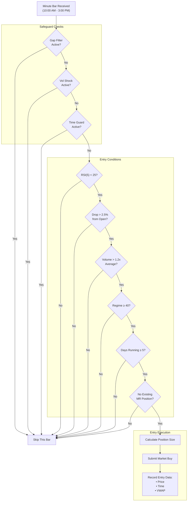
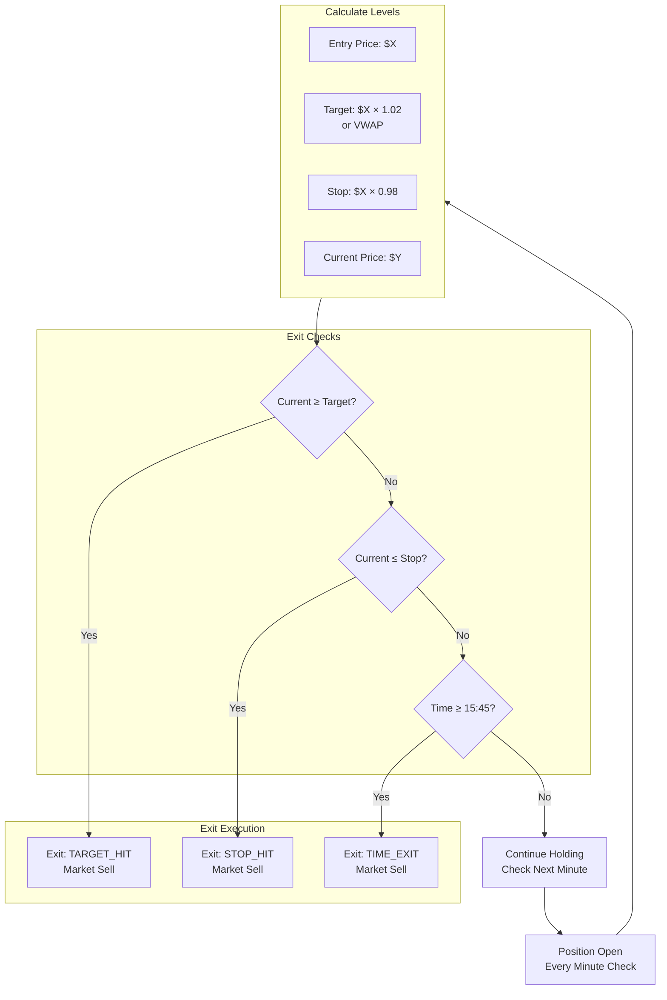

# Section 8: Mean Reversion Engine

> **V2.3.7 Planned:** Bidirectional Mean Reversion with SQQQ/SOXS (inverse ETFs) to capture "rally fade" when market is overbought (RSI > 75, rally > 2.5%). Currently long-only; will add short-side logic after V2.3.6 backtest validates current fixes.

## 8.1 Purpose and Philosophy

The Mean Reversion Engine captures **intraday oversold bounces** in 3× leveraged ETFs. When panic selling drives prices to extreme levels, a snap-back toward the mean often follows.

### 8.1.1 The Mean Reversion Thesis

Markets overreact in the short term. When a 3× ETF drops sharply intraday:

| Component | Description |
|-----------|-------------|
| **Fundamental selling** | Warranted, based on real news/events |
| **Emotional selling** | Panic, forced liquidations, stop cascades |
| **Reversion opportunity** | The emotional component often reverses quickly |

By buying extreme oversold conditions, we capture the reversion of the emotional component.

### 8.1.2 Why 3× for Mean Reversion?

Unlike trend trading, mean reversion is **intraday only**—no overnight holds. This eliminates the decay concern.

| Factor | Benefit for MR |
|--------|----------------|
| **Larger intraday moves** | Creates clearer entry signals |
| **Pronounced bounces** | 3% bounce on underlying = 9% on 3× |
| **High volume** | Ensures liquidity for quick exits |
| **Short holding period** | Minutes to hours, not days |

**Key Constraint:** All mean reversion positions **must be closed by 3:45 PM**. No overnight holds ever.

---

## 8.2 Instruments

> **V6.11 Update:** Added SPXL (3× S&P 500) for broader market bounce opportunities. Total allocation: 10% (TQQQ 4% + SPXL 3% + SOXL 3%).

### 8.2.1 TQQQ (ProShares UltraPro QQQ) — 4% Allocation

**Primary mean reversion instrument.** 3× leveraged Nasdaq-100.

| Characteristic | Description |
|----------------|-------------|
| Leverage | 3× |
| Underlying | Nasdaq-100 Index |
| Allocation | 4% of portfolio |
| Volume | Highest volume 3× equity ETF |
| Spreads | Tightest bid-ask of any 3× ETF |
| Intraday moves | Frequent large swings |
| Priority | Scan first |
| Exposure Group | NASDAQ_BETA |

### 8.2.2 SPXL (Direxion Daily S&P 500 Bull 3X) — 3% Allocation

**V6.11 Addition: Broad market bounces.** 3× leveraged S&P 500.

| Characteristic | Description |
|----------------|-------------|
| Leverage | 3× |
| Underlying | S&P 500 Index |
| Allocation | 3% of portfolio |
| Volatility | Lower than TQQQ (more diversified) |
| Catalyst | Broad market sell-offs, not tech-specific |
| Spreads | Tight, similar to TQQQ |
| Priority | Scan second |
| Exposure Group | SPY_BETA |

**Rationale for SPXL:** S&P 500 oversold bounces may occur when tech is flat:
- Diversifies beyond Nasdaq-only opportunities
- Provides broader market bounce exposure
- Lower correlation to TQQQ entries

### 8.2.3 SOXL (Direxion Daily Semiconductor Bull 3x) — 3% Allocation

**Semiconductor sector mean reversion.** 3× leveraged semiconductor index.

| Characteristic | Description |
|----------------|-------------|
| Leverage | 3× |
| Underlying | ICE Semiconductor Index |
| Allocation | 3% of portfolio |
| Volatility | Higher than TQQQ |
| Catalyst | Sector-specific news creates oversold opportunities |
| Spreads | Wider than TQQQ but acceptable |
| Priority | Scan third |
| Exposure Group | NASDAQ_BETA |

### 8.2.4 Allocation Summary

| Symbol | Allocation | Underlying | Exposure Group |
|--------|:----------:|------------|----------------|
| TQQQ | 4% | Nasdaq-100 | NASDAQ_BETA |
| SPXL | 3% | S&P 500 | SPY_BETA |
| SOXL | 3% | Semiconductors | NASDAQ_BETA |
| **Total** | **10%** | | |

---

## 8.3 Entry Conditions

**All eight conditions must be satisfied simultaneously** for entry.

### Entry Conditions Summary Table

| # | Condition | Requirement | Rationale |
|:-:|-----------|-------------|-----------|
| 1 | RSI Oversold | RSI(5) < threshold (VIX-adjusted) | Extreme oversold reading |
| 2 | Price Drop | > 2.5% from open | Meaningful decline, not noise |
| 3 | Volume Confirmation | > 1.2× average | Genuine selling pressure |
| 4 | Time Window | 10:00 AM – 3:00 PM | Avoid open chaos, allow time for bounce |
| 5 | Regime Requirement | Score ≥ 40 | Don't buy dips in bad environments |
| 6 | VIX Regime Filter | VIX < 40 (see table below) | Adjust exposure in high volatility |
| 7 | Not Cold Start | Days ≥ 5 | Need sufficient intraday history |
| 8 | Safeguards Clear | No gap/vol shock/time guard | Safety checks pass |

---

## 8.3.0 VIX Regime Filter (V2.1)

**The VIX level determines allocation, RSI threshold, and stop loss percentage.** This is a key V2.1 enhancement that reduces risk in high-volatility environments.

### VIX Regime Tiers

| VIX Level | Regime | Max Allocation | RSI Threshold | Stop Loss |
|:---------:|--------|:--------------:|:-------------:|:---------:|
| < 20 | NORMAL | 10% | RSI < 30 | 8% |
| 20-30 | CAUTION | 5% | RSI < 25 | 6% |
| 30-40 | HIGH_RISK | 2% | RSI < 20 | 4% |
| > 40 | CRASH | **DISABLED** | — | — |

### Why VIX Matters for Mean Reversion

| VIX State | Market Behavior | MR Adjustment |
|-----------|-----------------|---------------|
| **Low VIX** | Normal conditions, bounces reliable | Full allocation, standard thresholds |
| **Elevated VIX** | Increased fear, larger swings | Reduced size, tighter entry |
| **High VIX** | Fear dominant, momentum persists | Minimal exposure, extreme oversold only |
| **Crash VIX** | Panic selling, no mean reversion | **Engine disabled entirely** |

### VIX Check Implementation

```python
def get_vix_adjusted_params(self, vix: float) -> dict:
    """Return VIX-adjusted parameters for MR entry."""
    if vix >= 40:
        return {"enabled": False, "allocation": 0, "rsi_threshold": 0, "stop_pct": 0}
    elif vix >= 30:
        return {"enabled": True, "allocation": 0.02, "rsi_threshold": 20, "stop_pct": 0.04}
    elif vix >= 20:
        return {"enabled": True, "allocation": 0.05, "rsi_threshold": 25, "stop_pct": 0.06}
    else:
        return {"enabled": True, "allocation": 0.10, "rsi_threshold": 30, "stop_pct": 0.08}
```

### VIX is Checked at SOD

VIX regime is determined at **09:33 ET** (SOD baseline) and remains fixed for the day:
- Prevents whipsaw from intraday VIX spikes
- Provides predictable behavior throughout the session
- VIX tends to spike early if there's trouble

---

### 8.3.1 RSI Oversold (VIX-Adjusted)

**Requirement:** 5-period RSI must be below the VIX-adjusted threshold.

The threshold varies based on VIX regime (see 8.3.0):

| VIX Level | RSI Threshold | Meaning |
|:---------:|:-------------:|---------|
| VIX < 20 | RSI < 30 | Standard oversold |
| VIX 20-30 | RSI < 25 | More extreme required |
| VIX 30-40 | RSI < 20 | Only deep panic |
| VIX > 40 | **DISABLED** | No entries allowed |

| Parameter | Standard | MR Engine (VIX < 20) |
|-----------|:--------:|:--------------------:|
| RSI Period | 14 | **5** (faster) |
| Oversold Threshold | 30 | **20-30** (VIX-adjusted) |

This combination identifies **genuine panic selling**, not minor pullbacks.

---

### 8.3.2 Price Drop (> 2.5% from Open)

**Requirement:** Current price must be more than 2.5% below today's opening price.

```
Drop % = (Open − Current Price) / Open
Entry requires: Drop % > 0.025
```

#### Why 2.5%?

| Threshold | Issue |
|:---------:|-------|
| 0.5% (old) | Generated too many signals, caught normal fluctuation |
| **2.5%** | Filters for genuine "scare" events |

For a 3× ETF, 2.5% implies the underlying index is down approximately **0.8%**—a meaningful intraday decline.

---

### 8.3.3 Volume Confirmation (> 1.2× Average)

**Requirement:** Current period volume must exceed 1.2× the 20-period average volume.

```
Entry requires: Current Volume > (1.2 × SMA(Volume, 20))
```

#### Why Volume Matters

| Volume Level | Interpretation |
|--------------|----------------|
| Low volume drop | May be illiquidity, not real selling |
| **High volume drop** | Confirms genuine selling pressure |
| High volume reversal | More meaningful, likely to follow through |

---

### 8.3.4 Time Window (10:00 AM – 3:00 PM)

**Requirement:** Entries only allowed between 10:00 AM and 3:00 PM Eastern.

| Time | Status | Rationale |
|------|:------:|-----------|
| 09:30 – 09:59 | ❌ Blocked | Opening volatility is noise |
| 10:00 – 14:59 | ✅ Allowed | Core trading window |
| 15:00 – 15:44 | ❌ Blocked | Not enough time for bounce |
| 15:45 | Force exit | Close all MR positions |

---

### 8.3.5 Regime Requirement (Score ≥ 40)

**Requirement:** Regime score must be at least 40.

| Regime | Score | MR Entry |
|--------|:-----:|:--------:|
| RISK_ON | 70-100 | ✅ |
| NEUTRAL | 50-69 | ✅ |
| CAUTIOUS | 45-49 | ✅ |
| DEFENSIVE | 35-44 | ❌ |
| RISK_OFF | 0-34 | ❌ |

**Rationale:** In RISK_OFF or DEFENSIVE conditions, oversold can become **more oversold**. We only buy dips in reasonable market environments.

> **V6.15 Note:** Regime thresholds adjusted (CAUTIOUS 45, DEFENSIVE 35).

---

### 8.3.6 Not Cold Start (Days ≥ 5)

**Requirement:** Algorithm must be past the cold start period.

```
Entry requires: days_running >= 5
```

#### Why Block During Cold Start?

Mean reversion requires understanding what constitutes "normal" intraday behavior:
- Is a 2.5% drop unusual or routine for this instrument?
- Is current volume elevated versus **recent** history?

During the first five days, we don't have sufficient recent intraday history for reliable judgments.

---

### 8.3.7 Safeguards Clear

**Requirement:** Three safeguards must NOT be active:

| Safeguard | Blocks MR If |
|-----------|--------------|
| **Gap Filter** | SPY gapped down ≥ 1.5% at open |
| **Vol Shock** | SPY 1-min bar range > 3× ATR (15-min pause) |
| **Time Guard** | Current time is 13:55 – 14:10 |

If any safeguard is active, mean reversion entries are blocked.

---

## 8.4 Exit Conditions

Mean reversion positions **must be closed the same day**. Three exit triggers ensure this.

### Exit Conditions Summary

| Exit Type | Trigger | Action |
|-----------|---------|--------|
| **Target Exit** | +2% from entry OR return to VWAP | Take profit |
| **Stop Exit** | VIX-adjusted stop (4-8%) | Cut losses |
| **Time Exit** | 3:45 PM | Force close regardless of P&L |

### VIX-Adjusted Stop Loss (V2.1)

Stop loss varies based on VIX at SOD:

| VIX Level | Stop Loss | Rationale |
|:---------:|:---------:|-----------|
| VIX < 20 | 8% | Wide stop in calm markets |
| VIX 20-30 | 6% | Tighter in elevated vol |
| VIX 30-40 | 4% | Very tight in high vol |

---

### 8.4.1 Target Exit (+2% or VWAP)

**Trigger:** Close the position when either:
- Price rises **2% above entry price**, OR
- Price returns to **VWAP** (Volume Weighted Average Price)

Whichever comes first.

```
Target Price = Entry Price × 1.02
OR
Target Price = VWAP at entry time
```

#### Rationale

| Target | Purpose |
|--------|---------|
| +2% | Captures minimum acceptable bounce |
| VWAP | Represents "fair value" for the day |

Returning to VWAP means reversion is complete—the oversold condition has normalized.

---

### 8.4.2 Stop Exit (VIX-Adjusted)

**Trigger:** Close the position if price falls below the VIX-adjusted stop level.

```
Stop Price = Entry Price × (1 - stop_pct)

Where stop_pct is based on VIX at SOD:
  VIX < 20:  stop_pct = 0.08 (8%)
  VIX 20-30: stop_pct = 0.06 (6%)
  VIX 30-40: stop_pct = 0.04 (4%)
```

#### Rationale

| VIX Level | Stop % | Risk/Reward | Purpose |
|:---------:|:------:|:-----------:|---------|
| Low (< 20) | 8% | 1:4 | Wide stop, expect reversion |
| Elevated (20-30) | 6% | 1:3 | Moderate stop |
| High (30-40) | 4% | 1:2 | Tight stop, protect capital |

The tighter stops in high-VIX environments reflect that momentum may persist longer in volatile markets.

---

### 8.4.3 Time Exit (3:45 PM)

**Trigger:** Force close **all mean reversion positions** at 3:45 PM.

```
At 15:45 ET: Liquidate all MR positions regardless of P&L
```

#### Rationale

| Rule | Reason |
|------|--------|
| Never hold 3× ETFs overnight | Decay and gap risk unacceptable |
| 15 minutes before close | Ensures execution with liquidity |
| Override | Time-based, regardless of profit/loss |

---

## 8.5 Position Sizing

### 8.5.1 Volatility-Targeted Sizing

Mean reversion positions are sized using the same volatility-targeting approach as other strategies, subject to:

- **Tradeable equity** from Capital Engine
- **Exposure group limits** (NASDAQ_BETA)
- **Maximum single position** (50% SEED, 40% GROWTH)

### 8.5.2 NASDAQ_BETA Group Constraint

Both TQQQ and SOXL are in the **NASDAQ_BETA** exposure group:

| Limit | Value |
|-------|:-----:|
| Max Net Long | 50% |
| Max Gross | 75% |

If a trend position in QLD already exists, the MR position size may be reduced to stay within group limits.

---

## 8.6 Position Tracking

### 8.6.1 Entry Recording

When a mean reversion entry executes, record:

| Data Point | Value | Used For |
|------------|-------|----------|
| `entry_price` | Fill price | Target/stop calculation |
| `entry_time` | Timestamp | Time exit tracking |
| `vwap_at_entry` | VWAP value | Target calculation |
| `symbol` | TQQQ or SOXL | Position identification |

### 8.6.2 Real-Time Monitoring

**Every minute** while position is open:

```
1. Calculate current P&L percentage
2. Check if price ≥ target price (+2% or VWAP)
3. Check if price ≤ stop price (−2%)
4. Check if time ≥ 15:45 (force exit)
5. If any exit condition met → trigger exit
```

### 8.6.3 Exit Cleanup

When position closes:

| Action | Description |
|--------|-------------|
| Record exit price | For logging and analysis |
| Record exit reason | TARGET_HIT, STOP_HIT, or TIME_EXIT |
| Clear entry data | Reset tracking for symbol |
| Log trade summary | Entry, exit, P&L, duration |

---

## 8.7 Signal Timing and Execution

### 8.7.1 Continuous Scanning

Unlike trend (which scans at EOD), mean reversion scans **continuously** during market hours:

| Property | Value |
|----------|-------|
| Scan frequency | Every minute bar |
| Scan window | 10:00 AM – 3:00 PM |
| Symbols scanned | TQQQ, then SPXL, then SOXL |

Opportunities can appear at any time—the engine must act immediately when conditions align.

### 8.7.2 Immediate Execution

Mean reversion signals execute **immediately** via market orders:

| Signal | Order Type | Timing |
|--------|------------|--------|
| Entry | Market buy | Immediate |
| Exit (target/stop) | Market sell | Immediate |
| Exit (time) | Market sell | At 15:45 |

**No MOO orders, no delayed execution**—the time-sensitive nature of MR requires immediate action.

---

## 8.8 Output Format

The Mean Reversion Engine produces **TargetWeight** objects with **IMMEDIATE** urgency.

### Entry Signal Output

| Field | Value |
|-------|-------|
| Symbol | TQQQ, SPXL, or SOXL |
| Weight | 1.0 |
| Strategy | "MR" |
| Urgency | **IMMEDIATE** |
| Reason | "MR Entry: RSI=X<threshold, Drop=Y%, Volume=Zx, VIX=regime" |

### Exit Signal Output

| Field | Value |
|-------|-------|
| Symbol | TQQQ, SPXL, or SOXL |
| Weight | 0.0 |
| Strategy | "MR" |
| Urgency | **IMMEDIATE** |
| Reason | Exit description (see below) |

#### Exit Reason Formats

| Exit Type | Reason String |
|-----------|---------------|
| Target hit | "TARGET_HIT +X% (Price: $Y)" |
| Stop hit | "STOP_HIT −X% (Price: $Y)" |
| Time exit | "TIME_EXIT 15:45 (P&L: X%)" |

---

## 8.9 Mermaid Diagram: Entry Scan Flow



---

## 8.10 Mermaid Diagram: Exit Monitoring Flow



---

## 8.11 Integration with Other Engines

### Inputs from Other Engines

| Source | Data | Used For |
|--------|------|----------|
| **Regime Engine** | `regime_score` | Entry blocking if < 40 |
| **Capital Engine** | `tradeable_equity` | Position sizing |
| **Risk Engine** | Gap filter, vol shock, time guard status | Entry blocking |
| **Cold Start Engine** | `days_running` | Entry blocking if < 5 |

### Outputs to Other Engines

| Destination | Data | Purpose |
|-------------|------|---------|
| **Portfolio Router** | TargetWeight (IMMEDIATE) | Entry/exit execution |
| **State Persistence** | MR entry data | Track open positions |

### Interaction with Trend Positions

If both MR and Trend want exposure to NASDAQ_BETA:

```
Example:
- Trend holds 30% QLD
- MR wants to enter 25% TQQQ
- NASDAQ_BETA limit: 50% net long

Router will scale MR entry to fit within limit:
- Approved MR size: 20% (30% + 20% = 50%)
```

---

## 8.12 Parameter Reference

### RSI Parameters

| Parameter | Value | Description |
|-----------|:-----:|-------------|
| `RSI_PERIOD` | 5 | Fast RSI for intraday |
| `RSI_THRESHOLD` | VIX-adjusted | Oversold threshold (20-30) |

### Entry Parameters

| Parameter | Value | Description |
|-----------|:-----:|-------------|
| `DROP_THRESHOLD` | 0.025 | 2.5% drop from open |
| `VOLUME_MULT` | 1.2 | Volume must exceed 1.2× average |
| `WINDOW_START` | 10:00 AM | Earliest entry time |
| `WINDOW_END` | 3:00 PM | Latest entry time |

### Exit Parameters

| Parameter | Value | Description |
|-----------|:-----:|-------------|
| `TARGET_PCT` | 0.02 | +2% profit target |
| `STOP_PCT` | VIX-adjusted | 4-8% stop loss |
| `FORCE_EXIT_TIME` | 3:45 PM | Mandatory close time |

### Regime Threshold

| Parameter | Value | Description |
|-----------|:-----:|-------------|
| Entry minimum | 40 | Regime score required |

### VIX Regime Parameters (V2.1)

| Parameter | Value | Description |
|-----------|:-----:|-------------|
| `VIX_NORMAL_THRESHOLD` | 20 | Below = NORMAL regime |
| `VIX_CAUTION_THRESHOLD` | 30 | 20-30 = CAUTION regime |
| `VIX_HIGH_RISK_THRESHOLD` | 40 | 30-40 = HIGH_RISK regime |
| `VIX_CRASH_THRESHOLD` | 40 | Above = CRASH (disabled) |

| VIX Regime | Allocation | RSI Threshold | Stop |
|------------|:----------:|:-------------:|:----:|
| NORMAL | 10% | 30 | 8% |
| CAUTION | 5% | 25 | 6% |
| HIGH_RISK | 2% | 20 | 4% |
| CRASH | **0%** | — | — |

---

## 8.13 Trade Examples

### Example 1: Successful Target Exit

```
10:47 AM - Entry Conditions Met:
  • TQQQ RSI(5) = 22 (< 25 ✓)
  • Drop from open = 3.1% (> 2.5% ✓)
  • Volume = 1.4× average (> 1.2× ✓)
  • Regime = 58 (≥ 40 ✓)
  • All safeguards clear ✓

10:47 AM - Entry Executed:
  • Buy TQQQ at $45.20
  • Target = $46.10 (+2%)
  • Stop = $44.30 (−2%)
  • VWAP = $46.50

12:23 PM - Target Hit:
  • Price reaches $46.15
  • Exit at $46.12 (fill)
  • P&L = +2.0%
  • Duration = 1h 36m
```

### Example 2: Stop Loss Exit

```
11:15 AM - Entry Conditions Met:
  • SOXL RSI(5) = 24
  • Drop from open = 4.2%
  • Volume = 1.8× average
  • Regime = 52

11:15 AM - Entry Executed:
  • Buy SOXL at $28.50
  • Target = $29.07 (+2%)
  • Stop = $27.93 (−2%)

11:42 AM - Stop Hit:
  • Price drops to $27.90
  • Exit at $27.88 (fill)
  • P&L = −2.2%
  • Duration = 27m
```

### Example 3: Time Exit

```
14:35 PM - Entry Conditions Met:
  • TQQQ RSI(5) = 23
  • Drop from open = 2.8%
  • Volume = 1.3× average
  • Regime = 61

14:35 PM - Entry Executed:
  • Buy TQQQ at $44.00
  • Target = $44.88
  • Stop = $43.12

15:45 PM - Time Exit Forced:
  • Price at $44.35
  • Exit at $44.33 (fill)
  • P&L = +0.75%
  • Duration = 1h 10m
  • Reason: TIME_EXIT (did not hit target or stop)
```

---

## 8.14 Edge Cases and Special Scenarios

### Scenario 1: Both TQQQ and SOXL Signal

```
10:30 AM:
- TQQQ: All conditions met ✓
- SOXL: All conditions met ✓
```

**Action:** Enter TQQQ only (scanned first). One MR position at a time to manage risk. SOXL signal is logged but not executed.

### Scenario 2: Entry at 2:55 PM

```
14:55 PM: Conditions met for TQQQ
```

**Action:** Entry blocked—outside the 10:00 AM – 3:00 PM window. Not enough time for a bounce before forced exit.

### Scenario 3: Regime Drops While Holding

```
11:00 AM: Enter TQQQ (Regime = 45)
12:30 PM: Regime updates to 38
```

**Action:** Position remains open. Regime is checked at entry only. Exit is governed by target/stop/time, not regime changes intraday.

### Scenario 4: Vol Shock During Position

```
11:00 AM: Enter TQQQ
11:15 AM: Vol shock triggers (SPY extreme bar)
```

**Action:** Position remains open—vol shock blocks new **entries**, not exits. Continue monitoring for target/stop/time exit.

### Scenario 5: Gap Filter Day

```
09:33 AM: SPY gapped down 2.1% → Gap filter active
10:30 AM: TQQQ conditions would be met
```

**Action:** Entry blocked for entire day. Gap filter suggests systemic weakness—MR bounces less reliable on these days.

---

## 8.15 Key Design Decisions Summary

| Decision | Rationale |
|----------|-----------|
| **3× leverage** | Acceptable for intraday; larger moves create clearer signals |
| **No overnight holds** | Eliminates decay and gap risk entirely |
| **RSI(5) < 25** | Fast RSI with extreme threshold identifies panic |
| **2.5% drop threshold** | Filters noise; previous 0.5% generated false signals |
| **1.2× volume requirement** | Confirms genuine selling, not illiquidity |
| **10 AM – 3 PM window** | Avoids open chaos; ensures time for bounce |
| **+2%/−2% symmetric exits** | Simple 1:1 risk/reward; quick decisions |
| **VWAP alternative target** | "Fair value" reached = reversion complete |
| **3:45 PM force exit** | Ensures no overnight exposure to 3× |
| **Regime ≥ 40 required** | Don't buy dips in deteriorating markets |
| **Cold start blocking** | Need intraday history for reliable signals |
| **IMMEDIATE urgency** | Time-sensitive; must execute now |

---

*Next Section: [09 - Hedge Engine](09-hedge-engine.md)*

*Previous Section: [07 - Trend Engine](07-trend-engine.md)*
