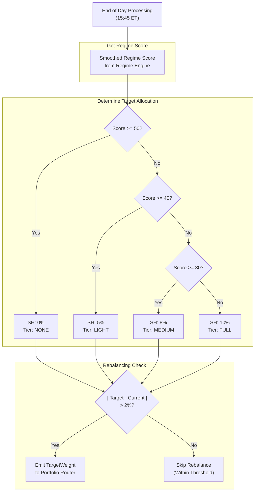
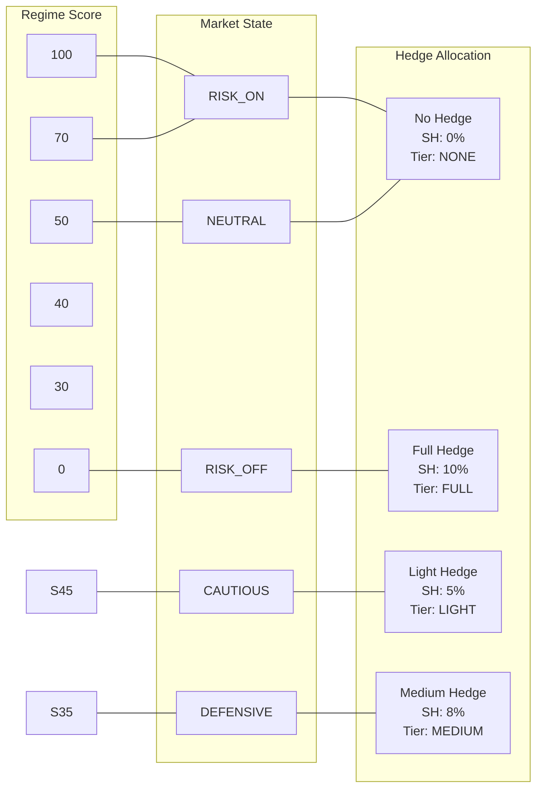

# Section 9: Hedge Engine

*Last Updated: 10 February 2026 (V6.11)*

## 9.1 Purpose and Philosophy

The Hedge Engine provides **tail risk protection** when market conditions deteriorate. Hedges are insurance—they cost money in good times but protect the portfolio during crashes.

> **V6.11 Universe Redesign**: TMF and PSQ have been **retired**. SH (1x Inverse S&P 500) is now the **sole hedge instrument**. SH provides direct equity offset without contango decay issues that affected volatility products.

### 9.1.1 Insurance Mentality

Hedges are **not profit centers**. We expect them to lose money most of the time. Their value comes from asymmetric payoff:

| Market Condition | Hedge Behavior | Portfolio Impact |
|------------------|----------------|------------------|
| Normal/Bull | Small, ongoing cost | Minor drag on returns |
| Crash/Correction | Large, sudden benefit | Offsets equity losses |

#### Example Asymmetry

```
Normal Year:
  - 10% hedge allocation loses 5%
  - Portfolio cost: 10% x 5% = 0.5% drag

Crash Year:
  - 10% hedge allocation gains 30%
  - Portfolio benefit: 10% x 30% = 3% gain
  - While equity positions fall 20%+
```

The hedge's purpose is **survival**, not profit.

### 9.1.2 Regime-Triggered Activation

Hedges activate based on **regime score**, not prediction:

| Approach | Problem |
|----------|---------|
| X Predict crashes | Impossible to time consistently |
| OK Respond to deterioration | Measurable, systematic, reliable |

As regime worsens, hedge allocation increases automatically. No discretion required.

---

## 9.2 Instruments

### 9.2.1 SH (ProShares Short S&P 500) - V6.11

**Sole hedge instrument.** 1x inverse S&P 500.

#### Why SH Replaced TMF/PSQ

| Factor | SH Advantage |
|--------|-------------|
| **No contango decay** | Unlike VIX products (VIXY/VXX), SH holds indefinitely without erosion |
| **Direct inverse** | Rises when S&P 500 falls - reliable inverse correlation |
| **Works in all selloffs** | Even rate-driven crashes (TMF failed in 2022) |
| **1x leverage** | Minimal daily decay, suitable for longer holds |
| **Broad market hedge** | S&P 500 is more diversified than Nasdaq-only (PSQ) |

#### Characteristics

| Property | Value/Description |
|----------|-------------------|
| Underlying | S&P 500 Index (inverse) |
| Leverage | 1x (inverse) |
| Correlation to SPY | -1.0 (by design) |
| Daily decay | Minimal (1x inverse products) |
| Best scenario | Any equity decline |
| Weakness | Bull markets (steady drag) |

### 9.2.2 Retired Instruments (V6.11)

> **TMF and PSQ are no longer used.** The following sections are retained for historical reference only.

#### TMF (Retired)

TMF (3x Long Treasury) was retired because:
- **2022 Rate Hike Failure**: TMF lost value during equity selloffs due to rising rates
- **Contango decay**: Significant erosion during calm periods
- **Correlation breakdown**: Flight-to-safety correlation failed in rate-driven markets

#### PSQ (Retired)

PSQ (1x Inverse Nasdaq) was retired in favor of SH because:
- **Narrower coverage**: Nasdaq-only leaves S&P and commodity positions unhedged
- **SH is more diversified**: S&P 500 covers broader market risk

### 9.2.3 Why Single Instrument?

V6.11 simplifies to a single hedge instrument for several reasons:

| Benefit | Description |
|---------|-------------|
| **Simplicity** | One instrument to track and rebalance |
| **No decay issues** | SH has minimal decay vs TMF's significant contango |
| **Reliable inverse** | SH reliably rises when equities fall |
| **Lower allocation** | 10% max vs 30% max (TMF 20% + PSQ 10%) |
| **No rate sensitivity** | Works in all interest rate environments |

---

## 9.3 Hedge Allocation Logic (V6.11)

### 9.3.1 Regime-Based Scaling

Hedge allocation scales with regime deterioration using SH only:

| Regime Score | State | SH Allocation | Hedge Tier |
|:------------:|-------|:-------------:|:----------:|
| **>= 50** | NEUTRAL / RISK_ON | 0% | NONE |
| **45 - 49** | CAUTIOUS | 5% | LIGHT |
| **35 - 44** | DEFENSIVE | 8% | MEDIUM |
| **< 35** | RISK_OFF | 10% | FULL |

> **V6.15 Note:** Thresholds adjusted (CAUTIOUS 45, DEFENSIVE 35).

### 9.3.2 Visual Representation

```
Regime Score:  100 -------- 50 -------- 45 -------- 35 -------- 0
                |           |           |           |           |
SH:            0%          0%          5%          8%         10%
                |           |           |           |           |
Tier:         NONE       NONE       LIGHT      MEDIUM       FULL
                |           |           |           |           |
State:      RISK_ON    NEUTRAL   CAUTIOUS   DEFENSIVE   RISK_OFF
```

### 9.3.3 Why Graduated Scaling?

Previous versions used **binary hedging** (ON at regime 40, OFF at 41). This caused problems:

| Problem | Impact |
|---------|--------|
| Regime oscillating around 40 | Constant hedge trading |
| Sudden large positions | Disrupted portfolio balance |
| No gradual adjustment | Couldn't match severity |
| High transaction costs | Frequent buys/sells |

**Graduated scaling provides:**

| Benefit | Description |
|---------|-------------|
| Smooth transitions | No abrupt position changes |
| Lower turnover | Fewer trades, lower costs |
| Proportional response | Hedge matches threat level |
| Reduced whipsaw | Less sensitivity to noise |

### 9.3.4 Why Lower Maximum (10% vs 30%)?

**V6.11 reduced maximum hedge allocation from 30% (TMF+PSQ) to 10% (SH only):**

| Reason | Explanation |
|--------|-------------|
| **No decay drag** | SH doesn't erode like 3x TMF, so less capital needed for same protection |
| **Capital efficiency** | Released 20% for productive assets (trend, options) |
| **Reliable inverse** | SH's -1.0 correlation is more predictable than TMF's variable correlation |
| **Simpler management** | One instrument, one threshold, one rebalance calculation |

---

## 9.4 Rebalancing Rules

### 9.4.1 EOD Only

Hedge rebalancing occurs **only at end of day** (15:45 ET):

| Property | Value |
|----------|-------|
| Timing | OnEndOfDay (15:45 ET) |
| Frequency | Once per day maximum |
| Trigger | Regime score change |

**Benefits:**
- Uses finalized regime score
- Prevents intraday churn from regime oscillation
- Batches with other EOD orders for efficiency

### 9.4.2 Threshold for Action

Rebalance only if target differs from current by more than **2%**:

```
Rebalance if: |Target Allocation - Current Allocation| > 2%
```

#### Example (V6.11 SH-only)

| Scenario | SH Target | SH Current | Difference | Action |
|----------|:---------:|:----------:|:----------:|--------|
| A | 5% | 4% | 1% | X No rebalance |
| B | 8% | 5% | 3% | OK Rebalance |
| C | 10% | 5% | 5% | OK Rebalance |
| D | 0% | 2% | 2% | X No rebalance |

This avoids small, costly adjustments that don't meaningfully change protection.

### 9.4.3 Panic Mode Exception

If **panic mode** triggers (SPY down 4%+ intraday), hedge requirements may be addressed **immediately** rather than waiting for EOD.

```
Panic Mode Triggered:
  -> Check if SH allocation is below required level
  -> If yes, increase SH immediately
  -> Do not wait for 15:45 EOD processing
```

This ensures protection is in place during acute stress.

---

## 9.5 Output Format (V6.11)

The Hedge Engine produces **TargetWeight** objects for SH only.

### SH Output

| Field | Value |
|-------|-------|
| Symbol | SH |
| Weight | 0.0, 0.05, 0.08, or 0.10 (based on regime) |
| Strategy | "HEDGE" |
| Urgency | EOD (or IMMEDIATE in panic mode) |
| Reason | "Regime=X, SH target=Y%, tier=Z" |

### Example Outputs

**Regime Score = 55 (NEUTRAL):**
```
TargetWeight(SH, 0.00, "HEDGE", EOD, "Regime=55.0, SH target=0%, tier=NONE")
```

**Regime Score = 45 (CAUTIOUS):**
```
TargetWeight(SH, 0.05, "HEDGE", EOD, "Regime=45.0, SH target=5%, tier=LIGHT")
```

**Regime Score = 35 (DEFENSIVE):**
```
TargetWeight(SH, 0.08, "HEDGE", EOD, "Regime=35.0, SH target=8%, tier=MEDIUM")
```

**Regime Score = 22 (RISK_OFF):**
```
TargetWeight(SH, 0.10, "HEDGE", EOD, "Regime=22.0, SH target=10%, tier=FULL")
```

**Panic Mode Active (IMMEDIATE urgency):**
```
TargetWeight(SH, 0.10, "HEDGE", IMMEDIATE, "PANIC_MODE: Regime=22.0, SH target=10%, tier=FULL")
```

---

## 9.6 Mermaid Diagram: Regime-Based Allocation (V6.11)



---

## 9.7 Mermaid Diagram: Hedge Allocation Tiers (V6.11)



---

## 9.8 Integration with Other Engines

### Inputs from Other Engines

| Source | Data | Used For |
|--------|------|----------|
| **Regime Engine** | `smoothed_score` | Determines hedge tier |
| **Capital Engine** | `tradeable_equity` | Calculates dollar amounts |
| **Risk Engine** | Panic mode status | Immediate rebalance trigger |

### Outputs to Other Engines

| Destination | Data | Purpose |
|-------------|------|---------|
| **Portfolio Router** | TargetWeight (SH) | Hedge allocation intent |

### Relationship to Regime Engine

The Hedge Engine is tightly coupled to the Regime Engine:

```
Regime Engine Output:
  - smoothed_score: 28

Hedge Engine calculates:
  - Score < 30 -> Tier: FULL
  - SH target: 10%

Output:
  TargetWeight(SH, 0.10, "HEDGE", EOD, "Regime=28.0, SH target=10%, tier=FULL")
```

The Hedge Engine uses the regime score to determine the hedge tier and emits TargetWeight objects for the Portfolio Router.

---

## 9.9 Exposure Group Consideration (V6.11)

### SPY_BETA Group

SH is in the **SPY_BETA** exposure group (as an inverse):

| Symbol | Type | Group |
|--------|------|-------|
| SH | 1x Inverse S&P | SPY_BETA |
| SSO | 2x Long S&P | SPY_BETA |
| SPXL | 3x Long S&P (MR) | SPY_BETA |

**SPY_BETA Group Limits (V6.11):**

| Limit | Value |
|-------|:-----:|
| Max Net Long | 40% |
| Max Net Short | 15% |
| Max Gross | 50% |

**Impact:** SH allocation counts as **negative** (short) exposure in SPY_BETA, which can offset long positions.

```
Example:
  - SSO position: +7% (long)
  - SH position: +10% (inverse = -10% effective)
  - Net SPY_BETA: 7% - 10% = -3% net short
  - Gross SPY_BETA: 7% + 10% = 17%
```

### Exposure Groups Summary (V6.11)

| Group | Symbols | Max Net Long | Max Gross |
|-------|---------|:------------:|:---------:|
| **NASDAQ_BETA** | QLD, TQQQ, SOXL | 50% | 75% |
| **SPY_BETA** | SSO, SPXL, SH (inverse) | 40% | 50% |
| **COMMODITIES** | UGL, UCO | 25% | 25% |

> **Note (V6.11):** The RATES group (TMF, SHV) has been **removed**. SHV is retired (no yield sleeve) and TMF is no longer used for hedging.

---

## 9.10 Parameter Reference (V6.11)

### Hedge Tier Parameters

| Parameter | Value | Description |
|-----------|:-----:|-------------|
| `HEDGE_LEVEL_1` | 50 | Score below which hedging begins (LIGHT) |
| `HEDGE_LEVEL_2` | 45 | V6.15: Score below which MEDIUM hedge (was 40) |
| `HEDGE_LEVEL_3` | 35 | V6.15: Score below which FULL hedge (was 30) |

### SH Allocation Parameters

| Parameter | Value | Description |
|-----------|:-----:|-------------|
| `SH_LIGHT` | 0.05 | SH allocation at CAUTIOUS (regime 45-49) |
| `SH_MEDIUM` | 0.08 | SH allocation at DEFENSIVE (regime 35-44) |
| `SH_FULL` | 0.10 | SH allocation at RISK_OFF (regime < 35) |

### Retired Parameters (V6.11)

| Parameter | Value | Description |
|-----------|:-----:|-------------|
| `TMF_LIGHT` | 0.00 | **DEPRECATED** - TMF no longer used |
| `TMF_MEDIUM` | 0.00 | **DEPRECATED** - TMF no longer used |
| `TMF_FULL` | 0.00 | **DEPRECATED** - TMF no longer used |
| `PSQ_MEDIUM` | 0.00 | **DEPRECATED** - PSQ no longer used |
| `PSQ_FULL` | 0.00 | **DEPRECATED** - PSQ no longer used |

### Rebalancing Parameters

| Parameter | Value | Description |
|-----------|:-----:|-------------|
| `HEDGE_REBAL_THRESHOLD` | 0.02 | Minimum difference to trigger rebalance (2%) |
| Rebalance timing | EOD | When rebalancing occurs (15:45 ET) |
| Panic mode urgency | IMMEDIATE | Override for acute stress |

---

## 9.11 Hedge Performance Scenarios (V6.11)

### Scenario 1: 2020 COVID Crash (Simulated with V6.11 model)

```
February 19, 2020: Regime Score = 72 (RISK_ON)
  - SH: 0%
  - No hedges, full equity exposure

March 1, 2020: Regime Score = 45 (CAUTIOUS)
  - SH: 5%
  - Light hedge activated

March 10, 2020: Regime Score = 32 (DEFENSIVE)
  - SH: 8%
  - Medium hedge

March 16, 2020: Regime Score = 15 (RISK_OFF)
  - SH: 10%
  - Full hedge, maximum protection

Result:
  - SH gained ~30% during crash (inverse of SPY)
  - 10% hedge allocation x 30% gain = 3% portfolio offset
  - No TMF rate sensitivity issues
  - Simpler, more reliable hedge
```

### Scenario 2: 2022 Rate Hike Environment (V6.11 Advantage)

```
January 2022: Regime Score = 55 (NEUTRAL)
  - SH: 0%
  - No hedges

March 2022: Regime Score = 38 (DEFENSIVE)
  - SH: 8%
  - Medium hedge activated

June 2022: Regime Score = 28 (RISK_OFF)
  - SH: 10%
  - Full hedge

Result:
  - SH gained value as S&P fell (rate-driven selloff)
  - Unlike TMF, SH has NO interest rate sensitivity
  - V6.11 model would have performed BETTER than V1 with TMF
  - This is exactly why SH replaced TMF
```

### Scenario 3: Normal Bull Market

```
Throughout 2021: Regime Score = 65-80 (NEUTRAL to RISK_ON)
  - SH: 0%
  - No hedges, no drag on performance

Result:
  - Full participation in bull market
  - No hedge cost during favorable conditions
  - Regime-based approach avoided unnecessary insurance
```

### Why V6.11 SH Model Outperforms Legacy TMF/PSQ

| Scenario | Legacy (TMF/PSQ) | V6.11 (SH) |
|----------|------------------|------------|
| Rate-driven crash (2022) | TMF lost, PSQ gained | SH gained |
| Flight-to-safety crash (2020) | TMF gained, PSQ gained | SH gained |
| Bull market | 0% allocation | 0% allocation |
| Capital tied up | Up to 30% | Up to 10% |

---

## 9.12 Edge Cases and Special Scenarios (V6.11)

### Scenario 1: Regime Oscillates Around 50

```
Day 1: Score = 52 -> SH: 0% (NONE)
Day 2: Score = 48 -> SH: 5% (LIGHT)
Day 3: Score = 51 -> SH: 0% (NONE)
Day 4: Score = 49 -> SH: 5% (LIGHT)
```

**Mitigation:**
- 2% rebalancing threshold prevents tiny adjustments
- On Day 3, SH current=5%, target=0%, diff=5% > 2% -> rebalance
- Exponential smoothing in Regime Engine reduces daily swings
- Graduated tiers reduce impact of threshold crossings

### Scenario 2: Panic Mode + Low Hedge

```
Regime Score: 55 (no hedge required)
11:00 AM: SPY drops 4.2% -> Panic Mode triggers
Current Hedge: 0%
```

**Action:** Panic mode triggers immediate SH addition with IMMEDIATE urgency, even though regime score doesn't require it. Risk Engine takes precedence.

### Scenario 3: SPY_BETA Group Limit

```
Current SSO (Trend): 7%
Current SPXL (MR): 3%
Regime Score: 28 -> SH target: 10%

Net SPY_BETA: 7% + 3% - 10% = 0% (balanced)
Gross SPY_BETA: 7% + 3% + 10% = 20%
Limit: 50% gross
```

**Action:** Within limits - SH can be fully allocated. V6.11 limits are less restrictive than legacy RATES group.

### Scenario 4: Regime Improves Rapidly

```
Day 1: Score = 18 -> SH: 10% (FULL)
Day 2: Score = 35 -> SH: 8% (MEDIUM)
Day 3: Score = 45 -> SH: 5% (LIGHT)
Day 4: Score = 55 -> SH: 0% (NONE)
```

**Action:** Hedges are reduced as conditions improve. The 2% threshold may cause slight lag, but positions are wound down over 2-4 days rather than immediately.

---

## 9.13 Key Design Decisions Summary (V6.11)

| Decision | Rationale | Version |
|----------|-----------|:-------:|
| **Single hedge instrument (SH)** | No decay, reliable inverse, works in all selloffs | V6.11 |
| **TMF/PSQ retired** | TMF failed in 2022 rate-driven selloff; SH is more reliable | V6.11 |
| **Lower max allocation (10%)** | SH's reliability means less capital needed for same protection | V6.11 |
| **Graduated scaling** | Smooth transitions, reduced whipsaw | V1 |
| **Regime-triggered (not predictive)** | Systematic response to measurable deterioration | V1 |
| **EOD rebalancing only** | Prevents intraday churn | V1 |
| **2% rebalancing threshold** | Avoids small, costly adjustments | V1 |
| **Panic mode exception** | Ensures protection during acute stress | V1 |
| **Insurance mentality** | Accept ongoing cost for tail risk protection | V1 |
| **SPY_BETA group (SH as inverse)** | SH hedges broad market, not just Nasdaq | V6.11 |

---

## 9.14 Version History

| Version | Date | Changes |
|---------|------|---------|
| V6.11 | Feb 2026 | TMF/PSQ retired, SH sole hedge, lower allocation (10% max) |
| V3.0 | Jan 2026 | HEDGE_LEVEL_1 raised to 50, thesis-aligned graduated response |
| V1.0 | Original | TMF+PSQ dual hedge with 30% max allocation |

---

*Next Section: [10 - Yield Sleeve](10-yield-sleeve.md)*

*Previous Section: [08 - Mean Reversion Engine](08-mean-reversion-engine.md)*
