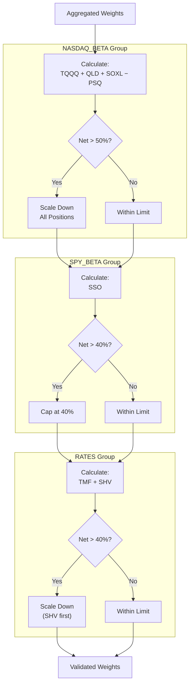

# Section 11: Portfolio Router

*Last Updated: 4 February 2026 (V2.30)*

## 11.1 Purpose and Philosophy

The Portfolio Router is the **central coordination hub** that transforms strategy intentions into executed trades. It ensures all strategies work together harmoniously rather than conflicting.

### 11.1.1 Why Centralized Routing?

Previous system versions had each strategy place orders independently. This caused serious problems:

| Problem | Description | Impact |
|---------|-------------|--------|
| **Wash Sales** | One strategy buys while another sells same symbol | Tax issues, wasted commissions |
| **Beta Stacking** | Multiple strategies all long Nasdaq simultaneously | Excessive concentration risk |
| **Conflicting Positions** | Long TQQQ and short PSQ creating unintended exposure | Unpredictable net exposure |
| **Execution Chaos** | Multiple orders hitting market at same time | Poor fills, confusion |

### 11.1.2 The Router Solution

The Portfolio Router solves these problems by:

| Function | Benefit |
|----------|---------|
| **Collecting all intentions** | See full picture before acting |
| **Netting opposing signals** | Cancel out conflicting requests |
| **Enforcing portfolio limits** | Prevent excessive concentration |
| **Coordinating execution** | Single, orderly set of trades |

### 11.1.3 The TargetWeight Abstraction

Strategies express **intentions**, not orders:

| Strategy Says | Not This |
|---------------|----------|
| "I want 30% in QLD" | "Buy 150 shares of QLD" |
| "I want 0% in TQQQ" | "Sell all TQQQ" |

This abstraction allows the Router to:
- Compare multiple strategy intentions for same symbol
- Calculate net desired exposure
- Determine actual shares needed to reach target

---

## 11.2 Processing Workflow Overview

The Portfolio Router follows a **six-step workflow**:

```
Step 1: COLLECT    → Gather all TargetWeight objects from strategy engines
Step 2: AGGREGATE  → Sum weights by symbol across strategies
Step 3: VALIDATE   → Apply portfolio-level constraints
Step 4: NET        → Compare targets to current positions
Step 5: PRIORITIZE → Separate by urgency (IMMEDIATE vs EOD)
Step 6: EXECUTE    → Pass to Execution Engine
```

---

## 11.3 Step 1: Collect

### 11.3.1 Sources of TargetWeights

Gather all TargetWeight objects from all strategy engines:

| Engine | Typical Weights | Symbols | Urgency |
|--------|-----------------|---------|---------|
| **Trend Engine** | 0-4 weights | QLD (20%), SSO (15%), TNA (12%), FAS (8%) | EOD |
| **Mean Reversion Engine** | 0-2 weights | TQQQ, SOXL | IMMEDIATE |
| **Options Engine** (V2.1) | 0-1 weight | QQQ options | IMMEDIATE |
| **Hedge Engine** | 2 weights | TMF, PSQ | EOD |
| **Yield Sleeve** | 0-1 weight | SHV | EOD |
| **Cold Start Engine** | 0-1 weight | QLD or SSO | IMMEDIATE |

### 11.3.2 TargetWeight Structure

Each TargetWeight includes:

| Field | Type | Description |
|-------|------|-------------|
| `symbol` | String | Instrument ticker |
| `weight` | Float | Desired allocation (0.0 to 1.0) |
| `strategy` | String | Source engine name |
| `urgency` | Enum | IMMEDIATE or EOD |
| `reason` | String | Human-readable explanation |

### 11.3.3 Example Collection

```
Collected TargetWeights at 15:45 ET:

From Trend Engine:
  • TargetWeight(QLD, 0.30, "TREND", EOD, "MA200_ADX_ENTRY")

From Options Engine (V2.1):
  • TargetWeight(QQQ_CALL, 0.20, "OPTIONS", IMMEDIATE, "Entry Score=3.5")

From Hedge Engine:
  • TargetWeight(TMF, 0.10, "HEDGE", EOD, "Regime=38")
  • TargetWeight(PSQ, 0.00, "HEDGE", EOD, "Regime=38")

From Yield Sleeve:
  • TargetWeight(SHV, 0.45, "YIELD", EOD, "Unallocated $45k")

Total: 5 TargetWeights collected
```

---

## 11.4 Step 2: Aggregate

### 11.4.1 Sum Weights by Symbol

Sum weights across all strategies for each symbol:

```
For each symbol:
    Aggregated Weight = Σ (all strategy weights for this symbol)
```

### 11.4.2 Simple Same-Direction Example

```
Collected:
  • Trend wants +30% QLD
  • No other strategy mentions QLD

Aggregated:
  • QLD: 30%
```

### 11.4.3 Opposing Signals Example

```
Collected:
  • Trend wants +40% QLD (entry signal)
  • MeanRev wants -15% QLD (hypothetical exit)

Aggregated:
  • QLD: 40% - 15% = 25%
```

The Router doesn't distinguish between strategies—it just sums to get **net intention**.

### 11.4.4 Full Cancellation Example

```
Collected:
  • Strategy A wants +20% TQQQ
  • Strategy B wants -20% TQQQ

Aggregated:
  • TQQQ: 0%

If currently holding 20% TQQQ → Close position entirely
```

---

## 11.5 Step 3: Validate

Apply portfolio-level constraints to aggregated weights.

### 11.5.1 Validation Checks

| Check | Constraint | Action if Violated |
|-------|------------|-------------------|
| **Group Exposure** | NASDAQ_BETA ≤ 50% net | Scale down proportionally |
| **Single Position** | ≤ 50% (SEED) or 40% (GROWTH) | Cap at limit |
| **Minimum Trade** | ≥ $2,000 position value | Skip trade |

### 11.5.2 Group Exposure Limits

#### Exposure Group Definitions

| Group | Symbols | Max Net Long | Max Net Short | Max Gross |
|-------|---------|:------------:|:-------------:|:---------:|
| **NASDAQ_BETA** | TQQQ, QLD, SOXL, PSQ | 50% | 30% | 75% |
| **SPY_BETA** | SSO | 40% | 0% | 40% |
| **SMALL_CAP_BETA** | TNA | 25% | 0% | 25% |
| **FINANCIALS_BETA** | FAS | 15% | 0% | 15% |
| **RATES** | TMF, SHV | 40% | 0% | 40% |

#### Calculating Group Exposure

```
For NASDAQ_BETA group:
  • Long exposure = Sum of positive weights (TQQQ, QLD, SOXL)
  • Short exposure = Absolute value of inverse (PSQ counts as short)
  • Net = Long - Short
  • Gross = Long + Short
```

#### Scaling When Exceeded

If net long exceeds maximum:

```
Scale Factor = Max Allowed / Current Total
Apply factor to all long positions in group
```

**Example:**
```
NASDAQ_BETA positions:
  • TQQQ: +25%
  • QLD: +35%
  • SOXL: +15%
  • PSQ: 0%

Total Net Long: 75%
Max Net Long: 50%

Scale Factor = 50% / 75% = 0.667

Adjusted:
  • TQQQ: 25% × 0.667 = 16.7%
  • QLD: 35% × 0.667 = 23.3%
  • SOXL: 15% × 0.667 = 10.0%

New Total: 50% (within limit)
```

### 11.5.3 Single Position Limits

Check each symbol against phase-dependent maximum:

| Phase | Max Single Position |
|-------|:-------------------:|
| SEED | 50% |
| GROWTH | 40% |

```
If validated_weight > max_single_position:
    validated_weight = max_single_position
```

### 11.5.4 Minimum Trade Size

If resulting position value is below $2,000, skip the trade:

```
Position Value = Tradeable Equity × Weight

If Position Value < $2,000:
    Skip this trade (not worth commission/spread)
```

---

## 11.6 Step 4: Net Against Current

Compare validated target weights to current portfolio positions.

### 11.6.1 Delta Calculation

For each symbol:

```
Target Value = Tradeable Equity × Target Weight
Current Value = Current Holdings Value
Delta Value = Target Value - Current Value
Delta Shares = Delta Value / Current Price
```

### 11.6.2 Rounding

Round to **whole shares**:

```
If |Delta Shares| < 1:
    No action needed (within rounding tolerance)
```

### 11.6.3 Example Calculation

```
Symbol: QLD
Tradeable Equity: $100,000
Target Weight: 30%
Current Holdings: 200 shares @ $80 = $16,000

Calculations:
  • Target Value: $100,000 × 30% = $30,000
  • Current Value: $16,000
  • Delta Value: $30,000 - $16,000 = +$14,000
  • Current Price: $80
  • Delta Shares: $14,000 / $80 = +175 shares

Action: Buy 175 shares of QLD
```

---

## 11.7 Step 5: Prioritize

Separate orders by urgency.

### 11.7.1 IMMEDIATE Queue

Process right away:

| Signal Type | Source |
|-------------|--------|
| Mean reversion entries | MR Engine |
| Mean reversion exits | MR Engine |
| Stop loss exits | Trend Engine |
| Kill switch liquidations | Risk Engine |
| Panic mode liquidations | Risk Engine |
| Cold start warm entries | Cold Start Engine |

### 11.7.2 EOD Queue

Hold until 15:45 batch processing:

| Signal Type | Source |
|-------------|--------|
| Trend entries | Trend Engine |
| Trend exits (band/regime) | Trend Engine |
| Hedge rebalancing | Hedge Engine |
| Yield sleeve adjustments | Yield Sleeve |

### 11.7.3 Conflict Resolution

If same symbol has both IMMEDIATE and EOD weights:

```
IMMEDIATE takes precedence
```

**Example:**
```
Collected:
  • TargetWeight(TQQQ, 0.15, "MEANREV", IMMEDIATE, "MR Entry")
  • TargetWeight(TQQQ, 0.00, "TREND", EOD, "Some signal")

Resolution:
  • Process IMMEDIATE weight (0.15) now
  • Ignore EOD weight for this symbol
```

---

## 11.8 Step 6: Execute

Pass validated orders to Execution Engine.

### 11.8.1 Order Type Mapping

| Urgency | Order Type | Timing |
|---------|------------|--------|
| IMMEDIATE | Market Order | Execute now |
| EOD | MOO Order | Execute next day open |

### 11.8.2 Order Handoff

```
For each order in queue:
    1. Create order object with:
       - Symbol
       - Quantity (delta shares)
       - Side (Buy/Sell)
       - Order type (Market/MOO)
    2. Pass to Execution Engine
    3. Track order status
```

---

## 11.9 SHV Liquidation Handling

When a new position requires cash, SHV is liquidated first.

### 11.9.1 Cash Sourcing Priority

```
1. Available cash balance
2. Sell SHV (Yield Sleeve) ← First to liquidate
3. Use margin (last resort)
```

### 11.9.2 Automatic Liquidation Process

```
1. Calculate cash needed for new position
2. Check available cash in account
3. If insufficient:
   a. Calculate shortfall
   b. Check SHV holdings (excluding locked portion)
   c. Sell sufficient SHV to cover shortfall
4. Execute the new position
```

### 11.9.3 Example

```
Scenario:
  • Cash needed: $25,000 (for QLD entry)
  • Available cash: $5,000
  • Shortfall: $20,000
  • SHV holdings: $45,000 (of which $10,000 locked)
  • SHV available: $35,000

Action:
  1. Sell $20,000 of SHV
  2. Combined with $5,000 cash = $25,000 available
  3. Execute QLD purchase
  4. Remaining SHV: $25,000
```

---

## 11.10 Capital Firewall: 50/50 Partition (V2.18)

Prior to V2.18, the Trend Engine could consume all available capital, leaving the Options Engine starved (manifesting as `Entries allowed=-1`). V2.18 introduces a **hard capital partition** between the two primary engines.

### 11.10.1 Partition Methods

| Method | Returns | Description |
|--------|---------|-------------|
| `get_trend_capital()` | 50% of total portfolio value | Capital reserved exclusively for Trend Engine |
| `get_options_capital()` | 50% of total portfolio value | Capital reserved exclusively for Options Engine |
| `check_capital_partition(source, order_value)` | `True`/`False` | Validates order fits within its engine's partition |

### 11.10.2 Configuration

| Parameter | Value | Description |
|-----------|:-----:|-------------|
| `CAPITAL_PARTITION_TREND` | 0.50 | 50% reserved for Trend (was 55% pre-V2.18) |
| `CAPITAL_PARTITION_OPTIONS` | 0.50 | 50% reserved for Options (was 25% pre-V2.18) |

### 11.10.3 How It Works

```
When a TREND order arrives:
  1. available = get_trend_capital() - current_trend_holdings
  2. If order_value > available → PARTITION_BLOCK (order rejected)

When an OPTIONS order arrives:
  1. available = get_options_capital() - reserved_spread_margin
  2. If order_value > available → PARTITION_BLOCK (order rejected)
```

The partition is **hard** -- one engine cannot borrow from the other's allocation.

---

## 11.11 Leverage Cap and Margin Pre-Check (V2.18)

V2.18 also introduces two margin safeguards to prevent the 196% margin overflow observed when all four Trend tickers (QLD, SSO, TNA, FAS) were fully allocated simultaneously.

### 11.11.1 Leverage Cap (90%)

The `check_leverage_cap()` method blocks new entries if projected margin usage would exceed 90% of equity.

| Parameter | Value | Description |
|-----------|:-----:|-------------|
| `MAX_MARGIN_WEIGHTED_ALLOCATION` | 0.90 | Block entries if margin > 90% of equity |

```
check_leverage_cap(projected_margin_pct):
  If projected_margin_pct > 0.90:
    → LEVERAGE_CAP: Blocked | log projected vs max
    → Return False (entry blocked)
  Else:
    → Return True (entry allowed)
```

### 11.11.2 Margin Pre-Check

The `verify_margin_available()` method verifies sufficient margin exists **before** order submission, with a 20% buffer. This prevents `INSUFFICIENT_MARGIN` broker rejections.

```
verify_margin_available(order_value):
  required_with_buffer = order_value * 1.20
  If required_with_buffer > Portfolio.MarginRemaining:
    → MARGIN_PRECHECK_FAIL (order blocked)
  Else:
    → Proceed with order
```

---

## 11.12 Options Price Discovery Chain (V2.19)

Options contracts frequently lack a price in the standard `current_prices` dictionary because they are not equity symbols. V2.19 introduces a **3-layer fallback chain** to resolve prices before order sizing.

### 11.12.1 The Three Layers

| Layer | Source | When It Fires | Introduced |
|-------|--------|---------------|:----------:|
| **Layer 1** | `current_prices[symbol]` | Portfolio holdings (existing positions) | Original |
| **Layer 2** | `metadata['contract_price']` | Options Engine chain data, injected via `main.py` | V2.19 |
| **Layer 3** | Bid/Ask mid-price from `Securities[symbol]` | `_try_bid_ask_mid_price()` lookup | V2.24.1 |

### 11.12.2 Fallback Logic

```
For each aggregated symbol:
  1. Check current_prices[symbol]
     → If valid (> 0): use it (Layer 1)

  2. Check agg.metadata['contract_price']
     → If valid (> 0): inject into current_prices, log PRICE_INJECT (Layer 2)

  3. Call _try_bid_ask_mid_price(symbol)
     → Search Securities for matching symbol
     → If Bid > 0 and Ask > 0: use (Bid + Ask) / 2, log BIDASK_INJECT (Layer 3)

  4. If all layers fail:
     → Log "ROUTER: SKIP | {symbol} | No price available"
     → Skip this symbol entirely
```

### 11.12.3 Known Issues

- **V2.24.2 fix**: A `TypeError` in `self.Log()` was crashing the router before Layer 2 could execute. The string formatting error prevented the metadata fallback from ever firing, causing all options entries to be skipped with "No price available".

---

## 11.13 Limit Order Execution for Options (V2.19)

V2.19 replaces market orders with **marketable limit orders** for all options trades, providing slippage protection and bad-tick rejection.

### 11.13.1 Spread Validation

`validate_options_spread()` checks both legs of a spread before execution:

| Check | Condition | Action |
|-------|-----------|--------|
| **Bad tick** | Bid or Ask <= 0 on either leg | Block: `BAD_TICK` |
| **Illiquidity** | Spread width > 20% of mid-price | Block: `ILLIQUID` |
| **Inverted pricing** | Short Bid > Long Ask on debit spread | Block: `BAD_TICK_GUARD` |

### 11.13.2 Limit Price Calculation

`calculate_limit_price()` computes the limit price with slippage tolerance:

| Direction | Formula | Rationale |
|-----------|---------|-----------|
| **BUY** | Ask + (Spread * 5%) | Willing to pay slightly above Ask for fill |
| **SELL** | Bid - (Spread * 5%) | Willing to accept slightly below Bid for fill |

The price is never allowed to go negative (floor of $0.01 for sells).

### 11.13.3 Unified Execution

`execute_options_limit_order()` is the single entry point for all options orders:

```
execute_options_limit_order(symbol, quantity, reason):
  1. If OPTIONS_USE_LIMIT_ORDERS is False → fall back to MarketOrder
  2. Calculate limit price via calculate_limit_price()
  3. If limit_price is None (blocked by validation) → reject order
  4. Submit LimitOrder(symbol, quantity, limit_price)
```

### 11.13.4 Configuration

| Parameter | Value | Description |
|-----------|:-----:|-------------|
| `OPTIONS_USE_LIMIT_ORDERS` | `True` | Enable limit orders for options |
| `OPTIONS_LIMIT_SLIPPAGE_PCT` | 0.05 | 5% of spread as slippage tolerance |
| `OPTIONS_MAX_SPREAD_PCT` | 0.20 | Block if bid-ask spread > 20% of mid |

---

## 11.14 Atomic Spread Close (V2.17-BT)

`execute_spread_close()` is the **single exit point** for all spread positions. It uses a retry-then-fallback strategy to ensure spread legs are closed together.

### 11.14.1 Close Strategy

```
execute_spread_close(spread, reason, is_emergency):
  1. Mark spread.is_closing = True (prevent duplicate signals)
  2. Unless is_emergency:
     → Attempt ComboMarketOrder (up to 3 retries)
     → If success: unregister margin, return True
  3. Sequential fallback:
     → Buy back SHORT leg first (reduce margin exposure)
     → Sell LONG leg second
  4. If all attempts fail:
     → Clear is_closing lock (allow retry on next cycle)
     → Return False
```

### 11.14.2 Why Short First?

The sequential fallback closes the **short leg first** because buying back the short option reduces margin requirement, making it safer to then sell the long leg. Closing the long leg first could temporarily increase margin exposure.

### 11.14.3 Configuration

| Parameter | Value | Description |
|-----------|:-----:|-------------|
| `COMBO_ORDER_MAX_RETRIES` | 3 | Max attempts for atomic ComboMarketOrder |
| `SPREAD_LOCK_CLEAR_ON_FAILURE` | `True` | Clear `is_closing` flag if all attempts fail |

---

## 11.15 Ghost Margin Fix (V2.18.2)

### 11.15.1 The Problem

When `clear_spread_position()` is called (e.g., during margin circuit breaker liquidation), it clears the Options Engine's state but does **not** clear the router's `_open_spread_margin` tracking. This leaves "ghost" margin reservations that block all future options trades because the router thinks margin is still consumed.

### 11.15.2 The Fix

`clear_all_spread_margins()` clears **all** router margin reservations when a spread position is force-cleared:

```
clear_all_spread_margins():
  If _open_spread_margin has entries:
    → Log count and total freed amount
    → Clear entire _open_spread_margin dict
```

This is called during margin circuit breaker events and kill switch liquidation to ensure the router's margin state stays in sync with actual positions.

---

## 11.16 Leverage-Adjusted Allocation (V2.3.24)

### 11.16.1 The Problem

A 20% allocation to a 2x ETF (QLD) consumes 40% of margin. A 12% allocation to a 3x ETF (TNA) consumes 36% of margin. Source allocation limits based on **weight alone** undercount actual margin consumption, potentially starving the Options Engine.

### 11.16.2 Margin-Weighted Enforcement

`_enforce_source_limits()` now calculates **margin-weighted allocation** for non-options sources:

```
For each non-options weight:
  margin_weighted = target_weight * SYMBOL_LEVERAGE[symbol]

Total margin-weighted = Sum of all non-options margin-weighted allocations
Max allowed = 1.0 - RESERVED_OPTIONS_PCT (75%)

If total margin-weighted > 75%:
  Scale all non-options weights by (75% / total_margin_weighted)
```

### 11.16.3 SYMBOL_LEVERAGE Reference

| Symbol | Leverage | Margin per 10% Allocation |
|--------|:--------:|:-------------------------:|
| QLD | 2.0x | 20% |
| SSO | 2.0x | 20% |
| TNA | 3.0x | 30% |
| FAS | 3.0x | 30% |
| TQQQ | 3.0x | 30% |
| SOXL | 3.0x | 30% |
| TMF | 3.0x | 30% |
| PSQ | 1.0x | 10% |

### 11.16.4 Contract Scaling for Spreads

When margin checks indicate a full spread position would exceed limits, the router scales the number of contracts down to fit available margin, with a minimum of 2 contracts. If even 2 contracts would exceed margin, the trade is skipped entirely.

| Parameter | Value | Description |
|-----------|:-----:|-------------|
| `MIN_SPREAD_CONTRACTS` | 2 | Minimum contracts for a scaled spread |

---

## 11.17 Mermaid Diagram: Six-Step Workflow (Original)

```mermaid
flowchart TD
    subgraph STEP1["Step 1: COLLECT"]
        TREND["Trend Engine"]
        MR["Mean Reversion Engine"]
        HEDGE["Hedge Engine"]
        YIELD["Yield Sleeve"]
        COLD["Cold Start Engine"]
        COLLECT["Collect All<br/>TargetWeights"]
    end
    
    subgraph STEP2["Step 2: AGGREGATE"]
        AGG["Sum Weights<br/>by Symbol"]
    end
    
    subgraph STEP3["Step 3: VALIDATE"]
        GROUP["Check Group<br/>Exposure Limits"]
        SINGLE["Check Single<br/>Position Limits"]
        MIN["Check Minimum<br/>Trade Size"]
    end
    
    subgraph STEP4["Step 4: NET"]
        CURRENT["Get Current<br/>Positions"]
        DELTA["Calculate<br/>Delta Shares"]
    end
    
    subgraph STEP5["Step 5: PRIORITIZE"]
        IMM["IMMEDIATE<br/>Queue"]
        EOD["EOD<br/>Queue"]
    end
    
    subgraph STEP6["Step 6: EXECUTE"]
        MKT["Market Orders<br/>(Immediate)"]
        MOO["MOO Orders<br/>(Next Day)"]
        EXEC["Execution<br/>Engine"]
    end
    
    TREND --> COLLECT
    MR --> COLLECT
    HEDGE --> COLLECT
    YIELD --> COLLECT
    COLD --> COLLECT
    
    COLLECT --> AGG
    AGG --> GROUP
    GROUP --> SINGLE
    SINGLE --> MIN
    MIN --> CURRENT
    CURRENT --> DELTA
    
    DELTA --> IMM
    DELTA --> EOD
    
    IMM --> MKT
    EOD --> MOO
    MKT --> EXEC
    MOO --> EXEC
```



---

## 11.18 Mermaid Diagram: Exposure Group Validation



---

## 11.19 Netting Examples

### Example 1: Multiple Strategies, Same Direction

```
Input:
  • Trend: QLD +30%
  • Cold Start: QLD +0% (no signal)
  • Hedge: QLD +0% (no signal)

Aggregated: QLD = 30%
Action: Target 30% QLD
```

### Example 2: Strategies with Opposing Views

```
Input:
  • Trend: QLD +40% (entry signal)
  • Hypothetical Exit: QLD -10%

Aggregated: QLD = 30%
Action: Target 30% QLD (net of both views)
```

### Example 3: Hedge Offsetting Long

```
Input:
  • Trend: QLD +35%
  • Hedge: PSQ +10% (inverse = -10% effective)

NASDAQ_BETA Exposure:
  • Gross: 35% + 10% = 45%
  • Net: 35% - 10% = 25%

Both within limits (Gross < 75%, Net < 50%)
```

### Example 4: Over-Concentration Requiring Scaling

```
Input:
  • Trend: QLD +35%
  • MR: TQQQ +25%
  • Cold Start: SSO +0%

NASDAQ_BETA (QLD + TQQQ):
  • Total: 60%
  • Limit: 50%
  • Scale: 50/60 = 0.833

Adjusted:
  • QLD: 35% × 0.833 = 29.2%
  • TQQQ: 25% × 0.833 = 20.8%
  • Total: 50% (within limit)
```

---

## 11.20 Error Handling

### 11.20.1 Invalid Symbols

```
If TargetWeight references unknown symbol:
    → Log error
    → Skip this weight
    → Continue processing others
```

### 11.20.2 Conflicting Urgencies

```
If same symbol has both IMMEDIATE and EOD:
    → IMMEDIATE takes precedence
    → Log the conflict
```

### 11.20.3 Insufficient Liquidity

```
If position sizing exceeds available capital (including margin):
    → Scale down to available amount
    → Log the reduction
    → Execute reduced position
```

### 11.20.4 Negative Weights

```
If aggregated weight < 0 for a long-only symbol:
    → Treat as 0 (no position)
    → Sell any existing holdings
```

---

## 11.21 Integration with Other Engines

### Inputs from Other Engines

| Source | Data | Purpose |
|--------|------|---------|
| **All Strategy Engines** | TargetWeight objects | Aggregation input |
| **Capital Engine** | `tradeable_equity` | Position sizing |
| **Capital Engine** | `max_single_position_pct` | Validation |
| **Capital Engine** | `locked_amount` | SHV liquidation protection |
| **Risk Engine** | Kill switch / panic mode status | Override processing |

### Outputs to Other Engines

| Destination | Data | Purpose |
|-------------|------|---------|
| **Execution Engine** | Order objects | Trade execution |

### Authority in System Hierarchy

The Portfolio Router sits at **Level 5-6** in the authority hierarchy:

```
Level 1: Operational Safety
Level 2: Circuit Breakers ← Can override Router
Level 3: Regime Constraints ← Can block signals
Level 4: Capital Constraints ← Router enforces
Level 5: Strategy Signals ← Router processes
Level 6: Execution Preferences ← Router decides
```

---

## 11.22 Parameter Reference

### Exposure Group Limits

| Group | Max Net Long | Max Net Short | Max Gross | Notes |
|-------|:------------:|:-------------:|:---------:|-------|
| NASDAQ_BETA | 50% | 30% | 75% | |
| SPY_BETA | 40% | 0% | 40% | |
| SMALL_CAP_BETA | 25% | 0% | 25% | |
| FINANCIALS_BETA | 15% | 0% | 15% | |
| RATES | 40% | 0% | 40% | TMF only (config) |

> **Note (V2.3.17):** The YIELD source allocation limit was raised to 99% to allow SHV to absorb idle cash post-kill-switch. See `SOURCE_ALLOCATION_LIMITS` in `portfolio_router.py`.

### Position Limits

| Phase | Max Single Position |
|-------|:-------------------:|
| SEED | 50% |
| GROWTH | 40% |

### Trade Thresholds

| Parameter | Value |
|-----------|:-----:|
| Minimum trade size | $2,000 |
| Minimum share delta | 1 share |

### Capital Partition (V2.18)

| Parameter | Value | Config Key |
|-----------|:-----:|------------|
| Trend capital partition | 50% | `CAPITAL_PARTITION_TREND` |
| Options capital partition | 50% | `CAPITAL_PARTITION_OPTIONS` |

### Margin Safeguards (V2.18)

| Parameter | Value | Config Key |
|-----------|:-----:|------------|
| Max margin-weighted allocation | 90% | `MAX_MARGIN_WEIGHTED_ALLOCATION` |
| Margin pre-check buffer | 1.20x | `MARGIN_PRE_CHECK_BUFFER` |

### Options Execution (V2.19)

| Parameter | Value | Config Key |
|-----------|:-----:|------------|
| Use limit orders | `True` | `OPTIONS_USE_LIMIT_ORDERS` |
| Limit order slippage | 5% of spread | `OPTIONS_LIMIT_SLIPPAGE_PCT` |
| Max bid-ask spread | 20% of mid | `OPTIONS_MAX_SPREAD_PCT` |
| Combo order max retries | 3 | `COMBO_ORDER_MAX_RETRIES` |
| Min spread contracts | 2 | `MIN_SPREAD_CONTRACTS` |

### Source Allocation Limits

| Source | Max Allocation | Notes |
|--------|:--------------:|-------|
| TREND | 55% | `config.TREND_TOTAL_ALLOCATION` |
| OPT | 30% | `config.OPTIONS_ALLOCATION_MAX` |
| OPT_INTRADAY | 5% | Intraday "Sniper" mode |
| MR | 10% | `config.MR_TOTAL_ALLOCATION` |
| HEDGE | 30% | TMF 20% + PSQ 10% |
| COLD_START | 35% | Subset of TREND |
| YIELD | 99% | V2.3.17: allows near-full SHV |
| RISK | 100% | Emergency liquidations |
| ROUTER | 100% | No limit |

---

## 11.23 Processing Timeline

### Intraday Processing (IMMEDIATE)

```
Every minute during market hours:
  1. Check for IMMEDIATE TargetWeights
  2. If found:
     a. Aggregate (typically just one signal)
     b. Validate
     c. Net against current
     d. Execute immediately
```

### End of Day Processing (EOD)

```
At 15:45 ET:
  1. Collect all EOD TargetWeights
  2. Aggregate all by symbol
  3. Validate against all limits
  4. Net against current positions
  5. Calculate SHV liquidation if needed
  6. Submit MOO orders for next day
```

---

## 11.24 Key Design Decisions Summary

| Decision | Rationale | Version |
|----------|-----------|:-------:|
| **Centralized coordination** | Prevents strategy conflicts, wash sales, beta stacking | V1 |
| **TargetWeight abstraction** | Strategies express intent, Router decides execution | V1 |
| **Aggregate then validate** | See full picture before applying constraints | V1 |
| **Static exposure groups** | Simpler than rolling correlation matrices | V1 |
| **IMMEDIATE vs EOD urgency** | Time-sensitive signals execute immediately | V1 |
| **SHV liquidation priority** | Lowest-priority holding funds higher-priority trades | V1 |
| **Proportional scaling** | Fair reduction when limits exceeded | V1 |
| **$2,000 minimum trade** | Avoids inefficient small trades | V1 |
| **MOO for EOD signals** | Reliable execution at next open | V1 |
| **50/50 capital partition** | Hard firewall prevents engine capital starvation | V2.18 |
| **90% leverage cap** | Prevents margin overflow from concentrated leveraged ETF positions | V2.18 |
| **Margin pre-check with 20% buffer** | Prevents broker INSUFFICIENT_MARGIN rejections | V2.18 |
| **3-layer options price discovery** | Ensures options orders are not skipped due to missing prices | V2.19 |
| **Limit orders for options** | Slippage protection + bad-tick rejection for illiquid options | V2.19 |
| **Atomic spread close with fallback** | Combo order first, then sequential (short-first) if needed | V2.17-BT |
| **Ghost margin cleanup** | Keeps router margin state in sync after force-clear events | V2.18.2 |
| **Leverage-adjusted source limits** | Accounts for 2x/3x ETF margin consumption, not just allocation weight | V2.3.24 |
| **Ghost spread state reconciliation** | Multi-layer cleanup prevents orphaned margin reservations and stale pending state | V2.29 |

---

## 11.25 Ghost Spread State Management (V2.29)

### 11.25.1 Problem

When spread positions are closed (both legs filled), the options engine's internal `_spread_position` state was not being cleared, creating a "ghost" state. This ghost state:
- Generated continuous `SPREAD_EXIT_WARNING` logs (43,291 in 2015 backtest)
- May have blocked new spread entries
- Consumed log bandwidth causing truncation

### 11.25.2 Reconciliation Layers

The Portfolio Router participates in ghost spread cleanup via `clear_all_spread_margins()`:

| Layer | Trigger | Router Action |
|:-----:|---------|---------------|
| A | Both spread legs fill | `clear_all_spread_margins()` |
| B | Portfolio check (no legs held) | `clear_all_spread_margins()` |
| C | Friday firewall | `clear_all_spread_margins()` |

### 11.25.3 State Cleanup in Liquidation

All liquidation paths (`_liquidate_all_spread_aware`) now call:
1. `options_engine.cancel_pending_spread_entry()`
2. `options_engine.cancel_pending_intraday_entry()`
3. `portfolio_router.clear_all_spread_margins()`

This ensures no orphaned margin reservations or pending entry state survives a governor shutdown or kill switch.

---

*Next Section: [12 - Risk Engine](12-risk-engine.md)*

*Previous Section: [10 - Yield Sleeve](10-yield-sleeve.md)*
