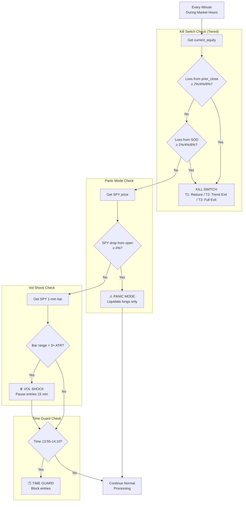
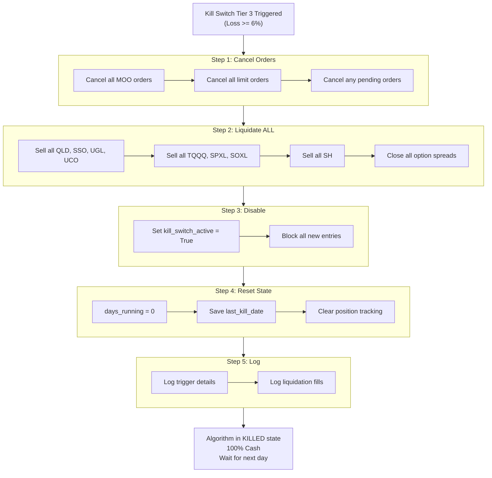

# Section 12: Risk Engine

## 12.1 Purpose and Philosophy

The Risk Engine implements all **circuit breakers and safeguards**. Its job is to prevent catastrophic losses and ensure the system survives adverse conditions.

### 12.1.1 Defense in Depth

Multiple layers of protection address different risk scenarios:

**V2.1 Circuit Breaker System (5 Levels - Graduated Responses):**

| Level | Trigger | Action | Reset |
|:-----:|---------|--------|-------|
| 1 | Daily loss -2% | Reduce sizing 50% | Daily reset |
| 2 | Weekly loss -5% | Reduce sizing 50% | Monday open |
| 3 | Portfolio vol > 1.5% | Block new entries | Auto when vol drops |
| 4 | Correlation > 0.60 | Reduce exposure 50% | Auto when corr drops |
| 5 | Greeks breach | Close options | Auto when within limits |

**V1 Safeguards (Still Active):**

| Safeguard | Threat Addressed |
|-----------|------------------|
| **Kill Switch** | Single-day catastrophic loss (Tiered: -2%/-4%/-6%) |
| **Panic Mode** | Flash crash / market meltdown (SPY -4%) |
| **Gap Filter** | Gap-down morning weakness (-1.5%) |
| **Vol Shock** | Extreme short-term volatility (3× ATR) |
| **Time Guard** | Fed announcement volatility (13:55-14:10) |
| **Split Guard** | Corporate action data errors |

Some safeguards will never trigger in normal conditions, but they're ready if needed.

### 12.1.2 Automatic Response

Risk events trigger **automatic responses**—no manual intervention required:

| Property | Value |
|----------|-------|
| Human judgment | Not required during crisis |
| Response time | Immediate (within 1 minute) |
| Consistency | Same response every time |
| Emotion | None (rules-based) |

The system doesn't hesitate or second-guess during crisis; it acts immediately according to predefined rules.

### 12.1.3 Authority Level

The Risk Engine operates at **Level 2** in the authority hierarchy—second only to operational safety:

```
Level 1: Operational Safety (broker, data, halts)
Level 2: CIRCUIT BREAKERS ← Risk Engine
Level 3: Regime Constraints
Level 4: Capital Constraints
Level 5: Strategy Signals
Level 6: Execution Preferences
```

Risk Engine decisions **override** all strategy signals and portfolio allocations.

---

## 12.2 Kill Switch (V2.28.1 Tiered System)

> **V2.28.1 Update:** Kill switch now uses a 3-tier graduated response system instead of a single threshold. This prevents over-liquidation on moderate losses while still protecting against catastrophic drawdowns.

### 12.2.1 Purpose

Prevent a single bad day from causing irreparable damage.

| Loss Level | Recovery Needed | Assessment |
|-----------:|:---------------:|------------|
| 2% | 2.0% | Minor setback |
| 4% | 4.2% | Significant concern |
| 6% | 6.4% | Major damage |
| 10% | 11.1% | Devastating |

**The tiered kill switch provides graduated responses to prevent over-liquidation.**

### 12.2.2 V2.28.1 Three-Tier Kill Switch

| Tier | Loss Threshold | Action | Assets Affected |
|:----:|:--------------:|--------|-----------------|
| **Tier 1** | -2% | REDUCE | Halve trend positions, block new options |
| **Tier 2** | -4% | TREND_EXIT | Liquidate trend positions, keep spreads |
| **Tier 3** | -6% | FULL_EXIT | Liquidate everything |

#### Tier 1: REDUCE (-2% Loss)
- Reduce trend allocation by 50%
- Block new option entries
- Keep existing spreads running
- Allow existing positions to reach targets

#### Tier 2: TREND_EXIT (-4% Loss)
- Liquidate all trend positions (QLD, SSO, UGL, UCO)
- Keep existing option spreads (they have defined risk)
- Block all new equity entries

#### Tier 3: FULL_EXIT (-6% Loss)
- Liquidate ALL positions including spreads
- Go to 100% cash
- Reset cold start

### 12.2.3 Baseline Measurement

The kill switch uses **two baselines** to catch different scenarios:

#### Baseline 1: `equity_prior_close`

| Property | Value |
|----------|-------|
| Set at | 09:25 AM (before market open) |
| Value | Portfolio value at previous day's close |
| Purpose | Catches **gap-down scenarios** |

If the portfolio gaps down 6%+ on open, Tier 3 triggers immediately at 09:30.

#### Baseline 2: `equity_sod` (Start of Day)

| Property | Value |
|----------|-------|
| Set at | 09:33 AM (after MOO fills) |
| Value | Portfolio value after opening auction |
| Purpose | Catches **intraday crashes** |

If MOO fills moved the portfolio significantly, we measure subsequent losses from the post-fill level.

### 12.2.4 Trigger Condition

Each tier triggers if loss from **EITHER baseline** exceeds its threshold:

```
TIER 1 if: loss >= 0.02 (2%)
TIER 2 if: loss >= 0.04 (4%)
TIER 3 if: loss >= 0.06 (6%)

Where loss = max(
    (equity_prior_close - current_equity) / equity_prior_close,
    (equity_sod - current_equity) / equity_sod
)
```

### 12.2.5 Legacy Single-Threshold Mode

When `KS_GRADUATED_ENABLED = False`, the system falls back to the legacy single-threshold mode:

| Parameter | Value |
|-----------|-------|
| `KILL_SWITCH_PCT` | 5% |

This triggers full liquidation at 5% daily loss.

### 12.2.6 Actions by Tier

**Tier 1 Actions (REDUCE):**

| Step | Action | Details |
|:----:|--------|---------|
| 1 | Reduce trend positions | Sell 50% of trend holdings |
| 2 | Block new options | No new spread entries |
| 3 | Keep existing spreads | Let them run to target/stop |
| 4 | Log warning | Alert about reduced mode |

**Tier 2 Actions (TREND_EXIT):**

| Step | Action | Details |
|:----:|--------|---------|
| 1 | Liquidate trend | Sell all QLD, SSO, UGL, UCO |
| 2 | Keep spreads | Existing spreads have defined risk |
| 3 | Block all equities | No new equity entries |
| 4 | Log details | Full tier 2 trigger information |

**Tier 3 Actions (FULL_EXIT):**

| Step | Action | Details |
|:----:|--------|---------|
| 1 | Cancel all pending orders | MOO orders, limit orders, any outstanding |
| 2 | Liquidate ALL positions | Longs, hedges, yield, spreads—everything |
| 3 | Disable new entries | For remainder of day |
| 4 | Reset `days_running` to 0 | Triggers new cold start period |
| 5 | Save kill date | To persistent storage |
| 6 | Log details | Full information about trigger |

### 12.2.7 Liquidation Details (Tier 3)

**ALL positions are liquidated via market orders:**

| Position Type | Action |
|---------------|--------|
| Trend (QLD, SSO, UGL, UCO) | Sell all |
| Mean Reversion (TQQQ, SPXL, SOXL) | Sell all |
| Hedges (SH) | Sell all |
| Option Spreads | Close all |

**Nothing is spared.** The goal is to go to 100% cash immediately.

### 12.2.6 Recovery

The algorithm remains in "killed" state until the next trading day:

| Behavior | Description |
|----------|-------------|
| New positions | ❌ Blocked for remainder of day |
| Final state | 100% cash after liquidation fills |
| Next day | Algorithm starts fresh in cold start mode |
| `days_running` | Reset to 0 (new 5-day cold start) |

### 12.2.7 Example Scenario

```
09:25 AM: equity_prior_close = $52,000
09:33 AM: equity_sod = $51,500 (after MOO fills)

10:42 AM: current_equity = $50,920
  Loss = ($52,000 - $50,920) / $52,000 = 2.08%
  2.08% >= 2% → TIER 1 TRIGGERED (REDUCE)
  Actions: Halve trend positions, block new options

11:30 AM: current_equity = $49,920
  Loss = ($52,000 - $49,920) / $52,000 = 4.00%
  4.00% >= 4% → TIER 2 TRIGGERED (TREND_EXIT)
  Actions: Liquidate all trend (QLD, SSO, UGL, UCO), keep spreads

13:15 AM: current_equity = $48,880
  Loss = ($52,000 - $48,880) / $52,000 = 6.00%
  6.00% >= 6% → TIER 3 TRIGGERED (FULL_EXIT)
  Actions:
    1. Cancel pending orders
    2. Liquidate ALL: QLD, SSO, UGL, UCO, TQQQ, SPXL, SOXL, SH, spreads
    3. Disable entries
    4. days_running = 0
    5. Save: last_kill_date = "2024-01-15"
```

---

## 12.3 Panic Mode (SPY −4% Intraday)

### 12.3.1 Purpose

Respond to **flash crash events** where the broader market is in freefall. Different from kill switch—panic mode is about **market conditions**, not portfolio performance.

### 12.3.2 Trigger Condition

SPY intraday decline exceeds 4% from today's opening price:

```
TRIGGER when:
    (SPY_open - SPY_current) / SPY_open >= 0.04
```

### 12.3.3 Actions on Trigger

| Action | Positions Affected |
|--------|-------------------|
| **Liquidate** | All leveraged longs (TQQQ, SPXL, QLD, SSO, UGL, UCO, SOXL) |
| **KEEP** | Hedge positions (SH) |
| **Disable** | New long entries for remainder of day |

### 12.3.4 Why Keep Hedges?

During a crash, hedges are **doing their job**:

| Instrument | Behavior During Crash |
|------------|----------------------|
| SH | Rising (inverse of falling S&P) |

Liquidating hedges during the crash would **remove protection** exactly when it's needed most.

### 12.3.5 Difference from Kill Switch

| Aspect | Kill Switch (Tier 3) | Panic Mode |
|--------|-------------|------------|
| Trigger | Portfolio loss (−6%) | Market drop (SPY −4%) |
| Liquidates | EVERYTHING | Only leveraged longs |
| Hedges | Sold | **Kept** |
| Reset cold start | Yes (Tier 3 only) | No |

### 12.3.6 Example Scenario

```
09:30 AM: SPY opens at $450.00
11:15 AM: SPY drops to $431.50

Check:
  Drop = ($450.00 - $431.50) / $450.00 = 4.11%
  4.11% >= 4% → PANIC MODE TRIGGERED

Actions:
  1. Liquidate QLD position (market sell)
  2. Liquidate SSO position (market sell)
  3. Liquidate UGL position (market sell)
  4. Liquidate UCO position (market sell)
  5. Liquidate TQQQ position (market sell)
  6. Liquidate SPXL position (market sell)
  7. Liquidate SOXL position (market sell)
  8. KEEP SH position (hedge working - inverse S&P rising)
  9. Block new long entries

Result:
  Portfolio is now: SH + Cash
  Hedge continues to provide protection
```

---

## 12.4 Weekly Circuit Breaker (−5% WTD)

### 12.4.1 Purpose

Prevent prolonged bleeding from destroying the account. A string of small daily losses can accumulate into large drawdowns.

### 12.4.2 Tracking

| Property | Value |
|----------|-------|
| Baseline set | Monday market open |
| Baseline value | `week_start_equity` |
| Comparison | Throughout the week |

### 12.4.3 Trigger Condition

Week-to-date loss exceeds 5%:

```
TRIGGER when:
    (week_start_equity - current_equity) / week_start_equity >= 0.05
```

### 12.4.4 Actions on Trigger

**Reduce all position sizes by 50%** for the remainder of the week:

| Aspect | Normal | Weekly Breaker Active |
|--------|:------:|:---------------------:|
| New entry sizing | 100% | 50% |
| Existing positions | Unchanged | Unchanged |
| Strategy signals | Active | Active (reduced size) |

**Does NOT force liquidation** of existing positions—only reduces new exposure.

### 12.4.5 Reset

The weekly breaker resets automatically at **Monday open**:

```
Monday 09:30 AM:
  1. Set week_start_equity = current portfolio value
  2. Clear weekly_breaker_triggered flag
  3. Return to normal (100%) sizing
```

### 12.4.6 Example Scenario

```
Monday open: week_start_equity = $100,000

Monday close: $98,000 (−2%)
Tuesday close: $96,500 (−3.5% WTD)
Wednesday 11:00 AM: $94,800 (−5.2% WTD)

WEEKLY BREAKER TRIGGERED

Wednesday-Friday:
  All new positions sized at 50% of normal
  Example: Trend signal would normally be $30k → Now $15k

Next Monday:
  Reset, back to normal sizing
```

---

## 12.5 Gap Filter (−1.5%)

### 12.5.1 Purpose

Avoid entering new positions on days that start poorly. A gap-down morning often continues lower.

### 12.5.2 Trigger Condition

SPY opens 1.5% or more below prior day's close:

```
TRIGGER when:
    (SPY_prior_close - SPY_open) / SPY_prior_close >= 0.015
```

Checked **once at 09:33 AM** after open.

### 12.5.3 Actions on Trigger

**Block intraday entries only:**

| Activity | Status |
|----------|:------:|
| Mean reversion entries | ❌ BLOCKED |
| Cold start warm entry | ❌ BLOCKED |
| Swing entries (MOO already submitted) | ✅ ALLOWED |
| All exits | ✅ ALLOWED |
| Hedge adjustments | ✅ ALLOWED |

### 12.5.4 Duration

Gap filter applies for **entire trading day**. Resets automatically next day.

### 12.5.5 Rationale

| Gap Down Size | Implication |
|:-------------:|-------------|
| < 1% | Normal overnight movement |
| 1% – 1.5% | Notable but not alarming |
| **≥ 1.5%** | Significant weakness, likely to continue |

On gap-down days, mean reversion "buy the dip" signals are **less reliable**—the dip may keep dipping.

---

## 12.6 Vol Shock (3× ATR)

### 12.6.1 Purpose

Pause during extreme short-term volatility. When a single 1-minute bar has an enormous range, something unusual is happening—wait for clarity.

### 12.6.2 Trigger Condition

SPY 1-minute bar range exceeds 3× the 14-period ATR on 1-minute bars:

```
TRIGGER when:
    (Bar_High - Bar_Low) > 3 × ATR(14, 1-minute)
```

### 12.6.3 Actions on Trigger

**Pause new entries for 15 minutes:**

| Activity | Status |
|----------|:------:|
| Mean reversion entries | ⏸️ PAUSED (15 min) |
| Trend entries | ⏸️ PAUSED (15 min) |
| All exits | ✅ CONTINUE |
| Stop loss monitoring | ✅ CONTINUE |

**Capital preservation never pauses.**

### 12.6.4 Duration

**15 minutes from trigger time.** After 15 minutes, normal entry activity resumes.

### 12.6.5 Example

```
11:23 AM: SPY 1-minute bar
  High: $448.50
  Low: $446.00
  Range: $2.50
  
  14-period ATR (1-min): $0.75
  Threshold: 3 × $0.75 = $2.25
  
  $2.50 > $2.25 → VOL SHOCK TRIGGERED

11:23 - 11:38 AM:
  New entries blocked
  Exits continue normally
  
11:38 AM:
  Vol shock expires
  Normal operations resume
```

---

## 12.7 Time Guard (13:55 – 14:10 ET)

### 12.7.1 Purpose

Avoid entering positions during the typical **Fed announcement window**. FOMC announcements are at 2:00 PM ET; this buffer protects against volatility around that time.

### 12.7.2 Scope

Applies **every trading day**, not just Fed days:

| Reason | Benefit |
|--------|---------|
| Simpler implementation | No Fed calendar required |
| Minimal opportunity cost | Only 15 minutes |
| Protects against other events | Other 2 PM announcements |

### 12.7.3 Actions During Guard

| Activity | Status |
|----------|:------:|
| All entry signals | ❌ IGNORED |
| Exits | ✅ CONTINUE |
| Stop monitoring | ✅ CONTINUE |

### 12.7.4 Duration

**13:55 to 14:10 ET** each trading day. Automatic activation and deactivation.

```
13:54:59 → Normal operations
13:55:00 → Time guard ACTIVE (entries blocked)
14:09:59 → Time guard ACTIVE
14:10:00 → Normal operations resume
```

---

## 12.8 Split Guard

### 12.8.1 Purpose

Avoid trading symbols experiencing **corporate actions**. Stock splits can cause apparent large price moves that aren't real trading opportunities.

### 12.8.2 Detection

Check incoming data for split events. The QuantConnect data provider flags these in the data stream.

### 12.8.3 Actions on Detection

**Freeze trading on affected symbol for the day:**

| Activity | Status |
|----------|:------:|
| New entries | ❌ BLOCKED |
| Exits | ❌ BLOCKED (let split adjust) |
| Scanning | ⏭️ SKIP this symbol |

### 12.8.4 Duration

Remainder of trading day. Next day, normal trading resumes with split-adjusted prices.

### 12.8.5 Rationale

| Problem | Impact |
|---------|--------|
| 2:1 split | Price appears to drop 50% |
| Indicators | Bollinger Bands, ATR corrupted |
| Stop levels | Invalid until recalculated |

Better to skip one day than to trade on corrupted data.

---

## 12.9 Safeguard Summary Table

| Safeguard | Trigger | Action | Duration | Resets |
|-----------|---------|--------|----------|--------|
| **Kill Switch (Tiered)** | T1: -2%, T2: -4%, T3: -6% daily | T1: Reduce 50%, T2: Exit trend, T3: Liquidate ALL | Rest of day | Next day (T3: cold start) |
| **Panic Mode** | SPY −4% intraday | Liquidate leveraged longs, keep hedges | Rest of day | Next day |
| **Weekly Breaker** | −5% week-to-date | Reduce sizing 50% | Rest of week | Monday open |
| **Gap Filter** | SPY gaps down ≥1.5% | Block intraday entries | Rest of day | Next day |
| **Vol Shock** | SPY 1-min range > 3×ATR | Pause entries 15 minutes | 15 minutes | Auto |
| **Time Guard** | 13:55 – 14:10 daily | Block all entries | 15 minutes | 14:10 |
| **Split Guard** | Corporate action detected | Freeze affected symbol | Rest of day | Next day |

---

## 12.10 Mermaid Diagram: Risk Engine Checks



---

## 12.11 Mermaid Diagram: Kill Switch Flow



---

## 12.12 Interaction Between Safeguards

### 12.12.1 Priority Order

When multiple safeguards could apply, they're checked in order:

```
1. Kill Switch (highest priority - checked first)
2. Panic Mode
3. Vol Shock
4. Gap Filter (checked once at 09:33)
5. Time Guard
6. Split Guard
```

### 12.12.2 Cascading Effects

| If This Triggers | Then This Happens |
|------------------|-------------------|
| Kill Switch | Everything else irrelevant (all liquidated) |
| Panic Mode | Vol shock still checked for remaining positions |
| Vol Shock | Time guard still applies |
| Gap Filter | Applies all day; vol shock can still trigger |

### 12.12.3 Example: Multiple Safeguards

```
09:33 AM: SPY gapped down 1.8%
  → Gap Filter ACTIVE (MR entries blocked all day)

10:15 AM: SPY 1-min bar range = 3.5× ATR
  → Vol Shock ACTIVE (additional 15 min pause)
  
10:30 AM: Vol Shock expires
  → Gap Filter still active (MR still blocked)
  
13:55 PM: Time Guard activates
  → All entries blocked (redundant with gap filter for MR)
  
14:10 PM: Time Guard expires
  → Gap Filter still active until close
```

---

## 12.13 State Tracking

### 12.13.1 Intraday State Variables

| Variable | Type | Purpose |
|----------|------|---------|
| `equity_prior_close` | Float | Kill switch baseline 1 |
| `equity_sod` | Float | Kill switch baseline 2 |
| `kill_switch_active` | Boolean | Trading disabled flag |
| `panic_mode_active` | Boolean | Longs-only liquidation mode |
| `vol_shock_until` | DateTime | When vol shock expires |
| `gap_filter_active` | Boolean | Intraday entry block |
| `weekly_breaker_active` | Boolean | 50% sizing mode |

### 12.13.2 Persisted State Variables

| Variable | Type | Purpose |
|----------|------|---------|
| `last_kill_date` | String | Date of most recent kill switch |
| `week_start_equity` | Float | Monday baseline for weekly breaker |

---

## 12.14 Integration with Other Engines

### 12.14.1 Risk Engine Inputs

| Source | Data | Used For |
|--------|------|----------|
| **Data Layer** | SPY prices (minute) | Panic mode, gap filter, vol shock |
| **Data Layer** | SPY ATR (1-min) | Vol shock threshold |
| **Capital Engine** | Portfolio equity | Kill switch calculation |
| **Scheduling** | Current time | Time guard |

### 12.14.2 Risk Engine Outputs

| Destination | Data | Purpose |
|-------------|------|---------|
| **All Engines** | `can_enter_new_positions` | Gate for new entries |
| **Portfolio Router** | `sizing_multiplier` | 1.0 or 0.5 (weekly breaker) |
| **Execution Engine** | Liquidation orders | Kill switch / panic mode |
| **Cold Start Engine** | `days_running` reset | Kill switch effect |

---

## 12.15 Parameter Reference

### Kill Switch Parameters

| Parameter | Value | Description |
|-----------|:-----:|-------------|
| `KILL_SWITCH_PCT` | 0.05 | 5% daily loss threshold (legacy fallback) |
| `KS_GRADUATED_ENABLED` | True | Enable tiered kill switch |
| `KS_TIER_1_PCT` | 0.02 | -2% Tier 1 (Reduce trend 50%, block new options) |
| `KS_TIER_2_PCT` | 0.04 | -4% Tier 2 (Exit trend, keep spreads) |
| `KS_TIER_3_PCT` | 0.06 | -6% Tier 3 (Full liquidation, reset cold start) |

### Panic Mode Parameters

| Parameter | Value | Description |
|-----------|:-----:|-------------|
| `PANIC_MODE_PCT` | 0.04 | 4% SPY intraday drop |

### Weekly Breaker Parameters

| Parameter | Value | Description |
|-----------|:-----:|-------------|
| `WEEKLY_BREAKER_PCT` | 0.05 | 5% week-to-date loss |
| `WEEKLY_SIZE_REDUCTION` | 0.50 | 50% sizing reduction |

### Gap Filter Parameters

| Parameter | Value | Description |
|-----------|:-----:|-------------|
| `GAP_FILTER_PCT` | 0.015 | 1.5% gap down threshold |

### Vol Shock Parameters

| Parameter | Value | Description |
|-----------|:-----:|-------------|
| `VOL_SHOCK_ATR_MULT` | 3.0 | ATR multiplier for trigger |
| `VOL_SHOCK_PAUSE_MIN` | 15 | Minutes to pause |

### Time Guard Parameters

| Parameter | Value | Description |
|-----------|:-----:|-------------|
| `TIME_GUARD_START` | 13:55 | Start of blocked window |
| `TIME_GUARD_END` | 14:10 | End of blocked window |

---

## 12.16 Key Design Decisions Summary

| Decision | Rationale |
|----------|-----------|
| **Two kill switch baselines** | Catches both gap-down and intraday crashes |
| **Tiered kill switch (2%/4%/6%)** | Graduated response prevents over-liquidation on moderate losses |
| **Panic mode keeps hedges** | SH hedge is working during crash; don't remove protection |
| **Weekly breaker reduces, doesn't liquidate** | Stay in game but reduce bleeding |
| **Gap filter blocks MR only** | Trend MOOs already submitted; MR relies on "normal" conditions |
| **15-minute vol shock pause** | Brief pause for clarity; not full-day block |
| **Daily time guard** | Simpler than tracking Fed calendar; minimal cost |
| **All liquidations via market orders** | Certainty of execution during crisis |
| **Kill switch resets cold start** | After significant loss, restart conservatively |

---

---

## 12.17 V2.1 Circuit Breaker System

The V2.1 Circuit Breaker System provides graduated responses to risk events, allowing the system to reduce exposure incrementally rather than always going nuclear.

### 12.17.1 Circuit Breaker Levels

**Level 1: Daily Loss (-2%)**

| Property | Value |
|----------|-------|
| Trigger | Portfolio loss ≥ 2% from prior close or SOD |
| Action | Reduce position sizing to 50% |
| Duration | Rest of trading day |
| Reset | Next trading day (daily reset) |

This is a "soft warning" level that reduces risk before the tiered kill switch (2%/4%/6%).

**Level 2: Weekly Loss (-5%)**

Same as V1 Weekly Breaker - reduces sizing 50% for remainder of week.

**Level 3: Portfolio Volatility (>1.5%)**

| Property | Value |
|----------|-------|
| Trigger | 20-day portfolio volatility > 1.5% daily |
| Action | Block all new entries |
| Duration | Until volatility drops below 1.2% (0.8× threshold) |
| Reset | Automatic when conditions normalize |

High portfolio volatility indicates unstable conditions where new entries are risky.

**Level 4: Correlation (>0.60)**

| Property | Value |
|----------|-------|
| Trigger | Average position correlation > 0.60 |
| Action | Reduce exposure multiplier to 50% |
| Duration | Until correlation drops below 0.48 (0.8× threshold) |
| Reset | Automatic when conditions normalize |

High correlation means positions will move together during drawdowns.

**Level 5: Greeks Breach (Options)**

| Property | Value |
|----------|-------|
| Trigger | Any Greeks breach: Delta > 0.80, Gamma > 0.05, Vega > 0.50, Theta < -2% |
| Action | Close all options positions |
| Duration | Until all Greeks are within limits |
| Reset | Automatic when conditions normalize |

Greeks breaches indicate options positions have become too risky.

### 12.17.2 Circuit Breaker Priority

Circuit breakers are checked in order of severity:

```
1. Kill Switch (V1) - Overrides everything
2. Panic Mode (V1)
3. Level 1: Daily Loss CB (V2.1)
4. Level 2: Weekly Loss / Weekly Breaker
5. Level 3: Portfolio Vol CB (V2.1)
6. Level 4: Correlation CB (V2.1)
7. Level 5: Greeks Breach CB (V2.1)
8. Vol Shock (V1)
9. Gap Filter (V1)
10. Time Guard (V1)
```

### 12.17.3 Level Tracking

The system tracks the highest active circuit breaker level (0-5):

- Level 0: No circuit breakers active
- Level 1: Daily loss CB active
- Level 2: Weekly breaker active
- Level 3: Portfolio vol CB active
- Level 4: Correlation CB active
- Level 5: Greeks breach active OR Kill Switch triggered

### 12.17.4 Parameter Reference

| Parameter | Value | Description |
|-----------|:-----:|-------------|
| `CB_DAILY_LOSS_THRESHOLD` | 0.02 | -2% daily loss triggers Level 1 |
| `CB_DAILY_SIZE_REDUCTION` | 0.50 | 50% sizing reduction |
| `CB_PORTFOLIO_VOL_THRESHOLD` | 0.015 | 1.5% daily vol triggers Level 3 |
| `CB_PORTFOLIO_VOL_LOOKBACK` | 20 | Days for vol calculation |
| `CB_CORRELATION_THRESHOLD` | 0.60 | 60% correlation triggers Level 4 |
| `CB_CORRELATION_REDUCTION` | 0.50 | 50% exposure reduction |
| `CB_DELTA_MAX` | 0.80 | Max delta for Level 5 |
| `CB_GAMMA_WARNING` | 0.05 | Gamma warning threshold |
| `CB_VEGA_MAX` | 0.50 | Max vega for Level 5 |
| `CB_THETA_WARNING` | -0.02 | Theta decay warning (-2% daily) |

---

## 12.18 Drawdown Governor (V5.2 Binary)

> **V5.3 Status:** `DRAWDOWN_GOVERNOR_ENABLED = False` - Disabled for strategy validation.

The Drawdown Governor provides cumulative high-watermark-based drawdown protection. V5.2 simplified this to a **binary system** (100% or 0%) to eliminate the oscillation and churn caused by intermediate levels.

### 12.18.1 V5.2 Binary Governor

| Drawdown from HWM | Governor Scale | Effect |
|:------------------:|:--------------:|--------|
| < 15% | 100% | Full allocation (trading) |
| >= 15% | 0% | Defensive only (no new entries) |

**Why Binary?**
- V3.x (5 levels): Massive churn between 100%/75%/50%/25%/0%
- V5.1 (2 levels): Still had 50% "limbo" state causing confusion
- V5.2 (binary): Either confident to trade (100%) or not (0%)

### 12.18.2 Recovery from Defensive Mode

Requirements to return from 0% to 100%:
1. Drawdown improves below 12% (`DRAWDOWN_GOVERNOR_RECOVERY_THRESHOLD`)
2. Regime score >= 60 for 5 consecutive days (Regime Guard)
3. Equity recovers 5% from trough
4. At least 7 days at 0% (prevents whipsaw)

### 12.18.3 Options Gating

With binary governor:
- Governor 100%: All options allowed at full size
- Governor 0%: ONLY PUT spreads allowed (hedging/profit from decline)

### 12.18.4 Persistence

Governor state is persisted via `StateManager`:
- `_equity_high_watermark`
- `_governor_scale`
- `_dd_trough`

---

## 12.19 Ghost Spread State Flush (V2.29 P0)

### 12.19.1 Problem

When both legs of a spread are filled, `OnOrderEvent` tracked fill status but never called `remove_spread_position()`. This left a "ghost" spread state that generated `SPREAD_EXIT_WARNING` logs every minute indefinitely (43,291 warnings in the 2015 backtest).

### 12.19.2 Three-Layer Reconciliation

| Layer | Location | Trigger | Purpose |
|:-----:|----------|---------|--------|
| A | `OnOrderEvent` | Both legs filled | Immediate cleanup after fill |
| B | `OnOrderEvent` | Any option fill | Portfolio-based verification |
| C | `_on_friday_firewall()` | Weekly | Catch any remaining ghost states |

**Layer A:** After both entry legs are confirmed filled, immediately clear spread state and router margins.

**Layer B:** After any option fill, check if spread state exists but neither leg is held in the portfolio — if so, clear the ghost state.

**Layer C:** Every Friday, `_reconcile_spread_state()` checks if spread state exists but no options are held in the portfolio. Serves as a weekly safety net.

### 12.19.3 State Cleanup in Liquidation Paths

All liquidation paths now clear pending options entry state:

| Path | Clears |
|------|--------|
| Kill Switch (`clear_all_positions`) | All pending spread + intraday fields |
| Governor Shutdown (`_liquidate_all_spread_aware`) | `cancel_pending_spread_entry()` + `cancel_pending_intraday_entry()` |
| Margin CB Shutdown | Same as Governor |

---

## 12.20 Kill Switch Tiered Thresholds (V2.27)

V2.27 introduced graduated kill switch thresholds:

| Parameter | Value | Description |
|-----------|:-----:|-------------|
| `KS_GRADUATED_ENABLED` | True | Enable tiered system |
| `KS_TIER_1_PCT` | 0.02 | 2% -- Reduce trend 50%, block new options |
| `KS_TIER_2_PCT` | 0.04 | 4% -- Liquidate trend, keep spreads |
| `KS_TIER_3_PCT` | 0.06 | 6% -- Full liquidation + cold start reset |
| `KS_TIER_1_TREND_REDUCTION` | 0.50 | Reduce trend allocation by 50% at Tier 1 |
| `KS_TIER_1_BLOCK_NEW_OPTIONS` | True | Block new option entries at Tier 1 |
| `KILL_SWITCH_SPREAD_DECOUPLE` | True | Spreads survive Tier 1 and Tier 2 |
| `KS_SKIP_DAYS` | 1 | Block new entries for 1 day after Tier 2+ |

**Note:** The `KILL_SWITCH_PCT` config value (0.05) is the legacy fallback when `KS_GRADUATED_ENABLED = False`. Tier 3 at 6% is the actual full liquidation trigger.

---

*Last updated: 13 February 2026 (V9.2 - Tiered KS, V5.2 Binary Governor, V6.11 Universe)*

*Next Section: [13 - Execution Engine](13-execution-engine.md)*

*Previous Section: [11 - Portfolio Router](11-portfolio-router.md)*
