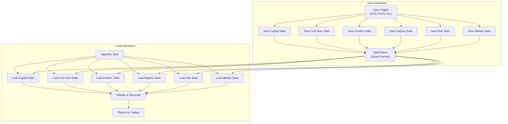
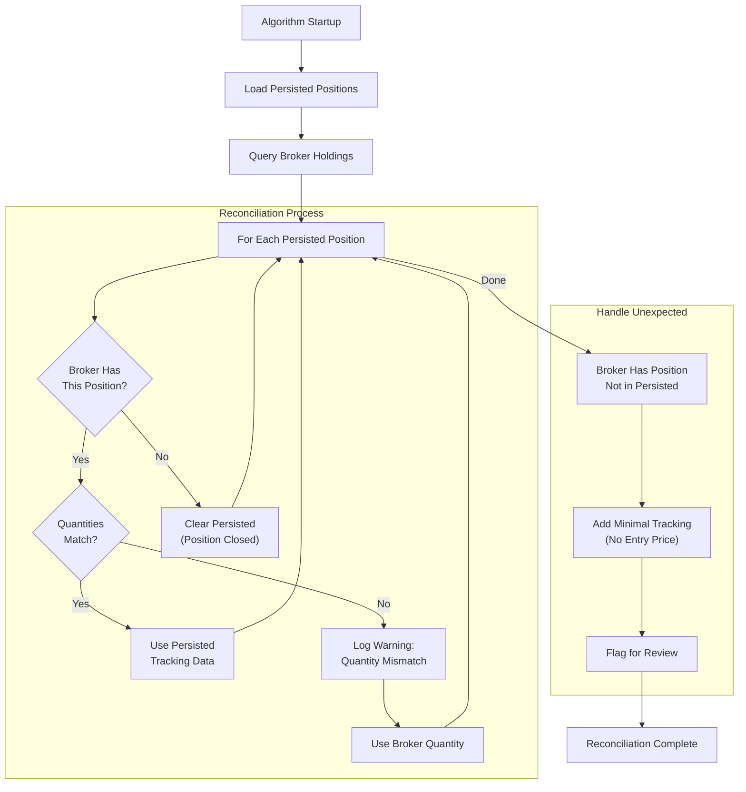

# Section 15: State Persistence

## 15.1 Purpose and Philosophy

State persistence ensures the algorithm **survives restarts** without losing critical information. When the algorithm restarts (due to deployment, errors, or platform maintenance), it must resume exactly where it left off.

### 15.1.1 What Could Be Lost Without Persistence?

| Data | Impact if Lost |
|------|----------------|
| `days_running` | Cold start repeats unnecessarily |
| `current_phase` | Phase reverts to SEED incorrectly |
| `lockbox_amount` | Protected profits lost |
| Position entry prices | Can't calculate stops correctly |
| Highest highs | Chandelier stops reset too low |
| Regime history | Smoothing restarts from scratch |
| Kill switch date | Safety record lost |

### 15.1.2 The QuantConnect ObjectStore

QuantConnect provides the **ObjectStore** for persistent storage:

| Property | Value |
|----------|-------|
| Storage type | Key-value store |
| Persistence | Survives algorithm restarts |
| Format | JSON (serialized) |
| Size limit | Sufficient for our needs |
| Access | Read/write during algorithm execution |

---

## 15.2 Persisted State Categories

### 15.2.1 Category Overview

| Category | Update Frequency | Critical Level |
|----------|------------------|:--------------:|
| **Capital State** | EOD, on milestones | 🔴 Critical |
| **Cold Start State** | EOD, on kill switch | 🔴 Critical |
| **Startup Gate State** | EOD | 🔴 Critical |
| **Position State** | EOD, on fills | 🔴 Critical |
| **Regime State** | EOD | 🟡 Important |
| **Risk State** | EOD, on triggers | 🟡 Important |
| **Weekly State** | Monday, on trigger | 🟢 Standard |

---

## 15.3 Capital State

### 15.3.1 Persisted Variables

| Variable | Type | Default | Description |
|----------|------|:-------:|-------------|
| `current_phase` | String | "SEED" | Current capital phase |
| `days_above_threshold` | Integer | 0 | Consecutive days above phase threshold |
| `lockbox_amount` | Float | 0.0 | Dollar amount locked |
| `lockbox_milestones` | Dict | {} | Which milestones triggered |

### 15.3.2 Save Triggers

| Event | Variables Saved |
|-------|-----------------|
| End of day (16:00) | All capital state |
| Phase transition | `current_phase`, `days_above_threshold` |
| Lockbox milestone | `lockbox_amount`, `lockbox_milestones` |

### 15.3.3 Example Persisted Data

```json
{
  "capital_state": {
    "current_phase": "SEED",
    "days_above_threshold": 3,
    "lockbox_amount": 0.0,
    "lockbox_milestones": {}
  }
}
```

### 15.3.4 Example After Milestone

```json
{
  "capital_state": {
    "current_phase": "GROWTH",
    "days_above_threshold": 0,
    "lockbox_amount": 10500.0,
    "lockbox_milestones": {
      "100000": "2024-01-15"
    }
  }
}
```

---

## 15.4 Cold Start State

### 15.4.1 Persisted Variables

| Variable | Type | Default | Description |
|----------|------|:-------:|-------------|
| `days_running` | Integer | 0 | Trading days since start/reset |
| `warm_entry_executed` | Boolean | False | Whether warm entry occurred |
| `warm_entry_symbol` | String | null | Symbol used for warm entry |
| `warm_entry_date` | String | null | Date of warm entry |

### 15.4.2 Save Triggers

| Event | Variables Saved |
|-------|-----------------|
| End of day (16:00) | `days_running` incremented and saved |
| Warm entry execution | All warm entry fields |
| Kill switch trigger | Reset all to defaults |

### 15.4.3 Example Persisted Data

```json
{
  "cold_start_state": {
    "days_running": 12,
    "warm_entry_executed": false,
    "warm_entry_symbol": null,
    "warm_entry_date": null
  }
}
```

### 15.4.4 Example During Cold Start

```json
{
  "cold_start_state": {
    "days_running": 2,
    "warm_entry_executed": true,
    "warm_entry_symbol": "QLD",
    "warm_entry_date": "2024-01-10"
  }
}
```

---

## 15.4.5 Startup Gate State (V2.30)

### Persisted Variables

| Variable | Type | Default | Description |
|----------|------|:-------:|-------------|
| `phase` | String | "INDICATOR_WARMUP" | Current startup gate phase |
| `days_in_phase` | Integer | 0 | Days spent in current phase |

### Save Triggers

| Event | Variables Saved |
|-------|-----------------|
| End of day (16:00) | All startup gate state |

### Example Persisted Data

```json
{
  "startup_gate_state": {
    "phase": "OBSERVATION",
    "days_in_phase": 3
  }
}
```

### Backward Compatibility (V2.29 → V2.30)

When loading V2.29 state, `restore_state()` performs automatic migration:
- `REGIME_GATE` phase maps to `INDICATOR_WARMUP`
- `arming_days` field is read as fallback for `days_in_phase`
- `regime_gate_consecutive_days` field is ignored (no longer used)

### Key Design Decision

The Startup Gate state is **never reset by kill switch**. This is deliberate — StartupGate is a one-time arming sequence that progresses permanently from INDICATOR_WARMUP → OBSERVATION → REDUCED → FULLY_ARMED. Once FULLY_ARMED, it stays armed forever. This is separate from ColdStartEngine (which resets on kill switch).

V2.30 removed the regime dependency: progression is purely time-based (5 days per phase, 15 days total). This ensures the gate completes in all market conditions, not just bull markets.

---

## 15.5 Position State

### 15.5.1 Persisted Variables

For each open position:

| Variable | Type | Description |
|----------|------|-------------|
| `symbol` | String | Ticker symbol |
| `entry_price` | Float | Fill price at entry |
| `entry_date` | String | Date of entry |
| `highest_high` | Float | Maximum price since entry |
| `current_stop` | Float | Current stop level |
| `strategy_tag` | String | "TREND", "COLD_START", etc. |
| `quantity` | Integer | Number of shares |

### 15.5.2 Save Triggers

| Event | Variables Saved |
|-------|-----------------|
| End of day (16:00) | All position state |
| New position entry | New position added |
| Position exit | Position removed |
| Stop level update | `highest_high`, `current_stop` updated |

### 15.5.3 Example Persisted Data

```json
{
  "positions": {
    "QLD": {
      "symbol": "QLD",
      "entry_price": 82.50,
      "entry_date": "2024-01-08",
      "highest_high": 89.25,
      "current_stop": 83.25,
      "strategy_tag": "TREND",
      "quantity": 150
    },
    "TMF": {
      "symbol": "TMF",
      "entry_price": 45.00,
      "entry_date": "2024-01-12",
      "highest_high": 45.00,
      "current_stop": null,
      "strategy_tag": "HEDGE",
      "quantity": 200
    }
  }
}
```

### 15.5.4 Position Reconciliation

On startup, **reconcile persisted state with actual broker positions**:

```
For each persisted position:
    1. Query actual broker holdings
    2. If broker position matches → Use persisted tracking data
    3. If broker position differs → Log warning, use broker quantity
    4. If broker position missing → Clear persisted data
    
For each broker position not in persisted state:
    1. Log warning (unexpected position)
    2. Add minimal tracking (no entry price, no stop)
    3. Flag for manual review
```

---

## 15.6 Regime State

### 15.6.1 Persisted Variables

| Variable | Type | Default | Description |
|----------|------|:-------:|-------------|
| `smoothed_score` | Float | 50.0 | Exponentially smoothed regime score |
| `previous_raw_score` | Float | 50.0 | Yesterday's raw score |
| `last_update_date` | String | null | Date of last calculation |

### 15.6.2 Save Triggers

| Event | Variables Saved |
|-------|-----------------|
| End of day (16:00) | All regime state |

### 15.6.3 Why Persist Smoothed Score?

The exponential smoothing formula depends on the **previous smoothed value**:

```
Smoothed = (0.30 × Raw) + (0.70 × Previous Smoothed)
```

Without persistence, the smoothed score would restart from 50.0, potentially causing incorrect regime classification for several days.

### 15.6.4 Example Persisted Data

```json
{
  "regime_state": {
    "smoothed_score": 58.3,
    "previous_raw_score": 62.1,
    "last_update_date": "2024-01-15"
  }
}
```

---

## 15.7 Risk State

### 15.7.1 Persisted Variables

| Variable | Type | Default | Description |
|----------|------|:-------:|-------------|
| `last_kill_date` | String | null | Date of most recent kill switch |
| `kill_count_ytd` | Integer | 0 | Kill switches this year |
| `equity_prior_close` | Float | null | Yesterday's closing equity |

### 15.7.2 Save Triggers

| Event | Variables Saved |
|-------|-----------------|
| End of day (16:00) | `equity_prior_close` |
| Kill switch trigger | `last_kill_date`, `kill_count_ytd` |
| Year change | Reset `kill_count_ytd` |

### 15.7.3 Example Persisted Data

```json
{
  "risk_state": {
    "last_kill_date": "2024-01-03",
    "kill_count_ytd": 1,
    "equity_prior_close": 52340.50
  }
}
```

---

## 15.8 Weekly State

### 15.8.1 Persisted Variables

| Variable | Type | Default | Description |
|----------|------|:-------:|-------------|
| `week_start_equity` | Float | null | Monday opening equity |
| `week_start_date` | String | null | Monday's date |
| `weekly_breaker_triggered` | Boolean | False | Whether breaker is active |

### 15.8.2 Save Triggers

| Event | Variables Saved |
|-------|-----------------|
| Monday open (09:30) | `week_start_equity`, `week_start_date` |
| Weekly breaker trigger | `weekly_breaker_triggered` |
| End of week (Friday 16:00) | Clear for next week |

### 15.8.3 Example Persisted Data

```json
{
  "weekly_state": {
    "week_start_equity": 51200.00,
    "week_start_date": "2024-01-15",
    "weekly_breaker_triggered": false
  }
}
```

---

## 15.9 ObjectStore Key Structure

### 15.9.1 Key Naming Convention

```
ALPHA_NEXTGEN_{CATEGORY}
```

| Key | Contents |
|-----|----------|
| `ALPHA_NEXTGEN_CAPITAL` | Capital state |
| `ALPHA_NEXTGEN_COLDSTART` | Cold start state |
| `ALPHA_NEXTGEN_STARTUP_GATE` | Startup gate phase + arming state (V2.29) |
| `ALPHA_NEXTGEN_POSITIONS` | Position tracking |
| `ALPHA_NEXTGEN_REGIME` | Regime smoothing |
| `ALPHA_NEXTGEN_RISK` | Risk state |
| `ALPHA_NEXTGEN_WEEKLY` | Weekly breaker state |
| `ALPHA_NEXTGEN_EXECUTION` | Execution engine state |
| `ALPHA_NEXTGEN_ROUTER` | Portfolio router state |

### 15.9.2 Why Separate Keys?

| Benefit | Description |
|---------|-------------|
| Atomic updates | Update one category without affecting others |
| Selective loading | Load only what's needed |
| Debugging | View/edit individual categories |
| Version migration | Update category schemas independently |

---

## 15.10 Save and Load Operations

### 15.10.1 Save Operation

```python
def save_state(self):
    """Save all state to ObjectStore."""
    
    # Capital state
    capital_data = {
        "current_phase": self.capital_engine.current_phase,
        "days_above_threshold": self.capital_engine.days_above_threshold,
        "lockbox_amount": self.capital_engine.lockbox_amount,
        "lockbox_milestones": self.capital_engine.lockbox_milestones
    }
    self.ObjectStore.Save("ALPHA_NEXTGEN_CAPITAL", json.dumps(capital_data))
    
    # Cold start state
    coldstart_data = {
        "days_running": self.cold_start_engine.days_running,
        "warm_entry_executed": self.cold_start_engine.warm_entry_executed,
        "warm_entry_symbol": self.cold_start_engine.warm_entry_symbol,
        "warm_entry_date": self.cold_start_engine.warm_entry_date
    }
    self.ObjectStore.Save("ALPHA_NEXTGEN_COLDSTART", json.dumps(coldstart_data))
    
    # ... similar for other categories
```

### 15.10.2 Load Operation

```python
def load_state(self):
    """Load all state from ObjectStore."""
    
    # Capital state
    if self.ObjectStore.ContainsKey("ALPHA_NEXTGEN_CAPITAL"):
        capital_data = json.loads(self.ObjectStore.Read("ALPHA_NEXTGEN_CAPITAL"))
        self.capital_engine.current_phase = capital_data.get("current_phase", "SEED")
        self.capital_engine.days_above_threshold = capital_data.get("days_above_threshold", 0)
        self.capital_engine.lockbox_amount = capital_data.get("lockbox_amount", 0.0)
        self.capital_engine.lockbox_milestones = capital_data.get("lockbox_milestones", {})
    else:
        self.log("No capital state found, using defaults")
    
    # ... similar for other categories
```

---

## 15.11 Mermaid Diagram: State Persistence Flow



---

## 15.12 Mermaid Diagram: Position Reconciliation



---

## 15.13 Error Handling

### 15.13.1 Missing State on First Run

| Scenario | Action |
|----------|--------|
| No state exists | Use defaults for all categories |
| Partial state exists | Use defaults for missing categories |

```python
# Safe loading pattern
value = data.get("key", default_value)
```

### 15.13.2 Corrupted State

| Scenario | Action |
|----------|--------|
| JSON parse error | Log error, use defaults, alert |
| Invalid values | Validate and correct, log warning |
| Missing fields | Use defaults for missing fields |

```python
try:
    data = json.loads(self.ObjectStore.Read(key))
except json.JSONDecodeError as e:
    self.log(f"State corruption detected: {e}")
    data = {}  # Use empty dict, will fall back to defaults
```

### 15.13.3 State Validation

After loading, validate critical values:

| Check | Action if Invalid |
|-------|-------------------|
| `days_running` < 0 | Reset to 0 |
| `lockbox_amount` < 0 | Reset to 0 |
| `current_phase` not in ["SEED", "GROWTH"] | Reset to "SEED" |
| `smoothed_score` outside [0, 100] | Clamp to range |

---

## 15.14 State Versioning

### 15.14.1 Version Field

Include a version field for future schema migrations:

```json
{
  "version": "1.0",
  "capital_state": { ... }
}
```

### 15.14.2 Migration Strategy

When schema changes:

```python
def migrate_state(self, data, from_version, to_version):
    """Migrate state from old version to new version."""
    
    if from_version == "1.0" and to_version == "1.1":
        # Example: Add new field with default
        data["new_field"] = default_value
        
    return data
```

---

## 15.15 State Reset Procedures

### 15.15.1 Manual Reset (Testing/Debug)

To reset all state to defaults:

```python
def reset_all_state(self):
    """Reset all persisted state to defaults."""
    keys = [
        "ALPHA_NEXTGEN_CAPITAL",
        "ALPHA_NEXTGEN_COLDSTART",
        "ALPHA_NEXTGEN_STARTUP_GATE",
        "ALPHA_NEXTGEN_POSITIONS",
        "ALPHA_NEXTGEN_REGIME",
        "ALPHA_NEXTGEN_RISK",
        "ALPHA_NEXTGEN_WEEKLY",
        "ALPHA_NEXTGEN_EXECUTION",
        "ALPHA_NEXTGEN_ROUTER",
    ]
    for key in keys:
        if self.ObjectStore.ContainsKey(key):
            self.ObjectStore.Delete(key)
    
    self.log("All state reset to defaults")
```

### 15.15.2 Selective Reset

Reset specific categories only:

| Command | Effect |
|---------|--------|
| Reset cold start | `days_running = 0`, warm entry cleared |
| Reset positions | All position tracking cleared |
| Reset regime | Smoothing restarts from 50.0 |

---

## 15.16 Integration Summary

### 15.16.1 When State Is Saved

| Event | Categories Saved |
|-------|------------------|
| End of day (16:00) | ALL categories |
| Position entry | Position state |
| Position exit | Position state |
| Kill switch | Cold start, risk state |
| Phase transition | Capital state |
| Lockbox milestone | Capital state |
| Weekly breaker | Weekly state |
| Monday open | Weekly state |

### 15.16.2 When State Is Loaded

| Event | Categories Loaded |
|-------|-------------------|
| Algorithm startup | ALL categories |
| Mid-day restart | ALL categories |

---

## 15.17 Parameter Reference

### ObjectStore Keys

| Key | Category | Contents |
|-----|----------|----------|
| `ALPHA_NEXTGEN_CAPITAL` | Capital | Phase, lockbox, milestones |
| `ALPHA_NEXTGEN_COLDSTART` | Cold Start | Days running, warm entry |
| `ALPHA_NEXTGEN_STARTUP_GATE` | Startup Gate | Phase, days_in_phase (V2.30) |
| `ALPHA_NEXTGEN_POSITIONS` | Positions | Entry prices, stops, highs |
| `ALPHA_NEXTGEN_REGIME` | Regime | Smoothed score |
| `ALPHA_NEXTGEN_RISK` | Risk | Kill dates, prior close |
| `ALPHA_NEXTGEN_WEEKLY` | Weekly | Week start equity |
| `ALPHA_NEXTGEN_EXECUTION` | Execution | Execution engine state |
| `ALPHA_NEXTGEN_ROUTER` | Router | Portfolio router state |

### Default Values

| Variable | Default |
|----------|:-------:|
| `current_phase` | "SEED" |
| `days_running` | 0 |
| `lockbox_amount` | 0.0 |
| `smoothed_score` | 50.0 |
| `last_kill_date` | null |

---

## 15.18 Key Design Decisions Summary

| Decision | Rationale |
|----------|-----------|
| **Separate ObjectStore keys** | Atomic updates, selective loading |
| **JSON serialization** | Human-readable, easy debugging |
| **Save at EOD primarily** | Captures finalized daily state |
| **Event-triggered saves** | Critical changes saved immediately |
| **Position reconciliation** | Broker state is source of truth for quantities |
| **Version field** | Enable future schema migrations |
| **Default fallbacks** | Graceful handling of missing/corrupt state |
| **Validation on load** | Catch and correct invalid values |

---

*Next Section: [16 - Appendix: Parameters](16-appendix-parameters.md)*

*Previous Section: [14 - Daily Operations](14-daily-operations.md)*
