# Engine Logic Reference - Alpha NextGen V2

> **Purpose:** Complete reference for all engine logic, conditions, and config values.
> This document enables developers to understand the entire trading system flow.
>
> **Last Updated:** 2026-02-01 (V2.3.20)

---

## Table of Contents

1. [System Overview](#system-overview)
2. [Regime Engine](#regime-engine)
3. [Capital Engine](#capital-engine)
4. [Risk Engine](#risk-engine)
5. [Cold Start Engine](#cold-start-engine)
6. [Trend Engine](#trend-engine)
7. [Mean Reversion Engine](#mean-reversion-engine)
8. [Options Engine](#options-engine)
9. [Hedge Engine](#hedge-engine)
10. [Yield Sleeve](#yield-sleeve)
11. [Portfolio Router](#portfolio-router)
12. [Key Thresholds Quick Reference](#key-thresholds-quick-reference)

---

## System Overview

### Architecture

```
┌─────────────────────────────────────────────────────────────────────────────┐
│                              DATA LAYER                                     │
├─────────────────────────────────────────────────────────────────────────────┤
│  Proxy (Daily): SPY, RSP, HYG, IEF     │  Traded (Minute): QLD, SSO, etc.  │
│  Options: QQQ chains                    │  VIX: Minute resolution           │
└─────────────────────────────────────────────────────────────────────────────┘
                                    │
                                    ▼
┌─────────────────────────────────────────────────────────────────────────────┐
│                            CORE ENGINES                                     │
├──────────────────┬────────────────────┬─────────────────────────────────────┤
│  REGIME ENGINE   │   CAPITAL ENGINE   │          RISK ENGINE                │
│  Score 0-100     │   Phase: SEED/     │   Kill Switch: 5% loss              │
│  5-Factor V2.3   │   GROWTH/MATURE    │   Panic Mode: SPY -4%               │
│  Smoothing 0.3   │   Lockbox          │   Weekly Breaker: 5%                │
└──────────────────┴────────────────────┴─────────────────────────────────────┘
                                    │
                                    ▼
┌─────────────────────────────────────────────────────────────────────────────┐
│                          STRATEGY ENGINES                                   │
├───────────┬────────────┬──────────┬───────────┬───────────┬─────────────────┤
│   TREND   │  OPTIONS   │   MR     │   HEDGE   │   YIELD   │   COLD START    │
│   55%     │   25%      │   10%    │   0-30%   │ Remainder │   Days 1-5      │
│ QLD,SSO   │ QQQ Opts   │ TQQQ,    │ TMF,PSQ   │    SHV    │   50% sizing    │
│ TNA,FAS   │ Swing+Intr │ SOXL     │           │           │   (options)     │
└───────────┴────────────┴──────────┴───────────┴───────────┴─────────────────┘
                                    │
                        TargetWeight Objects
                                    │
                                    ▼
┌─────────────────────────────────────────────────────────────────────────────┐
│                         PORTFOLIO ROUTER                                    │
│  1. Collect → 2. Aggregate → 3. Validate → 4. Net → 5. Prioritize → 6. Exec│
└─────────────────────────────────────────────────────────────────────────────┘
                                    │
                                    ▼
┌─────────────────────────────────────────────────────────────────────────────┐
│                        EXECUTION ENGINE                                     │
│        Market Orders (IMMEDIATE)    │    MOO Orders (EOD, submit 15:45)     │
│        OCO Manager (Options)        │    Fill Handler (Position tracking)  │
└─────────────────────────────────────────────────────────────────────────────┘
```

### Signal Flow Sequence

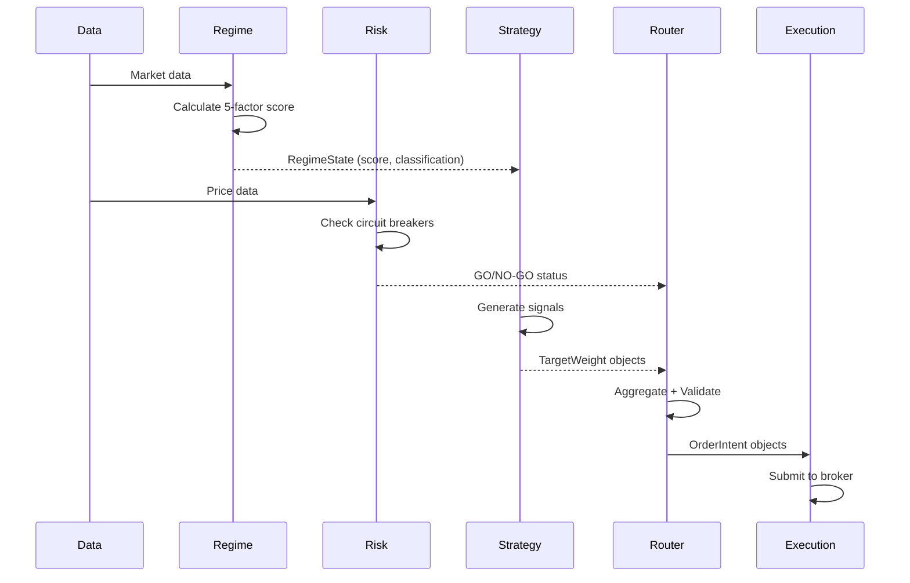

---

## Regime Engine

**File:** `engines/core/regime_engine.py`
**Purpose:** Detect overall market state using 5 weighted factors.

### Flowchart

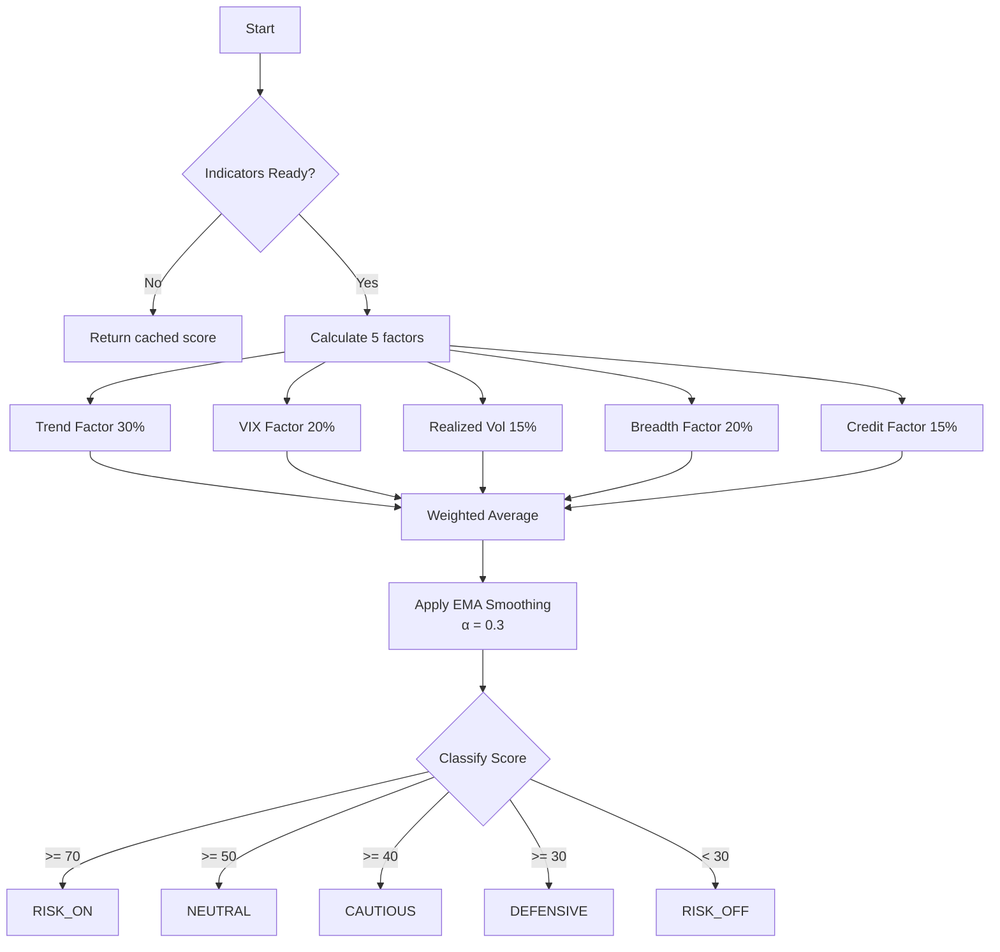

### Config Values

| Parameter | Value | Description |
|-----------|------:|-------------|
| `TREND_WEIGHT` | 0.30 | Price vs MA200 contribution |
| `VIX_WEIGHT` | 0.20 | VIX level contribution |
| `REALIZED_VOL_WEIGHT` | 0.15 | Historical volatility |
| `BREADTH_WEIGHT` | 0.20 | Market breadth (SPY vs RSP) |
| `CREDIT_WEIGHT` | 0.15 | Credit spread (HYG vs IEF) |
| `REGIME_SMOOTHING_ALPHA` | 0.30 | EMA smoothing factor |

### State Classification

| Score Range | State | Trading Allowed |
|:-----------:|:-----:|:---------------:|
| >= 70 | RISK_ON | Full allocation |
| >= 50 | NEUTRAL | Standard allocation |
| >= 40 | CAUTIOUS | Reduced allocation |
| >= 30 | DEFENSIVE | Hedges only |
| < 30 | RISK_OFF | No new longs |

---

## Capital Engine

**File:** `engines/core/capital_engine.py`
**Purpose:** Manage account phases, lockbox, and position limits.

### Flowchart

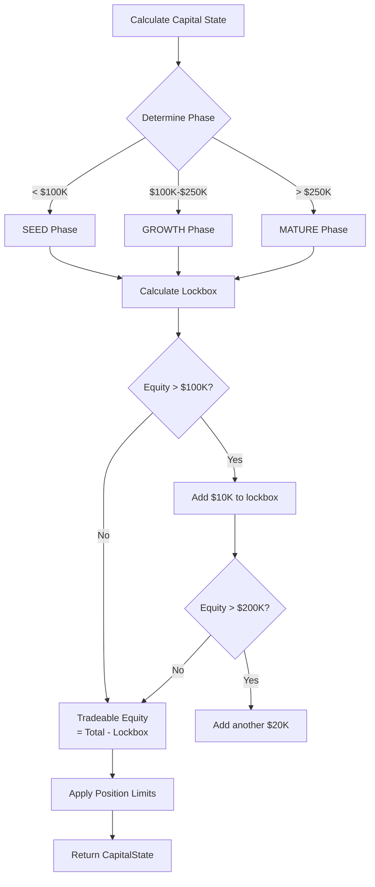

### Config Values

| Parameter | Value | Description |
|-----------|------:|-------------|
| `PHASE_SEED_MAX` | $100,000 | Max equity for SEED phase |
| `PHASE_GROWTH_MAX` | $250,000 | Max equity for GROWTH phase |
| `LOCKBOX_MILESTONE_1` | $100,000 | First lockbox trigger |
| `LOCKBOX_MILESTONE_1_AMT` | $10,000 | Amount locked at $100K |
| `LOCKBOX_MILESTONE_2` | $200,000 | Second lockbox trigger |
| `LOCKBOX_MILESTONE_2_AMT` | $20,000 | Amount locked at $200K |
| `SEED_MAX_POSITION_PCT` | 0.30 | Max single position in SEED |
| `GROWTH_MAX_POSITION_PCT` | 0.25 | Max single position in GROWTH |

---

## Risk Engine

**File:** `engines/core/risk_engine.py`
**Purpose:** Protect capital through circuit breakers and safeguards.

### Flowchart

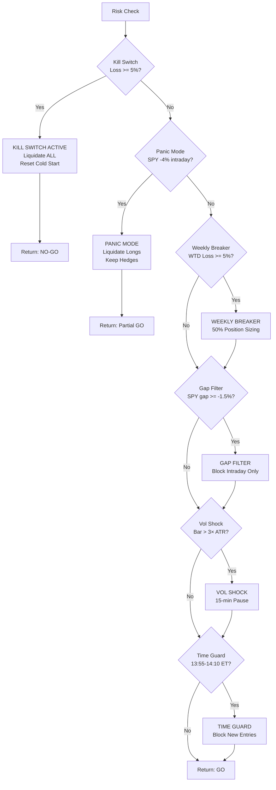

### Config Values

| Parameter | Value | Description |
|-----------|------:|-------------|
| `KILL_SWITCH_PCT` | 0.05 | 5% daily loss triggers kill switch (V2.3.17) |
| `PANIC_MODE_SPY_DROP` | 0.04 | SPY -4% triggers panic mode |
| `WEEKLY_BREAKER_PCT` | 0.05 | 5% WTD loss triggers sizing reduction |
| `GAP_FILTER_PCT` | 0.015 | SPY -1.5% gap blocks MR entries |
| `VOL_SHOCK_ATR_MULT` | 3.0 | Bar > 3× ATR triggers 15-min pause |
| `TIME_GUARD_START` | "13:55" | Entry blocking window start |
| `TIME_GUARD_END` | "14:10" | Entry blocking window end |

### Circuit Breaker Priority

1. **Kill Switch** (highest) - Full liquidation
2. **Panic Mode** - Liquidate longs, keep hedges
3. **Weekly Breaker** - 50% sizing reduction
4. **Gap Filter** - Block intraday only
5. **Vol Shock** - 15-minute pause
6. **Time Guard** - Block entries 13:55-14:10

---

## Cold Start Engine

**File:** `engines/core/cold_start_engine.py`
**Purpose:** Gradual entry during first 5 days after start or kill switch.

### Flowchart

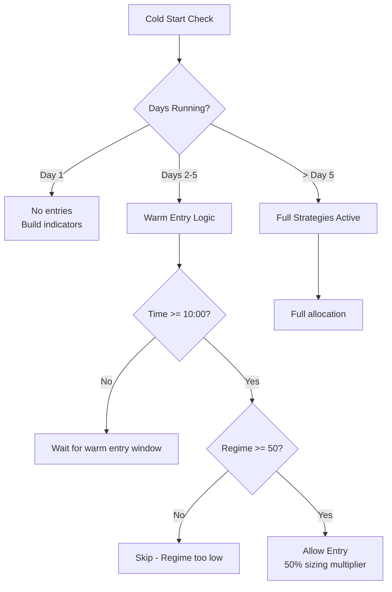

### Config Values

| Parameter | Value | Description |
|-----------|------:|-------------|
| `COLD_START_DAYS` | 5 | Number of days in cold start mode |
| `WARM_ENTRY_SIZE_MULT` | 0.50 | 50% sizing during warm entry |
| `WARM_ENTRY_TIME` | "10:00" | Earliest warm entry time |
| `WARM_REGIME_MIN` | 50 | Minimum regime score for warm entry |
| `OPTIONS_COLD_START_MULTIPLIER` | 0.50 | V2.3.20: 50% options sizing during cold start |

---

## Trend Engine

**File:** `engines/core/trend_engine.py`
**Purpose:** MA200 + ADX trend-following for core allocation (55%).

### Flowchart

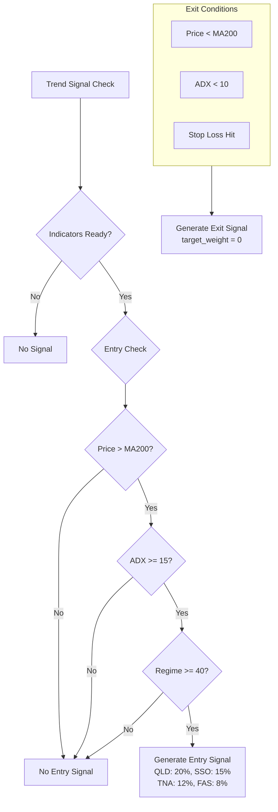

### Config Values

| Parameter | Value | Description |
|-----------|------:|-------------|
| `TREND_ADX_ENTRY_THRESHOLD` | 15 | ADX >= 15 for entry (V2.3.12) |
| `TREND_ADX_EXIT_THRESHOLD` | 10 | ADX < 10 for exit (V2.3.12) |
| `TREND_SYMBOL_ALLOCATIONS` | QLD: 0.20, SSO: 0.15, TNA: 0.12, FAS: 0.08 | Symbol weights |
| `CHANDELIER_ATR_PERIOD` | 14 | ATR period for stops |
| `CHANDELIER_BASE_MULT` | 3.5 | ATR multiplier for 2× ETFs |
| `CHANDELIER_3X_BASE_MULT` | 2.5 | ATR multiplier for 3× ETFs (TNA, FAS) |

### Stop Loss Progression

| Profit Range | 2× ETFs (QLD, SSO) | 3× ETFs (TNA, FAS) |
|:------------:|:------------------:|:------------------:|
| < 15% | ATR × 3.5 | ATR × 2.5 |
| 15-25% | ATR × 3.0 | ATR × 2.0 |
| > 25% | ATR × 2.5 | ATR × 1.5 |

---

## Mean Reversion Engine

**File:** `engines/satellite/mean_reversion_engine.py`
**Purpose:** RSI oversold bounce strategy for TQQQ/SOXL (10%).

### Flowchart

```mermaid
flowchart TD
    START[MR Signal Check] --> TIME{10:00-15:00 ET?}

    TIME -->|No| NONE[No Signal]
    TIME -->|Yes| RISK{Safeguards Clear?}

    RISK -->|No| BLOCKED[Entry Blocked<br/>Gap/Vol/Panic]
    RISK -->|Yes| RSI{RSI(5) < 25?}

    RSI -->|No| NO_ENTRY[No Entry Signal]
    RSI -->|Yes| DROP{Intraday Drop > 2.5%?}

    DROP -->|No| NO_ENTRY
    DROP -->|Yes| VIX{VIX < 35?}

    VIX -->|No| NO_ENTRY
    VIX -->|Yes| ENTRY[Generate Entry Signal<br/>TQQQ: 5%, SOXL: 5%<br/>Urgency: IMMEDIATE]

    subgraph EXIT[Exit Conditions - By 15:45]
        EX1[Profit Target +3%]
        EX2[Stop Loss -2%]
        EX3[Time Exit 15:45]
    end
```

### Config Values

| Parameter | Value | Description |
|-----------|------:|-------------|
| `MR_RSI_OVERSOLD` | 25 | RSI < 25 for entry |
| `MR_DROP_THRESHOLD` | 0.025 | Intraday drop > 2.5% |
| `MR_VIX_MAX` | 35 | VIX < 35 for entry |
| `MR_PROFIT_TARGET` | 0.03 | +3% profit target |
| `MR_STOP_LOSS` | 0.02 | -2% stop loss |
| `MR_WINDOW_START` | "10:00" | Entry window start |
| `MR_WINDOW_END` | "15:00" | Entry window end |
| `MR_FORCE_CLOSE_TIME` | "15:45" | Mandatory exit time |

---

## Options Engine

**File:** `engines/satellite/options_engine.py`
**Purpose:** QQQ options with Dual-Mode architecture (Swing 20% + Intraday 5%).

### Dual-Mode Architecture

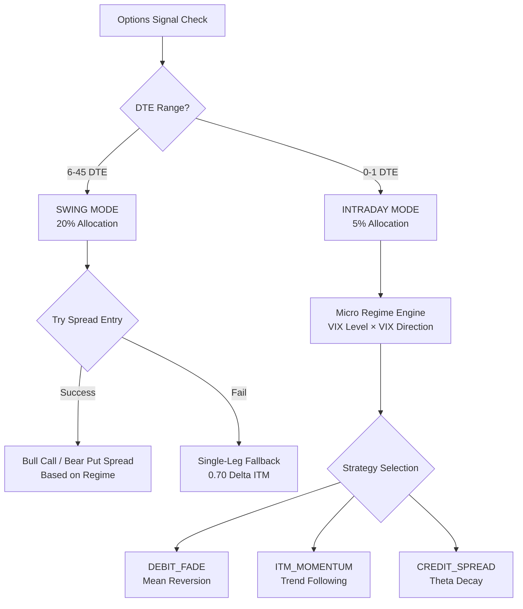

### Micro Regime Engine (Intraday)

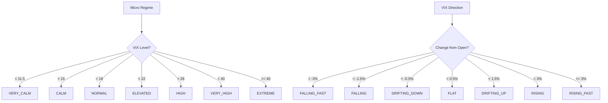

### Config Values - Swing Mode

| Parameter | Value | Description |
|-----------|------:|-------------|
| `OPTIONS_SWING_ALLOCATION` | 0.20 | 20% portfolio allocation |
| `OPTIONS_SWING_DTE_MIN` | 6 | Minimum DTE for swing (V2.3.18) |
| `OPTIONS_SWING_DTE_MAX` | 45 | Maximum DTE for swing |
| `OPTIONS_SWING_DELTA_MIN` | 0.55 | Min delta for swing |
| `OPTIONS_SWING_DELTA_MAX` | 0.85 | Max delta for swing |
| `OPTIONS_SINGLE_LEG_DTE_EXIT` | 4 | Exit single-leg at 4 DTE (V2.3.18) |
| `OPTIONS_SPREAD_DTE_EXIT` | 5 | Exit spreads at 5 DTE |

### Config Values - Intraday Mode

| Parameter | Value | Description |
|-----------|------:|-------------|
| `OPTIONS_INTRADAY_ALLOCATION` | 0.05 | 5% portfolio allocation |
| `OPTIONS_INTRADAY_DTE_MAX` | 1 | Max DTE for intraday (0-1 DTE) |
| `OPTIONS_INTRADAY_DELTA_MIN` | 0.40 | Min delta for intraday |
| `OPTIONS_INTRADAY_DELTA_MAX` | 0.60 | Max delta for intraday |
| `INTRADAY_MAX_TRADES_PER_DAY` | 2 | Sniper mode: 2 trades max |
| `QQQ_NOISE_THRESHOLD` | 0.0035 | 0.35% minimum move for signal |
| `INTRADAY_FADE_MIN_MOVE` | 0.0050 | 0.50% min for FADE |
| `INTRADAY_FADE_MAX_MOVE` | 0.0120 | 1.20% max for FADE |
| `INTRADAY_MOMENTUM_MIN_MOVE` | 0.0080 | 0.80% min for MOMENTUM |

### Config Values - Cold Start (V2.3.20)

| Parameter | Value | Description |
|-----------|------:|-------------|
| `OPTIONS_COLD_START_MULTIPLIER` | 0.50 | 50% sizing during cold start |

---

## Hedge Engine

**File:** `engines/satellite/hedge_engine.py`
**Purpose:** Regime-based tail protection with TMF and PSQ.

### Flowchart

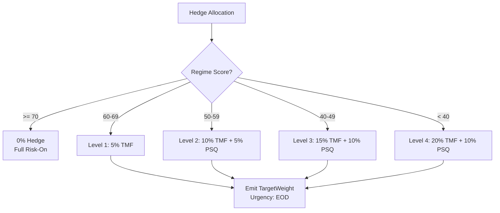

### Config Values

| Parameter | Value | Description |
|-----------|------:|-------------|
| `HEDGE_REGIME_THRESHOLD` | 70 | No hedge above this score |
| `HEDGE_L1_THRESHOLD` | 60 | Level 1 hedge threshold |
| `HEDGE_L2_THRESHOLD` | 50 | Level 2 hedge threshold |
| `HEDGE_L3_THRESHOLD` | 40 | Level 3 hedge threshold |
| `HEDGE_TMF_MAX` | 0.20 | Max TMF allocation |
| `HEDGE_PSQ_MAX` | 0.10 | Max PSQ allocation |

---

## Yield Sleeve

**File:** `engines/satellite/yield_sleeve.py`
**Purpose:** Cash management via SHV (Short-Term Treasury ETF).

### Flowchart

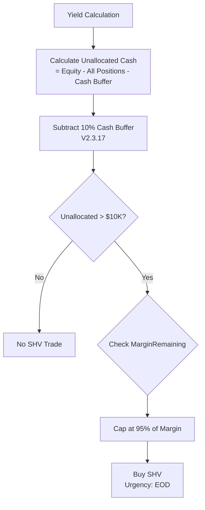

### Config Values

| Parameter | Value | Description |
|-----------|------:|-------------|
| `SHV_MIN_TRADE` | 10,000 | Minimum trade size (V2.3.6) |
| `CASH_BUFFER_PCT` | 0.10 | 10% cash buffer (V2.3.17) |
| `YIELD_ALLOCATION_MAX` | 0.99 | Max SHV allocation (V2.3.17) |

---

## Portfolio Router

**File:** `portfolio/portfolio_router.py`
**Purpose:** Central hub that aggregates, validates, and routes signals.

### Processing Flow

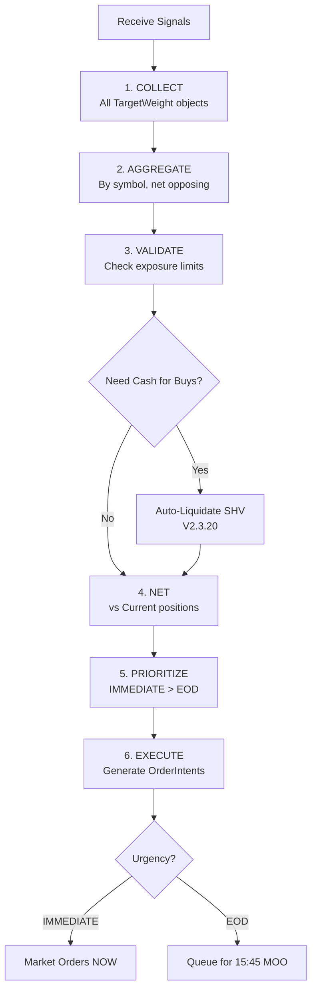

### SHV Auto-Liquidation (V2.3.20)

```python
# Calculate shortfall
buy_value = sum(order.quantity * price for order in buys)
sell_proceeds = sum(order.quantity * price for order in sells)
projected_cash = available_cash + sell_proceeds
shortfall = buy_value - projected_cash

if shortfall > 0:
    shv_sell_amount = min(shortfall * 1.05, available_shv)
    # Generate SHV SELL order, insert at beginning
```

### Exposure Group Limits

| Group | Max Net Long | Max Gross | Symbols |
|-------|:------------:|:---------:|---------|
| NASDAQ_BETA | 50% | 75% | QLD, TQQQ, PSQ |
| SPY_BETA | 40% | 40% | SSO |
| SMALL_CAP_BETA | 25% | 25% | TNA |
| FINANCIALS_BETA | 15% | 15% | FAS |
| RATES | 99% | 99% | TMF, SHV (V2.3.17) |

### Source Allocation Limits

| Source | Max % | Description |
|--------|------:|-------------|
| TREND | 55% | Core trend following |
| OPT | 30% | Swing options |
| OPT_INTRADAY | 5% | Intraday options |
| MR | 10% | Mean reversion |
| HEDGE | 30% | Hedging |
| YIELD | 99% | Cash management (V2.3.17) |
| COLD_START | 35% | Cold start entries |
| RISK | 100% | Risk-driven exits |
| ROUTER | 100% | Router-initiated trades |

---

## Key Thresholds Quick Reference

### Risk Controls

| Safeguard | Threshold | Action |
|-----------|:---------:|--------|
| Kill Switch | 5% daily loss | Liquidate ALL (V2.3.17) |
| Panic Mode | SPY -4% | Liquidate longs |
| Weekly Breaker | 5% WTD loss | 50% sizing |
| Gap Filter | SPY -1.5% gap | Block MR |
| Vol Shock | 3× ATR | 15-min pause |
| Time Guard | 13:55-14:10 | Block entries |

### Entry Conditions

| Engine | Key Threshold | Value |
|--------|--------------|:-----:|
| Trend | ADX Entry | >= 15 |
| Trend | MA200 | Price > MA200 |
| MR | RSI Oversold | < 25 |
| MR | Drop | > 2.5% |
| MR | VIX | < 35 |
| Options | Regime | >= 40 |
| Options (Swing) | DTE | 6-45 |
| Options (Intraday) | DTE | 0-1 |

### Key Times (Eastern)

| Time | Event |
|:----:|-------|
| 09:25 | Set equity_prior_close |
| 09:30 | Market open, MOO executes |
| 09:33 | Set equity_sod, check gap |
| 10:00 | Warm entry window opens |
| 13:55 | Time guard starts |
| 14:10 | Time guard ends |
| 15:00 | MR window closes |
| 15:30 | Intraday options force close |
| 15:45 | EOD processing, MOO submit, TQQQ/SOXL close |
| 16:00 | Market close, state persist |

---

## Version History

| Version | Date | Changes |
|---------|------|---------|
| V2.3.17 | 2026-02-01 | Kill switch 3%→5%, 10% cash buffer, RATES/YIELD 99% |
| V2.3.18 | 2026-02-01 | Single-leg exit 2→4 DTE, Swing entry 5→6 DTE |
| V2.3.19 | 2026-02-01 | ITM_MOMENTUM time window to config |
| V2.3.20 | 2026-02-01 | Cold start options 50%, SHV auto-liquidation |

---

*Document: docs/system/ENGINE_LOGIC_REFERENCE.md*
*Created: 2026-02-01*
*Author: Engineering Team*
